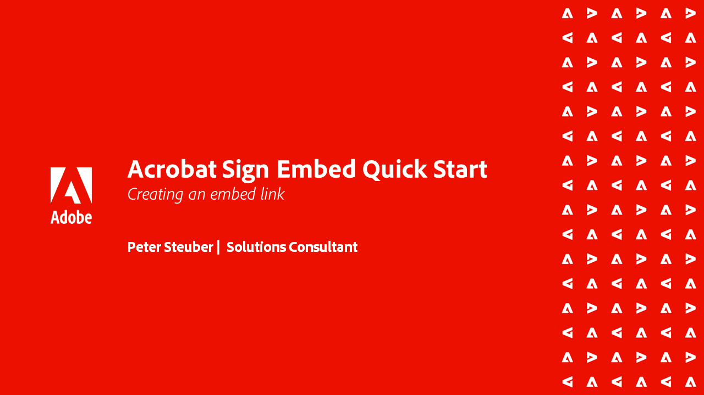

# Tutoriels de l’API Acrobat Sign

Les API Acrobat Sign vous permettent de créer des applications et d’intégrer l’interface utilisateur et les fonctionnalités d’Acrobat Sign dans vos applications.

## Prise en main

<table style="table-layout:fixed">
<tr>
   <td>
    
    

    <a href="signapi.md"><strong>Prise en main</strong></a>
    

    <em>Découvrez comment inclure l’API Sign dans votre application pour collecter des signatures et d’autres informations</em>
     
  </td>
  <td>
    
    

     
  </td>
  <td>
    
    

     
  </td>
  <td>
    
    

     
  </td>
</tr>
</table>

## Guide de démarrage rapide d’Acrobat Sign Embed

Découvrez comment commencer à intégrer la version OEM d’Acrobat Sign dans votre application. Ce guide est spécialement conçu pour les partenaires OEM qui élaborent et intègrent un processus de signature dans leur application.

<table style="table-layout:fixed">
<tr>
 <td>
   
    

   <a href="sign-up-developer-account.md"><strong>Ouvrir un compte développeur</strong></a>
    

    <em>Découvrez comment créer un compte Développeur pour Acrobat Sign, qui est entièrement activé avec les fonctionnalités Sign et API</em>
     
  </td>
  <td>
   
    

   <a href="creating-your-application.md"><strong>Création de l’application</strong></a>
    

    <em>Découvrez comment créer une application dans Acrobat Sign</em>
     
  </td>
   <td>
   
    

   <a href="creating-an-embed-link.md"><strong>Création d’un lien incorporé</strong></a>
    

    <em>Découvrez comment créer un lien d’incorporation pour OAuth, la méthode par laquelle votre application obtient des autorisations pour les utilisateurs</em>
     
  </td>
  <td>
   
    

   <a href="generating-an-access-token.md"><strong>Génération d’un jeton d’accès</strong></a>
    

    <em>Découvrez comment générer un jeton d’accès qui peut être utilisé avec l’API Acrobat Sign</em>
     
  </td>
</tr>
<tr>
  <td>
   
    

   <a href="creating-a-transient-document.md"><strong>Création d’un document temporaire</strong></a>
    

    <em>Découvrez comment créer un document temporaire pouvant être utilisé avec l’application Acrobat Sign</em>
     
  </td>
  <td>
    
    

     
  </td>
   <td>
    
    

     
  </td>
  <td>
    
    

     
  </td>
</tr>
</table>
