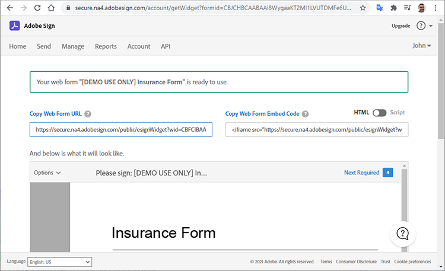

# Prise en main de l’API Adobe Sign

[API ACROBAT SIGN](https://www.adobe.io/apis/documentcloud/sign.html) C’est un excellent moyen d’améliorer la façon dont vous gérez les accords signés. Les développeurs peuvent facilement intégrer leurs systèmes à l’API Sign, qui fournit un moyen fiable et facile de charger des documents, de les envoyer pour signature, d’envoyer des rappels et de collecter des signatures électroniques.

## Ce que vous pouvez apprendre

Ce tutoriel pratique explique comment les développeurs peuvent utiliser l’API Sign pour améliorer les applications et les workflows créés avec [!DNL Adobe Acrobat Services]. [!DNL Acrobat Services] comprend [API Adobe PDF Services](https://www.adobe.io/apis/documentcloud/dcsdk/pdf-tools.html), [API Adobe PDF Embed](https://www.adobe.io/apis/documentcloud/viesdk) (gratuit), et [API Adobe Document Generation](https://www.adobe.io/apis/documentcloud/dcsdk/doc-generation.html).

Plus précisément, découvrez comment inclure l’API Acrobat Sign dans votre application pour collecter des signatures et d’autres informations, telles que les informations sur les employés figurant sur un formulaire d’assurance. Des étapes génériques avec des requêtes et des réponses HTTP simplifiées sont utilisées. Vous pouvez implémenter ces demandes dans votre langue préférée. Vous pouvez créer un PDF à l’aide d’une combinaison de [[!DNL Acrobat Services] API](https://www.adobe.io/apis/documentcloud/dcsdk/), téléchargez-le dans l’API Sign en tant que [transitoire](https://www.adobe.io/apis/documentcloud/sign/docs.html#!adobedocs/adobe-sign/master/overview/terminology.md) documente et demande les signatures de l’utilisateur final à l’aide de l’accord ou [widget](https://www.adobe.io/apis/documentcloud/sign/docs.html#!adobedocs/adobe-sign/master/overview/terminology.md) workflow.

## Création d’un document de PDF

Commencez par créer un modèle Microsoft Word et enregistrez-le comme PDF. Vous pouvez également automatiser votre pipeline à l’aide de l’API Document Generation pour télécharger un modèle créé dans Word, puis générer un document de PDF. L’API Document Generation fait partie de [!DNL Acrobat Services], [gratuit pendant six mois, puis paiement à l’utilisation pour seulement 0,05 $ par transaction de document](https://www.adobe.io/apis/documentcloud/dcsdk/pdf-pricing.html).

Dans cet exemple, le modèle est un simple document avec quelques champs de signataire à remplir. Nommez les champs pour l’instant, puis insérez-les ultérieurement dans ce tutoriel.


## Découverte du point d’accès API valide

Avant d’utiliser l’API Sign, [créer un compte développeur gratuit](https://acrobat.adobe.com/ca/en/sign/developer-form.html) pour accéder à l’API, testez l’échange et l’exécution de documents, ainsi que la fonctionnalité d’envoi par e-mail.

Adobe distribue l’API Acrobat Sign dans le monde entier dans de nombreuses unités de déploiement appelées « partitions ». Chaque partition dessert le compte d’un client, tel que NA1, NA2, NA3, EU1, JP1, AU1, IN1 et autres. Les noms des partitions correspondent à des emplacements géographiques. Ces partitions composent l’URI de base (points d’accès) des points de terminaison API.

Pour accéder à l’API Sign, vous devez d’abord découvrir le point d’accès correct pour votre compte, qui peut être api.na1.adobesign.com, api.na4.adobesign.com, api.eu1.adobesign.com ou autres, selon votre emplacement.

```
  GET /api/rest/v6/baseUris HTTP/1.1
  Host: https://api.adobesign.com
  Authorization: Bearer {YOUR-INTEGRATION-KEY-HERE}
  Accept: application/json

  Response Body (example):

  {
    "apiAccessPoint": "https://api.na4.adobesign.com/", 
    "webAccessPoint": "https://secure.na4.adobesign.com/" 
  }
```

Dans l’exemple ci-dessus, est une réponse avec la valeur comme point d’accès.

>[!IMPORTANT]
>
>Dans ce cas, toutes les demandes ultérieures que vous effectuez à l’API Sign doivent utiliser ce point d’accès. Si vous utilisez un point d’accès qui ne dessert pas votre zone géographique, une erreur s’affiche.

## Chargement d’un document temporaire

Adobe Sign vous permet de créer différents flux qui préparent les documents pour signature ou collecte de données. Quel que soit le flux de votre application, vous devez d’abord télécharger un document, qui reste disponible pendant sept jours seulement. Les appels API suivants doivent ensuite faire référence à ce document temporaire.

Le document est chargé à l’aide d’une demande de POST dans le dossier `/transientDocuments` point de terminaison. La requête en plusieurs parties se compose du nom du fichier, d’un flux de fichier et du type MIME (média) du fichier document. La réponse du point de terminaison contient un ID qui identifie le document.

En outre, votre application peut spécifier une URL de rappel pour qu’Acrobat Sign envoie une commande ping à l’application une fois le processus de signature terminé.


```
  POST /api/rest/v6/transientDocuments HTTP/1.1
  Host: {YOUR-API-ACCESS-POINT}
  Authorization: Bearer {YOUR-INTEGRATION-KEY-HERE}
  x-api-user: email:your-api-user@your-domain.com
  Content-Type: multipart/form-data
  File-Name: "Insurance Form.pdf"
  File: "[path]\Insurance Form.pdf"
  Accept: application/json

  Response Body (example):

  {
     "transientDocumentId": "3AAA...BRZuM"
  }
```

## Création d’un formulaire web

Les formulaires web (auparavant appelés widgets de signature) sont des documents hébergés que toute personne disposant d’un accès peut signer. Parmi les exemples de formulaires web, citons les formulaires d’inscription, les renonciations et d’autres documents auxquels de nombreuses personnes accèdent et qu’elles signent en ligne.

Pour créer un formulaire web à l’aide de l’API Sign, vous devez d’abord télécharger un document temporaire. La demande du POST à l&#39;adresse `/widgets` le point de terminaison utilise le `transientDocumentId` .

Dans cet exemple, le formulaire web est `ACTIVE`, mais vous pouvez le créer dans l’un des trois états suivants :

* VERSION PRÉLIMINAIRE : pour créer progressivement le formulaire web.

* CRÉATION : pour ajouter ou modifier des champs de formulaire dans le formulaire web.

* ACTIF : pour héberger immédiatement le formulaire web.

Les informations sur les participants au formulaire doivent également être définies. Le `memberInfos` contient des données sur les participants, telles que l’adresse e-mail. Actuellement, cet ensemble ne prend pas en charge plus d’un membre. Cependant, comme l’adresse électronique du signataire du formulaire web est inconnue au moment de la création du formulaire web, l’adresse e-mail doit rester vide, comme dans l’exemple suivant. Le `role` définit le rôle assumé par les membres dans `memberInfos` (par exemple, SIGNATAIRE et APPROBATEUR).

```
  POST /api/rest/v6/widgets HTTP/1.1
  Host: {YOUR-API-ACCESS-POINT}
  Authorization: Bearer {YOUR-INTEGRATION-KEY-HERE}
  x-api-user: email:your-api-user@your-domain.com
  Content-Type: application/json

  Request Body:

  {
    "fileInfos": [
      {
      "transientDocumentId": "YOUR-TRANSIENT-DOCUMENT-ID"
      }
     ],
    "name": "Insurance Form",
      "widgetParticipantSetInfo": {
          "memberInfos": [{
              "email": ""
          }],
      "role": "SIGNER"
      },
      "state": "ACTIVE"
  }

  Response Body (example):

  {
     "id": "CBJ...PXoK2o"
  }
```

Vous pouvez créer un formulaire web en tant que `DRAFT` ou `AUTHORING`, puis modifiez son état lorsque le formulaire passe par votre pipeline d’application. Pour modifier un état de formulaire web, reportez-vous à la section [PUT /widgets/{widgetId}/state](https://secure.na4.adobesign.com/public/docs/restapi/v6#!/widgets/updateWidgetState) point de terminaison.

## Lecture de l’URL d’hébergement du formulaire web

L’étape suivante consiste à découvrir l’URL hébergeant le formulaire web. Le point d’entrée /widgets récupère une liste de données de formulaire web, y compris l’URL hébergée du formulaire web que vous transférez à vos utilisateurs, pour collecter des signatures et d’autres données de formulaire.

Ce point de terminaison renvoie une liste, ce qui vous permet de localiser le formulaire spécifique par son ID dans le `userWidgetList` avant d’obtenir l’URL hébergeant le formulaire web :

```
  GET /api/rest/v6/widgets HTTP/1.1
  Host: {YOUR-API-ACCESS-POINT}
  Authorization: Bearer {YOUR-INTEGRATION-KEY-HERE}
  Accept: application/json

  Response Body:

  {
    "userWidgetList": [
      {
        "id": "CBJCHB...FGf",
        "name": "Insurance Form",
        "groupId": "CBJCHB...W86",
        "javascript": "<script type='text/javascript' ...
        "modifiedDate": "2021-03-13T15:52:41Z",
        "status": "ACTIVE",
        "Url":
        "https://secure.na4.adobesign.com/public/esignWidget?wid=CBFCIB...Rag*",
        "hidden": false
      },
      {
        "id": "CBJCHB...I8_",
        "name": "Insurance Form",
        "groupId": "CBJCHBCAABAAyhgaehdJ9GTzvNRchxQEGH_H1ya0xW86",
        "javascript": "<script type='text/javascript' language='JavaScript'
        src='https://sec
        "modifiedDate": "2021-03-13T02:47:32Z",
        "status": "ACTIVE",
        "Url":
        "https://secure.na4.adobesign.com/public/esignWidget?wid=CBFCIB...AAB",
        "hidden": false
      },
      {
        "id": "CBJCHB...Wmc",
```

## Gestion de votre formulaire web

Il s’agit d’un document PDF que les utilisateurs peuvent remplir. Cependant, vous devez toujours indiquer à l’éditeur du formulaire les champs que les utilisateurs doivent remplir et où ils se trouvent dans le document :


Le document ci-dessus n’affiche pas encore les champs. Ils sont ajoutés lors de la définition des champs qui collectent les informations du signataire, ainsi que leur taille et leur position.

Maintenant, passez à la section [Formulaires web](https://secure.na4.adobesign.com/public/agreements/#agreement_type=webform) sur la page « Vos accords » et recherchez le formulaire que vous avez créé.


Cliquez sur **Modifier** pour ouvrir la page d’édition du document. Les champs prédéfinis disponibles se trouvent dans le panneau de droite.


L’éditeur vous permet de glisser-déposer des champs de texte et de signature. Après avoir ajouté tous les champs nécessaires, vous pouvez les redimensionner et les aligner pour affiner votre formulaire. Enfin, cliquez sur **Enregistrer** pour créer le formulaire.


## Envoi d’un formulaire web pour signature

Une fois le formulaire web terminé, vous devez l’envoyer afin que les utilisateurs puissent le remplir et le signer. Une fois le formulaire enregistré, vous pouvez afficher et copier l’URL et le code incorporé.

**Copier l’URL du formulaire web**: utilisez cette URL pour envoyer des utilisateurs vers une version hébergée de cet accord pour révision et signature. Par exemple :

[https://secure.na4.adobesign.com/public/esignWidget?wid=CBFCIBAA3...babw\*](https://secure.na4.adobesign.com/public/esignWidget?wid=CBFCIBAA3AAABLblqZhCndYscuKcDMPiVfQlpaGPb-5D7ebE9NUTQ6x6jK7PIs8HCtTzr3HOx8U6D5qqbabw*)

**Copier le code incorporé du formulaire web**: ajoutez l’accord à votre site web en copiant ce code et en le collant dans votre HTML.

Par exemple :

```
<iframe
src="https://secure.na4.adobesign.com/public/esignWidget?wid=CBFC
...yx8*&hosted=false" width="100%" height="100%" frameborder="0"
style="border: 0;
overflow: hidden; min-height: 500px; min-width: 600px;"></iframe>
```



Lorsque vos utilisateurs accèdent à la version hébergée de votre formulaire, ils révisent le document temporaire chargé pour la première fois avec les champs positionnés comme spécifié.


L’utilisateur remplit ensuite les champs et signe le formulaire.


Ensuite, l’utilisateur signe le document avec une signature précédemment enregistrée ou avec une nouvelle signature.


Lorsque l’utilisateur clique sur **Appliquer**, Adobe leur demande d’ouvrir leur e-mail et de confirmer la signature. La signature reste en attente jusqu’à l’arrivée de la confirmation.


Cette authentification ajoute l’authentification à plusieurs facteurs et renforce la sécurité du processus de signature.


## Lecture des formulaires web terminés

Il est maintenant temps d’obtenir les données de formulaire que les utilisateurs ont remplies. Le `/widgets/{widgetId}/formData` Le point de terminaison récupère les données saisies par l’utilisateur dans un formulaire interactif lorsqu’il a signé le formulaire.

```
GET /api/rest/v6/widgets/{widgetId}/formData HTTP/1.1
Host: {YOUR-API-ACCESS-POINT}
Authorization: Bearer {YOUR-INTEGRATION-KEY-HERE}
Accept: text/csv
```

Le flux de fichier CSV résultant contient des données de formulaire.

```
Response Body:
"Agreement
name","completed","email","role","first","last","title","company","agreementId",
"email verified","web form signed/approved"
"Insurance Form","","myemail@email.com","SIGNER","John","Doe","My Job Title","My
Company Name","","","2021-03-07 19:32:59"
```

## Création d’un accord

À la place des formulaires web, vous pouvez créer des accords. Les sections suivantes illustrent quelques étapes simples pour gérer les accords à l’aide de l’API Sign.

L’envoi d’un document à des destinataires spécifiés pour signature ou approbation crée un accord. Vous pouvez suivre le statut et l’achèvement d’un accord à l’aide des API.

Pour créer un accord, utilisez une [document temporaire](https://helpx.adobe.com/sign/kb/how-to-send-an-agreement-through-REST-API.html), [document de bibliothèque](https://www.adobe.io/apis/documentcloud/sign/docs.html#!adobedocs/adobe-sign/master/samples/send_using_library_doc.md)ou URL. Dans cet exemple, l’accord est basé sur le `transientDocumentId`, tout comme le formulaire web créé précédemment.

```
POST /api/rest/v6/agreements HTTP/1.1
Host: {YOUR-API-ACCESS-POINT}
Authorization: Bearer {YOUR-INTEGRATION-KEY-HERE}
x-api-user: email:your-api-user@your-domain.com
Content-Type: application/json
Accept: application/json
Request Body:
{
    "fileInfos": [
      {
      "transientDocumentId": "{transientDocumentId}"
      }
     ],
    "name": "{agreementName}",
    "participantSetsInfo": [
      {
      "memberInfos": [
          {
          "email": "{signerEmail}"
          }
        ],
        "order": 1,
        "role": "SIGNER"
      }
    ],
    "signatureType": "ESIGN",
    "state": "IN_PROCESS"
  }
```

Dans cet exemple, l’accord est créé en cours de traitement, mais vous pouvez le créer dans l’un des trois états suivants :

* VERSION PRÉLIMINAIRE : pour créer progressivement l’accord avant de l’envoyer.

* CRÉATION : pour ajouter ou modifier des champs de formulaire dans l’accord.

* EN_COURS : pour envoyer immédiatement l’accord.

Pour modifier l’état d’un accord, utilisez la commande `PUT /agreements/{agreementId}/state` point de terminaison pour effectuer l’une des transitions d’état autorisées ci-dessous :

* VERSION PRÉLIMINAIRE À LA CRÉATION

* CRÉATION EN_COURS

* EN_COURS vers ANNULÉ

Le `participantSetsInfo` la propriété ci-dessus fournit les adresses e-mail des personnes censées participer à l’accord et l’action qu’elles effectuent (signer, approuver, accuser réception, etc.). Dans l’exemple ci-dessus, il n’y a qu’un seul participant : le signataire. Les signatures par écrit sont limitées à quatre par document.

Contrairement aux formulaires web, lorsque vous créez un accord, Adobe l’envoie automatiquement pour signature. Le point de terminaison renvoie l’identifiant unique de l’accord.


```
  Response Body:

  {
     id (string): The unique identifier of the agreement
  }
```

## Récupération d’informations sur les membres de l’accord

Une fois que vous avez créé un accord, vous pouvez utiliser la fonctionnalité `/agreements/{agreementId}/members` point de terminaison pour récupérer des informations sur les membres de l’accord. Par exemple, vous pouvez vérifier si un participant a signé l’accord.

```
GET /api/rest/v6/agreements/{agreementId}/members HTTP/1.1
Host: {YOUR-API-ACCESS-POINT}
Authorization: Bearer {YOUR-INTEGRATION-KEY-HERE}
Accept: application/json
```

Le corps de la réponse JSON obtenu contient des informations sur les participants.

```
  Response Body:

  {
     "participantSets":[
        {
           "memberInfos":[
              {
                 "id":"CBJ...xvM",
                 "email":"participant@email.com",
                 "self":false,
                 "securityOption":{
                    "authenticationMethod":"NONE"
                 },
                 "name":"John Doe",
                 "status":"ACTIVE",
                 "createdDate":"2021-03-16T03:48:39Z",
                 "userId":"CBJ...vPv"
              }
           ],
           "id":"CBJ...81x",
           "role":"SIGNER",
           "status":"WAITING_FOR_MY_SIGNATURE",
           "order":1
        }
     ],
```

## Envoi de rappels d’accord

Selon les règles métier, une échéance peut empêcher les participants de signer l’accord après une date spécifique. Si l’accord a une date d’expiration, vous pouvez le rappeler aux participants à mesure que cette date approche.

En fonction des informations des membres de l’accord que vous avez reçues après l’appel à la `/agreements/{agreementId}/members` dans la dernière section, vous pouvez envoyer des rappels par e-mail à tous les participants qui n’ont toujours pas signé l’accord.

Une demande de POST à l&#39;adresse `/agreements/{agreementId}/reminders` le point de terminaison crée un rappel pour les participants spécifiés d’un accord identifié par `agreementId` paramètre.

```
POST /agreements/{agreementId}/reminders HTTP/1.1
Host: {YOUR-API-ACCESS-POINT}
Authorization: Bearer {YOUR-INTEGRATION-KEY-HERE}
x-api-user: email:your-api-user@your-domain.com
Content-Type: application/json
Accept: application/json
  Request Body:

  {
    "recipientParticipantIds": [{agreementMemberIdList}],
    "agreementId": "{agreementId}",
    "note": "This is a reminder that you haven't signed the agreement yet.",
    "status": "ACTIVE"
  }

  Response Body:

  {
     id (string, optional): An identifier of the reminder resource created on the
     server. If provided in POST or PUT, it will be ignored
  }
```

Une fois le rappel publié, les utilisateurs reçoivent un e-mail avec les détails de l’accord et un lien vers l’accord.


## Lecture des accords terminés

Comme pour les formulaires web, vous pouvez lire les détails des accords signés par les destinataires. Le `/agreements/{agreementId}/formData` Le point de terminaison récupère les données saisies par l’utilisateur lorsqu’il a signé le formulaire web.

```
GET /api/rest/v6/agreements/{agreementId}/formData HTTP/1.1
Host: {YOUR-API-ACCESS-POINT}
Authorization: Bearer {YOUR-INTEGRATION-KEY-HERE}
Accept: text/csv
Response Body:
"completed","email","role","first","last","title","company","agreementId"
"2021-03-16 18:11:45","myemail@email.com","SIGNER","John","Doe","My Job Title","My
Company Name","CBJCHBCAABAA5Z84zy69q_Ilpuy5DzUAahVfcNZillDt"
```

## Marche à suivre

L’API Acrobat Sign vous permet de gérer des documents, des formulaires web et des accords. Les workflows simplifiés mais complets créés à l’aide de formulaires web et d’accords sont réalisés d’une manière générique qui permet aux développeurs de les mettre en œuvre dans n’importe quel langage.

Pour obtenir un aperçu du fonctionnement de l’API Sign, vous pouvez trouver des exemples dans la section [Guide du développeur d’utilisation d’API](https://www.adobe.io/apis/documentcloud/sign/docs.html#!adobedocs/adobe-sign/master/api_usage.md). Cette documentation contient de courts articles sur la plupart des étapes suivies tout au long de l’article, ainsi que d’autres sujets connexes.

L’API Acrobat Sign est disponible via plusieurs niveaux de [formules de signature électronique mono et multi-utilisateurs](https://acrobat.adobe.com/fr/fr/sign/pricing/plans.html), afin que vous puissiez choisir le modèle de tarification le mieux adapté à vos besoins. Maintenant que vous savez à quel point il est facile d’incorporer l’API Sign dans vos applications, d’autres fonctionnalités telles que [Acrobat Sign Webhooks](https://www.adobe.io/apis/documentcloud/sign/docs.html#!adobedocs/adobe-sign/master/webhooks.md), un modèle de programmation basée sur les notifications push. Au lieu d’exiger que votre application effectue des vérifications fréquentes dans les événements Acrobat Sign, les webhooks vous permettent d’enregistrer une URL HTTP pour laquelle l’API Sign exécute une demande de rappel de POST chaque fois qu’un événement se produit. Les webhooks permettent une programmation robuste en alimentant votre application avec des mises à jour en temps réel et instantanées.

Consultez le [tarification par répartition](https://www.adobe.io/apis/documentcloud/dcsdk/pdf-pricing.html), pour savoir quand votre version d’essai gratuite de six mois de l’API Adobe PDF Services se termine, et l’API gratuite Adobe PDF Embed.

Pour ajouter des fonctionnalités passionnantes telles que la création automatique de documents et la signature de documents à votre application, commencez par [[!DNL Adobe Acrobat Services]](https://www.adobe.io/apis/documentcloud/dcsdk/gettingstarted.html).
