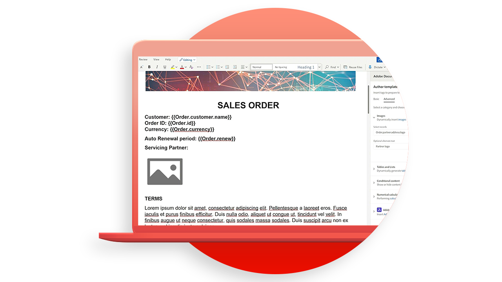
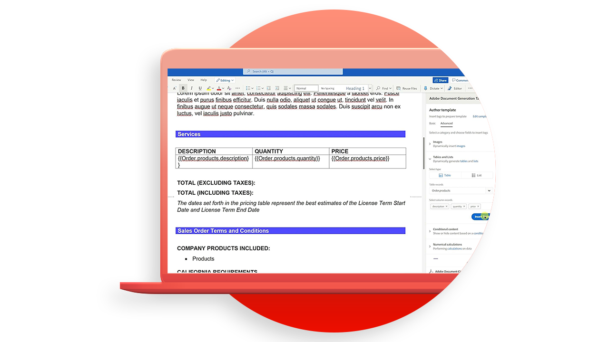
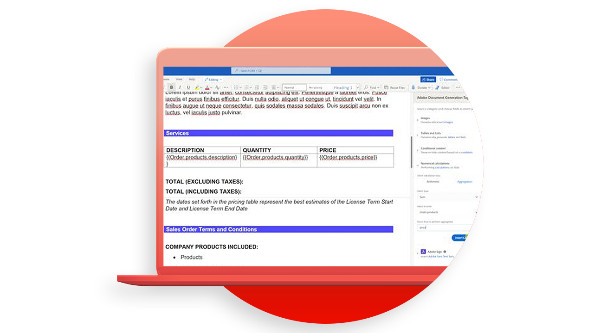
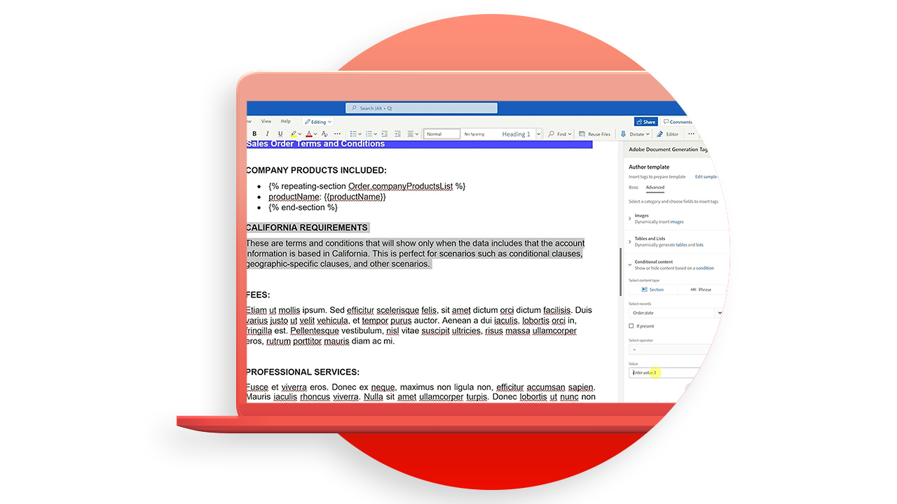

# Tutoriels sur les API Document Generation

L’API Document Generation permet de créer des documents Word et PDF à partir de modèles Word et de données JSON.

>[!NOTE]
>
>L’API de génération de documents est incluse dans l’API PDF Services.

## Créer des modèles

L’API de génération de document accepte un modèle de document (avec des balises de modèle) avec les données d’entrée pour générer le document final. Le document final est généré en remplaçant toutes les balises de modèle du modèle de document par le contenu dynamique basé sur les valeurs réelles correspondant à l’entrée de données.

<table style="table-layout:fixed">
<tr>
 <td>
   
    

   <a href="taggeroverview.md"><strong>Présentation du marqueur de génération de document Adobe</strong></a>
    

    <em>Obtenez un aperçu du marqueur de génération de document Adobe conçu pour être utilisé avec l’API de génération de document Adobe</em>
     
  </td>
  <td>
   
    

   <a href="taggeraddtexttags.md"><strong>Ajout de balises de texte</strong></a>
    

    <em>Découvrez comment ajouter des balises de texte aux modèles Microsoft Word à l’aide de l’étiquette de génération de document Adobe à utiliser avec l’API de génération de document Adobe</em>
     
  </td>
  <td>
   
    

   <a href="taggeraddimagetags.md"><strong>Ajout de balises d’image</strong></a>
    

    <em>Découvrez comment ajouter des balises d’image aux modèles Microsoft Word à l’aide du marqueur de génération de document Adobe pour envoyer dynamiquement des images dans les documents à l’aide de l’API de génération de document Adobe</em>
     
  </td>
  <td>
   
    

   <a href="taggertables.md"><strong>Ajout de tableaux et de balises de liste</strong></a>
    

    <em>Découvrez comment ajouter des tableaux et des balises de liste à des modèles Microsoft Word à l’aide de l’outil Adobe Document Generation Tagger pour ajouter dynamiquement des lignes de tableau ou de liste en fonction des données à l’aide de l’API Adobe Document Generation</em>
     
  </td>
</tr>
<tr>
  <td>
   
    

   <a href="taggercalculations.md"><strong>Définition d’étiquettes de calcul numérique</strong></a>
    

    <em>Découvrez comment définir des balises de calcul numériques dans les modèles Microsoft Word à l’aide du marqueur de génération de document Adobe pour calculer des agrégations ou des calculs arithmétiques de valeurs de données à l’aide de l’API de génération de document Adobe</em>
     
  </td>
  <td>
   
    

   <a href="taggerconditional.md"><strong>Définition du contenu conditionnel</strong></a>
    

    <em>Découvrez comment définir des sections dans des modèles Microsoft Word à l’aide de l’Adobe Document Generation Tagger pour inclure ou exclure dynamiquement des sections d’un document en fonction de données à l’aide de l’Adobe Document Generation API</em>
     
  </td>
  <td>
    
    

     
  </td>
   <td>
    
    

     
  </td>
</tr>
</table>
