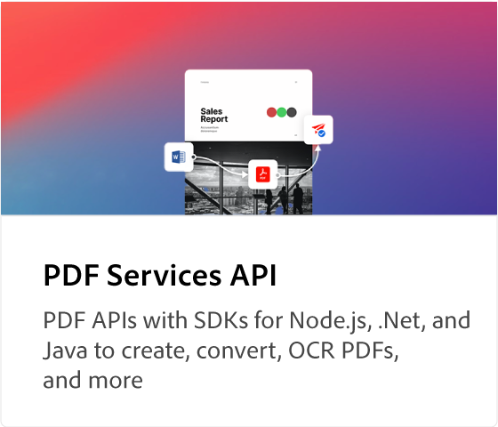
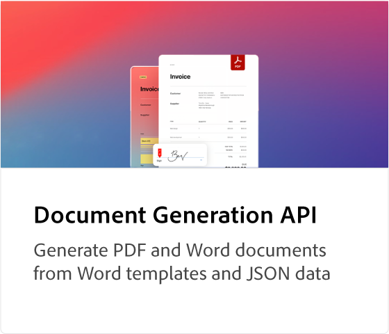
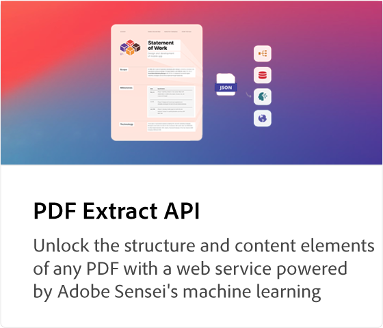
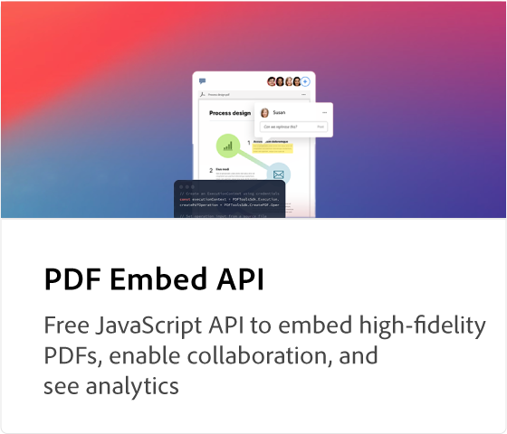
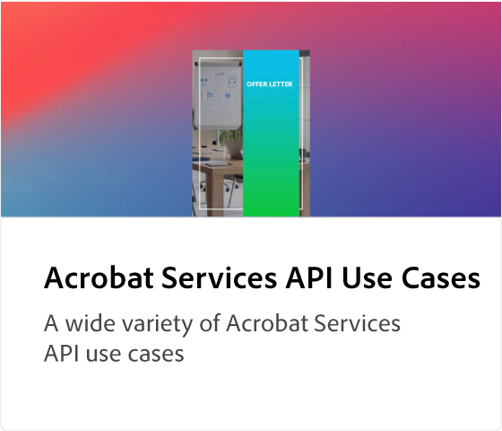

# [!DNL Adobe Acrobat Services] Tutoriels API

[!DNL Adobe Acrobat Services] possède cinq API principales : [!DNL Adobe PDF Services API], le [!DNL Adobe PDF Embed API], le [!DNL Adobe Document Generation API], le [!DNL Adobe PDF Extract API] et [!DNL Adobe PDF Accessibility Auto-Tag API]. Les deux dernières API et leurs SDK sont regroupés dans [!DNL Adobe PDF Services API] dans le cadre d’une offre payante. [!DNL PDF Embed API] est une offre gratuite. Ces API automatisent la génération, la manipulation et la transformation du contenu des documents via un ensemble de services web modernes basés sur le cloud. Ils vous aident à offrir des expériences plus simples, plus rapides et de marque afin que vous contrôliez l’interaction des utilisateurs avec vos documents, rationalisez les workflows des PDF et favorisez l’utilisation et la rétention. Ces tutoriels vous aident à vous familiariser avec les fonctionnalités de marque, plus simples et plus rapides de [!DNL Adobe Acrobat Services] API.

<table style="table-layout:fixed">
<tr>
 <td>
   
  </td>
  <td>
   
  </td>
  <td>
   
  </td>
  <td>
   
  </td>
</tr>
<tr>
  <td>
   
  </td>
 <td>
   
  </td>
  <td>
    
    

     
  </td>
  <td>
    
    

     
  </td>
</tr>
</table>
