# Contrôlez votre expérience en ligne PDF et collectez des analyses

Votre organisation affiche-t-elle des PDF sur votre site Web ? Découvrez comment utiliser l’API Adobe PDF Embed pour contrôler l’apparence, activer la collaboration et collecter des analyses sur la façon dont les utilisateurs interagissent avec les PDF, y compris le temps passé sur une page et les recherches. Pour commencer ce tutoriel pratique en 4 parties, sélectionnez *Prise en main de l’API PDF Embed*.

<table style="table-layout:fixed">
<tr>
  <td>
    <a href="controlpdfexperience.md#part1">
        
    </a>
    <div>
    <a href="controlpdfexperience.md#part1"><strong>Partie 1 : Prise en main de l’API PDF Embed</strong></a>
    </div>
  </td>
  <td>
    <a href="controlpdfexperience.md#part2">
        
    </a>
    <div>
    <a href="controlpdfexperience.md#part2"><strong>Partie 2 : Ajout d’une API PDF Embed à une page web</strong></a>
    </div>
  </td>
  <td>
   <a href="controlpdfexperience.md#part3">
      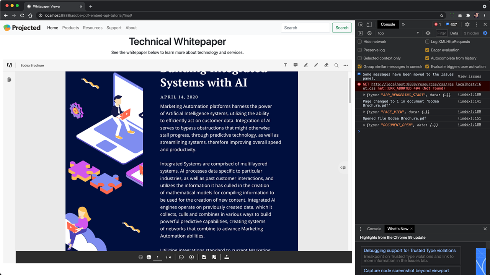
   </a>
    <div>
    <a href="controlpdfexperience.md#part3"><strong>Partie 3 : Accès aux API Analytics</strong></a>
    </div>
  </td>
  <td>
   <a href="controlpdfexperience.md#part4">
      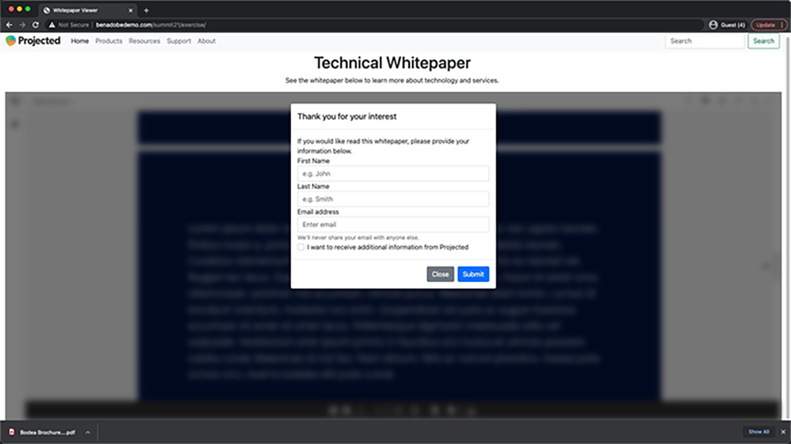
   </a>
    <div>
    <a href="controlpdfexperience.md#part4"><strong>Partie 4 : Ajout d’interactivité en fonction des événements</strong></a>
    </div>
  </td>
</tr>
</table>

## Partie 1 : Prise en main de l’API PDF Embed {#part1}

Dans la première partie, découvrez comment commencer à utiliser tout ce dont vous avez besoin pour les parties 1 à 3. Vous commencerez par obtenir les identifiants d’API.

**Ce dont vous avez besoin**

* Ressources du tutoriel [téléchargement](https://github.com/benvanderberg/adobe-pdf-embed-api-tutorial)
* Adobe ID [en obtenir un ici](https://accounts.adobe.com/fr)
* Serveur Web (Node JS, PHP, etc.)
* Connaissance pratique de HTML / JavaScript / CSS

**Ce que nous utilisons**

* Serveur Web de base (noeud)
* Code Visual Studio
* GitHub

### Obtention des informations

1. Accédez à l’onglet [Site Web Adobe.io](https://www.adobe.io/).
1. Cliquez **[!UICONTROL En savoir plus]** sous Créer des expériences documentaires attrayantes.

   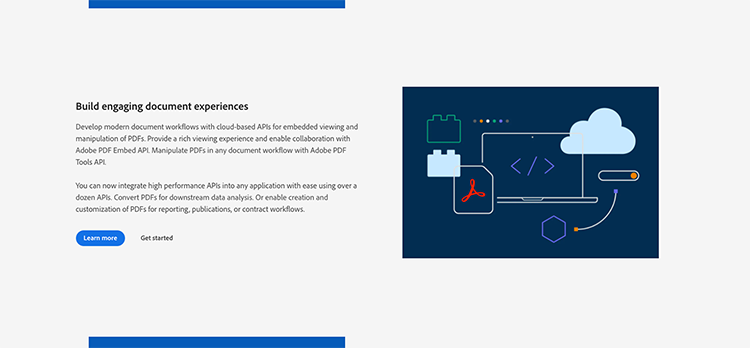

   Cela vous amène à la [!DNL Adobe Acrobat Services] page d’accueil.

1. Cliquez **[!UICONTROL Prise en main]** dans la barre de navigation.

   Vous verrez une option dans le **Prise en main [!DNL Acrobat Services] API** à **Créer de nouvelles identifiants** ou **Gérer les identifiants existants**.

1. Cliquez **[!UICONTROL Prise en main]** sous le bouton **[!UICONTROL Créer de nouvelles identifiants]**.

   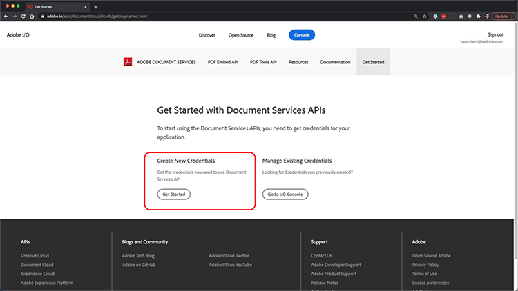

1. Sélectionnez le **[!UICONTROL API PDF Embed]** et ajoutez un nom d’identification de votre choix et un domaine d’application dans la fenêtre suivante.

   >[!NOTE]
   >
   >Ces informations d&#39;identification ne peuvent être utilisées que sur le domaine d&#39;application répertorié ici. Vous pouvez utiliser n’importe quel domaine de votre choix.

   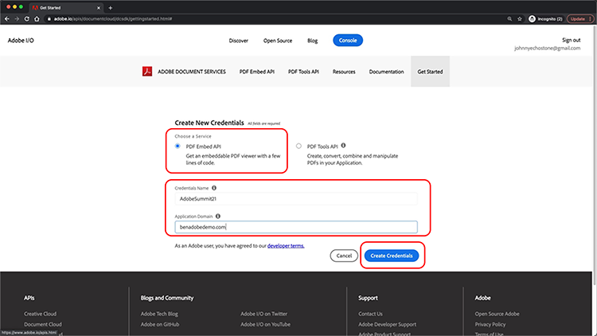

1. Cliquez **[!UICONTROL Créer des identifiants]**.

   La dernière page de l&#39;Assistant vous fournit les informations d&#39;identification de votre client. Laissez cette fenêtre ouverte afin de pouvoir y revenir et copier l’ID client (clé API) pour une utilisation ultérieure.

1. Cliquez **[!UICONTROL Voir la documentation]** pour accéder à la documentation avec des informations détaillées sur l’utilisation de cette API.

   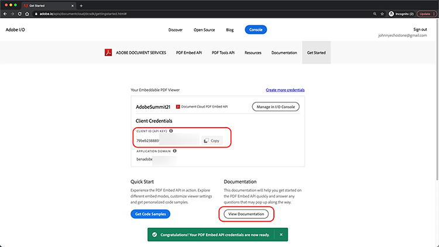

## Partie 2 : Ajout d’une API PDF Embed à une page web {#part2}

Dans la deuxième partie, vous apprendrez à intégrer facilement l’API PDF Embed dans une page web. Pour ce faire, vous allez utiliser la démonstration en ligne de l’API Adobe PDF Embed pour créer votre code.

### Obtenir le code de l&#39;exercice

Nous avons créé du code que vous pouvez utiliser. Bien que vous puissiez utiliser votre propre code, les démonstrations s’effectueront dans le contexte des ressources du tutoriel. Télécharger un exemple de code [ici](https://github.com/benvanderberg/adobe-pdf-embed-api-tutorial).

1. Accéder à [[!DNL Adobe Acrobat Services] site](https://www.adobe.io/apis/documentcloud/dcsdk/).

   ![Capture d&#39;écran [!DNL Adobe Acrobat Services] site](assets/ControlPDF_6.png)

1. Cliquez **[!UICONTROL API]** dans la barre de navigation, puis accédez à la **[!UICONTROL API PDF Embed]** dans la liste déroulante.

   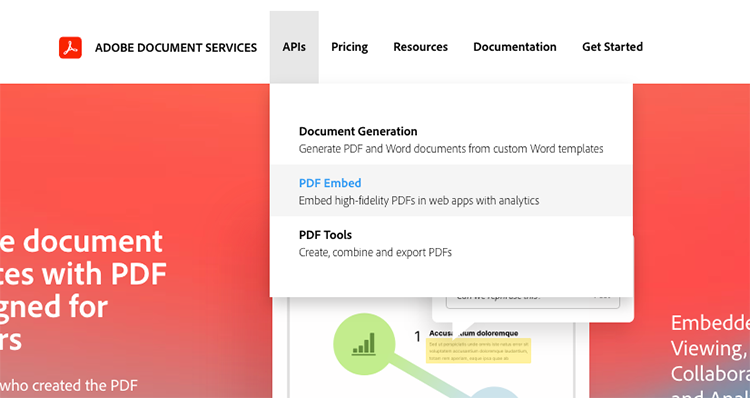

1. Cliquez **[!UICONTROL Essayer la démonstration]**.

   Une nouvelle fenêtre s’ouvre avec le sandbox du développeur pour l’API PDF Embed.

   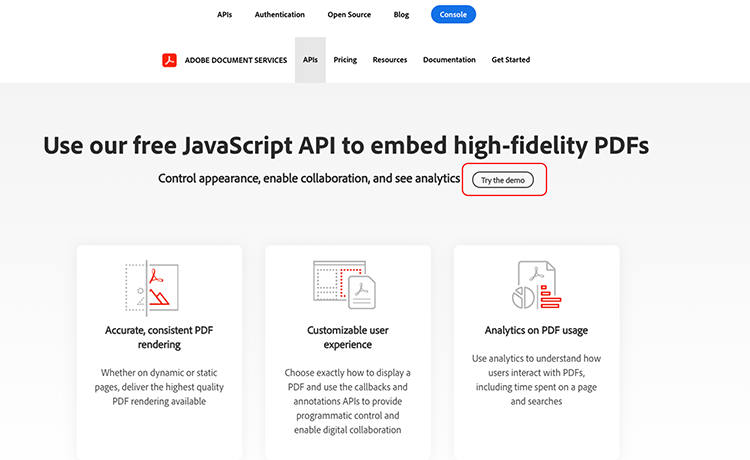

   Vous pouvez voir ici les options des différents modes d’affichage.

1. Cliquez sur les différents modes d’affichage pour Fenêtre entière, Conteneur redimensionné, En ligne et Lightbox.

   

1. Cliquez **[!UICONTROL Fenêtre entière]** mode d’affichage, puis cliquez sur le bouton **[!UICONTROL Personnaliser]** pour activer ou désactiver les options.

   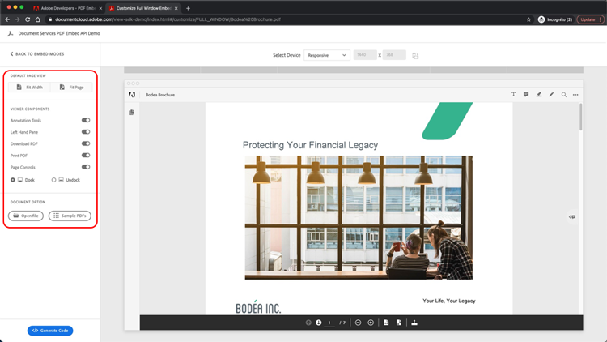

1. Désactiver **[!UICONTROL Télécharger]** Option de PDF.
1. Cliquez **[!UICONTROL Générer le code]** pour afficher l’aperçu du code.
1. Copier **[!UICONTROL ID client]** dans la fenêtre Informations d&#39;identification du client de la partie 1.

   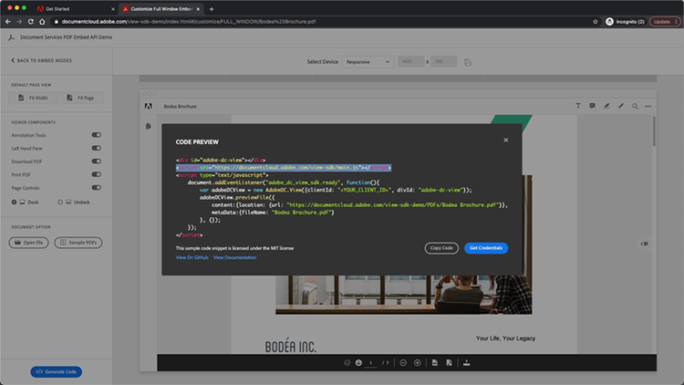

1. Ouvrez le **[!UICONTROL Web]** -> **[!UICONTROL ressources]** -> **[!UICONTROL js]** -> **[!UICONTROL dc-config.js]** dans votre éditeur de code.

   Vous verrez que la variable clientID est présente.

1. Collez vos informations d’identification de client entre les guillemets doubles pour définir l’ID client sur vos informations d’identification.

1. Revenez à l’aperçu du code sandbox du développeur.

1. Copiez la deuxième ligne contenant le script d’Adobe :

   ```
   <script src=https://documentccloud.adobe.com/view-sdk/main.js></script>
   ```

   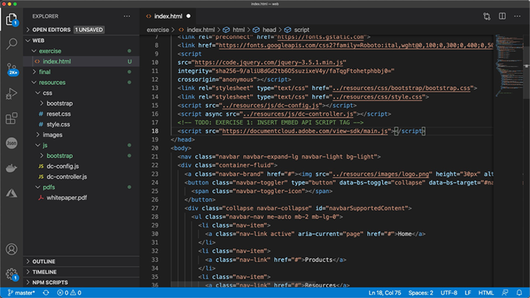

1. Accédez à votre éditeur de code et ouvrez le fichier **[!UICONTROL Web]** -> **[!UICONTROL exercice]** -> **[!UICONTROL index.html]** fichier.

1. Collez le code de script dans le `<head>` du fichier à la ligne 18 sous le commentaire qui dit : **TODO: EXERCICE 1 : INSÉRER UNE BALISE DE SCRIPT API EMBED**.

   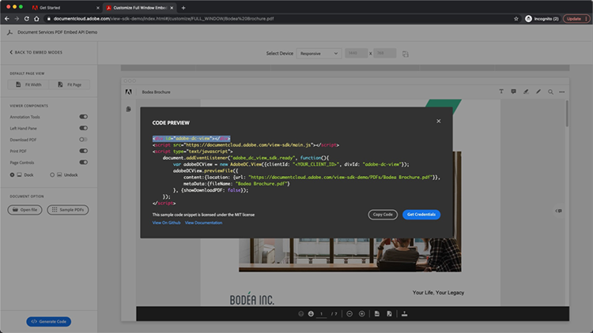

1. Revenez à l’aperçu du code sandbox du développeur et copiez la première ligne de code qui contient :

   ```
   <div id="adobe-dc-view"></div>
   ```

   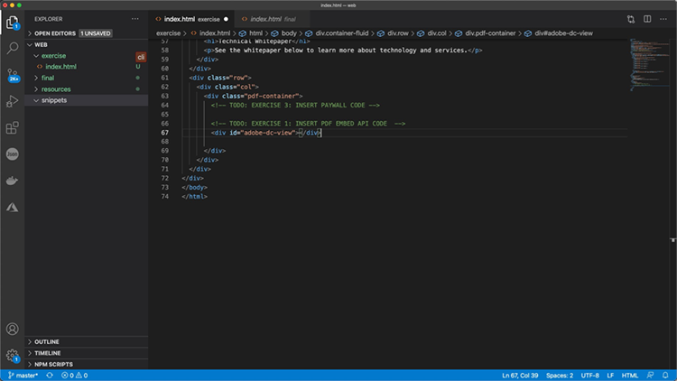

1. Accédez à votre éditeur de code et ouvrez le fichier **[!UICONTROL Web]** -> **[!UICONTROL exercice]** -> **[!UICONTROL index.html]** à nouveau.

1. Collez le `<div>` dans le fichier `<body>` du dossier à la ligne 67 sous le commentaire qui indique **TODO: EXERCICE 1 : INSÉRER LE CODE API INCORPORÉ AU PDF**.

   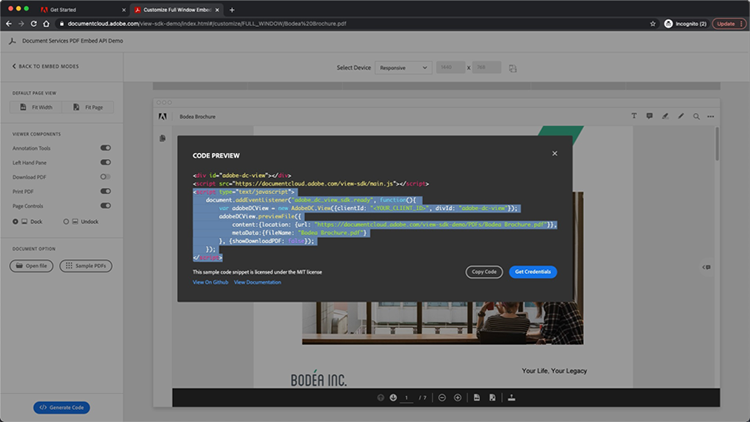

1. Revenez à l’aperçu du code sandbox du développeur et copiez les lignes de code pour le fichier `<script>` ci-dessous :

   ```
   <script type="text/javascript">
       document.addEventListener("adobe_dc_view_sdk.ready",             function(){ 
           var adobeDCView = new AdobeDC.View({clientId:                     "<YOUR_CLIENT_ID>", divId: "adobe-dc-view"});
           adobeDCView.previewFile({
               content:{location: {url: "https://documentcloud.                adobe.com/view-sdk-demo/PDFs/Bodea Brochure.                    pdf"}},
               metaData:{fileName: "Bodea Brochure.pdf"}
           }, {showDownloadPDF: false});
       });
   </script>
   ```

1. Accédez à votre éditeur de code et ouvrez le fichier **[!UICONTROL Web]** -> **[!UICONTROL exercice]** -> **[!UICONTROL index.html]** à nouveau.

1. Collez le `<script>` dans le fichier `<body>` du dossier à la ligne 68 sous la rubrique `<div>` Balise.

1. Modification de la ligne 70 du même **index.html** pour inclure la variable clientID créée précédemment.

   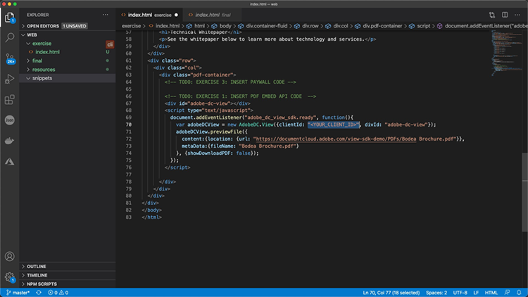

1. Modification de la ligne 72 du même **index.html** pour mettre à jour l’emplacement du fichier du PDF afin d’utiliser un fichier local.

   Il y en a un disponible dans les fichiers tutoriels du **/resources/pdfs/whitepaper.pdf**.

1. Enregistrez vos fichiers modifiés et prévisualisez votre site web en accédant à **`<your domain>`/summit21/web/exercise/**.

   Le rendu de l’article technique devrait s’afficher en mode Fenêtre pleine dans votre navigateur.

## Partie 3 : Accès aux API Analytics {#part3}

Maintenant que vous avez réussi à créer une page web avec rendu d’API PDF Embed dans un PDF, vous pouvez maintenant découvrir, dans la troisième partie, comment utiliser les événements JavaScript pour mesurer l’analytics afin de comprendre comment les utilisateurs utilisent les PDF.

### Recherche de documentation

Il existe de nombreux événements JavaScript dans le cadre de l’API d’intégration de PDF. Vous pouvez y accéder à partir de [!DNL Adobe Acrobat Services] la documentation.

1. Accédez à l’onglet [documentation](https://www.adobe.io/apis/documentcloud/dcsdk/docs.html) site.
1. Passez en revue les différents types d’événements disponibles dans le cadre de l’API. Ils sont utiles pour référence et seront également utiles pour vos futurs projets.

   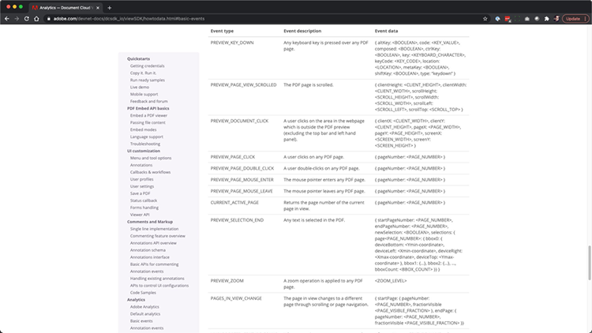

1. Copiez l&#39;exemple de code figurant sur le site web.

   Utilisez-le comme base pour votre code et modifiez-le.

   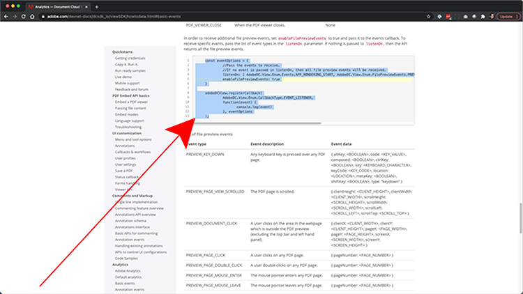

   ```
   const eventOptions = {
     //Pass the PDF analytics events to receive.
      //If no event is passed in listenOn, then all PDF         analytics events will be received.
   listenOn: [ AdobeDC.View.Enum.PDFAnalyticsEvents.    PAGE_VIEW, AdobeDC.View.Enum.PDFAnalyticsEvents.DOCUMENT_DOWNLOAD],
     enablePDFAnalytics: true
   }
   
   
   adobeDCView.registerCallback(
     AdobeDC.View.Enum.CallbackType.EVENT_LISTENER,
     function(event) {
       console.log("Type " + event.type);
       console.log("Data " + event.data);
     }, eventOptions
   );
   ```

1. Recherchez la section de code que vous avez ajoutée précédemment et qui ressemble à celle ci-dessous, puis ajoutez le code ci-dessus après ce code dans **index.html**:

   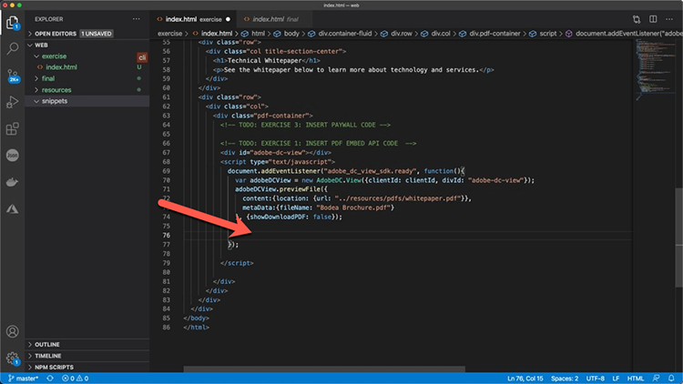

1. Chargez la page dans votre navigateur web et ouvrez la console pour afficher les sorties de la console des différents événements lorsque vous interagissez avec l’afficheur du PDF.

   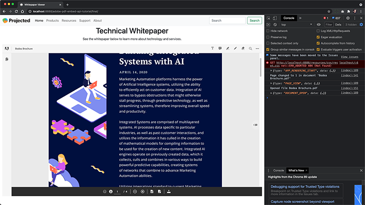

   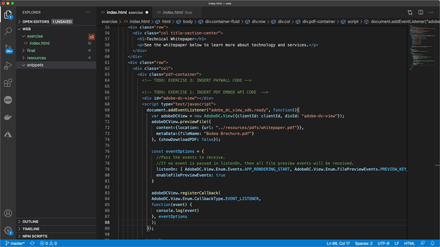

### Ajouter un commutateur pour capturer des événements

Maintenant que vous avez généré les événements dans le journal console.log, changeons le comportement en fonction des événements. Pour ce faire, vous allez utiliser un exemple de commutateur.

1. Accédez à **snippets/eventsSwitch.js** et copiez le contenu du fichier dans le code du tutoriel.

   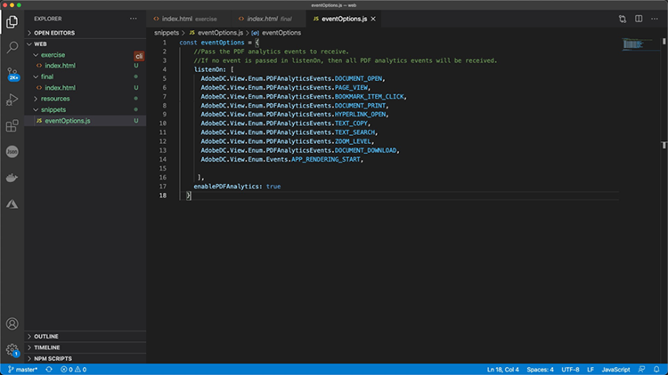

1. Collez le code dans la fonction d&#39;écouteur d&#39;événement.

   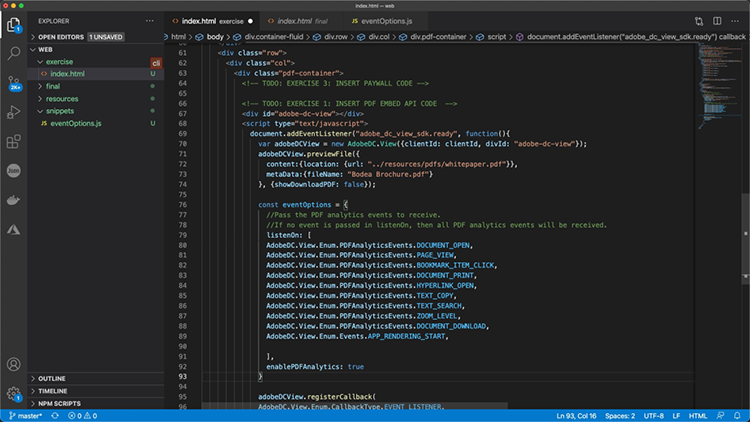

1. Vérifiez que la sortie de la console est correcte lorsque la page est chargée et que vous interagissez avec l’afficheur du PDF.

### Adobe Analytics

Si vous souhaitez ajouter la prise en charge d’Adobe Analytics à votre lecteur, vous pouvez suivre les instructions documentées sur le site Web.

>[!IMPORTANT]
>
>Adobe Analytics doit déjà être chargé sur votre page web dans l’en-tête.

Accédez à l’onglet [Documentation Adobe Analytics](https://www.adobe.com/devnet-docs/dcsdk_io/viewSDK/howtodata.html#adobe-analytics) et vérifiez si Adobe Analytics est déjà activé sur votre page web. Suivez les instructions pour configurer reportSuite.

### Google Analytics

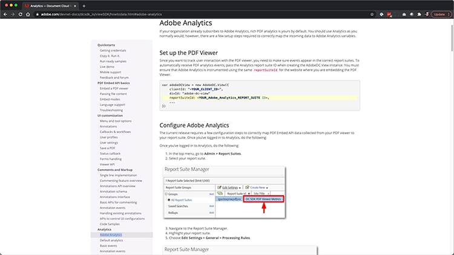

L’API Adobe PDF Embed fournit une intégration prête à l’emploi avec Adobe Analytics. Cependant, étant donné que tous les événements sont disponibles en tant qu’événements JavaScript, il est possible de les intégrer à des Google Analytics en capturant des événements de PDF et en utilisant la fonction ga() pour ajouter l’événement à Adobe Analytics.

1. Accédez à **snippets/eventsSwitchGA.js** pour voir comment vous pouvez intégrer des Google Analytics.
1. Examinez et utilisez ce code comme exemple si votre page Web est suivie à l’aide d’Adobe Analytics et qu’elle est déjà incorporée à la page Web.

   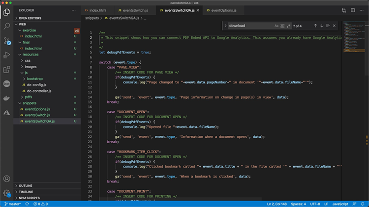

## Partie 4 : Ajout d’interactivité en fonction des événements {#part4}

Dans la quatrième partie, vous apprendrez à placer sur le dessus de la visionneuse de votre PDF une paywall qui s’affiche après le défilement de la deuxième page.

### Exemple de Paywall

Accédez à cette [exemple de PDF derrière une paywall](https://www3.technologyevaluation.com/research/white-paper/the-forrester-wave-digital-decisioning-platforms-q4-2020.html). Dans cet exemple, vous allez apprendre à ajouter de l&#39;interactivité à une expérience de visionnage de PDF.

### Ajouter un code paywall

1. Accédez à snippets/paywallCode.html et copiez le contenu.
1. Recherche de `<!-- TODO: EXERCISE 3: INSERT PAYWALL CODE -->` dans exercise/index.html.

   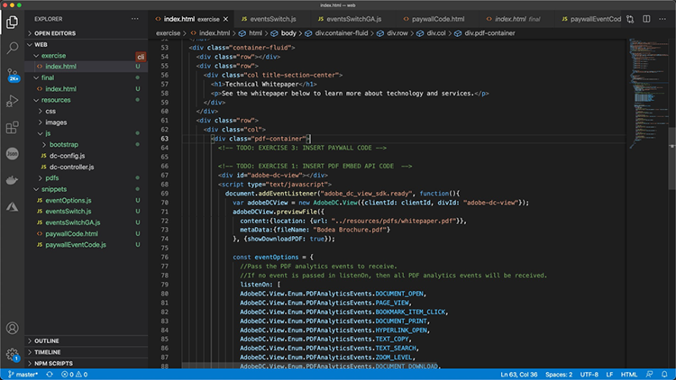

1. Collez le code copié après le commentaire.
1. Accéder à **snippets/paywallCode.js** et copiez le contenu.

   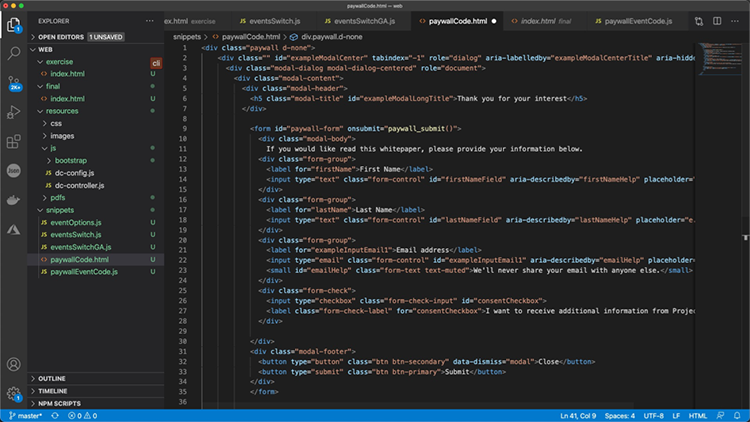

1. Collez le code dans cet emplacement.

### Tester la démonstration avec Paywall

Vous pouvez maintenant visionner la démonstration.

1. Recharger **index.html** sur votre site web.
1. Faites défiler la liste jusqu’à une page > 2.
1. Afficher la boîte de dialogue qui s’affiche pour demander à l’utilisateur d’accéder à la deuxième page.

   

## Autres ressources

Des ressources supplémentaires sont disponibles [ici](https://www.adobe.io/apis/documentcloud/dcsdk/docs.html).
