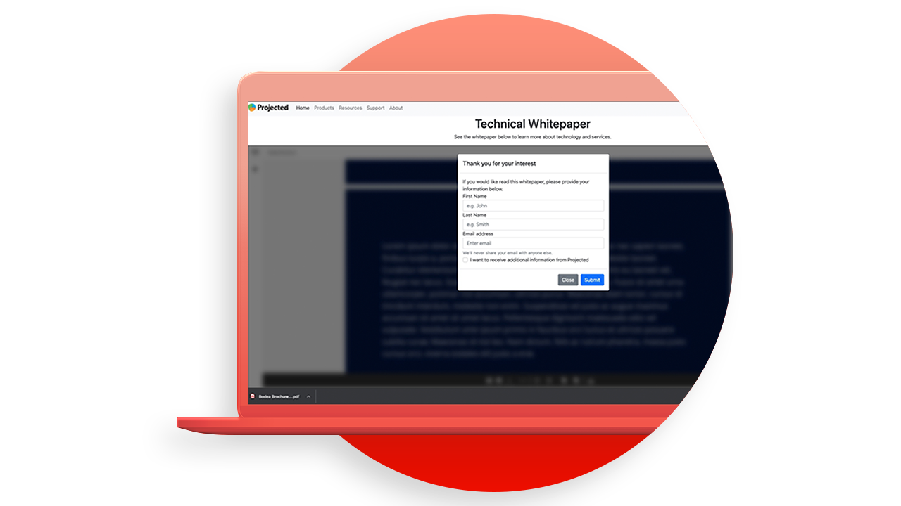

# Tutoriels de l’API Adobe PDF Embed

L’API PDF Embed est une API JavaScript gratuite qui permet d’intégrer des PDF haute fidélité, d’activer la collaboration et de consulter les analyses.

<table style="table-layout:fixed">
<tr>
 <td>
   
    

   <a href="controlpdfexperience.md"><strong>Contrôlez l’expérience en ligne de votre PDF et collectez des analyses</strong></a>
    

    <em>Découvrez comment utiliser l’API Adobe PDF Embed pour contrôler l’apparence, activer la collaboration et collecter des analyses sur la façon dont l’utilisateur interagit avec les PDF, y compris le temps passé sur une page et les recherches</em>
     
  </td>
  <td>
   
    

   <a href="https://experienceleague.adobe.com/docs/adobe-developers-live-events/events/2021/oct2021/pdf-embed-api.html"><strong>Débrouillez les PDF sur le web comme un pro</strong></a>
    

    <em>Découvrez comment utiliser l’API Adobe PDF Embed gratuite pour faciliter l’utilisation des PDF dans votre site web</em>
     
  </td>
  <td>
    
    

     
  </td>
</tr>
</table>
