# Création de votre premier flux dans Microsoft Power Automate

Apprenez à créer votre premier flux dans [Microsoft Power Automate](https://flow.microsoft.com/fr-fr/) en utilisant le [Services Adobe PDF](https://us.flow.microsoft.com/fr-fr/connectors/shared_adobepdftools/adobe-pdf-services/) connecteur.

Dans ce tutoriel pratique, découvrez comment :

* Conversion de documents Word en PDF
* Regroupement de documents PDF dans un PDF
* Protect d’un document PDF avec un mot de passe

## Préparation

### Ce dont vous avez besoin

* **Identifiants de version d’évaluation ou de production pour Adobe PDF Services**
En savoir plus sur l’obtention et la configuration des informations d’identification dans Microsoft Power Automate [ici](https://experienceleague.adobe.com/docs/document-services/tutorials/pdfservices/getting-credentials-power-automate.html).
* **Microsoft Power Automate avec connecteurs Premium**
Découvrez comment vérifier le niveau de licence de Power Automate [ici](https://docs.microsoft.com/en-us/power-platform/admin/power-automate-licensing/types).
* **OneDrive**
Le connecteur de stockage OneDrive est utilisé dans ce tutoriel, mais n’importe quel connecteur de stockage peut être substitué.

### Fichiers exemples

Il y en a deux [exemples de fichiers](assets/sample-assets.zip) que vous devez décompresser et télécharger vers OneDrive :

* WordDocument01.docx
* WordDocument02.docx

### Obtention des informations

Pour terminer ce tutoriel, vous devez avoir configuré vos informations d’identification dans Microsoft Power Automate pour Adobe PDF Services. Si vous n’avez pas terminé cette étape, consultez la [instructions ici](https://experienceleague.adobe.com/docs/document-services/tutorials/pdfservices/getting-credentials-power-automate.html).

## Partie 1 : Création d’un flux et conversion de Word en PDF

### Création du flux

Dans cette partie, vous créez un enchaînement dans [Microsoft Power Automate](https://flow.microsoft.com/fr-fr/) à l’aide d’un flux instantané, ajoutez des paramètres, récupérez vos fichiers sur OneDrive et convertissez-les en PDF.

1. Accédez à [Microsoft Power Automate](https://flow.microsoft.com/fr-fr/) et connectez-vous avec vos identifiants.
1. Dans la barre latérale, sélectionnez **[!UICONTROL Créer]**.

   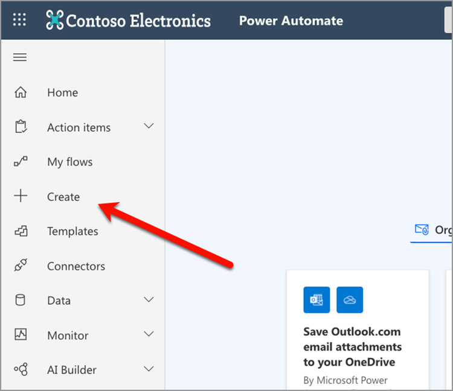

1. Sélectionner **[!UICONTROL Flux instantané]**.
1. Donnez un nom à votre flux.
1. Sous *Choisir comment déclencher ce flux*, sélectionnez **[!UICONTROL Déclencher manuellement un enchaînement]**.
1. Sélectionnez **[!UICONTROL Créer]**.

### Obtention du contenu des fichiers

Ensuite, récupérez le contenu des fichiers d’exemple.

>[!PREREQUISITES]
>
>Si vous n’avez pas chargé le fichier [exemples de fichiers](assets/sample-assets.zip) dans OneDrive, décompressez-les et chargez-les.


1. Dans [Power Automate](https://flow.microsoft.com/fr-fr/), sélectionnez **[!UICONTROL + Nouvelle étape]**.
1. Recherche de *OneDrive* dans la barre de recherche.
1. Choisissez votre compte OneDrive personnel ou professionnel en sélectionnant **[!UICONTROL OneDrive Entreprise]** ou **[!UICONTROL OneDrive]**.
1. Recherche de *Obtenir le contenu du fichier* dans la barre de recherche.
1. Dans le **[!UICONTROL Fichier]** , sélectionnez l’icône Dossier pour accéder au *WordDocument01.docx* dans OneDrive.

   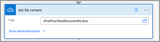

### Convertir le fichier en PDF

Maintenant que vous avez le contenu du fichier, vous pouvez convertir le document en PDF.

1. Dans [Power Automate](https://flow.microsoft.com/fr-fr/), sélectionnez **[!UICONTROL + Nouvelle étape]**.
1. Recherche de *Services Adobe PDF* dans la barre de recherche.
1. Sélectionner **[!UICONTROL Services Adobe PDF]**.
1. Recherche de *Conversion de Word en PDF* dans la barre de recherche.
1. Dans **[!UICONTROL Nom du fichier]**, nommez votre fichier comme vous le souhaitez, mais il doit se terminer par *.docx*. Cette extension est nécessaire pour convertir des documents Word en PDF.
1. Placez votre curseur dans le **[!UICONTROL Contenu du fichier]** .
1. En utilisant le **[!UICONTROL Contenu dynamique]** , sélectionnez **[!UICONTROL Contenu du fichier]**.

   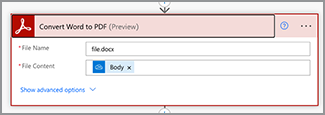

### Enregistrez le fichier dans OneDrive

Une fois le document généré, enregistrez à nouveau le fichier dans OneDrive.

1. Dans [Microsoft Power Automate](https://flow.microsoft.com/fr-fr/), sélectionnez **[!UICONTROL + Nouvelle étape]**.
1. Recherche de *OneDrive* dans la barre de recherche.
1. Choisissez votre compte OneDrive personnel ou professionnel en sélectionnant **[!UICONTROL OneDrive Entreprise]** ou **[!UICONTROL OneDrive]**.
1. Recherche de *Obtenir le contenu du fichier* dans la barre de recherche.
1. Recherche de *Créer un fichier* dans la barre de recherche.
1. Sélectionner **[!UICONTROL Créer un fichier]**.
1. Dans le **[!UICONTROL Chemin du dossier]** , sélectionnez l’icône de dossier pour spécifier où enregistrer le fichier dans OneDrive.
1. Dans **[!UICONTROL Nom du fichier]**, nommez votre fichier comme vous le souhaitez, mais il doit se terminer par *.docx*. Cette extension est nécessaire pour convertir des documents Word en PDF.
1. Dans le **[!UICONTROL Contenu du fichier]** , utilisez **[!UICONTROL Contenu dynamique]** pour insérer la variable Contenu du fichier de PDF.

### Essayer le flux

1. En haut à gauche, sélectionnez **[!UICONTROL Sans titre]** pour renommer l’enchaînement.
1. Sélectionnez **[!UICONTROL Enregistrer]**.
1. Sélectionner **[!UICONTROL Test]**.
1. Sélectionner **[!UICONTROL Manuellement]** et ensuite **[!UICONTROL Enregistrer et tester]**.
1. Sélectionnez **[!UICONTROL Continuer]**.
1. Sélectionner **[!UICONTROL Exécuter le flux]**.

Dans le dossier OneDrive, vous devriez maintenant voir le PDF converti.

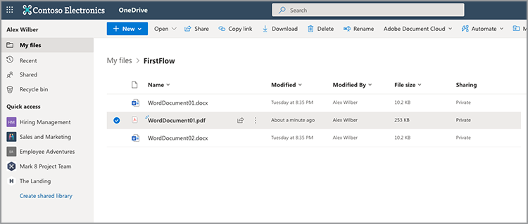

## Partie 2 : Génération d’un document dynamique à partir d’un modèle

La partie suivante repose sur la partie 1 et utilise la *Générer un document à partir de Word* pour fusionner dynamiquement des données dans votre document.

### Révision du modèle de document

Ouvrir *WordDocument02_.docx* de vos fichiers d’exemple dans OneDrive. Le document Word contient plusieurs balises de texte différentes qui représentent les emplacements où les données sont renseignées dans le document.

### Ajout de paramètres au déclencheur

Pour insérer des données dynamiques dans le document, vous devez créer quelques paramètres pour que le déclencheur demande des valeurs.

1. Lorsque vous modifiez votre flux, sélectionnez **[!UICONTROL Déclencher manuellement un enchaînement]** pour développer l’action.
1. Sélectionner **[!UICONTROL Ajout d’une entrée]**.
1. Sélectionner **[!UICONTROL Texte]**.
1. Nommez le champ. *Prénom*.

Répétez les étapes 2 à 4 pour ajouter les champs suivants :

* Nom
* Salaire

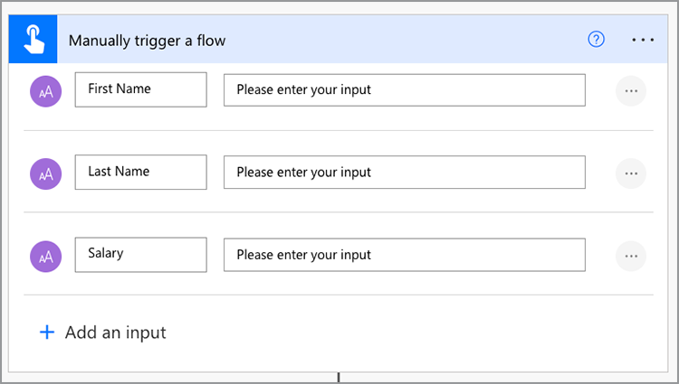

### Obtention du contenu d’un fichier de modèle

Pour générer un document, vous devez d’abord obtenir le contenu du fichier du modèle Word.

1. Dans Power Automate, sélectionnez + **[!UICONTROL Nouvelle étape]**.
1. Recherche de *OneDrive* dans la barre de recherche.
1. Choisissez votre compte OneDrive personnel ou professionnel en sélectionnant **[!UICONTROL OneDrive Entreprise]** ou **[!UICONTROL OneDrive]**.
1. Recherche de *Obtenir le contenu du fichier* dans la barre de recherche.
1. Dans le **[!UICONTROL Fichier]** , sélectionnez l’icône Dossier pour accéder au *WordDocument02.docx* dans OneDrive.

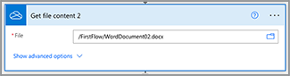

### Générer le document à partir du modèle

1. Dans Power Automate, sélectionnez **[!UICONTROL + Nouvelle étape]**.
1. Recherche de *Services Adobe PDF* dans la barre de recherche.
1. Sélectionner **[!UICONTROL Services Adobe PDF]**.
1. Sélectionnez le fichier **[!UICONTROL Générer un document à partir d’un modèle Word]** action .
1. Dans le **[!UICONTROL Nom du fichier modèle]** , nommez votre fichier comme vous le souhaitez, mais il doit se terminer par *.docx*.

#### Fusionner les données

En utilisant le *Générer un document à partir d’un modèle Word* , vous pouvez fusionner des données dans votre document à partir de l’une des différentes variables précédemment présentes dans l’enchaînement à l’aide de l’option Contenu dynamique.

Copiez les données JSON ci-dessous dans le fichier **Fusionner les données** champ :

```
{
    "FirstName": "",
    "LastName": "",
    "Salary": ""
}
```

1. Placez votre curseur dans le champ situé entre les deux guillemets du *FirstName* valeur.
1. En utilisant le **[!UICONTROL Contenu dynamique]** , insérez le panneau *Prénom* de la boîte de dialogue Déclencher manuellement une action d’enchaînement.

   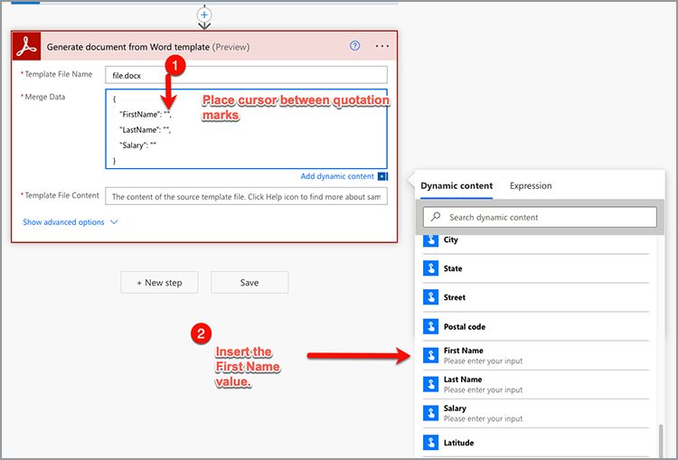

1. Répétez les étapes 7 à 8 pour le **[!UICONTROL LastName]** et **[!UICONTROL Salaire]** champs.
1. Dans le **[!UICONTROL Contenu du fichier modèle]** , utilisez le champ **[!UICONTROL Contenu dynamique]** pour insérer le panneau **[!UICONTROL Contenu du fichier]** de la boîte de dialogue *Obtenir le contenu du fichier* étape.

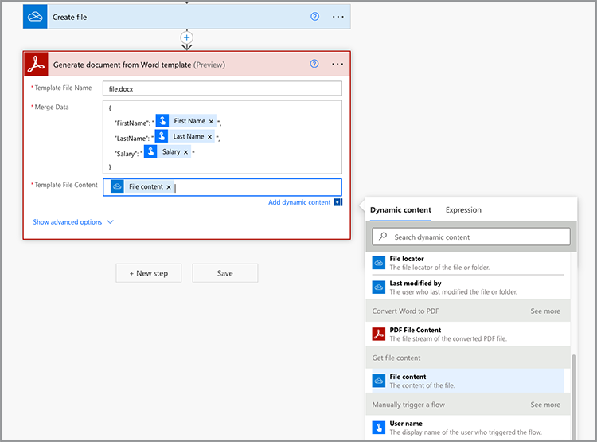

>[!TIP]
>
>La *Générer un document à partir d’un modèle Word* utilise l’API Adobe Document Generation. Si vous voulez en savoir plus sur la création de modèles, voici quelques ressources :
>
>* [En savoir plus sur la génération de documents Adobes](https://developer.adobe.com/document-services/apis/doc-generation/)
>* [Baliseur de génération de document Adobe pour Microsoft Word](https://appsource.microsoft.com/en-US/product/office/WA200002654)
>* [Documentation de l’API Adobe Document Generation](https://developer.adobe.com/document-services/docs/overview/document-generation-api/)

### Enregistrez le fichier dans OneDrive

Une fois le document généré, vous pouvez enregistrer le fichier dans OneDrive.

1. Dans Power Automate, sélectionnez **+ [!UICONTROL Nouvelle étape]**.
1. Recherche de *OneDrive* dans la barre de recherche.
1. Choisissez votre compte OneDrive personnel ou professionnel en sélectionnant **[!UICONTROL OneDrive Entreprise]** ou **[!UICONTROL OneDrive]**.
1. Recherche de *Créer un fichier* dans la barre de recherche.
1. Sélectionner **[!UICONTROL Créer un fichier]**.
1. Dans le **[!UICONTROL Chemin du dossier]** , sélectionnez l’icône de dossier pour spécifier où enregistrer le fichier dans OneDrive.
1. Dans le **[!UICONTROL Nom du fichier]** , définissez le nom du fichier. Comme la sortie est un PDF, votre nom de fichier doit se terminer par l’extension .pdf.
1. Utilisez la **[!UICONTROL Contenu dynamique]** pour insérer la variable Contenu du fichier du PDF dans le panneau **[!UICONTROL Contenu du fichier]** .

### Essayer le flux

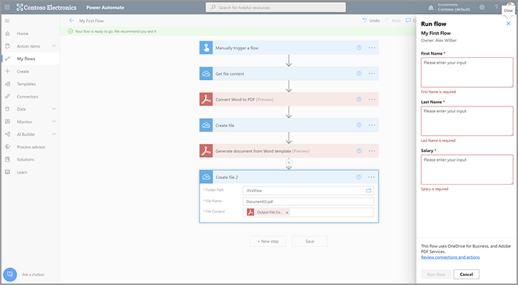

1. Sélectionnez **[!UICONTROL Enregistrer]**.
1. Sélectionner **[!UICONTROL Test]**.
1. Sélectionner **[!UICONTROL Manuellement]** et ensuite **[!UICONTROL Enregistrer et tester]**.
1. Sélectionnez **[!UICONTROL Continuer]**.
1. Saisissez des valeurs pour *Prénom*, *Nom*, et *Salaire*.
1. Sélectionner **[!UICONTROL Exécuter le flux]**.

Dans le dossier OneDrive, vous voyez maintenant un PDF généré à partir du document Word. Lorsque vous ouvrez le document du PDF dans OneDrive, vous constatez que les données sont fusionnées dans les emplacements des balises de texte.


## Partie 3 : Regroupez plusieurs PDF dans un seul

Maintenant que vous avez généré et converti un document Word en PDF, l&#39;étape suivante consiste à regrouper plusieurs documents PDF.

>[!NOTE]
>
>Dans les actions précédentes, vous avez enregistré une copie du document en tant que fichier dans OneDrive. Pour utiliser des outils tels que les PDF de fusion, vous n’avez pas besoin d’enregistrer le fichier dans OneDrive. Au lieu de cela, vous pouvez transmettre la sortie directement d’une action à la suivante, ce qui est préférable à l’enregistrement dans OneDrive après chaque action. Mais à des fins de démonstration, vous enregistrez ces fichiers dans OneDrive.

### Étape Ajouter un PDF de fusion

1. Lorsque vous modifiez votre flux, sélectionnez **[!UICONTROL + Étape suivante]** pour ajouter une action à la fin du flux.
1. Recherche de *Services Adobe PDF* dans la barre de recherche.
1. Sélectionner **[!UICONTROL Services Adobe PDF]**.
1. Sélectionnez le fichier **[!UICONTROL Fusionner les PDF]** action.
1. Dans le **[!UICONTROL Nom du fichier PDF de fusion]** , entrez le nom de fichier souhaité (c.-à-d.*CombinedDocument.pdf*).
1. Dans le **[!UICONTROL Contenu du fichier -1]** , utilisez le champ **[!UICONTROL Contenu dynamique]** pour insérer le panneau *Contenu du fichier PDF* de la boîte de dialogue **[!UICONTROL Conversion de Word en PDF]** étape.
1. Pour ajouter le document suivant, sélectionnez **+ [!UICONTROL ajouter un nouvel élément]**.
1. Dans le **[!UICONTROL Contenu du fichier - 2]** , utilisez le champ **[!UICONTROL Contenu dynamique]** pour insérer le panneau **[!UICONTROL Contenu du fichier de sortie]** de la boîte de dialogue *Générer un document à partir d’un modèle Word* étape.

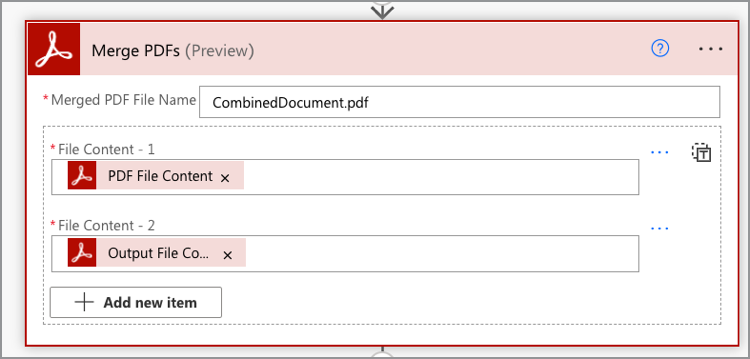

### Enregistrer le PDF fusionné dans OneDrive

Une fois le document combiné, vous pouvez l’enregistrer de nouveau dans OneDrive.

1. Dans Power Automate, sélectionnez **+ [!UICONTROL Nouvelle étape]**.
1. Recherche de *OneDrive* dans la barre de recherche.
1. Choisissez votre compte OneDrive personnel ou professionnel en sélectionnant **[!UICONTROL OneDrive Entreprise]** ou **[!UICONTROL OneDrive]**.
1. Recherche de *Créer un fichier* dans la barre de recherche.
1. Sélectionner **[!UICONTROL Créer un fichier]**.
1. Dans le **[!UICONTROL Chemin du dossier]** , sélectionnez l’icône de dossier pour spécifier où enregistrer le fichier dans OneDrive.
1. Dans le **[!UICONTROL Nom du fichier]** , définissez le nom du fichier. Comme la sortie est un PDF, votre nom de fichier doit se terminer par .pdf.
1. Dans le **[!UICONTROL Contenu du fichier]** , utilisez **[!UICONTROL Contenu dynamique]** pour insérer le panneau *Contenu du fichier PDF* de la boîte de dialogue **[!UICONTROL Fusionner les PDF]** étape.

   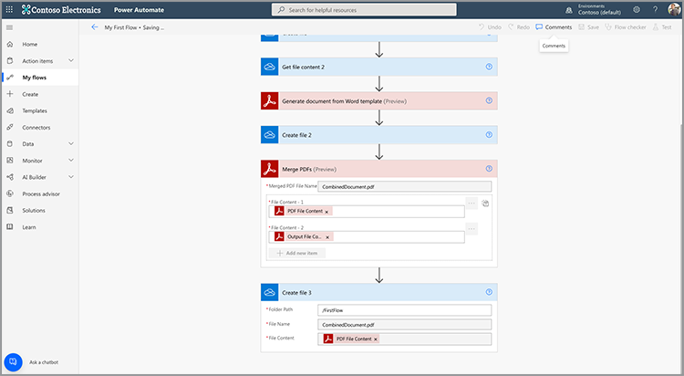

### Essayer le flux

1. Sélectionnez **[!UICONTROL Enregistrer]**.
1. Sélectionner **[!UICONTROL Test]**.
1. Sélectionner **[!UICONTROL Manuellement]** et ensuite **[!UICONTROL Enregistrer et tester]**.
1. Sélectionnez **[!UICONTROL Continuer]**.
1. Saisissez des valeurs pour *Prénom*, *Nom*, et *Salaire*.
1. Sélectionner **[!UICONTROL Exécuter le flux]**.

Dans le dossier OneDrive, vous voyez le PDF combiné avec les pages du premier et du deuxième document.

## Partie 4 : Document Protect PDF

Après avoir généré votre document, vous pouvez le protéger de la modification en incluant une étape supplémentaire avant l’enregistrement dans OneDrive.

### Protéger un PDF

1. Lors de la modification de votre flux dans Power Automate, sélectionnez **+** entre les **[!UICONTROL Fusionner les PDF]** et l&#39;action **[!UICONTROL Créer un fichier 3]** action.

   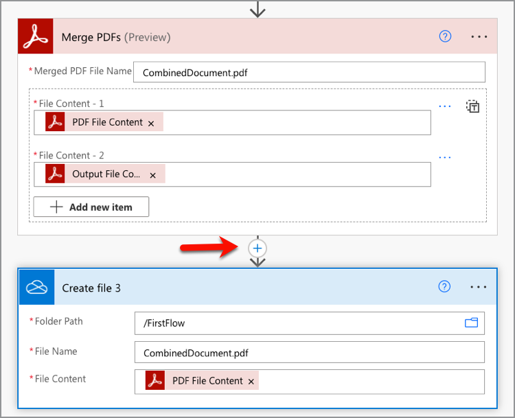

1. Sélectionner **[!UICONTROL Ajout d’une action]**.
1. Recherche de *Services Adobe PDF* dans la barre de recherche.
1. Sélectionner **[!UICONTROL Services Adobe PDF]**.
1. Sélectionnez le fichier **[!UICONTROL Protect PDF - Vue]** action.
1. Dans le **[!UICONTROL Nom du fichier]** , indiquez le nom souhaité, à condition qu’il se termine par une extension .pdf.
1. Définissez la **[!UICONTROL Mot de passe]** à votre mot de passe spécifié pour ouvrir le document.
1. Dans le **[!UICONTROL Contenu du fichier]** , utilisez le champ **[!UICONTROL Contenu dynamique]** pour insérer le panneau *Contenu du fichier PDF* de la boîte de dialogue **[!UICONTROL Fusionner les PDF]** étape.

### Mettre à jour l’enregistrement dans OneDrive

Une fois le document protégé, vous pouvez enregistrer le fichier dans OneDrive. Dans cet exemple, vous mettez à jour le fichier **Créer un fichier 3** action avec un nouveau *Contenu du fichier* valeur.

1. Sélectionnez votre curseur dans la **[!UICONTROL Contenu du fichier]** dans le champ **[!UICONTROL Créer un fichier 3]** action.
1. Utilisez la **[!UICONTROL Contenu dynamique]** pour insérer le panneau *Contenu du fichier PDF* de la boîte de dialogue **Protect PDF - Vue** étape.

### Essayer le flux

1. Sélectionnez **[!UICONTROL Enregistrer]**.
1. Sélectionner **[!UICONTROL Test]**.
1. Sélectionner **[!UICONTROL Manuellement]** et ensuite **[!UICONTROL Enregistrer et tester]**.
1. Sélectionnez **[!UICONTROL Continuer]**.
1. Saisissez des valeurs pour *Prénom*, *Nom*, et *Salaire*.
1. Sélectionner **[!UICONTROL Exécuter le flux]**.

Dans le dossier OneDrive, vous voyez le mot de PDF associé qui vous invite maintenant à saisir un mot de passe pour afficher le document.

## Marche à suivre

Dans ce tutoriel, vous convertissez un document Word en mot de PDF, générez un document à partir de données, fusionnez plusieurs documents et protégez-le par mot de passe. Pour en savoir plus, explorez certaines des autres actions disponibles dans le connecteur Adobe PDF Services dans Microsoft Power Automate :

* Affichez les modèles prédéfinis disponibles dans Microsoft Power Automate.
* En savoir plus [articles](https://medium.com/adobetech/tagged/microsoft-power-automate) sur le blog Adobe Tech.
* Révision [documentation](https://developer.adobe.com/document-services/docs/overview/document-generation-api/) pour l’API Adobe Document Generation.
