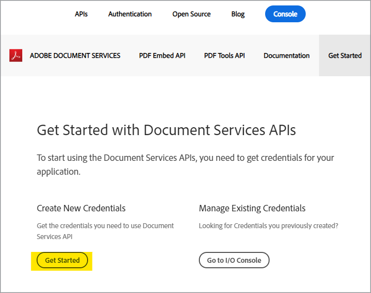
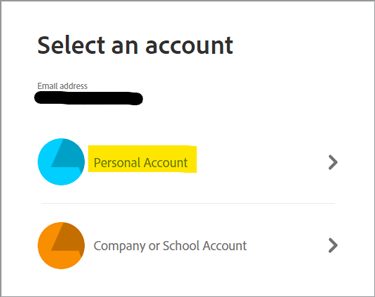
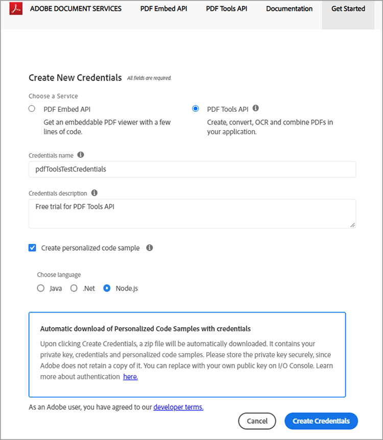
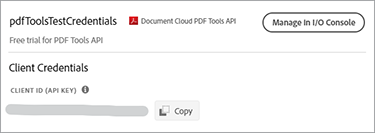
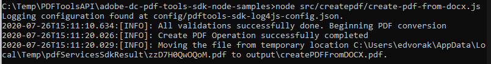

# Création d&#39;un PDF à partir de HTML ou MS Office en quelques minutes avec l&#39;API PDF Services et Node.js


La numérisation des workflows documentaires n’a jamais été aussi simple avec la nouvelle API Adobe PDF Services, qui offre aux développeurs un espace libre pour choisir entre plusieurs services de manipulation de PDF performants afin de répondre aux besoins de workflows métier complexes. Les architectures complexes, les stratégies d&#39;implémentation et la montée en puissance technologique peuvent être rationalisées grâce à ces services web dans le cloud, facilement disponibles.

Dans l&#39;API PDF Services, il existe plusieurs services disponibles pour la création et la manipulation de PDF, ou l&#39;exportation de PDF vers MS Office et d&#39;autres formats.

* Création d’un fichier de PDF à partir de HTML statique ou dynamique, MS Word, PowerPoint, Excel, etc.
* Export PDF à MS Word, PowerPoint, Excel et plus encore
* Reconnaissance optique des caractères pour reconnaître du texte dans des fichiers de PDF et activer la recherche de documents
* Mot de PDF Protect avec mot de passe lors de l’ouverture de documents
* Regroupement de pages de PDF ou de documents de PDF dans un PDF unique
* Compressez les PDF pour réduire la taille du partage par e-mail ou en ligne.
* Linéariser pour optimiser un PDF pour un affichage rapide sur le web
* Organiser les pages du PDF avec les services d’insertion, de remplacement, de réorganisation, de suppression et de rotation

Les développeurs peuvent commencer en quelques minutes avec les fichiers d’exemple prêts à l’emploi fournis pour accéder à tous les services web disponibles. Voici comment procéder.

## Obtention des informations d’identification et téléchargement des fichiers d’exemple

La première étape consiste à obtenir un identifiant (clé API) pour déverrouiller l’utilisation. [Inscrivez-vous ici pour bénéficier de la version d’essai gratuite](https://www.adobe.com/go/dcsdks_credentials) et cliquez sur &quot;Commencer&quot; pour créer vos nouvelles informations d’identification.



Il est important de choisir un &quot;Compte personnel&quot; pour vous inscrire à l&#39;essai gratuit :



À l’étape suivante, vous allez choisir le service d’API PDF Services, puis ajouter un nom et une description pour vos informations d’identification.

Il existe une case à cocher pour &quot;Créer un exemple de code personnalisé&quot;. Sélectionnez cette option pour que vos nouvelles informations d’identification soient automatiquement ajoutées à vos fichiers d’exemple, en ignorant l’étape manuelle.

Ensuite, choisissez Node.js comme langue pour recevoir les exemples spécifiques à Node.js et cliquez sur le bouton &quot;Create Credentials&quot;.



Vous recevrez un fichier .zip à télécharger appelé PDFToolsSDK-Node.jsSamples.zip qui peut être enregistré sur votre système de fichiers local.

## Ajout de vos informations d’identification aux exemples de code

Si vous avez choisi l’option &quot;Créer un exemple de code personnalisé&quot;, vous n’avez pas besoin d’ajouter manuellement votre ID client aux fichiers d’exemple de code. Vous pouvez ignorer l’étape suivante et accéder directement à la section Exemples de code d’exécution ci-dessous.

Si vous n’avez pas choisi l’option &quot;Créer un exemple de code personnalisé&quot;, vous devez copier l’ID client (clé API) depuis la console Adobe.io :



Décompressez le contenu de PDFToolsSDK-Node.jsSamples.zip.

Accédez au répertoire racine sous le dossier adobe-dc-pdf-tools-sdk-node-samples .

Ouvrez le fichier pdftools-api-credentials.json avec n&#39;importe quel éditeur de texte ou IDE.

Collez les informations d’identification dans le champ correspondant à l’ID client dans le code :

```javascript
{
 "client_credentials": {
  "client_id": "abcdefghijklmnopqrstuvwxyz",
```

Enregistrez le fichier et passez à l’étape suivante pour exécuter les exemples de code.

## Exécution de votre premier exemple de code

À l’aide de l’invite de commande, accédez au répertoire racine sous le dossier adobe-dc-pdf-tools-sdk-node-samples .

Tapez npm install :

C:\Temp\PDFToolsAPI\adobe-dc-pdf-tools-sdk-node-samples>npm install

Vous êtes maintenant prêt à exécuter les fichiers d’exemple !

Pour votre premier exemple, créez un PDF :

Toujours dans l’invite de commande, exécutez l’exemple de création de PDF avec la commande suivante :

C:\Temp\PDFToolsAPI\adobe-dc-pdf-tools-sdk-node-samples>node src/createpdf/create-pdf-from-docx.js

Exemple de sortie :



Votre PDF sera créé à l’emplacement désigné dans la sortie, qui est par défaut le répertoire pdfServicesSdkResult.

## Ressources et étapes suivantes

* Pour obtenir de l’aide et une assistance supplémentaires, consultez l’Adobe [[!DNL Acrobat Services] API](https://community.adobe.com/t5/document-cloud-sdk/bd-p/Document-Cloud-SDK?page=1&amp;sort=latest_replies&amp;filter=all) forum de communauté

API PDF Services [Documentation](https://www.adobe.com/go/pdftoolsapi_doc)

* [FAQ](https://community.adobe.com/t5/document-cloud-sdk/faq-for-document-services-pdf-tools-api/m-p/10726197) pour les questions d’API PDF Services

* [Nous contacter](https://www.adobe.com/go/pdftoolsapi_requestform) pour toute question sur les licences et les tarifs

* Articles connexes:
   [La nouvelle API PDF Services offre encore plus de fonctionnalités pour les workflows documentaires](https://community.adobe.com/t5/document-services-apis/new-pdf-tools-api-brings-more-capabilities-for-document-services/m-p/11294170)

   [Version de juillet [!DNL Adobe Acrobat Services]: Services d&#39;intégration et de PDF PDF](https://medium.com/adobetech/july-release-of-adobe-document-services-pdf-embed-and-pdf-tools-17211bf7776d)
