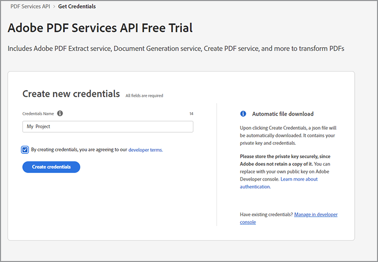
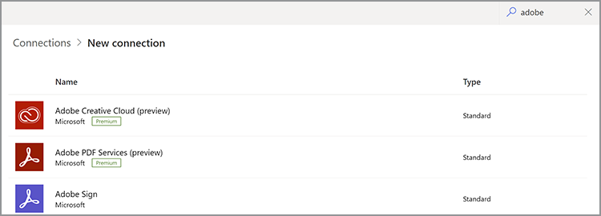

# Obtention des informations d’identification pour Microsoft Power Automate

[Microsoft Power Automate](https://powerautomate.microsoft.com/) fournit aux développeurs et aux développeurs citoyens un moyen efficace de créer des processus automatisés performants pour améliorer leur activité sans aucune programmation. [Services Adobe PDF](https://us.flow.microsoft.com/fr-fr/connectors/shared_adobepdftools/adobe-pdf-services/) , dans le cadre de [[!DNL Adobe Acrobat Services]](https://developer.adobe.com/document-services), permet aux utilisateurs d’effectuer n’importe quelle action disponible dans l’API Adobe PDF Services dans Microsoft Power Automate.

Dans ce tutoriel, découvrez comment obtenir des informations d’identification pour commencer à utiliser ou à tester les services Adobe PDF. Selon que vous êtes un utilisateur d’une version d’essai ou un client existant, ce tutoriel présente les étapes appropriées pour obtenir des informations d’identification.

## Comment les utilisateurs de Microsoft Power Automate peuvent-ils commencer à utiliser le connecteur Adobe PDF Services ?

Les utilisateurs existants de Microsoft Power Automate peuvent [obtenir des identifiants de version](https://www.adobe.com/go/powerautomate_getstarted_fr) pour les services Adobe PDF. Le lien ci-dessus est un lien d’inscription spécial pour aider dans ce processus, en particulier pour les utilisateurs de Microsoft Power Automate.


>[!IMPORTANT]
> Si vous vous connectez pour une version d’essai, vous devez utiliser un Adobe ID et non un Enterprise ID. Si vous n’êtes pas actuellement abonné à l’API Adobe PDF Services et que vous tentez de vous connecter avec votre Enterprise ID, vous pouvez obtenir une erreur d’autorisation car votre entreprise ne vous a pas autorisé à utiliser l’API Adobe PDF Services. Pour cette raison, il est recommandé d’utiliser un Adobe ID personnel qui est gratuit.
>

1. Une fois connecté, vous êtes invité à sélectionner un nom pour vos nouvelles informations d’identification. Saisissez votre *Nom des informations*.
1. Cochez la case pour accepter les conditions du développeur.
1. Sélectionner **[!UICONTROL Créer des identifiants]**.

   

Ces informations d’identification couvrent cinq valeurs différentes :

* ID client (clé API)
* Clé secrète client
* ID d’organisation
* ID de compte technique
* Base64 (Clé privée codée)


Un fichier JSON contenant toutes ces valeurs est également téléchargé automatiquement sur votre système. Ce fichier porte le nom `pdfservices-api-pa-credentials.json` et ressemble à ceci :

```json
{
 "client_id": "client id value",
 "client_secret": "client secret value",
 "organization_id": "organized id value",
 "account_id": "account id value",
 "base64_encoded_private_key": "base64 version of the private key"
}
```

Stockez ce fichier dans un emplacement sécurisé, car il n’est pas possible d’obtenir à nouveau une copie de la clé privée.

### Ajouter une connexion dans Microsoft Power Automate

Maintenant que vous avez vos informations d’identification, vous pouvez commencer à les utiliser dans les flux Microsoft Power Automate.

1. Dans le menu de la barre latérale, ouvrez la boîte de dialogue **[!UICONTROL Données]** et sélectionnez **Connexions**:

   

1. Sélectionner **+ [!UICONTROL Nouvelle connexion]**.

1. L’écran suivant affiche une liste des types de connexion possibles. Dans le coin supérieur droit, saisissez &quot;adobe&quot; pour filtrer les options :

   

1. Sélectionner **[!UICONTROL Services Adobe PDF (aperçu)]**.
1. Dans la fenêtre modale, entrez les cinq valeurs que vous avez précédemment générées. Sélectionner **[!UICONTROL Créer]** lorsque vous avez terminé.

   

Vous êtes maintenant prêt à utiliser les services Adobe PDF dans Microsoft Power Automate.

### Accès aux informations d’identification après leur création

Si vous avez déjà créé des informations d’identification et égaré les informations d’identification téléchargées, vous pouvez les récupérer à nouveau dans [Console Adobe Developer](https://developer.adobe.com/console).

1. Après vous être connecté à [Console Adobe Developer](https://developer.adobe.com/console), recherchez d’abord votre projet et sélectionnez-le.
1. Dans le menu de gauche sous *Informations*, sélectionnez **Compte de service (JWT)**:

   

1. Notez les cinq valeurs présentées ici : *ID client*, *Secret client*, *ID de compte technique*, *Adresse électronique du compte technique*, et *ID organisation*.

Malheureusement, vous ne pouvez pas télécharger la clé privée précédente, mais vous pouvez utiliser le bouton &quot;Générer une paire de clés publique/privée&quot; pour en créer une nouvelle.

## Utilisation des identifiants Adobe PDF Services existants

Si vous disposez d’identifiants d’API Adobe PDF Services existants générés à partir de [!DNL Adobe Acrobat Services] , vous pouvez les utiliser avec Microsoft Power Automate. Si vous avez téléchargé un SDK lors de votre inscription, vos informations d’identification existantes se présentaient sous la forme d’un fichier JSON très probablement nommé `pdfservices-api-credentials.json`. Ce fichier JSON contient les cinq clés nécessaires lors de la création de vos informations de connexion. Copiez chaque valeur du fichier JSON dans le champ de connexion correspondant.

La valeur de votre clé privée provient d’un deuxième fichier nommé `private.key`.

Vous pouvez également obtenir les valeurs à partir de la console Adobe Developer comme décrit ci-dessus.

## Comment peut-on [!DNL Adobe Acrobat Services] utilisateurs commencent à travailler avec Microsoft Power Automate ?

Pour commencer à utiliser Power Automate, rendez-vous d’abord sur <https://powerautomate.microsoft.com> et utilisez le bouton &quot;Démarrer gratuitement&quot;. Si vous n’avez pas de compte Microsoft, vous devez en créer un. Une fois connecté, le tableau de bord Power Automate s’affiche.


Comme décrit au début de ce tutoriel, créez un flux, ajoutez une étape et recherchez les services Adobe PDF. Sélectionnez une action et vous serez peut-être averti qu’un compte Premium est requis.


Comme le montre la capture d’écran ci-dessus, vous pouvez passer à un compte professionnel ou configurer un nouveau compte d’entreprise. Une fois que vous avez terminé, vous pouvez ajouter l’action Services Adobe PDF.

Pour un examen plus approfondi de la création de votre premier flux Microsoft Power Automate avec [!DNL Adobe Acrobat Services], voir [Création de votre premier workflow dans Microsoft Power Automate](https://experienceleague.adobe.com/docs/document-services/tutorials/pdfservices/create-workflow-power-automate.html).

## Autres ressources

Pour en savoir plus, voici une liste de ressources supplémentaires :

* Tout d’abord, les documents Adobe PDF Services Power Automate : <https://docs.microsoft.com/en-us/connectors/adobepdftools/>. Ces ressources viennent compléter ce que vous avez appris ici.
* Besoin d&#39;exemples ? Vous trouverez de nombreux [Modèles Power Automate](https://powerautomate.microsoft.com/en-us/connectors/details/shared_adobepdftools/adobe-pdf-services/) présentant les Services de PDF.
* Notre contenu vidéo en direct, [Clips papier](https://www.youtube.com/playlist?list=PLcVEYUqU7VRe4sT-Bf8flvRz1XXUyGmtF), contient également des vidéos démontrant l’utilisation de Power Automate.
* La [Blog Adobe Tech](https://medium.com/adobetech/tagged/microsoft-power-automate) contient de nombreux articles sur l’utilisation de Power Automate.
* Enfin, assurez-vous de consulter le noyau [Services de PDF](https://developer.adobe.com/document-services/docs/overview/) la documentation également.
