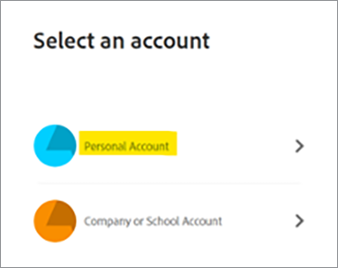

# Prise en main de l’API Adobe PDF Services et de .Net

Les développeurs peuvent commencer en quelques minutes avec les fichiers d’exemple prêts à l’emploi fournis pour accéder à tous les services web disponibles. Ce didacticiel vous guide à travers toutes les étapes pour commencer à exécuter les exemples à l&#39;aide du SDK .Net PDF Services :

## Étape 1 : Obtention des informations d’identification et téléchargement des fichiers d’exemple

La première étape consiste à obtenir un identifiant (clé API) pour déverrouiller l’utilisation. [Inscrivez-vous ici pour bénéficier de la version d’essai gratuite](https://www.adobe.io/apis/documentcloud/dcsdk/gettingstarted.html) et cliquez sur &quot;Commencer&quot; pour créer vos nouvelles informations d’identification.

Il est important de choisir un &quot;Compte personnel&quot; pour vous inscrire à l&#39;essai gratuit :

À l’étape suivante, vous allez choisir le service d’API PDF Services, puis ajouter un nom et une description pour vos informations d’identification.

Il existe une case à cocher pour &quot;Créer un exemple de code personnalisé&quot;. Sélectionnez cette option pour que vos nouvelles informations d’identification soient automatiquement ajoutées à vos fichiers d’exemple, ce qui vous évitera de les ajouter manuellement à votre projet.

Ensuite, choisissez Node.js comme langue pour recevoir les exemples spécifiques à Node.js et cliquez sur le bouton &quot;Create Credentials&quot;.

Vous recevrez un fichier .zip à télécharger appelé PDFToolsSDK-.NetSamples.zip qui peut être enregistré sur votre système de fichiers local.

## Étape 2 : Configurez votre environnement .Net et exécutez l&#39;exemple de code

1. Téléchargez et installez le fichier [SDK .Net](https://dotnet.microsoft.com/learn/dotnet/hello-world-tutorial/install)
1. Extrayez le fichier téléchargé **[!UICONTROL PDFToolsSDK-.NetSamples.zip]** et décompressez le contenu
1. cd vers le répertoire racine des exemples **[!UICONTROL adobe-DC.PDFTools.SDK.NET.Samples]**
1. À partir du répertoire racine des exemples, exécutez `dotnet build`

   C:\Temp\PDFToolsAPI\ PDFToolsSDK-.NetSamples\adobe-DC.PDFTools.SDK.NET.Samples>dotnet build

   Vous êtes maintenant prêt à exécuter les fichiers d’exemple !

   Ces dernières étapes vous montrent comment exécuter votre premier exemple avec l’opération Créer un PDF à partir de Word :

1. À partir des exemples, remplacez le répertoire racine par le dossier CreatePDFFromDocx , cd CreatePDFFromDocx/

   C:\Temp\PDFToolsAPI\ PDFToolsSDK-.NetSamples\adobe-DC.PDFTools.SDK.NET.Samples>cd CreatePDFFromDocx/

1. exécuter `dotnet run CreatePDFFromDocx.csproj`

   C:\Temp\PDFToolsAPI\ PDFToolsSDK-.NetSamples\adobe-DC.PDFTools.SDK.NET.Samples\CreatePDFFromDocx>dotnet exécuter CreatePDFFromDocx.csproj

Votre PDF sera créé à l’emplacement indiqué dans la sortie, qui est par défaut le même dossier.

## Réflexions finales

L&#39;API PDF Services peut vous aider à éliminer les processus manuels en automatisant les workflows courants et en déplaçant la charge de traitement vers le cloud. Dans un monde où chaque navigateur traite le PDF différemment, l’API Adobe PDF Embed et l’API PDF Services vous permettent de créer des processus simplifiés, fiables et prévisibles qui s’exécutent et s’affichent correctement **chaque fois** quelle que soit la plateforme ou le device.

## Ressources et étapes suivantes

* Pour une aide et une assistance supplémentaires, consultez la page [[!DNL Adobe Acrobat Services] API](https://community.adobe.com/t5/document-cloud-sdk/bd-p/Document-Cloud-SDK?page=1&amp;sort=latest_replies&amp;filter=all) forum de communauté

* API PDF Services [Documentation](https://www.adobe.com/go/pdftoolsapi_doc)

* [FAQ](https://community.adobe.com/t5/document-cloud-sdk/faq-for-document-services-pdf-tools-api/m-p/10726197) pour les questions d’API PDF Services

* [Nous contacter](https://www.adobe.com/go/pdftoolsapi_requestform) pour toute question sur les licences et les tarifs

* Articles connexes

   [La nouvelle API PDF Services offre encore plus de fonctionnalités pour les workflows documentaires](https://community.adobe.com/t5/document-services-apis/new-pdf-tools-api-brings-more-capabilities-for-document-services/m-p/11294170)

   [Version de juillet [!DNL Adobe Acrobat Services]: Services d&#39;intégration et de PDF PDF](https://medium.com/adobetech/july-release-of-adobe-document-services-pdf-embed-and-pdf-tools-17211bf7776d)
