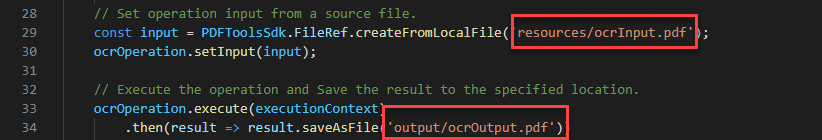

# Utilisation de l’API Adobe PDF Services pour créer des fichiers de PDF OCR

Grâce à la reconnaissance optique des caractères (ROC), vous pouvez déverrouiller des PDF numérisés pour extraire du texte et générer des fichiers indexables. À l’aide de nos API cloud performantes, intégrez la reconnaissance optique des caractères dans n’importe quel workflow documentaire pour offrir une solution parfaite à l’archivage, la copie de texte et la création d’index de documents indexables. Créez des archives consultables à partir de dépôts de PDF numérisés pour déverrouiller des informations importantes et gagner du temps grâce à des recherches rapides. Ou appliquez la reconnaissance optique des caractères à vos PDF à partir de numérisations chargées pour leur permettre d’être modifiés afin de les utiliser dans les workflows d’intégration.

Les développeurs peuvent démarrer en quelques minutes grâce aux fichiers d’exemple prêts à l’emploi fournis pour la reconnaissance optique des caractères.

Ce tutoriel présente les principes de base de l’exécution de votre première opération de ROC de l’API PDF Services à l’aide de fichiers d’exemple pour les langages Node.js, Java et .Net.

## Étape 1 : Création de vos informations d’identification et configuration de votre environnement

Utilisez les tutoriels de prise en main ci-dessous pour créer vos identifiants d’API, télécharger des fichiers d’exemple et configurer votre environnement.

[Prise en main de l’API PDF Services et de Java](gettingstartedjava.md)

[Prise en main de l&#39;API PDF Services et de .Net](gettingstartednet.md)

[Prise en main de l&#39;API PDF Services et de Node.js](createpdffromhtml.md)

## Exécutez l’exemple de ROC fourni dans les fichiers d’exemple

Notre opération de reconnaissance optique des caractères permet de définir des paramètres régionaux en anglais par défaut, mais prend également en charge l’allemand, le français, le danois et [autres langues](https://opensource.adobe.com/pdftools-sdk-docs/release/latest/howtos.html#ocr-with-explicit-language). La valeur par défaut est en-us.

Lorsque vous transmettez des options avec une opération de ROC, y compris des paramètres régionaux spécifiques, la méthode accepte également le paramètre &quot;type&quot; qui a deux options :

* SEARCHABLE_IMAGE : Modifie l’image d’origine pendant le processus de nettoyage (par exemple, l’étire) avant de placer un calque de texte invisible dessus. Ce type supprime les artefacts indésirables et peut, dans certains cas, améliorer la lisibilité du document.

* SEARCHABLE_IMAGE_EXACT : Permet de rechercher et de sélectionner du texte. Cette option conserve l’image d’origine et place un calque de texte invisible dessus. Recommandé pour les cas nécessitant une fidélité maximale à l’image d’origine.

**Java**

1. Ouvrez une invite de commande.

1. Transformez les répertoires en exemple de répertoire de code.

   Par exemple, C:\Temp\PDFToolsAPI\adobe-dc-pdf-tools-sdk-java-samples>.

1. Exécutez la commande suivante:

   `mvn -f pom.xml exec:java -Dexec.mainClass=com.adobe.platform.operation.samples.ocrpdf.OcrPDF`

Votre PDF sera créé dans le répertoire src/main/resources.

**.Net**

1. Ouvrez une invite de commande.

1. Transformez les répertoires en exemple de répertoire de code.

   Par exemple, C:\Temp\PDFToolsAPI\adobe-dc-pdf-tools-sdk-NetSamples

1. Remplacez les répertoires par le répertoire OcrPDF.

1. Exécutez la commande suivante:

   `dotnet run OcrPDF.csproj`

Votre PDF sera créé dans le même répertoire.

**Node.js**

1. Ouvrez une invite de commande.

1. Transformez les répertoires en exemple de répertoire de code.

   Par exemple, C:\Temp\PDFToolsAPI\adobe-dc-pdf-tools-sdk-node-samples

1. Exécutez la commande suivante:

   `node src/ocr/ocr-pdf.js`

Votre PDF sera créé à l’emplacement désigné dans la sortie, qui est par défaut le répertoire de sortie.

## Réflexions finales

En suivant ces étapes simples à l’aide des fichiers d’exemple, vous devriez disposer d’un exemple concret sur lequel vous pouvez vous appuyer. Outre l’exemple de ROC que nous avons utilisé dans ce tutoriel, il existe un autre exemple de ROC utilisant les options de type et de paramètres régionaux prises en charge, décrites précédemment.

À partir de là, vous pouvez simplement remplacer vos fichiers d’entrée et de sortie situés dans l’exemple pour utiliser votre propre PDF afin de finaliser votre preuve de concept pour votre propre cas d’utilisation.

## Ressources et étapes suivantes

* Pour obtenir de l’aide et une assistance supplémentaires, consultez l’Adobe [[!DNL Acrobat Services] API](https://community.adobe.com/t5/document-cloud-sdk/bd-p/Document-Cloud-SDK?page=1&amp;sort=latest_replies&amp;filter=all) forum de communauté

* API PDF Services [Documentation](https://www.adobe.com/go/pdftoolsapi_doc)

* [FAQ](https://community.adobe.com/t5/document-cloud-sdk/faq-for-document-services-pdf-tools-api/m-p/10726197) pour les questions d’API PDF Services

* [Nous contacter](https://www.adobe.com/go/pdftoolsapi_requestform) pour toute question sur les licences et les tarifs
