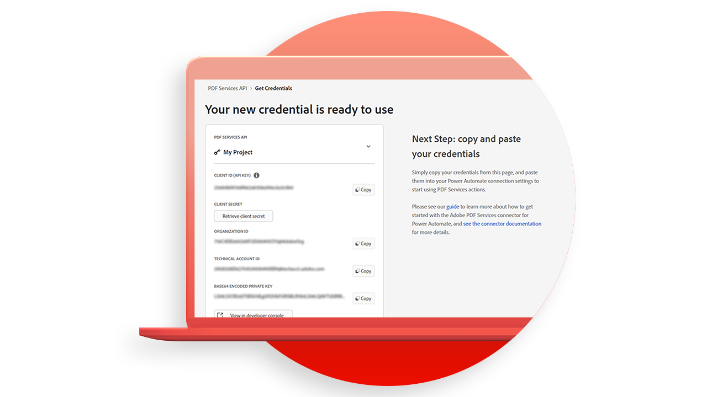

# Tutoriels sur les API Adobe PDF Services

<table style="table-layout:fixed">
<tr>
 <td>
   
    

   <a href="https://experienceleague.adobe.com/docs/adobe-developers-live-events/events/2021/oct2021/pdf-services-api.html"><strong>Présentation de l’API PDF Services</strong></a>
    

    <em>L’API PDF Services d’Adobe permet aux développeurs de créer, combiner, exporter et extraire des données des PDF via des API cloud puissantes et flexibles</em>
     
  </td>
  <td>
   
    

   <a href="getting-credentials-power-automate.md"><strong>Obtention des identifiants pour [!DNL Microsoft Power Automate]</strong></a>
    

    <em>Découvrez comment obtenir des informations d’identification pour commencer à utiliser ou à tester [!DNL Adobe PDF Services]</em>
     
  </td>
  <td>
   
    

   <a href="create-workflow-power-automate.md"><strong>Créez votre premier workflow dans [!DNL Microsoft Power Automate]</strong></a>
    

    <em>Apprendre à utiliser [!DNL Adobe PDF Services] connecteur dans [!DNL Microsoft Power Automate]</em>
     
  </td>
  <td>
   
    

   <a href="createpdffromhtml.md"><strong>Création d’un PDF depuis HTML ou [!DNL MS Office] en quelques minutes avec l'API PDF Services et Node.js</strong></a>
    

    <em>[!DNL Adobe PDF Services API] ce qui permet aux développeurs de choisir librement entre plusieurs services de manipulation de PDF puissants pour répondre aux besoins de workflows commerciaux complexes</em>
     
  </td>
</tr>
<tr>
  <td>
   
    

   <a href="exportpdf.md"><strong>Exploitation [!DNL PDF Services API] pour exporter le PDF vers [!DNL Word], [!DNL PowerPoint], etc.</strong></a>
    

    <em>Découvrez comment exécuter le fichier [!DNL PDF Services API] opération d’exportation à l’aide des fichiers d’exemple pour les langages Node.js, Java et .Net</em>
     
  </td>
   <td>
   
    

   <a href="gettingstartedjava.md"><strong>Prise en main de l’API Adobe PDF Services et de Java</strong></a>
    

    <em>Les développeurs peuvent commencer en quelques minutes avec les fichiers d’exemple prêts à l’emploi fournis pour accéder à tous les services web disponibles</em>
     
  </td>
   <td>
   
    

   <a href="ocr.md"><strong>Utilisation [!DNL Adobe PDF Services API] vers des fichiers de PDF OCR</strong></a>
    

    <em>Grâce à la reconnaissance optique des caractères (ROC), vous pouvez déverrouiller des PDF numérisés pour extraire du texte et générer des fichiers indexables</em>
     
  </td>
  <td>
   
    

   <a href="gettingstartednet.md"><strong>Prise en main de [!DNL Adobe PDF Services API] et .Net</strong></a>
    

    <em>[!DNL Adobe PDF Services API] ce qui permet aux développeurs de choisir librement entre plusieurs services de manipulation de PDF puissants pour répondre aux besoins de workflows commerciaux complexes</em>
     
  </td>
</tr>
</table>
