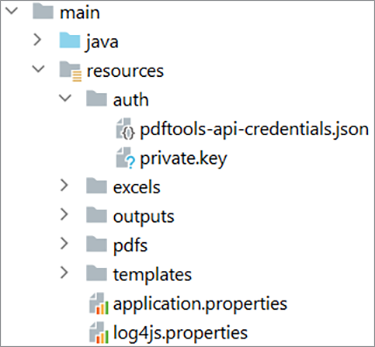
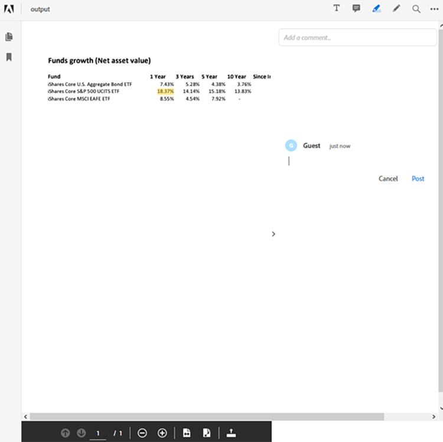

# Gestion des workflows de documents financiers dans Java


Le secteur de la finance utilise largement des fichiers PDF pour échanger des données, car il contribue à la conservation du format, de la conception et de la structure des documents. Ce format robuste permet aux analystes et conseillers financiers d&#39;aider leurs clients à prendre des décisions éclairées.

Toutefois, le format PDF peut s’avérer difficile à traiter et à automatiser, en particulier en associant plusieurs sources de données, ce qui est un cas d’usage courant dans le secteur financier. La création d’une solution personnalisée pour le traitement des documents en PDF est une option, mais il n’est pas nécessaire d’investir trop de temps et d’argent dans les logiciels et l’infrastructure. [!DNL Adobe Acrobat Services] fournit tous les outils, services et fonctions nécessaires pour traiter et extraire des données à partir de documents de PDF.

## Ce que vous pouvez apprendre

Dans ce tutoriel pratique, découvrez comment utiliser [!DNL Adobe Acrobat Services] API pour [!DNL Java Spring Boot] applications. Vous créez une application MVC (Model-View-Controller) qui extrait le contenu des documents du PDF, le convertit dans d&#39;autres formats de données tels qu&#39;Excel, associe plusieurs mots de PDF et protège les ressources par mot de passe. Ce tutoriel explique comment traiter des documents de PDF et les afficher sur vos sites Web à l’aide de l’Adobe [API PDF Embed](https://www.adobe.io/apis/documentcloud/dcsdk/pdf-embed.html).

## API et ressources pertinentes

* [API PDF Services](https://opensource.adobe.com/pdftools-sdk-docs/release/latest/index.html)

* [API PDF Embed](https://www.adobe.com/devnet-docs/dcsdk_io/viewSDK/index.html)

* [Exemples de projet](https://github.com/adobe/pdftools-java-sdk-samples)

## Configuration

[!DNL Adobe Acrobat Services] utilise un système d&#39;authentification pour contrôler l&#39;accès aux ressources. Pour accéder aux services, vous devez demander une clé API à Adobe pour votre organisation ou votre application. Si vous disposez d’une clé API, passez à la section suivante. Pour créer une nouvelle clé API, consultez [Prise en main](https://www.adobe.io/apis/documentcloud/dcsdk/gettingstarted.html) dans le [!DNL Acrobat Services] site. Vous pouvez créer une clé à l’aide de sa version d’essai gratuite, qui fournit 1 000 transactions documentaires pouvant être utilisées pendant six mois maximum.

Pour suivre ce tutoriel, vous devez disposer de deux jeux de clés d’API :

* Services Adobe PDF : utilisés pour traiter le document du PDF

* API Adobe PDF Embed

Après avoir créé les informations d’identification, copiez les informations d’identification de l’API PDF Services et la clé privée dans le fichier [!DNL Spring Boot] dans la section ressources. En savoir plus sur le [Bibliothèques et dépendances Maven et Gradle](https://www.adobe.io/apis/documentcloud/dcsdk/docs.html?view=services) dans le [!DNL Adobe Acrobat Services] site web. Assurez-vous de configurer tous les packages et bibliothèques nécessaires avant de continuer.



Pour configurer les services de journalisation, consultez [Documentation Adobe](https://www.adobe.io/apis/documentcloud/dcsdk/docs.html?view=services) et faites défiler jusqu’à la section Journalisation.

>[!NOTE]
>
> Dans votre environnement de production, n’enregistrez pas les clés privées dans le contrôle de version. Utilisez toujours un coffre secret ou un service d&#39;injection de clés pour empêcher l&#39;utilisation non autorisée des informations d&#39;identification.

Maintenant que votre [!DNL Spring Boot] est configurée, vous pouvez traiter les PDF et générer des rapports pour les clients.

## Envoi des données du rapport

Pour utiliser l’API Adobe PDF Services, configurez d’abord un `ExecutionContext` qui utilise les informations d’identification que vous fournissez. Comme vous disposez des informations d’identification dans votre application, vous pouvez les lire à partir du fichier et créer le contexte comme suit :

```
Credentials credentials = Credentials.serviceAccountCredentialsBuilder()
    .fromFile(AUTH_FILE_PATH)
    .build();

ExecutionContext executionContext = ExecutionContext.create(credentials);
```

Ensuite, affichez le contexte pour traiter les documents du PDF. Voici les actions que vous pouvez effectuer :

* Conversion des documents du PDF (au format Excel, Word ou graphique)

* Création des documents du PDF (à partir de HTML, Excel, Word, etc.)

* Combinaison de plusieurs documents PDF

* Protect et déprotection des documents de mot de PDF (vous devez avoir le mot de passe)

* Optimiser les documents du PDF pour une diffusion sur les réseaux

Tous ces échantillons sont disponibles dans le [Exemples GitHub](https://github.com/adobe/pdfservices-java-sdk-samples/tree/master/src/main/java/com/adobe/pdfservices/operation/samples) référentiel.

Ensuite, dans [!DNL Spring Boot], vous pouvez obtenir un fichier à l’aide du chemin d’accès String ou du flux où le fichier est en cours de téléchargement. Chaque opération que vous effectuez doit être initialisée et un chemin de fichier d&#39;entrée doit être défini. Pour ce tutoriel, vous utiliserez les rapports de PDF accessibles au public provenant de [Blackrock](https://www.blackrock.com/us/individual/products/investment-funds). Vous pouvez utiliser toute autre source, y compris vos propres rapports.

Commencez par capturer le [FileRef](https://opensource.adobe.com/pdfservices-java-sdk-samples/apidocs/latest/com/adobe/pdfservices/operation/io/FileRef.html) à partir du fichier. Pour plus de simplicité, concentrez-vous sur les fichiers par chemin String. Ci-dessous, vous créez une opération pour convertir un fichier dans votre chemin de PDF en Excel :

```
ExecutionContext executionContext = ExecutionContext.create(credentials);
ExportPDFOperation exportOperation = ExportPDFOperation.createNew(ExportPDFTargetFormat.XLSX);

// Create the input source
FileRef inputPdf = FileRef.createFromLocalFile(INPUT_PDF);
exportOperation.setInput(inputPdf);
```

Après cette étape, votre programme est prêt à exécuter la première opération sur le PDF. Ensuite, vous exécutez l&#39;opération et obtenez le résultat dans la feuille Excel :

```
try {
    FileRef output = exportOperation.execute(executionContext);
    output.saveAs(OUTPUT_EXCEL);
} catch (ServiceApiException e) {
    e.printStackTrace();
}
```

Ce scénario ne gère qu’un seul fichier de PDF. Vous pouvez également commencer avec plusieurs fichiers de PDF et les regrouper dans un seul fichier. L&#39;utilisation de plusieurs fichiers est courante dans le reporting de données financières, car vous devez traiter des fonds provenant de plusieurs sources pour fournir un rapport complet.

## Génération du rapport

[!DNL Adobe Acrobat Services] ne prend pas en charge le traitement des documents Excel prêts à l&#39;emploi, mais vous pouvez toujours utiliser des infrastructures et des bibliothèques communautaires pour traiter le contenu.

Par exemple, vous pouvez utiliser le fichier [Apache POI](https://poi.apache.org/) pour traiter Excel (ou d’autres documents Microsoft) dans votre [!DNL Java Spring Boot] , ou vous pouvez effectuer d’autres tâches manuelles ou automatisées sur le fichier Excel.

Dans cet exemple, à partir de vos documents de PDF, vous extrayez la valeur de l&#39;actif net de vos trois fonds et les affichez dans un tableau. Vous pouvez également extraire d’autres informations, telles que des graphiques et des tableaux, en fonction de vos besoins et des données disponibles. Vous pouvez même importer des données d’autres sources.

Une fois votre rapport généré (dans cet exemple, au format Excel), vous pouvez utiliser les opérations des services Adobe PDF pour le reconvertir en document PDF et le protéger.

Pour convertir le rapport au format Excel en document PDF, procédez comme suit :

```
ExecutionContext executionContext = ExecutionContext.create(credentials);
CreatePDFOperation exportOperation = CreatePDFOperation.createNew();

// Create the input source
FileRef inputPdf = FileRef.createFromLocalFile(INPUT_EXCEL);
exportOperation.setInput(inputPdf);

try {
    FileRef output = exportOperation.execute(executionContext);
    output.saveAs(OUTPUT_PDF);
} catch (ServiceApiException e) {
    e.printStackTrace();
}
```

>[!TIP]
>
> Pour éviter d&#39;avoir à recréer l&#39;objet chaque fois qu&#39;une demande arrive, utilisez l&#39;injection de dépendance de Spring pour injecter le `ExecutionContext` objet.

Ce code génère un document PDF à partir du rapport au format Excel.

Avant de proposer ce mot de PDF à vos clients, vous pouvez le protéger par un mot de passe. Créez une autre opération qui gère cette protection pour vous, [ProtectPDFOperation](https://opensource.adobe.com/pdfservices-java-sdk-samples/apidocs/latest/com/adobe/pdfservices/operation/pdfops/ProtectPDFOperation.html), puis utilisez [ProtectPDFOptions](https://opensource.adobe.com/pdfservices-java-sdk-samples/apidocs/latest/com/adobe/pdfservices/operation/pdfops/options/protectpdf/package-summary.html) pour ajouter le mot de passe au document.

```
ProtectPDFOptions options = ProtectPDFOptions.passwordProtectOptionsBuilder()
                    .setUserPassword("p@55w0rd")
                    .setEncryptionAlgorithm(EncryptionAlgorithm.AES_256)
                    .build();
ProtectPDFOperation operation = ProtectPDFOperation.createNew(options);
```

Ensuite, spécifiez l&#39;entrée et exécutez l&#39;opération. Le fichier obtenu doit comporter un mot de passe pour empêcher tout accès non autorisé.

## Affichage du rapport

Maintenant que votre rapport de PDF est généré, vous pouvez l’afficher sur le site Web à l’aide de l’API Adobe PDF Embed. Cette API JavaScript permet aux développeurs Web de charger et de rendre les documents du PDF en mode natif dans le navigateur Web.

>[!NOTE]
>
> À ce stade, vous avez besoin du deuxième jeton d’identification, l’ID client.

Dans votre [!DNL Spring Boot] , ajoutez l’extrait de HTML suivant à l’endroit où vous souhaitez rendre le rapport de PDF :

```
<div id="pdf-viewer"></div>
<script src="https://documentcloud.adobe.com/view-sdk/main.js"></script>
<script type="text/javascript">
    document.addEventListener("adobe_dc_view_sdk.ready", function()
    {
        var adobeDCView = new AdobeDC.View({ clientId: "<your-client-id-here>", divId: "pdf-viewer" });
        adobeDCView.previewFile(
        {
            content: {
                location: {
                    url: "<your-document.pdf>"
                }
            },
            metaData: {
                fileName: "<document-name.pdf>"
            }
        });
    });
</script>
```

Ce script charge le document du PDF et permet aux utilisateurs d’annoter et de commenter les documents. Voici la vue de cette API intégrée comme indiqué dans Firefox :



L’API PDF Embed fournit tous les outils nécessaires pour prévisualiser le PDF et annoter le rapport.

## Marche à suivre

Ce tutoriel pratique a exploré les [[!DNL Adobe Acrobat Services]](https://www.adobe.io/apis/documentcloud/dcsdk/) Les API et ont discuté de la façon d&#39;utiliser ces services pour traiter les données des PDF et générer des rapports pour les décisions financières. Il a démontré comment vous pouvez intégrer les API dans vos systèmes, en utilisant [!DNL Java Spring Boot] comme exemple de framework, pour montrer à quel point il est facile de traiter rapidement des documents PDF.

Explorer [[!DNL Adobe Acrobat Services]](https://www.adobe.io/apis/documentcloud/dcsdk/) et découvrez ce qu&#39;Adobe PDF Services peut faire pour votre entreprise. Pour en savoir plus sur les autres fonctionnalités disponibles dans le SDK, consultez la [Référentiel GitHub](https://github.com/adobe/pdftools-java-sdk-samples) pour les exemples et découvrez comment [API PDF Embed](https://www.adobe.io/apis/documentcloud/dcsdk/pdf-embed.html) peuvent vous aider à afficher rapidement les PDF dans vos applications.

Pour regrouper et manipuler facilement des documents, en créant des rapports PDF utiles pour vos clients, commencez par vous inscrire gratuitement [Compte développeur Adobe](https://www.adobe.io/apis/documentcloud/dcsdk/) aujourd&#39;hui.
