# Accélérez votre processus de vente


Des articles techniques aux contrats en passant par les accords, de nombreux documents sont nécessaires tout au long d’un parcours d’achat. Dans ce tutoriel, découvrez comment [[!DNL Adobe Acrobat Services]](https://developer.adobe.com/document-services/) Vous pouvez intégrer des expériences documentaires tout au long de ce parcours pour accélérer vos ventes.

## Générer des accords et des commandes client à partir des données

Les contrats de vente et autres documents peuvent varier considérablement en fonction de critères spécifiques. Par exemple, un contrat de vente peut uniquement inclure certains termes basés sur des critères uniques, tels que le fait d’être dans un pays ou un état spécifique, ou l’inclusion de certains produits dans le cadre du contrat. La création manuelle de ces documents ou le maintien de nombreuses variantes de modèles peuvent augmenter considérablement les coûts juridiques liés à la révision manuelle des modifications.

[API de génération de documents Adobe](https://developer.adobe.com/document-services/apis/doc-generation/) vous permet de récupérer des données de votre CRM ou autre système de données pour générer dynamiquement des documents de vente basés sur ces données.

## Obtenir des informations

Commencez par vous inscrire aux informations d’identification gratuites des services Adobe PDF :

1. Navigation [ici](https://documentcloud.adobe.com/dc-integration-creation-app-cdn/main.html) pour enregistrer vos identifiants.
1. Connectez-vous à l’aide de votre Adobe ID.
1. Définissez le nom de vos informations d&#39;identification (par exemple, Démonstration des commandes ouvertes).

   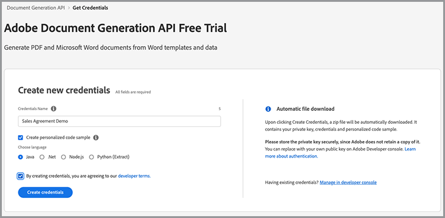

1. Choisissez une langue pour télécharger votre exemple de code (par exemple, Node.js).
1. Cochez cette case pour accepter **[!UICONTROL conditions du développeur]**.
1. Sélectionner **[!UICONTROL Créer des identifiants]**.
Un fichier ZIP contenant les fichiers d’exemple, pdfservices-api-credentials.json et private.key pour l’authentification est téléchargé sur votre ordinateur.

   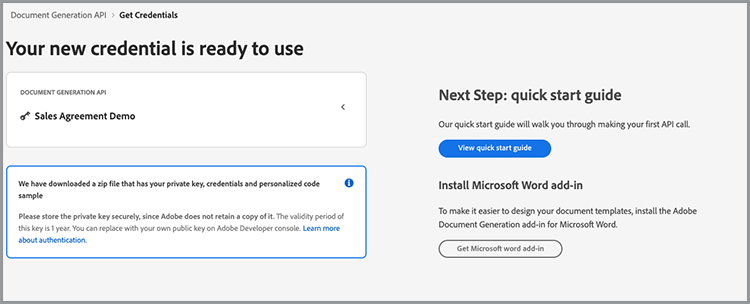

1. Sélectionner **[!UICONTROL Télécharger le complément Microsoft Word]** ou accéder à [AppSource](https://appsource.microsoft.com/en-cy/product/office/WA200002654) pour installer.

   >[!NOTE]
   >
   >L’installation du complément Word nécessite que vous soyez autorisé à installer des compléments dans Microsoft 365. Si vous ne disposez pas des autorisations nécessaires, contactez votre administrateur Microsoft 365.

## Vos données

Si vous extrayez des données d’un système de données spécifique, vous devez générer ces données en tant que données JSON ou générer votre propre schéma. Ce scénario utilise l&#39;exemple de jeu de données précréé suivant :

```
{
    "salesOrder": {
        "comment": "Make sure to call 555-555-1234 when you arrive. The front door is broken."
    },
    "company": {
        "name":"Home Services Co.",
        "address": {
            "city": "Homestead",
            "state": "NY",
            "zip": "14623",
            "streetAddress": "123 Demohome Street"
        }
    },
    "customer": {
        "address": {
            "city": "Seattle",
            "state": "WA",
            "zip": "98052",
            "streetAddress": "20341 Whitworth Institute 405 N. Whitworth"
        },
        "email": "mailto:jane-doe@xyz.edu",
        "jobTitle": "Professor",
        "name": "Jane Doe",
        "telephone": "(425) 123-4567",
        "url": "http://www.janedoe.com"
    },
    "tax": {
        "state":"WA",
        "rate": 0.08
    },
    "referencesOrder": [
        {
            "description": "Carpet Cleaning Service - 3BR 2BA",
            "totalPaymentDue": {
                "price": 359.54
            },
            "orderedItem": {
                "description": "Carpet Cleaning Service"
            }
        },
        {
            "description": "Home Cleaning Service - 3BR 2BA",
            "totalPaymentDue": {
                "price": 299.99
            },
            "orderedItem": {
                "description": "House Cleaning Service"
            }
        }
    ]
}
```

## Ajout de balises de base au document

Ce scénario utilise un document de commande client, qui peut être téléchargé [ici](https://github.com/benvanderberg/adobe-document-generation-samples/blob/main/SalesOrder/Exercise/SalesOrder_Base.docx?raw=true).

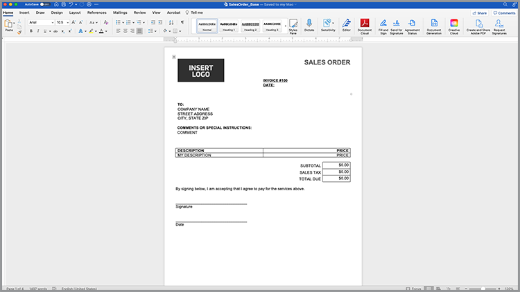

1. Ouvrez le *SalesOrder.docx* exemple de document dans Microsoft Word.
1. Si votre plug-in Génération de document est installé, sélectionnez **[!UICONTROL Génération de documents]** dans le ruban. Si Génération de document n’est pas visible dans le ruban, suivez ces instructions.
1. Sélectionner **[!UICONTROL Prise en main]**.
1. Copiez les données d’exemple JSON écrites ci-dessus dans le fichier *Données JSON* .

   

Accédez ensuite au panneau Balises de génération de document pour placer des balises dans le document.

1. Sélectionnez le texte que vous souhaitez remplacer (par exemple, *NOM DE SOCIÉTÉ*).
1. Dans le *Baliseur de génération de document* , recherchez &quot;nom&quot;.
1. Dans la liste des balises, sélectionnez le nom sous société.
1. Sélectionner **[!UICONTROL Insérer du texte]**.

   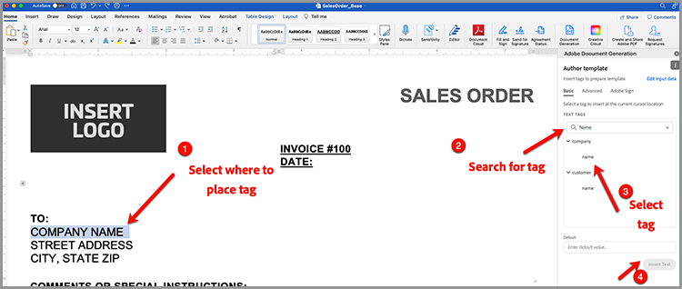

   Ce processus place une balise appelée {{company.name}} car la balise se trouve sous le chemin dans le fichier JSON.

   ```
   {
   …
   "company": {
       "name":"Home Services Co.",
       …
   },
   …
   }
   ```

Répétez ces actions pour certaines balises supplémentaires du document, telles que STREET ADDRESS, CITY, STATE, ZIP, etc.

## Aperçu du document généré

Directement dans Microsoft Word, vous pouvez prévisualiser votre document généré à partir des exemples de données JSON.

1. Dans le *Baliseur de génération de document* , sélectionnez **[!UICONTROL Générer le document]**. La première fois que vous serez invité à vous connecter avec votre Adobe ID. Sélectionner **[!UICONTROL Se connecter]** et complétez les invites de connexion avec vos identifiants.

   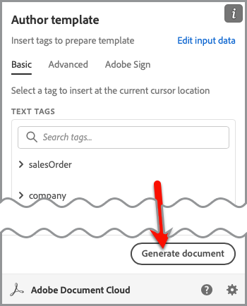

1. Sélectionner **[!UICONTROL Afficher le document]**.

   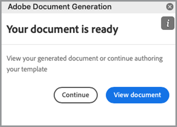

1. Une fenêtre de navigateur s’ouvre, vous permettant de prévisualiser les résultats du document.

   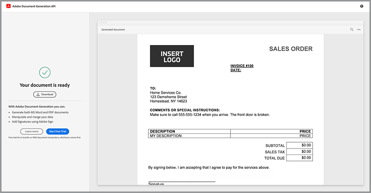

Vous pouvez voir les balises du document qui ont été remplacées par les données des exemples de données d’origine.

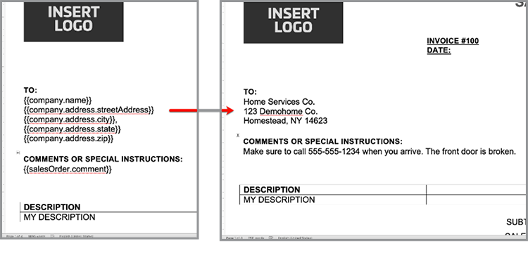

## Ajouter un tableau à un modèle

Dans le scénario suivant, ajoutez une liste de produits à un tableau du document.

1. Insérez votre curseur à l’endroit où le tableau doit être placé.
1. Dans le *Baliseur de génération de document* , sélectionnez **[!UICONTROL Avancé]**.
1. Développer **[!UICONTROL Tables et listes]**.
1. Dans le *Enregistrements de table* , sélectionnez *referencesOrder*, qui est un tableau qui répertorie tous les éléments de produit.
1. Dans le champ Sélectionner les enregistrements de colonne, saisissez les éléments à inclure *description* et *totalPaymentDue.price* .
1. Sélectionner **[!UICONTROL Insérer un tableau]**.

   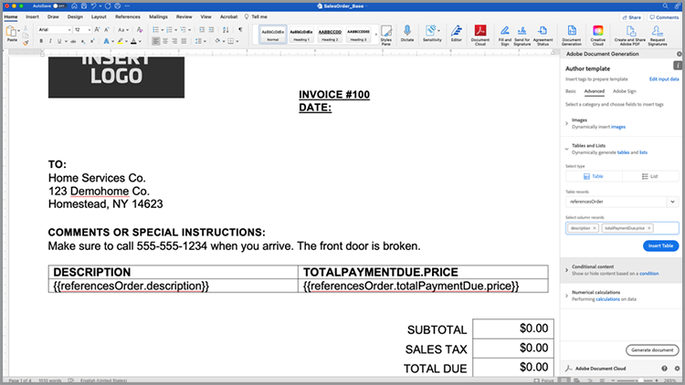

Modifiez le tableau pour ajuster les styles, tailles et autres paramètres comme vous le feriez pour n’importe quel autre tableau dans Microsoft Word.

## Ajouter un calcul numérique

Les calculs numériques vous permettent de calculer des sommes et d&#39;autres calculs à partir d&#39;une collection de données, telle qu&#39;un tableau. Dans ce scénario, ajoutez un champ pour calculer le sous-total.

1. Sélectionnez le fichier *0,00 $* en regard du titre du sous-total.
1. Dans le *[!UICONTROL Baliseur de génération de document]* , développez **[!UICONTROL Calculs numériques]**.
1. Sous *[!UICONTROL Sélectionner le type de calcul]*, choisissez **[!UICONTROL Agrégation]**.
1. Sous *[!UICONTROL Sélectionner un type]*, choisissez **[!UICONTROL Somme]**.
1. Sous *[!UICONTROL Sélectionner des enregistrements]*, choisissez **[!UICONTROL ReferencesOrder]**.
1. Sous *[!UICONTROL Sélectionner l&#39;élément à agréger]**, choisissez **[!UICONTROL totalPaymentsDue.price]**.
1. Sélectionner **[!UICONTROL Insérer un calcul]**.

Ce processus insère une balise de calcul qui fournit la somme des valeurs. Des calculs plus avancés peuvent être effectués à l’aide de calculs JSONata. Par exemple :

* Sous-total : `${{expr($sum(referencesOrder.totalPaymentDue.price))}}`
Calcule la somme de referencesOrder.totalPaymentDue.price.

* Taxe de vente : `${{expr($sum(referencesOrder.totalPaymentDue.price)*0.08)}}`
Calcule le prix et le multiplie par 8 % pour calculer la taxe.

* Total dû : `${{expr($sum(referencesOrder.totalPaymentDue.price)*1.08)}}`
Calcule le prix et les multiples de 1,08 pour calculer le sous-total + taxe.

## Ajout de conditions

Les sections conditionnelles vous permettent d’inclure une phrase ou un paragraphe uniquement lorsqu’une condition est remplie. Dans ce scénario, seule une section est incluse si elle correspond à un certain état.

1. Dans le document, recherchez la section appelée *DÉCLARATIONS DE CONFIDENTIALITÉ CALIFORNIE*.
1. Sélectionnez la section avec votre curseur.

   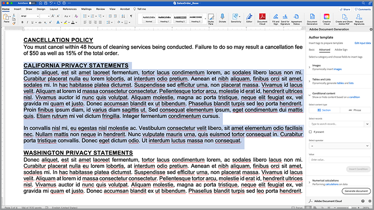

1. Dans le *[!UICONTROL Baliseur de génération de document]*, sélectionnez **[!UICONTROL Avancé]**.
1. Développer **[!UICONTROL Contenu conditionnel]**.
1. Dans le *[!UICONTROL Sélectionner des enregistrements]* , recherchez et sélectionnez **[!UICONTROL customer.address.state]**.
1. Dans le *[!UICONTROL Sélectionner un opérateur]* , sélectionnez **=**.
1. Dans le *[!UICONTROL Champ Valeur]*, saisissez *CA*.
1. Sélectionner **[!UICONTROL Insérer une condition]**.

La section Californie n&#39;apparaît dans le document généré que si customer.address.state = CA.

Ensuite, sélectionnez la section pour WASHINGTON PRIVACY STATEMENTS et répétez les étapes ci-dessus, en remplaçant la valeur CA par WA.

## Ajout d’une image dynamique

L’API Document Generation vous permet d’insérer des images de manière dynamique à partir des données. Cette fonction est utile lorsque vous avez différentes sous-marques et que vous souhaitez modifier des logos, des portraits ou des images pour les rendre plus pertinents pour un secteur d’activité donné.

Les images peuvent être transmises par une URL dans le contenu data ou base64. Cet exemple utilise une URL.

1. Placez votre curseur à l’endroit où vous souhaitez inclure une image.
1. Dans le *[!UICONTROL Baliseur de génération de document]* , sélectionnez **[!UICONTROL Avancé]**.
1. Développer **[!UICONTROL Images]**.
1. Dans le *[!UICONTROL Sélectionner des balises]* , sélectionnez **[!UICONTROL logo]**.
1. Dans le *[!UICONTROL Texte de remplacement facultatif]* , fournissez une description (par exemple, logo). Ce processus insère un espace réservé à une image qui ressemble à ceci :

   

Toutefois, vous souhaitez définir l’image de manière dynamique sur une image qui se trouve déjà dans la mise en page, ce que vous pouvez faire en procédant comme suit :

1. Cliquez avec le bouton droit de la souris sur l’image de substitution insérée.

   

1. Sélectionner **[!UICONTROL Modifier le texte alternatif]**.
1. Dans le panneau, copiez le texte comme suit :
   `{ "location-path": "logo", "image-props": { "alt-text": "Logo" }}`
1. Sélectionnez une autre image dans votre document que vous souhaitez rendre dynamique.

   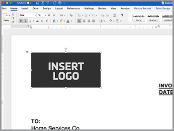

1. Cliquez avec le bouton droit sur l’image et sélectionnez **[!UICONTROL Modifier le texte alternatif]**.
1. Collez la valeur dans le panneau.

Ce processus remplace l’image par une image qui se trouve dans la variable du logo dans les données.

## Ajout de balises pour Acrobat Sign

Adobe Acrobat Sign vous permet de recueillir des signatures électroniques sur vos documents. Acrobat Sign permet de faire glisser et déposer facilement des champs dans l’interface web, mais vous pouvez également contrôler la signature et le placement d’autres champs à l’aide d’une balise de texte. Avec l’Adobe de l’étiquette de génération de document, vous pouvez facilement placer ces champs de balise de texte.

1. Accédez à l’endroit où une signature est requise dans le document d’exemple.
1. Insérez votre curseur à l’endroit où la signature est nécessaire.
1. Dans le *[!UICONTROL Adobe du marqueur de génération de document]* , sélectionnez **[!UICONTROL Adobe Sign]**.
1. Dans le *[!UICONTROL Spécifier le nombre de destinataires]* , définissez le nombre de destinataires (dans cet exemple, il s’agit d’un seul).
1. Dans le *[!UICONTROL Destinataires]* , sélectionnez **[!UICONTROL Signer-1]**.
1. Dans le *[!UICONTROL Champ]* tapez, sélectionnez **[!UICONTROL Signature]**.
1. Sélectionner **[!UICONTROL Insérer une balise de texte Adobe Sign]**.

Une balise est insérée dans le document.

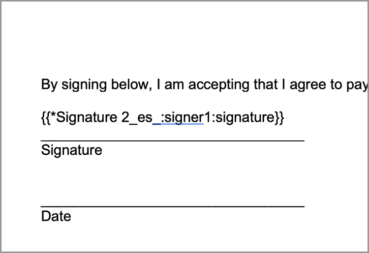

Acrobat Sign propose plusieurs autres types de champs que vous pouvez placer, tels que les champs de date.
1. Dans le *Champ* tapez, sélectionnez **[!UICONTROL Date]**.
1. Déplacez le curseur au-dessus de l’emplacement Date dans le document.
1. Sélectionner **[!UICONTROL Insérer une balise de texte Adobe Sign]**.

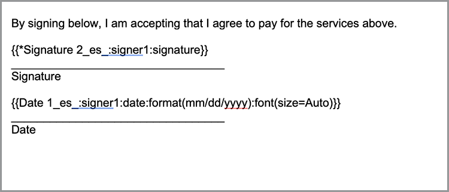

## Génération de votre accord

Vous avez maintenant balisé votre document et vous êtes prêt. La section suivante explique comment générer un document à l’aide des exemples d’API de génération de document pour Node.js, qui fonctionneront toutefois dans toutes les langues.

Ouvrez le fichier pdfservices-node-sdk-samples-master téléchargé lors de l&#39;enregistrement de vos informations d&#39;identification. Les fichiers pdfservices-api-credentials.json et private.key doivent être inclus dans ces fichiers.

1. Ouvrez un Terminal pour installer les dépendances à l&#39;aide de npm install.
1. Copiez l’exemple data.json dans le dossier resources .
1. Copiez le modèle Word dans le dossier des ressources.
1. Créez un fichier dans le répertoire racine du dossier d&#39;exemples nommé generate-salesOrder.js.

```
const PDFServicesSdk = require('@adobe/pdfservices-node-sdk');
const fs = require('fs');
const path = require('path');

var dataFileName = path.join('resources', '<INSERT JSON FILE');
var outputFileName = path.join('output', 'salesOrder_'+Date.now()+".pdf");
var inputFileName = path.join('resources', '<INSERT DOCX>');

//Loads credentials from the file that you created.
const credentials =  PDFServicesSdk.Credentials
    .serviceAccountCredentialsBuilder()
    .fromFile("pdfservices-api-credentials.json")
    .build();

// Setup input data for the document merge process
const jsonString = fs.readFileSync(dataFileName),
jsonDataForMerge = JSON.parse(jsonString);

// Create an ExecutionContext using credentials
const executionContext = PDFServicesSdk.ExecutionContext.create(credentials);

// Create a new DocumentMerge options instance
const documentMerge = PDFServicesSdk.DocumentMerge,
documentMergeOptions = documentMerge.options,
options = new documentMergeOptions.DocumentMergeOptions(jsonDataForMerge, documentMergeOptions.OutputFormat.PDF);

// Create a new operation instance using the options instance
const documentMergeOperation = documentMerge.Operation.createNew(options)

// Set operation input document template from a source file.
const input = PDFServicesSdk.FileRef.createFromLocalFile(inputFileName);
documentMergeOperation.setInput(input);

// Execute the operation and Save the result to the specified location.
documentMergeOperation.execute(executionContext)
.then(result => result.saveAsFile(outputFileName))
.catch(err => {
    if(err instanceof PDFServicesSdk.Error.ServiceApiError
        || err instanceof PDFServicesSdk.Error.ServiceUsageError) {
        console.log('Exception encountered while executing operation', err);
    } else {
        console.log('Exception encountered while executing operation', err);
    }
});
```

1. Remplacer `<INSERT JSON FILE>` avec le nom du fichier JSON dans /resources.
1. Remplacer `<INSERT DOCX>` portant le nom du fichier DOCX.
1. Pour l&#39;exécuter, utilisez Terminal pour exécuter le noeud generate-salesOrder.js.

Le fichier de sortie doit se trouver dans le dossier /output avec le document généré correctement.

## Autres options

Une fois le document généré, vous pouvez effectuer d’autres actions, telles que :

* Protection des documents par mot de passe
* Compresser le PDF s’il y a de grandes images
* Recueillir des signatures électroniques sur le document

Pour en savoir plus sur d&#39;autres actions disponibles, consultez les scripts du dossier /src dans les fichiers d&#39;exemple. Vous pouvez également en savoir plus en consultant la documentation des différentes actions.

## Autres cas d’utilisation

[!DNL Adobe Acrobat Services] Les workflows documentaires digitaux peuvent vous aider à rationaliser de nombreux aspects d’un cycle de vente :

* Utilisez l’API Adobe PDF Embed pour incorporer des articles techniques et d’autres contenus dans des sites web, tout en mesurant et en collectant des analyses sur le nombre de visiteurs
* Utilisez Acrobat Sign pour recueillir des signatures électroniques sur vos accords générés
* Extrayez les données d’accord de vos documents de PDF à l’aide de l’API Adobe PDF Extract

## Apprentissage ultérieur

Vous souhaitez en savoir plus ? Jetez un oeil à quelques autres façons d&#39;utiliser [!DNL Adobe Acrobat Services]:

* En savoir plus sur [documentation](https://developer.adobe.com/document-services/docs/overview/)
* Voir plus de tutoriels sur Adobe Experience League
* Utilisez les exemples de scripts du dossier /src pour découvrir comment exploiter PDF
* Suivre [Blog Adobe Tech](https://medium.com/adobetech/tagged/adobe-document-cloud) pour obtenir les derniers conseils et astuces
* S&#39;abonner [Clips papier (flux mensuel en direct)](https://www.youtube.com/playlist?list=PLcVEYUqU7VRe4sT-Bf8flvRz1XXUyGmtF) pour en savoir plus sur l&#39;automatisation [!DNL Adobe Acrobat Services]. =======
* En savoir plus sur [documentation](https://developer.adobe.com/document-services/docs/overview/)
* Voir plus de tutoriels sur Adobe Experience League
* Utilisez les exemples de scripts du dossier /src pour découvrir comment exploiter PDF
* Suivre [Blog Adobe Tech](https://medium.com/adobetech/tagged/adobe-document-cloud) pour obtenir les derniers conseils et astuces
* S&#39;abonner [Clips papier (flux mensuel en direct)](https://www.youtube.com/playlist?list=PLcVEYUqU7VRe4sT-Bf8flvRz1XXUyGmtF) pour en savoir plus sur l&#39;automatisation [!DNL Adobe Acrobat Services]
