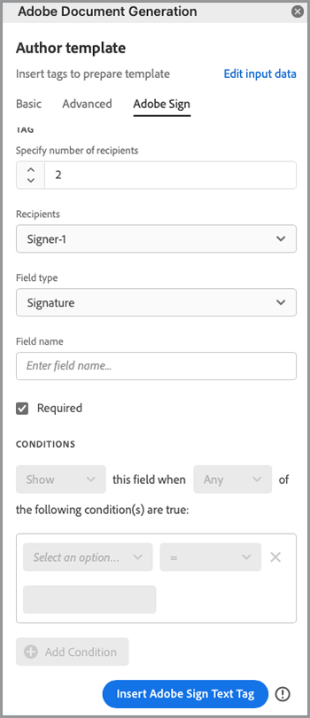

# Automatisation des workflows juridiques


Dans le meilleur des cas, les conditions du contrat sont acceptées sans aucune modification. Toutefois, il arrive souvent que les accords nécessitent une personnalisation, qui nécessite ensuite un examen juridique. Les révisions juridiques entraînent des coûts importants et ralentissent le processus de mise en oeuvre des termes du contrat. L’utilisation de modèles prédéfinis, qui changent en fonction de la langue approuvée, aide les équipes juridiques à gérer et à exécuter les conditions des accords en toute sécurité.

Ce tutoriel utilise un accord juridique qui varie d’un état à l’autre. Pour remédier à ces variations, un modèle d’accord avec des sections conditionnelles est créé. Ces sections ne sont incluses que lorsque certains critères sont remplis. Le document généré peut être un document Word ou un document PDF. Vous pouvez également découvrir comment sécuriser votre document à l’aide de l’API Adobe PDF Services ou d’Acrobat Sign.

## Obtenir des informations

Commencez par vous inscrire aux informations d’identification gratuites des services Adobe PDF :

1. Navigation [ici](https://documentcloud.adobe.com/dc-integration-creation-app-cdn/main.html) pour enregistrer vos identifiants.
1. Connectez-vous à l’aide de votre Adobe ID.
1. Définissez votre nom d’identification.

   

1. Choisissez une langue pour télécharger votre exemple de code (par exemple Node.js).
1. Cochez cette case pour accepter **[!UICONTROL conditions du développeur]**.
1. Sélectionner **[!UICONTROL Créer des identifiants]**.
Un fichier ZIP contenant les fichiers d’exemple, pdfservices-api-credentials.json et private.key pour l’authentification est téléchargé sur votre ordinateur.

   

1. Sélectionner **[!UICONTROL Télécharger le complément Microsoft Word]** ou accéder à [AppSource](https://appsource.microsoft.com/en-cy/product/office/WA200002654) pour installer.

   >[!NOTE]
   >
   >L’installation du complément Word nécessite que vous soyez autorisé à installer des compléments dans Microsoft 365. Si vous ne disposez pas des autorisations nécessaires, contactez votre administrateur Microsoft 365.

## Vos données

Dans ce scénario, les informations sont transmises pour aider à générer le document et indiquer si certaines sections doivent être incluses ou non :

```
{
    "customer": {
        "name": "Home Services Company",
        "street": "123 Any Street",
        "city": "Anywhere",
        "state": "CA",
        "zip": "12345",
        "country":"USA",
        "signer": {
            "email": "johnnyechostone@gmail.com",
            "firstName": "John",
            "lastName": "Echostone"
        }
    },
    "company": {
        "name": "Projected Consultants",
        "signer": {
            "email": "maryburostone@gmail.com",
            "firstName": "Mary",
            "lastName": "Burostone"
        }
    },
    "conditions": {
        "includeGeneralTerms": true,
        "includeConsumerDiscloure": true
    }
}
```

Dans les données, il y a des informations sur le client, son nom, qui signe, dans quel état il se trouve, et ainsi de suite. En outre, il existe des sections pour obtenir des informations sur la société qui génère l’accord et des indicateurs de condition utilisés pour inclure certaines sections de l’accord.

## Ajout de balises de base au document

Ce scénario utilise un document relatif aux conditions générales, qui peut être téléchargé [ici](https://github.com/benvanderberg/adobe-document-generation-samples/blob/main/Agreement/exercise/TermsAndConditions_Sample.docx?raw=true).


1. Ouvrez le *TermsAndConditions.docx* exemple de document dans Microsoft Word.
1. Si la [Génération de documents](https://appsource.microsoft.com/en-cy/product/office/WA200002654) est installé, sélectionnez **[!UICONTROL Génération de documents]** dans le ruban. Si Génération de document n’est pas visible dans le ruban, suivez ces instructions.
1. Sélectionner **[!UICONTROL Prise en main]**.
1. Copiez les données d’exemple JSON écrites ci-dessus dans le champ Données JSON.

   

Accédez à l’onglet *Baliseur de génération de document* pour placer des balises dans le document.

## Insérer le nom de la société

1. Sélectionnez le texte que vous souhaitez remplacer. Dans ce scénario, vous remplacez la SOCIÉTÉ dans la section d’ouverture du document.
1. Dans *Baliseur de génération de document*, recherchez &quot;name&quot;.
1. Sous Société, choisissez *name*.

   

1. Sélectionner **[!UICONTROL Insérer du texte]**.

Une balise appelée est alors placée `{{company.name}}` car la balise se trouve sous ce chemin dans le fichier JSON.

```
{
    "company": {
        "name": "Projected Consultants",
        ...
    }
    ...
}
```

Répétez ensuite cette étape dans la section d&#39;ouverture du texte CUSTOMER. Répéter **étapes 1 à 4**, en remplaçant CLIENT par &quot;nom&quot; sous client. La sortie doit être `{{customer.name}}`, ce qui indique que le texte provient du dessous de l&#39;objet client.

L’API Adobe Document Generation vous permet également d’inclure des balises dans vos en-têtes et pieds de page, ainsi qu’à l’extrémité où les titres des signatures doivent être placés.

Répétez ce processus avec **étapes 1 à 4** pour le texte SOCIÉTÉ et CLIENT dans le pied de page.


Enfin, vous devez **répétez les étapes 1 à 4.** pour remplacer PRÉNOM et NOM sous la section Client de la page de signature par les étiquettes pour `{{customer.signer.firstName}}` et `{{customer.signer.lastName}}` respectivement. Ne vous inquiétez pas si la balise est longue et passe à la ligne suivante, car la balise est remplacée lors de la génération du document.

Le début de votre document et le pied de page doivent ressembler à ceci :

* Section de début :


* Pied de page:


* Page de signature :


Maintenant que vos balises sont placées dans le document, vous êtes prêt à prévisualiser votre accord généré.

## Aperçu du document généré

Directement dans Microsoft Word, vous pouvez prévisualiser votre document généré à partir des exemples de données JSON.

1. Dans *Baliseur de génération de document*, sélectionnez **[!UICONTROL Générer le document]**.
1. La première fois que vous serez invité à vous connecter avec votre Adobe ID. Sélectionner **[!UICONTROL Se connecter]** et complétez les invites de connexion avec vos identifiants.

   

1. Sélectionner **[!UICONTROL Afficher le document]**.

   

1. Une fenêtre de navigateur s’ouvre, vous permettant de prévisualiser les résultats du document.

   

## Ajout de conditions pour chaque état

Dans cette section suivante, vous ne définissez que certaines sections à inclure en fonction de certains critères de données d&#39;entrée. Dans l&#39;exemple de document, les sections 4 et 5 concernent uniquement un état spécifique. Dans ce scénario, seules les conditions spécifiques à l’état doivent être incluses lorsqu’un client réside dans cet état. En outre, la numérotation dans Microsoft Word ne doit pas inclure cette section si elle est supprimée. Utilisez la fonction de contenu conditionnel de l’API de génération de document pour baliser cela.


1. Dans le document, sélectionnez la section Divulgation en Californie et toutes les sous-puces.

   

1. Dans *[!UICONTROL Baliseur de génération de document]*, sélectionnez **[!UICONTROL Avancé]**.
1. Développer **[!UICONTROL Contenu conditionnel]**.
1. Dans *[!UICONTROL Sélectionner des enregistrements]* , recherchez et sélectionnez **[!UICONTROL customer.state]**.
1. Dans *[!UICONTROL Sélectionner un opérateur]* , sélectionnez **=**.
1. Dans *[!UICONTROL Valeur]* champ, type *CA*.
1. Sélectionner **[!UICONTROL Insérer une condition]**.

La section est maintenant entourée de balises appelées balises de section conditionnelle. Lorsque vous avez ajouté des balises, il se peut qu’il ait ajouté la balise de section conditionnelle sous la forme d’une ligne numérotée. Vous pouvez le supprimer en plaçant un retour arrière avant la balise. Dans le cas contraire, la balise est numérotée comme si elle n&#39;existait pas lors de la génération du document. La section qui est conditionnelle se termine par le `` Balise.


**Répétez les étapes 1 à 7** pour le *Washington Disclosure* , en remplaçant la *CA* valeur avec *WA* pour indiquer que la section n&#39;est affichée que si l&#39;état du client est Washington.


## Test avec des sections conditionnelles

Une fois vos sections conditionnelles en place, vous pouvez prévisualiser votre document en sélectionnant **Générer le document**.

Lorsque vous générez votre document, notez que la section incluse est uniquement celle qui répond aux critères de données. Dans l’exemple ci-dessous, l’état étant égal à CA, seule la section Californie est incluse.


Un autre changement notable est que la numérotation pour la section suivante, Utilisation des Services et des Logiciels, porte le numéro 5. Cela signifie que lorsque la section Washington est omise, la numérotation continue.


Pour vérifier si le modèle se comporte correctement lorsque le client se trouve dans l’État de Washington plutôt que en Californie, modifiez les données d’exemple du modèle :

1. Dans *Baliseur de génération de document*, sélectionnez **[!UICONTROL Modifier les données d&#39;entrée]**.

   

1. Sélectionner **[!UICONTROL Modifier]**.

1. Dans les données JSON, modifiez *CA* à *WA*.

   

1. Sélectionner **[!UICONTROL Générer des balises]**.
1. Sélectionner **[!UICONTROL Générer le document]** pour régénérer le document.

Notez que le document inclut uniquement la section État de Washington.


## Ajout d’une phrase conditionnelle

Comme les sections conditionnelles, vous pouvez également avoir des phrases spécifiques qui sont incluses lorsque certaines conditions sont remplies. Pour cet exemple, la politique de retour est différente entre la Californie et Washington.

1. Dans la section 3.1, sélectionnez la première phrase &quot;Lors de l&#39;achat dans l&#39;État de Washington, un doit être retourné par la POSTE dans les 30 jours de la transaction originale pour un remboursement complet.&quot;
1. Dans *[!UICONTROL Baliseur de génération de document]*, sélectionnez **[!UICONTROL Avancé]**.
1. Développer **[!UICONTROL Contenu conditionnel]**.
1. Sous *[!UICONTROL Type de contenu]*, sélectionnez **[!UICONTROL Phrase]**.
1. Dans *[!UICONTROL Sélectionner des enregistrements]* , recherchez et sélectionnez **[!UICONTROL customer.state]**.
1. Dans *[!UICONTROL Sélectionner un opérateur]* , sélectionnez **=**.
1. Dans *[!UICONTROL Valeur]* champ, type *CA*.
1. Sélectionner **[!UICONTROL Insérer une condition]**.

Bien que le nom de la balise soit le même, la principale différence entre les expressions et les sections réside dans le fait qu’une expression ne comporte pas de nouvelles lignes. L&#39;étiquette de condition-section et l&#39;étiquette de fin-section doivent se trouver dans le même paragraphe.


## Ajout de balises pour Acrobat Sign

Acrobat Sign vous permet d’envoyer des accords pour signature ou de les intégrer à une expérience web pour qu’une personne puisse les consulter et les signer facilement. L’Adobe du marqueur de génération de document dans Microsoft Word vous permet de pré-baliser facilement les documents avant leur envoi avec Acrobat Sign, afin que les signatures soient toujours placées au bon endroit. Dans ce scénario, deux signataires ont besoin d’un emplacement pour signer et dater le document.

1. Accédez à l’endroit où le client doit signer.
1. Placez votre curseur à l’endroit où la signature doit se trouver.

   

1. Dans *[!UICONTROL Baliseur de génération de document]*, sélectionnez **[!UICONTROL Adobe Sign]**.
1. Dans *[!UICONTROL Spécifier le nombre de destinataires]* , définissez le nombre de destinataires (cet exemple utilise 2).
1. Dans *[!UICONTROL Destinataires]* , sélectionnez **[!UICONTROL Signer-1]**.
1. Dans *[!UICONTROL Champ]* tapez, sélectionnez **[!UICONTROL Signature]**.
1. Sélectionner **[!UICONTROL Insérer une balise de texte Adobe Sign]**.

   

>[!NOTE]
>
>Si la **Insérer une balise de texte Adobe Sign** semble manquant, faites défiler vers le bas.

Un champ de signature est alors placé à l’endroit où le premier signataire doit signer.


Ensuite, placez un champ de données pour le signataire qui le remplit automatiquement lorsqu’il signe.

1. Déplacez votre curseur à l’endroit où la date doit être placée.

   

1. Définissez le Type de champ sur Date.
1. Sélectionner **[!UICONTROL Insérer une balise de texte Adobe Sign]**.

La balise Date placée est assez longue : `{{Date 3_es_:signer1:date:format(mm/dd/yyyy):font(size=Auto)}}`. La balise de texte Acrobat Sign doit rester sur la même ligne, ce qui est différent des balises de génération de document. La `:format()` et `font()` sont facultatifs, donc pour ce scénario, nous pouvons raccourcir la balise à `{{Date 3_es_:signer1:date}}`.

Répétez les étapes ci-dessus pour *Signature de la société* s&#39;affiche. Dans ce cas, vous devez remplacer le champ Destinataires par **Signer-2**, sinon tous les champs de signature sont affectés à la même personne.

## Génération de votre accord

Vous avez maintenant balisé votre document et vous êtes prêt. Dans cette section suivante, découvrez comment générer un document à l’aide des exemples d’API de génération de document pour Node.js. Ces exemples fonctionnent dans toutes les langues.

Ouvrez le fichier pdfservices-node-sdk-samples-master que vous avez téléchargé lors de l’enregistrement de vos informations d’identification. Ces fichiers incluent les fichiers pdfservices-api-credentials.json et private.key.

1. Ouvrez votre **[!UICONTROL Terminal]** pour installer des dépendances avec `npm install`.
1. Copie de l&#39;exemple *data.json* dans le *ressources* dossier.
1. Copiez le modèle Word que vous avez créé dans le *ressources* dossier.
1. Créez un nouveau fichier dans le répertoire racine du dossier d’exemples nommé *generate-salesOrder.js*.

   ```
   const PDFServicesSdk = require('@adobe/pdfservices-node-sdk').
   const fs = require('fs');
   const path = require('path');
   
   var dataFileName = path.join('resources', '<INSERT JSON FILE');
   var outputFileName = path.join('output', 'salesOrder_'+Date.now()+".pdf");
   var inputFileName = path.join('resources', '<INSERT DOCX>');
   
   //Loads credentials from the file that you created.
   const credentials =  PDFServicesSdk.Credentials
      .serviceAccountCredentialsBuilder()
      .fromFile("pdfservices-api-credentials.json")
      .build();
   
   // Setup input data for the document merge process
   const jsonString = fs.readFileSync(dataFileName),
   jsonDataForMerge = JSON.parse(jsonString);
   
   // Create an ExecutionContext using credentials
   const executionContext = PDFServicesSdk.ExecutionContext.create(credentials);
   
   // Create a new DocumentMerge options instance
   const documentMerge = PDFServicesSdk.DocumentMerge,
   documentMergeOptions = documentMerge.options,
   options = new documentMergeOptions.DocumentMergeOptions(jsonDataForMerge, documentMergeOptions.OutputFormat.PDF);
   
   // Create a new operation instance using the options instance
   const documentMergeOperation = documentMerge.Operation.createNew(options)
   
   // Set operation input document template from a source file.
   const input = PDFServicesSdk.FileRef.createFromLocalFile(inputFileName);
   documentMergeOperation.setInput(input);
   
   // Execute the operation and Save the result to the specified location.
   documentMergeOperation.execute(executionContext)
   .then(result => result.saveAsFile(outputFileName))
   .catch(err => {
      if(err instanceof PDFServicesSdk.Error.ServiceApiError
         || err instanceof PDFServicesSdk.Error.ServiceUsageError) {
         console.log('Exception encountered while executing operation', err);
      } else {
         console.log('Exception encountered while executing operation', err);
      }
   });
   ```

1. Remplacer `<JSON FILE>` avec le nom du fichier JSON dans /resources.
1. Remplacer `<INSERT DOCX>` portant le nom du fichier DOCX.
1. Pour exécuter, utilisez **[!UICONTROL Terminal]** pour exécuter le noeud `generate-salesOrder.js`.

Le fichier de sortie se trouve dans le dossier /output avec le document généré correctement.

Vous pouvez modifier le format en modifiant la ligne ci-dessous. Le format DOCX est utile si ce document doit être envoyé pour modification dans Word ou pour révision de contrat.

PDF:

```
options = new documentMergeOptions.DocumentMergeOptions(jsonDataForMerge,
documentMergeOptions.OutputFormat.PDF);
```

Word:

```
options = new documentMergeOptions.DocumentMergeOptions(jsonDataForMerge, documentMergeOptions.OutputFormat.DOCX);
```

Vous devez également remplacer le nom du fichier de sortie par .pdf ou .docx pour le format de sortie PDF ou DOCX respectivement :

```
var outputFileName = path.join('output', 'salesOrder_'+Date.now()+".docx");
```

## Envoyer l’accord pour signature

[Adobe Acrobat Sign](https://www.adobe.com/fr/sign.html) permet d’envoyer des accords à un ou plusieurs destinataires pour qu’ils puissent consulter et signer des documents. En plus d’une expérience utilisateur conviviale pour envoyer un document pour signature, des API REST sont disponibles pour prendre Word, PDF, HTML et autres formats et les envoyer pour signature.

L’exemple ci-dessous explique comment utiliser la page de documentation de l’API REST pour prendre le document généré précédemment et l’envoyer pour signature. Découvrez d’abord comment procéder via l’interface web d’Acrobat Sign, puis comment procéder avec l’API REST.

## Obtenir un compte Acrobat Sign

Si vous ne disposez pas d’un compte Acrobat Sign, créez-en un et consultez la documentation [ici](https://developer.adobe.com/adobesign-api/), puis sélectionnez **Inscription au compte développeur**. Vous êtes invité à remplir un formulaire et à recevoir un e-mail de vérification. Une fois que vous avez fait cela, vous êtes dirigé vers un site Web pour définir votre mot de passe et votre compte où vous pouvez ensuite vous connecter à Acrobat Sign.

## Envoyer un accord à partir de l’interface web

1. Sélectionner **[!UICONTROL Envoyer]** dans la barre de navigation.

   

1. Dans *Destinataires* , spécifiez deux adresses électroniques. Il est recommandé d’utiliser une adresse électronique qui n’est pas associée à votre compte Acrobat Sign.

   

1. Définissez un **[!UICONTROL Nom de contrat]** et **[!UICONTROL Message]**.
1. Sélectionner **[!UICONTROL Ajouter des fichiers]** et chargez le fichier généré à partir de votre ordinateur.
1. Sélectionnez **[!UICONTROL Prévisualiser et ajouter des champs de signature]**.
1. Sélectionnez **[!UICONTROL Suivant]**.
1. Lorsque vous faites défiler la page de signature vers le bas, vous pouvez voir les champs de signature placés en fonction des balises.

   

1. Sélectionnez **[!UICONTROL Envoyer]**.
1. Dans votre e-mail, un message contenant un lien pour consulter et signer s’affiche.

   

1. Sélectionner **[!UICONTROL Révision et signature]**.
1. Sélectionner **[!UICONTROL Continuer]** pour accepter les conditions d’utilisation.
1. Sélectionner **[!UICONTROL Début]** pour accéder à l’endroit où vous devez signer.

   

1. Sélectionner **[!UICONTROL Cliquez ici pour signer.]**.

   

1. Tapez votre signature.

   

1. Sélectionner **[!UICONTROL Appliquer]**.
1. Sélectionner **[!UICONTROL Cliquer pour signer]**.

Un e-mail est envoyé au signataire suivant. Répétez les étapes 9 à 16 pour afficher et signer le document pour le deuxième signataire.

Une fois l’accord complété, une copie signée de l’accord est envoyée par e-mail à chacune des parties. En outre, un accord signé peut être récupéré depuis l’interface web d’Acrobat Sign dans le **Gérer** s&#39;affiche.


Apprenez ensuite à effectuer le même scénario via la documentation de l’API REST.

## Obtenir des informations

1. Accédez à [Documentation REST Acrobat Sign](https://secure.na1.adobesign.com/public/docs/restapi/v6).
1. Développer *transientDocuments* et le [POST /transientDocuments](https://benprojecteddemo.na1.adobesign.com/public/docs/restapi/v6#!/transientDocuments/createTransientDocument).
1. Sélectionner **[!UICONTROL JETON D’ACCÈS OAUTH]**.

   

1. Vérifiez les autorisations OAUTH pour *agreement_write*, *agreement_sign*, *widget_write*, et *library_write*.
1. Sélectionner **[!UICONTROL Autoriser]**.
1. Une fenêtre contextuelle vous invite à vous connecter avec votre compte Acrobat Sign. Connectez-vous avec votre nom d&#39;utilisateur et votre mot de passe administrateur.
1. Vous êtes invité à autoriser l’accès à la documentation REST. Sélectionner **[!UICONTROL Autoriser l’accès]**.

Un jeton de porteur est ensuite ajouté au **Autorisation** .

Pour en savoir plus sur la création d’un jeton d’autorisation pour Acrobat Sign, suivez la procédure ci-dessous [ici](https://opensource.adobe.com/acrobat-sign/developer_guide/helloworld.html).

## Chargement d’un document temporaire

Dans la mesure où le jeton d’autorisation est ajouté à partir des étapes précédentes, vous devez télécharger un document pour effectuer l’appel d’API :

1. Dans *Fichier* , téléchargez le document de PDF généré lors des étapes précédentes.

   

1. Sélectionner **[!UICONTROL Essayez-le !]**.
1. Dans **[!UICONTROL Corps de réponse]**, copiez le fichier *transientDocumentId* valeur.

La *transientDocumentId* est utilisé pour référencer un document qui est temporairement stocké dans Acrobat Sign afin qu’il puisse être référencé dans les appels API suivants.

## Envoi pour signature

Une fois un document chargé, vous devez envoyer l’accord pour signature.

1. Développez les sections Accord et Accord de POST.
1. Dans le *AgreementInfo* , renseignez-le avec le fichier JSON suivant :

   ```
   {
   "fileInfos": [
      {
         "transientDocumentId": "3AAABLblqZhAJeoswpyslef8_toTGT1WgBLk3TlhfJXy_uSLlKyre2hjF0-J1meBDn0PlShk0uQy6JghlqEoqXNnskq7YawteF6QWtHefP9wN2CW_Xbt0O9kq1tkpznG0a5-mEm4bYAV1FGOnD1mt_ooYdzKxm7KzTB11DLX2-81Zbe2Z1suy7oXiWNR3VSb-zMfIb5D4oIxF8BiNfN0q08RwT108FcB1bx4lekkATGld3nRbf8ApVPhB72VNrAIF0F1rAFBWTtfgvBKZaxrYSyZq73R_neMdvZEtxWTk5fii_bLVe7VdNZMcO55sofH61eQC_QIIsoYswZP4rw6dsTa68ZRgKUNs"
      }
   ],
   "name": "Terms and Conditions",
   "participantSetsInfo": [
      {
         "memberInfos": [
         {
            "email": "adobesigndemo+customer@outlook.com"
         }
         ],
         "order": 1,
         "role": "SIGNER"
      },
      {
         "memberInfos": [
            {
               "email": "adobesigndemo+company@outlook.com"
            }
         ],
         "order": 1,
         "role": "SIGNER"
         }
   ],
   "signatureType": "ESIGN",
   "state": "IN_PROCESS"
   }
   ```

1. Sélectionner **[!UICONTROL Essayez-le !]**.

**API d’accords POST** renvoie un ID pour l’accord. Pour obtenir un modèle pour le schéma de modèle JSON, sélectionnez **Schéma de modèle minimal**. Une liste complète des paramètres est disponible dans le **Schéma de modèle complet** s&#39;affiche.

## Vérifier le statut de l’accord

Une fois que vous disposez d’un ID d’accord, vous pouvez envoyer un état d’accord.

1. Développer **[!UICONTROL GET /agreements/{agreementId}]**.
1. Comme vous avez peut-être besoin d’une portée OAUTH supplémentaire, sélectionnez **[!UICONTROL OAUTH-ACCESS-TOKEN]** à nouveau.
1. Copiez l’ID agreementId de la réponse d’appel d’API précédente dans le champ agreementId.
1. Sélectionner **[!UICONTROL À vous de jouer !]**.

Vous avez maintenant des informations sur cet accord.

```
{
    "id": "CBJCHBCAABAAc6LyP4SVuKXP_pNstzIzyripanRdz4IB",
    "name": "Terms and Conditions",
    "groupId": "CBJCHBCAABAAoyMb1yIgczAGhBuJeHf99mglPtM7ElEu",
    "type": "AGREEMENT",
    "participantSetsInfo": [
      {
        "id": "CBJCHBCAABAAzZE-IcHHkt05-AVbxas4Jz7DUl3oEBO6",
        "memberInfos": [
          {
            "email": "adobesigndemo+customer@outlook.com",
            "id": "CBJCHBCAABAAyWgMMReqbxUFM7ctI5xz16c2kOmEy-IQ",
            "securityOption": {
              "authenticationMethod": "NONE"
            }
          }
        ],
        "role": "SIGNER",
        "order": 1
      },
      {
        "id": "CBJCHBCAABAAaRHz3gY2W0w5n_6pj1GMMuZAfhBihc1j",
        "memberInfos": [
          {
            "email": "adobesigndemo+company@outlook.com",
            "id": "CBJCHBCAABAAOZQwjPwJXFiX8YDKPYtzMpftsmxYrIo9",
            "securityOption": {
              "authenticationMethod": "NONE"
            }
          }
        ],
        "role": "SIGNER",
        "order": 1
      }
    ],
    "senderEmail": "adobesigndemo+new@outlook.com",
    "createdDate": "2022-03-22T02:59:36Z",
    "lastEventDate": "2022-03-22T02:59:41Z",
    "signatureType": "ESIGN",
    "locale": "en_US",
    "status": "OUT_FOR_SIGNATURE",
    "documentVisibilityEnabled": true,
    "hasFormFieldData": false,
    "hasSignerIdentityReport": false,
    "documentRetentionApplied": false
  }
```

La méthode la plus efficace pour obtenir des notifications lorsque des mises à jour sont modifiées est via Webhooks, sur lequel vous pouvez en savoir plus [ici](https://opensource.adobe.com/acrobat-sign/developer_guide/webhookapis.html.

## Stocker un document signé

Une fois le document signé, il peut être récupéré à l’aide du fichier GET /agreements/combinedDocument.

1. Développer **[!UICONTROL GET /agreements/{agreementId}/combinedDocument]**.
1. Définir **[!UICONTROL agreementId]** dans le *agreementId* fourni à partir de l’appel API précédent.
1. Sélectionner **[!UICONTROL À vous de jouer !]**.

Des paramètres supplémentaires pour joindre un rapport d&#39;audit ou des documents d&#39;accompagnement peuvent être définis à l&#39;aide des paramètres attachSupportDocuments et attachAuditReport.

Dans le **Corps de réponse**, il peut ensuite être téléchargé sur votre ordinateur et stocké où vous le souhaitez.

## Autres options

Outre la génération d’un document et son envoi pour signature, des actions supplémentaires sont disponibles.

Par exemple, si le document n’a pas de signature, l’API Adobe PDF Services offre de nombreuses façons de transformer des documents après la génération de l’accord, telles que :

* Protection des documents par mot de passe
* Compresser le PDF s’il y a de grandes images
* Pour en savoir plus sur les autres actions disponibles, consultez les scripts du dossier /src dans les fichiers d’exemple de l’API Adobe PDF Services. Vous pouvez également en savoir plus en consultant la documentation des différentes actions qui peuvent être utilisées.

En outre, Acrobat Sign offre plusieurs fonctions supplémentaires telles que :

* Intégration de l’expérience de signature dans une application
* Ajout de méthodes de vérification d’identité pour les signataires
* Configuration des paramètres de notification électronique
* Télécharger des documents individuels dans le cadre d’un accord

## Apprentissage ultérieur

Vous souhaitez en savoir plus ? Jetez un oeil à quelques autres façons d&#39;utiliser [!DNL Adobe Acrobat Services]:

* En savoir plus sur [documentation](https://developer.adobe.com/document-services/docs/overview/)
* Voir plus de tutoriels sur Adobe Experience League
* Utilisez les exemples de scripts du dossier /src pour découvrir comment utiliser PDF
* Suivre [Blog Adobe Tech](https://medium.com/adobetech/tagged/adobe-document-cloud) pour obtenir les derniers conseils et astuces
* S&#39;abonner [Clips papier (flux mensuel en direct)](https://www.youtube.com/playlist?list=PLcVEYUqU7VRe4sT-Bf8flvRz1XXUyGmtF) pour en savoir plus sur l&#39;automatisation [!DNL Adobe Acrobat Services].
