# Publication de documents numériques


Les documents électroniques sont omniprésents. En fait, ils le sont probablement [des milliards de PDF](https://itextpdf.com/en/blog/technical-notes/do-you-know-how-many-pdf-documents-exist-world) dans le monde, et ce nombre augmente chaque jour. En incorporant une visionneuse de PDF dans vos pages web, vous permettez aux utilisateurs d’afficher des documents sans avoir à repenser votre HTML et votre feuille de style CSS ni à entraver l’accès à votre site web.

Explorons un scénario populaire. Une société affiche [articles techniques sur leur site web](https://www.adobe.io/apis/documentcloud/dcsdk/digital-content-publishing.html)
pour fournir le contexte de leurs applications et services. Le responsable marketing du site souhaite mieux cerner la manière dont les utilisateurs interagissent avec leur contenu basé sur un PDF et l&#39;incorporent à leur page web et à leur marque. Ils ont décidé de publier les articles techniques comme [contenu protégé](https://whatis.techtarget.com/definition/gated-content-ungated-content#:~:text=Gated%20content%20is%20online%20materials,about%20their%20jobs%20and%20organizations.), contrôlant qui peut les télécharger.

## Ce que vous pouvez apprendre

Dans ce tutoriel pratique, découvrez comment afficher des documents de PDF intégrés dans des pages web à l’aide de [API Adobe PDF Embed](https://www.adobe.io/apis/documentcloud/dcsdk/pdf-embed.html), qui est gratuit et facile à utiliser. Ces exemples utilisent JavaScript, Node.js, Express.js, HTML et CSS. Vous pouvez afficher le code de projet complet sur [GitHub](https://www.google.com/url?q=https://github.com/marcelooliveira/EmbedPDF/tree/main/pdf-app&amp;sa=D&amp;source=editors&amp;ust=1617129543031000&amp;usg=AOvVaw2rzSwYuJ_JI7biVIgbNMw1).

## API et ressources pertinentes

* [API PDF Embed](https://www.adobe.com/devnet-docs/dcsdk_io/viewSDK/index.html)

* [API PDF Services](https://opensource.adobe.com/pdftools-sdk-docs/release/latest/index.html)

* [Code du projet](https://www.google.com/url?q=https://github.com/marcelooliveira/EmbedPDF/tree/main/pdf-app&amp;sa=D&amp;source=editors&amp;ust=1617129543031000&amp;usg=AOvVaw2rzSwYuJ_JI7biVIgbNMw1)

## Création d&#39;une application Web de noeud

Commençons par créer un site avec Node.js et Express qui utilise un joli template et propose plusieurs PDF à télécharger.

Premièrement, [télécharger et installer Node.js](https://nodejs.org/en/download/).

Pour créer facilement un projet Node.js avec une structure d&#39;application web minimale, installez l&#39;outil de génération d&#39;application `` `express-generator` ``.

```
npm install express-generator -g
```

Ensuite, créez la nouvelle application Express nommée pdf-app, en choisissant comme moteur d’affichage.

```
express pdf-app --view=ejs
```

Passez ensuite au répertoire \\pdf-app et installez toutes les dépendances du projet.

```
cd pdf-app
npm install
```

Ensuite, démarrez le serveur Web local et exécutez l’application.

```
npm start
```

Enfin, ouvrez le site web à l’adresse <http://localhost:3000>.

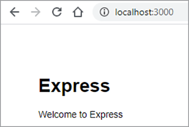

Vous disposez maintenant d’un site web de base.

## Rendu des données du livre blanc

Pour publier des articles techniques sur le site Web, les données de l’article technique sont définies et préparées sur le site Web pour afficher ces documents. Commencez par créer un dossier \\data à la racine du projet. Les informations sur les articles techniques disponibles proviennent d’un nouveau fichier nommé [data.json](https://github.com/marcelooliveira/EmbedPDF/blob/main/pdf-app/data/data.json), qui est placé dans le dossier de données.

Pour donner à l’application web un aspect agréable et soigné, installez le [Bootstrap](https://getbootstrap.com/) et [Police géniale](https://fontawesome.com/) bibliothèques front-end.

```
npm install bootstrap
npm install font-awesome
```

Ouvrez le fichier app.js et incluez ces répertoires en tant que sources pour les fichiers statiques, en les plaçant après le fichier `` `express.static` `` ligne.

```
app.use(express.static(path.join(__dirname, '/node_modules/bootstrap/dist')));
app.use(express.static(path.join(__dirname, '/node_modules/font-awesome')));
```

Pour inclure les documents du PDF, créez un dossier \\pdfs sous le dossier \\public du projet. Au lieu de créer vous-même les PDF et les vignettes, vous pouvez les copier à partir de cette [Dossier du référentiel GitHub](https://github.com/marcelooliveira/EmbedPDF/tree/main/pdf-app/public) vers les dossiers \\pdfs et \\image.

Le dossier \\public\\pdfs contient désormais les documents du PDF :

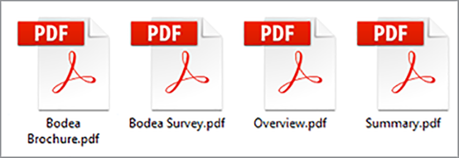

Alors que le dossier \\public\\images doit contenir les vignettes de chacun des documents du PDF :

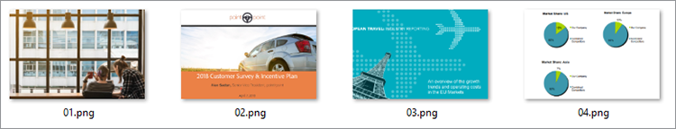

Ouvrez ensuite le fichier \\routes\\index.js, qui contient la logique de routage de la page d’accueil. Pour utiliser les données de l&#39;article technique du fichier data.json, vous devez charger le module Node.js chargé d&#39;accéder au système de fichiers et d&#39;interagir avec lui. Ensuite, déclarez le fichier `fs` dans la première ligne du fichier \\routes\\index.js, comme suit :

```
const fs = require('fs');
```

Ensuite, lisez et analysez le fichier data.json et stockez-les dans la variable papers :

```
let rawdata = fs.readFileSync('data/data.json');
let papers = JSON.parse(rawdata);
```

Modifiez maintenant la ligne pour appeler la méthode de rendu pour la vue d&#39;index, en transmettant la collection de papiers comme modèle pour la vue d&#39;index.

```
res.render('index', { title: 'Embedding PDF', papers: papers });
```

Pour effectuer le rendu de la collection d’articles techniques sur la page d’accueil, ouvrez le fichier \\views\\index.ejs et remplacez le code existant par le code de votre projet [fichier index](https://github.com/marcelooliveira/EmbedPDF/blob/main/pdf-app/views/index.ejs).

Maintenant, réexécutez npm start et ouvrez <http://localhost:3000> pour afficher votre collection d’articles techniques disponibles.

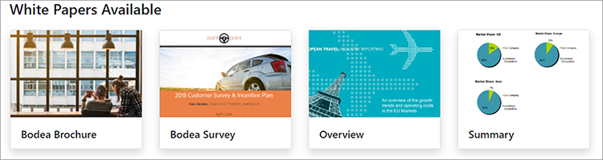

Dans les sections suivantes, vous devrez améliorer le site Web et utiliser [API PDF Embed](https://www.adobe.io/apis/documentcloud/dcsdk/pdf-embed.html) pour afficher les documents du PDF sur la page web. L’API PDF Embed est gratuite. Il vous suffit d’obtenir un identifiant d’API.

## Obtention d’un identifiant d’API PDF Embed

Pour obtenir un identifiant d’API PDF Embed gratuit, consultez la page [Prise en main](https://www.adobe.io/apis/documentcloud/dcsdk/gettingstarted.html) après vous être inscrit à un nouveau compte ou vous être connecté à votre compte existant.

Cliquez **Créer de nouvelles identifiants** et ensuite **Prise en main :**

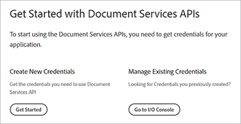

À ce stade, vous êtes invité à créer un compte gratuit si vous n’en avez pas.

Sélectionner **API PDF Embed**, saisissez votre nom d’identification et votre domaine d’application. Utilisez la **localhost** en raison du test local de l’application web.

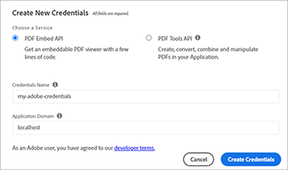

Cliquez sur le bouton **Créer des identifiants** pour accéder aux identifiants de votre PDF et obtenir l’ID client (CLÉ API).

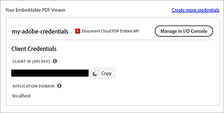

Dans votre projet Node.js, créez un fichier nommé .ENV dans le dossier racine de l’application et déclarez la variable d’environnement pour votre ID client incorporé de PDF avec la valeur de l’identifiant de CLÉ d’API de l’étape précédente.

```
PDF_EMBED_CLIENT_ID=**********************************************
```

Vous utiliserez ultérieurement cet ID client pour accéder à l’API PDF Embed. Installez le package dotenv pour accéder à cette variable d’environnement à l’aide du code Node.js.

```
npm install dotenv
```

Ouvrez maintenant le fichier app.js et ajoutez la ligne suivante en haut du fichier afin que Node.js puisse charger le module dotenv :

```
require('dotenv').config();
```

## Affichage des PDF dans l’application web

Utilisez maintenant l’API PDF Embed pour afficher les PDF sur le site. Ouvrez le fichier en direct [Démonstration de l’API PDF Embed](https://documentcloud.adobe.com/view-sdk-demo/index.html#/view/FULL_WINDOW/Bodea%20Brochure.pdf).

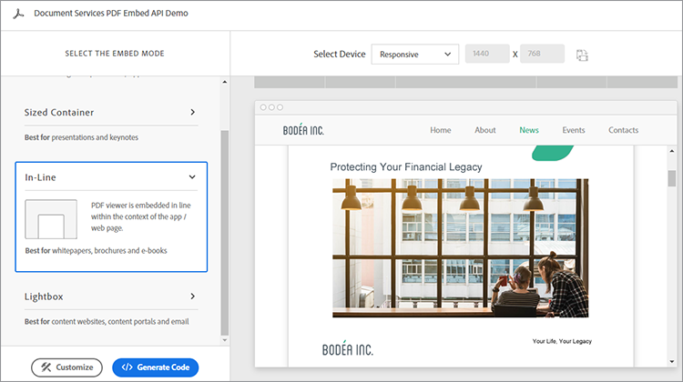

Dans le panneau de gauche, vous pouvez choisir le mode d’intégration qui répond le mieux aux besoins de votre site web :

* **Fenêtre entière**: le PDF couvre tout l’espace de la page web.

* **Conteneur dimensionné**: le PDF s’affiche dans la page web, page par page, dans une div de taille limitée

* **In-Line**: le PDF s’affiche dans une balise div à l’intérieur de la page web.

* **Lightbox**: le PDF s’affiche sous forme de calque au-dessus de votre page web.

Il est recommandé d’utiliser le mode d’intégration en ligne pour les articles techniques et le générateur de code ultérieurement pour incorporer un PDF dans l’application.

## Création d’une page en mode d’intégration en ligne

Pour intégrer une visionneuse de PDF à votre page Web et afficher toutes les pages simultanément, vous devez créer une nouvelle page à l’aide du mode d’intégration intégré.

Créez une vue dans le fichier \\views\\in-line.ejs à l’aide du moteur d’affichage EJS.

```
<! html DOCTYPE >
<html>
<head>
<title>
<%= title %>
</title>
<link rel='stylesheet' href='/stylesheets/style.css' />
<link rel='stylesheet' href='/css/bootstrap.min.css'/>
<link rel='stylesheet' href='/css/font-awesome.min.css' />
<style type="text/css">
p {
font-family: 'Gill Sans', 'Gill Sans MT', Calibri, 'Trebuchet MS', sans-serif
}
</style>
</head>
<body class="m-0">
<div>
<main>
<div class="row">
<div class="col-sm-3"></div>
<div class="col-sm-6">
<h3>
<p class="text-center">Grow your business, establish your brand,<br
/>
```

et donnez la priorité à vos clients.

```
</p>
</h3>
<div>
<p class="text-center">Lorem ipsum dolor sit amet, consectetur adipiscing elit, sed do<br />
eiusmod tempor incididunt ut labore et dolore</p>
</div>
</div>
</main>
<footer>
<div class="row">
<div class="col-sm-3"></div>
<div class="col-sm-6">
<p class="text-center">Bodea Inc. Your trusted partner since 2008</p>
</div>
</div>
</footer>
</div>
</div>
</body>
</html>
```

Ensuite, modifiez \\views\\index.ejs pour créer un bouton permettant d’ouvrir la vue en ligne.

```
<div class="card-body">
<h5 class="card-title">
<span>
<%= paper.title %>
</span>
</h5>
<p>
<a class="btn btn-sm btn btn-danger" href="/in-line/<%=
paper.id %>">
<span type="button"></span>
<span class="fa fa-file-pdf-o"></span>&nbsp;View Document</button>
</a>
</p>
</div>
```

Ouvrez le fichier app.js et déclarez un nouveau routeur après la déclaration indexRouter :

```
var indexRouter = require('./routes/index');
var inLineRouter = require('./routes/in-line');
```

Ajoutez ensuite ce code après app.use(&#39;/&#39;, indexRouter); pour associer la vue en mode intégré en ligne à son routeur :

```
app.use('/', indexRouter);
app.use('/in-line', inLineRouter);
```

Maintenant, créez un nouveau fichier in-line.js sous \\routes pour créer une nouvelle logique de routeur. Include Express, un module de noeud qui active un moteur d&#39;application Web.

```
var express = require('express');
const fs = require('fs');
var router = express.Router();
```

Créez ensuite un point de terminaison qui gère les demandes de GET pour un ID d’article technique spécifique et affiche la vue in-line.ejs.

```
router.all('/:id', function(req, res, next) {
let rawdata = fs.readFileSync('data/data.json');
let papers = JSON.parse(rawdata);
let paper = papers.filter(p => p.id == parseInt(req.params.id))[0];
res.render('in-line', { title: paper.title, paper: paper });
});
module.exports = router;
```

Regardez encore la [démonstration en direct](https://documentcloud.adobe.com/view-sdk-demo/index.html#/view/FULL_WINDOW/Bodea%20Brochure.pdf) pour générer automatiquement du code API PDF Embed. Cliquez **In-Line** dans le panneau de gauche :


Cliquez **Générer le code** pour afficher le code de HTML requis pour afficher un visualiseur de PDF de conteneurs redimensionné.

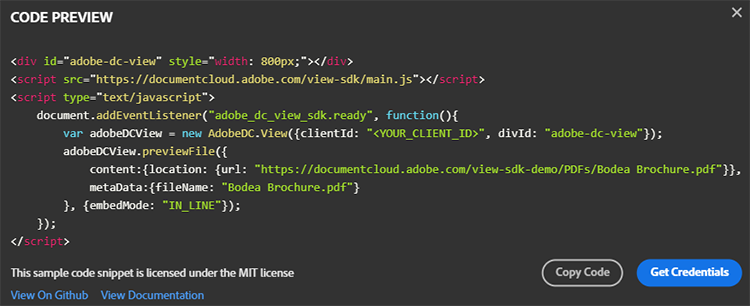

Cliquez **Copier le code** et collez le code dans le fichier in-line.ejs.

```
<div>
<p class="text-center">Lorem ipsum dolor sit amet, consectetur adipiscing elit, sed do<br />
eiusmod tempor incididunt ut labore et dolore</p>
</div>
<div class="row align-items-center border border-primary">
<div id="adobe-dc-view" style="width: 800px;"></div>
<script src="https://documentcloud.adobe.com/view-sdk/main.js"></script>
<script type="text/javascript">
document.addEventListener("adobe_dc_view_sdk.ready", function(){
var adobeDCView = new AdobeDC.View({clientId: "<YOUR_CLIENT_ID>", divId: "adobe-dc-view"});
adobeDCView.previewFile({
content:{location: {url: "https://documentcloud.adobe.com/view-sdk-demo/PDFs/Bodea Brochure.pdf"}},
metaData:{fileName: "Bodea Brochure.pdf"}
}, {embedMode: "IN_LINE"});
});
</script>
</div>
```

Cependant, les paramètres du document sont toujours codés en dur. Remplaçons-les par la syntaxe des crochets EJS (\&lt;%= someValue %\>) pour rendre la page selon les données du modèle de l&#39;article technique.

```
<div id="adobe-dc-view" style="width: 800px;"></div>
<script src="https://documentcloud.adobe.com/view-sdk/main.js"></script>
<script type="text/javascript">
document.addEventListener("adobe_dc_view_sdk.ready", function () {
var adobeDCView = new AdobeDC.View({ clientId: "<%=process.env.PDF_EMBED_CLIENT_ID %>", divId: "adobe-dc-view" });
adobeDCView.previewFile({
content: { location: { url: "<%= paper.pdf %>" } },
metaData: { fileName: "<%= paper.fileName %>" }
}, {
embedMode: "IN_LINE"
});
});
</script>
```

Exécutez maintenant l&#39;application avec la commande npm start et ouvrez le site Web à l&#39;adresse <http://localhost:3000>.

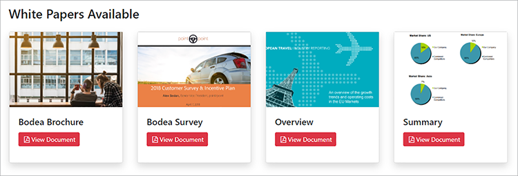

Enfin, choisissez un article technique, puis cliquez sur **Afficher le document** pour ouvrir une nouvelle page avec le mot de PDF incorporé en ligne :


Notez que les options Télécharger le PDF et Imprimer le PDF sont désormais disponibles.

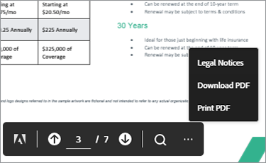

Vous souhaitez contrôler ces indicateurs sur le serveur principal. Vous pourrez ensuite mettre en oeuvre des contrôles d&#39;autorisation basés sur l&#39;identité des utilisateurs et restreindre l&#39;accès conformément à vos règles métier. Cette complexité n&#39;est pas nécessaire ici, nous allons simplement modifier \\routes\\in-line.js pour inclure les propriétés authentifiées et les autorisations dans l&#39;objet modèle.

```
let authenticated = false;
res.render('in-line', {
title: paper.title,
paper: paper,
authenticated: authenticated,
permissions: {
showDownloadPDF: true,
showPrintPDF: true,
showFullScreen: true
}
});
```

Ensuite, modifiez \\views\\in-line.ejs afin que votre page web puisse afficher les valeurs d’indicateur provenant du backend.

```
embedMode: "IN_LINE",
showDownloadPDF: <%= permissions.showDownloadPDF %>,
showPrintPDF: <%= permissions.showPrintPDF %>,
showFullScreen: <%= permissions.showFullScreen %>
Now, open the in-line.js route file and modify it to disallow the printing, downloading, and full-screen controls.
permissions: {
showDownloadPDF: false,
showPrintPDF: false,
showFullScreen: false
}
```

Ensuite, réexécutez l’application pour voir comment cette modification se reflète dans la visionneuse du PDF.


## Création de contenu protégé

Selon le scénario de l&#39;utilisateur final, le responsable marketing du site Web de l&#39;entreprise veut mieux comprendre comment les utilisateurs interagissent avec leur contenu basé sur un PDF et incorporent le contenu avec le reste de leur page Web et de la marque.

Nous mettons l&#39;accent sur l&#39;incorporation des mots de PDF, de sorte que vous ne créez pas de fonction d&#39;authentification utilisateur. Au lieu de cela, il suffit d’implémenter une simple et fausse paywall à l’aide d’un formulaire web qui accepte certaines informations utilisateur, puis affiche le document du PDF une fois que l’utilisateur a envoyé le formulaire.

Remplacez le fichier \\routes\\in-line.js par le contenu ci-dessous pour fournir au modèle d&#39;affichage les informations utilisateur :

```
var express = require('express');
const fs = require('fs');
var router = express.Router();
router.all('/:id', function(req, res, next) {
let rawdata = fs.readFileSync('data/data.json');
let papers = JSON.parse(rawdata);
let paper = papers.filter(p => p.id == parseInt(req.params.id))[0];
let authenticated = false;
let user = {};
if (req.body.firstName) {
user = {
firstName: req.body.firstName,
lastName: req.body.lastName,
jobTitle: req.body.jobTitle,
email: req.body.email,
};
authenticated = true;
}
res.render('in-line', {
title: paper.title,
paper: paper,
user: user,
authenticated: authenticated,
permissions: {
showDownloadPDF: false,
showPrintPDF: false,
showFullScreen: false
}
});
});
module.exports = router;
```

Remplacez ensuite le contenu \\views\\in-line.ejs par le code ci-dessous. Il affiche le formulaire de données utilisateur ou la visionneuse du PDF, selon qu’il s’agit d’un utilisateur authentifié.

```
<!DOCTYPE html>
<html>
<head>
<title>
<%= title %>
</title>
<link rel='stylesheet' href='/css/bootstrap.min.css'/>
<link rel='stylesheet' href='/css/font-awesome.min.css' />
<style type="text/css">
p {
font-family: 'Gill Sans', 'Gill Sans MT', Calibri, 'Trebuchet MS', sans-serif
}
</style>
</head>
<body class="m-0">
<% if (authenticated) { %>
<header class="bg-dark text-white">
<div class="text-right mr-4">Hello, <%= user.firstName %> <%= user.lastName%></div>
</header>
<% } %>
<div>
<main>
<div class="row">
<div class="col-sm-3"></div>
<div class="col-sm-6">
<h3>
<p class="text-center">Grow your business, establish your brand,<br
/>
```

et donnez la priorité à vos clients.

```
</p>
</h3>
<div>
<p class="text-center">Lorem ipsum dolor sit amet, consectetur adipiscing elit, sed do<br />
eiusmod tempor incididunt ut labore et dolore</p>
</div>
<% if (!authenticated) { %>
<div class="row">
<form method="POST" class="center-panel text offset-md-3 col-md-6 border">
<fieldset class="offset-md-1">
<legend>Submit your info to<br/>access the whitepaper</legend>
<p><input name="firstName" placeholder="first name"/></p>
<p><input name="lastName" placeholder="last name"/></p>
<p><input name="jobTitle" placeholder="job title"/></p>
<p><input name="email" placeholder="email"/></p>
<p><button type="submit" class="btn btn-sm btn btn-primary">Submit</button></p>
</fieldset>
</form>
</div>
<% } %>
<% if (authenticated) { %>
<div class="row align-items-center border border-primary">
<div id="adobe-dc-view" style="width: 800px;"></div>
<script src="https://documentcloud.adobe.com/view-sdk/main.js"></script>
<script type="text/javascript">
document.addEventListener("adobe_dc_view_sdk.ready", function () {
var adobeDCView = new AdobeDC.View({ clientId: "<%=process.env.PDF_EMBED_CLIENT_ID %>", divId: "adobe-dc-view" });
adobeDCView.previewFile({
content: { location: { url: "<%= paper.pdf %>" } },
metaData: { fileName: "<%= paper.fileName %>" }
}, {
embedMode: "IN_LINE",
showDownloadPDF: <%= permissions.showDownloadPDF %>,
showPrintPDF: <%= permissions.showPrintPDF %>,
showFullScreen: <%= permissions.showFullScreen %>
});
});
</script>
<% } %>
</div>
</div>
</main>
<footer>
<div class="row">
<div class="col-sm-3"></div>
<div class="col-sm-6">
<p class="text-center">Bodea Inc. Your trusted partner since 2008</p>
</div>
</div>
</footer>
</div>
</div>
</body>
</html>
```

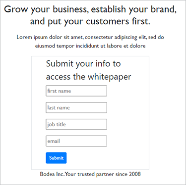

Désormais, les visiteurs du site peuvent uniquement accéder aux PDF après avoir soumis leurs informations :

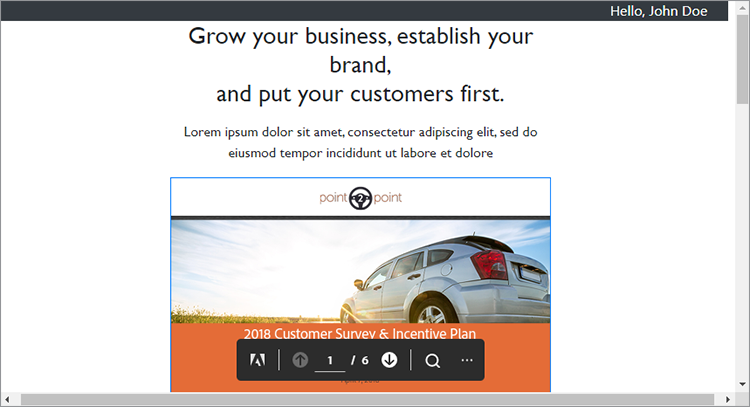

## Activation des événements

Voyons comment intégrer facilement des événements de visionneuse de PDF à votre application pour recueillir des données d&#39;analytics pour le responsable marketing. Pour étendre votre visionneuse à l’aide de PDF EmbedAPI, ajoutez les lignes de code suivantes après avoir déclaré la variable adobeDCView et avant d’appeler la méthode previewFile :

```
var adobeDCView = new AdobeDC.View({ clientId: "<%=process.env.PDF_EMBED_CLIENT_ID %>", divId: "adobe-dc-view" });
adobeDCView.registerCallback(
AdobeDC.View.Enum.CallbackType.EVENT_LISTENER,
function(event) {
console.log(event);
},
{ enablePDFAnalytics: true }
);
```

Exécutez à nouveau l’application et ouvrez les outils de développement de votre navigateur web pour afficher les données de l’événement.

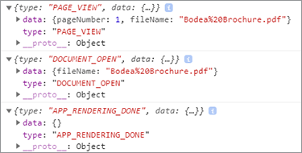

Vous pouvez envoyer ces données à [Adobe Analytics](https://www.adobe.io/apis/documentcloud/dcsdk/docs.html?view=view) ou d&#39;autres outils d&#39;analytics.

## Marche à suivre

[!DNL Acrobat Services] Les API aident les développeurs à résoudre facilement les problèmes de publication numérique à l’aide d’un workflow orienté PDF. Vous avez vu comment créer un exemple d’application web Node pour afficher une collection d’articles techniques. Ensuite, acquérez un [identifiant d’API gratuit](https://www.adobe.io/apis/documentcloud/dcsdk/gettingstarted.html) et un accès restreint aux articles techniques, qui peut être affiché dans l’un des quatre [modes intégrés](https://documentcloud.adobe.com/view-sdk-demo/index.html#/view/FULL_WINDOW/Bodea%20Brochure.pdf).

L’association de ce workflow aide les [responsable marketing hypothétique](https://www.adobe.io/apis/documentcloud/dcsdk/digital-content-publishing.html) recueillez les coordonnées des contacts principaux en échange de téléchargements d’articles techniques et consultez des statistiques sur les personnes qui interagissent avec les PDF. Vous pouvez intégrer ces fonctionnalités à votre site web pour stimuler et surveiller les interactions des utilisateurs.

Si vous êtes un développeur Angular ou React, vous pouvez essayer [exemples supplémentaires](https://github.com/adobe/pdf-embed-api-samples) Découvrez comment intégrer l’API PDF Embed aux projets React et Angular.

Adobe vous permet de créer une expérience client de bout en bout avec des solutions innovantes. Extraire [API Adobe PDF Embed](https://www.adobe.io/apis/documentcloud/viesdk) gratuitement. Pour découvrir d’autres possibilités, testez l’API Adobe PDF Services avec [pay-as-you-gopr](https://www.adobe.io/apis/documentcloud/dcsdk/pdf-pricing.html)[glaçage](https://www.adobe.io/apis/documentcloud/dcsdk/pdf-pricing.html).

[Prise en main](https://www.adobe.io/apis/documentcloud/dcsdk/gettingstarted.html) avec [!DNL Adobe Acrobat Services] API aujourd&#39;hui.
