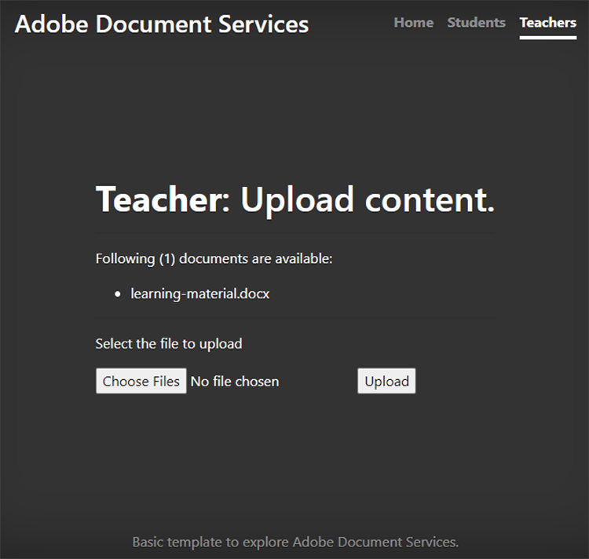
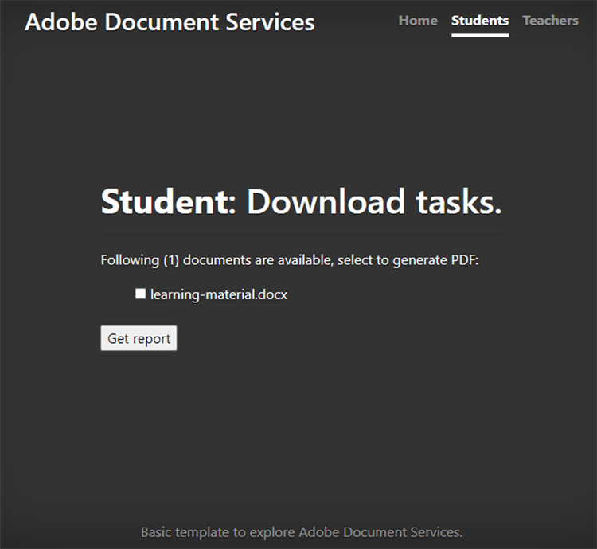
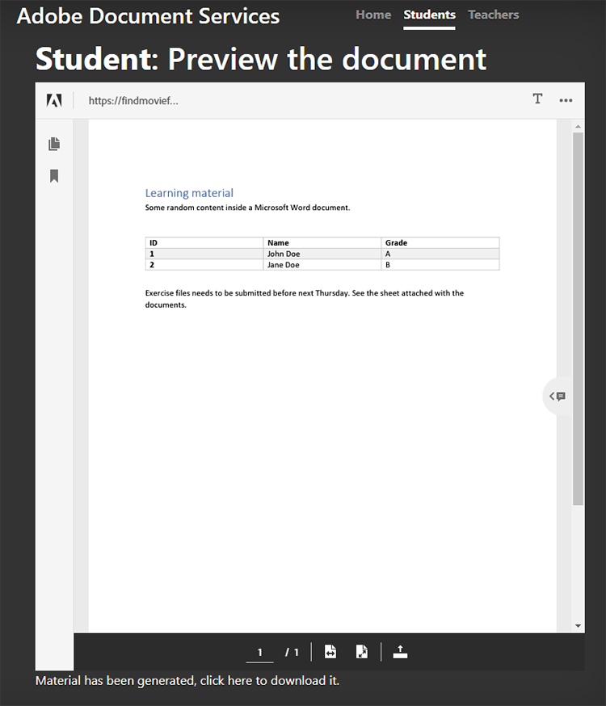
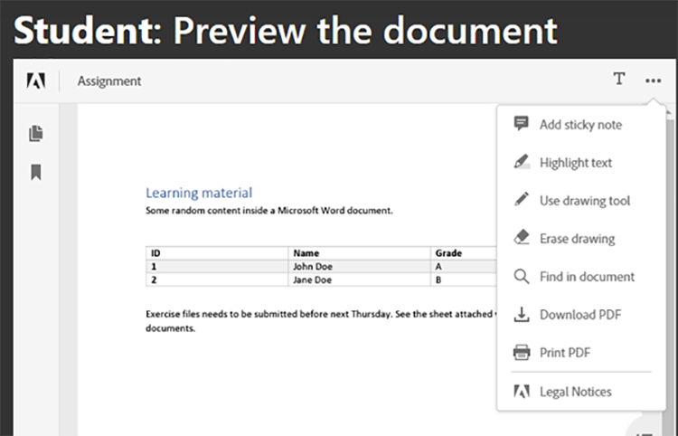
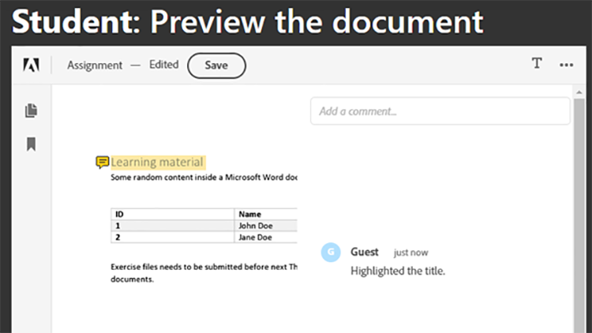
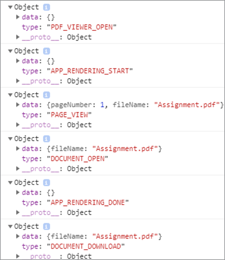

# Collaboration étudiant-enseignant


Les établissements d’enseignement utilisent des documents PDF pour partager du matériel pédagogique avec les étudiants. Le PDF offre aux enseignants un format de document interchangeable.

Intégration [API Adobe PDF Services](https://www.adobe.io/apis/documentcloud/dcsdk/pdf-tools.html) et [API Adobe PDF Embed](https://www.adobe.io/apis/documentcloud/dcsdk/pdf-embed.html) into an app fournit aux enseignants et aux étudiants une plateforme unique sur laquelle ils peuvent enseigner et apprendre. Par exemple, votre application peut permettre aux étudiants de poser des questions sur leurs devoirs et fiches de rendement, et de collaborer sur des devoirs de groupe.

Il existe un SDK officiel pour les applications Node.js afin d’accéder à l’API PDF Services. Cela vous permet de convertir des documents comme Microsoft Word ou Microsoft Excel en PDF. En outre, vous pouvez effectuer des opérations plus avancées comme la combinaison de plusieurs rapports, la réorganisation des pages et la protection des PDF. Pour plus de détails, consultez [documentation produit](https://www.adobe.io/apis/documentcloud/dcsdk/).

## Ce que vous pouvez apprendre

Dans ce tutoriel pratique, apprenez à créer une plateforme d&#39;apprentissage en ligne qui [permet aux enseignants et aux étudiants de partager facilement les ressources](https://www.adobe.io/apis/documentcloud/dcsdk/student-teacher-collaboration.html) en PDF. Ce tutoriel utilise un [portail de formation](https://github.com/afzaal-ahmad-zeeshan/adobe-pdf-tools-for-teachers) créé à l’aide du moteur d’exécution JavaScript Node.js (Node.js) et des services de PDF.

Le portail d’apprentissage offre les fonctionnalités suivantes :

* Permet aux enseignants de charger des ressources

* Permet aux étudiants de sélectionner plusieurs documents à convertir en PDF

* Permet la conversion de documents en PDF

* Fournit un aperçu de PDF aux étudiants dans un navigateur Web et leur permet d&#39;annoter les documents sans logiciel supplémentaire

* Permet aux étudiants de laisser des commentaires et de les télécharger sur leur ordinateur

En savoir plus [!DNL Adobe Acrobat Services] offrez une expérience riche à vos étudiants avec le PDF. [!DNL Acrobat Services] Les API s&#39;intègrent parfaitement dans vos applications en place pour permettre aux étudiants de transférer, convertir et consulter des fichiers, puis de créer et enregistrer des commentaires, le tout dans votre configuration actuelle.

## API et ressources pertinentes

* [API PDF Embed](https://www.adobe.com/devnet-docs/dcsdk_io/viewSDK/index.html)

* [API PDF Services](https://opensource.adobe.com/pdftools-sdk-docs/release/latest/index.html)

* [Code du projet](https://github.com/afzaal-ahmad-zeeshan/adobe-pdf-tools-for-teachers)

## Chargement de ressources sur le portail de formation

Dans la section des enseignants du portail d’apprentissage, les enseignants peuvent télécharger des documents tels que des devoirs et des tests. Les documents peuvent être dans n’importe quel format, tel que Microsoft Word, Microsoft Excel, HTML, divers formats d’image, etc.



Les documents téléchargés sont stockés et présentés aux étudiants lorsqu’ils ouvrent leur page Web.

Pour savoir comment l’application télécharge les fichiers, consultez la page [code de projet](https://github.com/afzaal-ahmad-zeeshan/adobe-pdf-tools-for-teachers).

## Conversion de documents en PDF

Les étudiants peuvent convertir un ou plusieurs documents de tout type en PDF, comme Microsoft Word, Excel et PowerPoint, ainsi que d’autres types de fichiers de texte et d’image courants. Le portail d’apprentissage utilise les services de PDF pour convertir les fichiers en PDF.

Pour créer votre propre portail d’apprentissage, vous devez d’abord créer vos propres identifiants. [S&#39;inscrire](https://www.adobe.io/apis/documentcloud/dcsdk/gettingstarted.html) pour utiliser gratuitement l’API PDF Services pendant six mois et jusqu’à 1 000 transactions documentaires. Après cela, [pay-as-you-go](https://www.adobe.io/apis/documentcloud/dcsdk/pdf-pricing.html) à seulement \$0.05 par transaction de document lorsque la classe augmente ses affectations.

Lorsqu’un étudiant sélectionne un document dans le tableau de bord, il voit les éléments suivants :



L&#39;étudiant sélectionne simplement les documents à convertir et clique **Télécharger le rapport**.

Le portail de formation convertit les documents en PDF et affiche une page de rapport, ainsi qu’un aperçu du fichier de PDF.

Voici l’exemple de code pour cette étape :

```
async function createPdf(rawFile, outputPdf) {
    try {
            // configurations
            const credentials =  adobe.Credentials
            .serviceAccountCredentialsBuilder()
            .fromFile("./src/pdftools-api-credentials.json")
            .build();
 
            // Capture the credential from app and show create the context
            const executionContext = adobe.ExecutionContext.create(credentials),
            operation = adobe.CreatePDF.Operation.createNew();
 
            // Pass the content as input (stream)
            const input = adobe.FileRef.createFromLocalFile(rawFile);
            operation.setInput(input);
 
            // Async create the PDF
            let result = await operation.execute(executionContext);
            await result.saveAsFile(outputPdf);
    } catch (err) {
            console.log('Exception encountered while executing operation', err);
    }
}
```

L&#39;exemple de code appelle le fichier `createPdf` dans le gestionnaire d&#39;itinéraire Express pour générer le PDF.

Pour savoir comment cette méthode est appelée, consultez [le code du projet](https://github.com/afzaal-ahmad-zeeshan/adobe-pdf-tools-for-teachers/blob/master/src/helpers/pdf.js).

## Aperçu des ressources d’apprentissage

L’interface utilisateur utilise l’API PDF Embed pour effectuer le rendu des PDF dans un navigateur Web. Cette API peut être utilisée gratuitement.

L’API PDF Embed utilise des informations d’identification différentes de celles de l’API PDF Services. Vous devez donc [création d’informations](https://www.adobe.io/apis/documentcloud/dcsdk/gettingstarted.html)
avant de pouvoir l’utiliser. Ensuite, vous pouvez utiliser PDF Embed complètement gratuitement.

Assurez-vous de saisir l’URL de site Web correcte dans le jeton. Sinon, vous risquez de ne pas pouvoir effectuer le rendu des PDF avec le jeton.

L’interface utilisateur utilise l’attribut [Guidons](https://handlebarsjs.com/) modèle langue. Il affiche le PDF dans un navigateur Web.

Voici le code de cette étape :

```
<div id="adobe-dc-view" style="height: 750px; width: 700px;"></div>
<script src="https://documentcloud.adobe.com/view-sdk/main.js"></script>
<script type="text/javascript">
    document.addEventListener("adobe_dc_view_sdk.ready", function () {
        var adobeDCView = new AdobeDC.View({ clientId: "<your-credentials-here>", divId: "adobe-dc-view" });
        adobeDCView.previewFile(
            {
                content: {
                    location: { url: "<file-url>" }
                },
                    metaData: { fileName: "<file-name>" }
            },
           );
    });
</script>
 
<p>Material has been generated, <a href="/students/download/{{filename}}" target="_blank">click here</a> to download it.
</p>
```

Ce code affiche la sortie du PDF et le lien permettant de télécharger le rapport de PDF, comme indiqué dans la capture d’écran ci-dessous :



Les étudiants devraient pouvoir télécharger le rapport ou travailler sur le matériel ici.

## Annotation de documents PDF

Une plateforme d&#39;apprentissage doit prendre en charge l&#39;annotation de base, les commentaires et les discussions en PDF. L’API PDF Embed fournit toutes ces fonctionnalités. Il active la prise en charge des annotations avec `showAnnotationTools`, permettant aux enseignants et aux étudiants de commenter les documents et d’archiver les commentaires dans le cadre du PDF.

Pour activer les annotations dans les documents PDF, il vous suffit de transmettre l’argument `showAnnotationTools` : vrai à la `previewFile` méthode. L’outil d’annotation s’affiche dans l’aperçu du PDF. Accédez à cet outil à partir du menu à trois points dans le coin supérieur droit de l’aperçu.



Dans les documents chargés par les enseignants, les étudiants peuvent surligner du texte, ajouter des commentaires, etc.



Dans la capture d’écran ci-dessus, l’utilisateur est intitulé &quot;Invité&quot;, mais vous pouvez configurer des profils pour les utilisateurs, tels que les étudiants et les enseignants.

Lorsqu’un étudiant applique une annotation, l’API PDF Embed affiche un **Enregistrer** le long de la bannière supérieure. L’enregistrement ajoute les annotations au fichier. Essayez de cliquer **Enregistrer** pour voir comment le fichier est enregistré avec l&#39;annotation incorporée dans le rapport.

Les étudiants peuvent utiliser des annotations pour poser des questions ou partager leurs commentaires sur le matériel d’apprentissage.

## Suivi de l’utilisation

Il est important pour les enseignants et les écoles de voir comment les étudiants utilisent les plateformes en ligne. Cela aide les enseignants à aider leurs élèves avec des ressources qui les aident à mieux s&#39;acquitter de leurs devoirs. L’API PDF Embed s’intègre avec les outils d’analytics que vous pouvez utiliser pour mesurer tous les événements en cours, par exemple le moment où les utilisateurs ouvrent, lisent et ferment des documents. Grâce à l’API PDF Services, les enseignants peuvent également désactiver l’impression, le téléchargement et la modification des fichiers pour préserver l’intégrité des cours.

Si vous disposez d’un [Adobe Analytics](https://www.adobe.io/apis/experiencecloud/analytics.html) , vous pouvez utiliser son [intégration prête à l’emploi](https://experienceleague.adobe.com/docs/document-services/tutorials/pdfembed/controlpdfexperience.html?lang=en#adobe-analytics). Sinon, utilisez les rappels pour intégrer vos services de PDF à d&#39;autres fournisseurs d&#39;analytics, tels que [Google](https://experienceleague.adobe.com/docs/document-services/tutorials/pdfembed/controlpdfexperience.html?lang=en#google-analytics).

Pour activer la mesure des événements de document, associez les gestionnaires d’événements à l’aide du `registerCallback` avec l&#39;instance Adobe DC View. Vous pouvez afficher des mesures de base, telles que l’ouverture d’un document ou la lecture d’une page, sur la console. Vous pouvez également enregistrer les mesures dans un journal ou les publier dans d&#39;autres magasins d&#39;analytics.

Voici l&#39;exemple de code pour joindre les gestionnaires d&#39;événements :

```
adobeDCView.registerCallback(
    AdobeDC.View.Enum.CallbackType.EVENT_LISTENER,
    function(event) {
           console.log(event);
    },
    {
           enablePDFAnalytics: true
    }
);
```

Les enseignants peuvent voir combien d&#39;étudiants ont vu le devoir, combien ont parcouru toutes les pages de leurs notes et d&#39;autres détails précieux.

Voici une capture d’écran de la console du navigateur web :



Cette capture d&#39;écran montre que l&#39;étudiant a ouvert le fichier d&#39;affectation, qu&#39;il a lu la première page (soit il n&#39;a pas défilé jusqu&#39;à d&#39;autres pages, soit le document ne comportait qu&#39;une seule page), puis il a téléchargé le fichier. Vous pouvez collecter ces mesures pour effectuer des analyses et étudier le comportement de vos étudiants.

En outre, [Adobe Analytics](https://business.adobe.com/products/analytics/adobe-analytics.html) est intégré à l’API PDF Embed, de sorte que si vous disposez d’un abonnement à la suite Adobe Analytics, vous pouvez publier vos mesures dans votre abonnement. Pour publier les mesures dans Adobe Analytics, il vous suffit de transmettre votre ID de suite au constructeur d’API PDF Embed. (Notez que vous devez utiliser vos identifiants d’API PDF Embed, et non vos identifiants d’API PDF Services.)

Voici un exemple de code qui montre comment transmettre l’ID de suite au constructeur d’API incorporé au PDF :

```
var adobeDCView = new AdobeDC.View({
    clientId: "<your-adobe-dc-credential>",
    divId: "<#element>"
    reportSuiteId: <your-id-here>,
}); 
```

## Marche à suivre

Ce didacticiel pratique explique comment utiliser l’API PDF Services et l’API PDF Embed pour créer un portail de formation, facilitant ainsi une intégration efficace des mots de  [collaboration entre étudiants et enseignants](https://www.adobe.io/apis/documentcloud/dcsdk/student-teacher-collaboration.html). Grâce à ce portail, les enseignants peuvent télécharger du matériel pédagogique dans n’importe quel format et le convertir en PDF à l’aide de l’API des services de PDF. Les étudiants peuvent ensuite prévisualiser ces PDF à l’aide de l’API PDF Embed.

Maintenant que vous savez comment annoter des rapports de PDF, archiver les annotations et suivre l&#39;utilisation des rapports de PDF, vous pouvez commencer à implémenter ces solutions dans vos propres projets.

Vous pouvez utiliser [!DNL Adobe Acrobat Services] Des API pour créer des expériences de PDF interactives et conviviales sur votre site web. Profitez de l’API Adobe PDF Services gratuitement pendant six mois, puis [pay-as-you-go](https://www.adobe.io/apis/documentcloud/dcsdk/pdf-pricing.html) (via AWS ou un accord direct) pour seulement \$0.05 par transaction de document. Utilisez Adobe PDF Embed gratuitement et sans limitation de temps. Créer un compte gratuit pour [prise en main](https://www.adobe.com/go/dcsdks_credentials) aujourd&#39;hui.
