# Modernisation de l’intégration


Dans une grande entreprise, l’intégration des employés peut être un processus long et volumineux. En règle générale, il y a un mélange de documentation personnalisée et de documents standard qui doivent être présentés et signés par un nouvel employé. Ce mélange de matériaux personnalisés et de matériaux standard nécessite plusieurs étapes, ce qui prend un temps précieux aux personnes impliquées dans le processus. [!DNL Adobe Acrobat Services] et Acrobat Sign peuvent moderniser et automatiser cette approche, libérant ainsi votre personnel RH pour des tâches plus importantes. Voyons comment cela se fait.

## Que sont [!DNL Adobe Acrobat Services]?

[[!DNL Adobe Acrobat Services]](https://developer.adobe.com/document-services/homepage) sont un ensemble d’API liées à l’utilisation de documents (et pas seulement de PDF). Globalement, cette suite de services se divise en trois grandes catégories :

* Tout d’abord, [Services de PDF](https://developer.adobe.com/document-services/apis/pdf-services/) ensemble d’outils. Il s’agit de méthodes &quot;utiles&quot; pour travailler avec des PDF et d’autres documents. Les services incluent des choses telles que la conversion vers et depuis un PDF, la réalisation de la reconnaissance optique des caractères et l’optimisation, la fusion et le fractionnement de PDF, etc. C&#39;est la boîte à outils des fonctions de traitement de documents.
* [API PDF Extract](https://developer.adobe.com/document-services/apis/pdf-extract/) utilise de puissantes techniques d’IA et de machine learning pour analyser un PDF et renvoyer une quantité incroyable de détails sur son contenu. Cela inclut le texte, le style et les informations de position, et peut également renvoyer des données tabulaires au format CSV/XLS ainsi que récupérer des images.
* Enfin, [API Document Generation](https://developer.adobe.com/document-services/apis/doc-generation/) permet aux développeurs d’utiliser Microsoft Word comme un &quot;modèle&quot;, de combiner leurs données (quelle que soit leur source) et de générer des documents personnalisés dynamiques (PDF et Word).

Les développeurs peuvent [s&#39;inscrire](https://documentcloud.adobe.com/dc-integration-creation-app-cdn/main.html) et testez gratuitement tous ces services. La [!DNL Acrobat Services] utilise une API REST, mais prend également en charge les kits SDK pour Node, Java, .NET et Python (Extract uniquement pour le moment).

Bien qu’ils ne soient pas une API, les développeurs peuvent également utiliser le [API PDF Embed](https://developer.adobe.com/document-services/apis/pdf-embed/), qui offre une expérience d’affichage cohérente et flexible des documents avec vos pages web.

## Présentation d’Acrobat Sign

[Acrobat Sign](https://www.adobe.com/fr/sign.html) est le leader mondial des services de signature électronique. Vous pouvez envoyer des documents pour signature en utilisant différents workflows, y compris plusieurs signatures. Acrobat Sign prend également en charge les workflows qui nécessitent des signatures et des informations supplémentaires. Toutes ces fonctionnalités sont prises en charge par un tableau de bord puissant doté d’un système de création flexible.

Comme avec [!DNL Acrobat Services], Acrobat Sign a un [essai gratuit](https://www.adobe.com/sign.html#sign_free_trial) qui permet aux développeurs de tester le processus de signature à la fois via le tableau de bord et avec une API REST facile à utiliser.

## Scénario d’intégration

Considérons un scénario réel qui démontre comment les services de l&#39;Adobe peuvent aider. Lorsqu&#39;un nouvel employé rejoint une entreprise, il a besoin d&#39;informations personnalisées adaptées à son rôle. En outre, ils ont également besoin de matériel à l&#39;échelle de l&#39;entreprise. Enfin, ils doivent démontrer l&#39;acceptation des politiques de l&#39;entreprise en signant les documents. Je vais vous expliquer en détail comment procéder :

* D&#39;abord, il faut une lettre d&#39;accompagnement personnalisée qui accueille le nouvel employé par son nom. La lettre doit contenir des renseignements sur le nom, le rôle, le salaire et le lieu de l&#39;employé.
* La lettre personnalisée doit être associée à un PDF qui contient des informations de base à l&#39;échelle de l&#39;entreprise (pensez aux diverses politiques de RH, aux avantages, etc.)
* Un document final doit être inclus et demander la signature et la date de l&#39;employé.
* Tous les documents ci-dessus doivent être présentés sous la forme d&#39;un seul document envoyé à l&#39;employé pour signature.

Passons aux détails sur la façon de procéder.

## Génération de documents dynamiques

Adobe [Génération de documents](https://developer.adobe.com/document-services/apis/doc-generation/) L’API permet aux développeurs de créer des documents dynamiques à l’aide de Microsoft Word et d’un langage de template simple, comme base pour générer des PDF et des documents Word. Voici un exemple de la façon dont cela fonctionne.

Commençons par un document Word avec des valeurs codées en dur. Le document peut être mis en forme comme vous le souhaitez, y compris sous forme de graphiques, tableaux, etc. Voici le document initial.

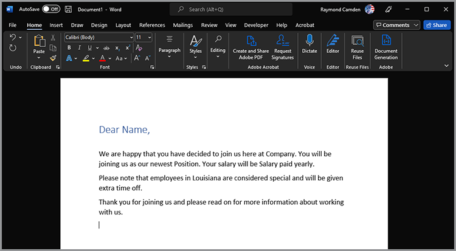

La génération de document fonctionne en ajoutant des &quot;jetons&quot; à un document Word qui sont remplacés par vos données. Bien que ces jetons puissent être saisis manuellement, il existe un [Module complémentaire Microsoft Word](https://developer.adobe.com/document-services/docs/overview/document-generation-api/wordaddin/) ce qui facilite la tâche. Son ouverture permet aux auteurs de définir des balises ou des ensembles de données pouvant être utilisés dans votre document.

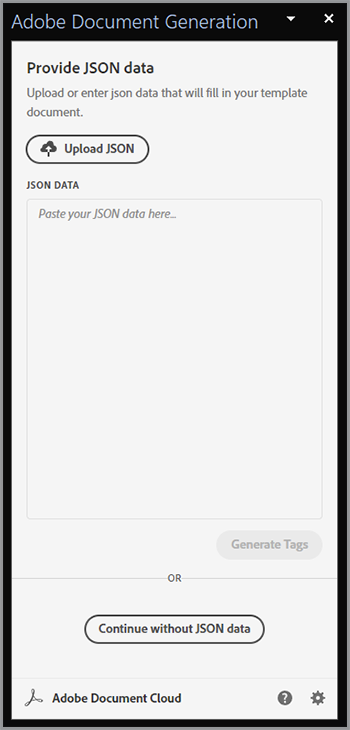

Vous pouvez télécharger des informations JSON à partir d’un fichier local, les copier dans du texte JSON ou les sélectionner pour continuer avec les données initiales. Cela vous permet de définir vos balises de manière ad hoc en fonction de vos besoins particuliers. Dans cet exemple, seule une balise pour le nom, le rôle, le salaire et l&#39;emplacement est nécessaire. Pour ce faire, utilisez la commande **Créer une balise** bouton :

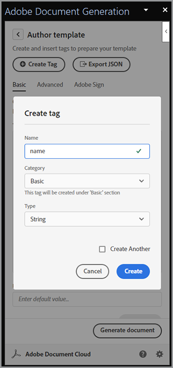

Après avoir défini la première balise, vous pouvez continuer à définir autant de balises que nécessaire :

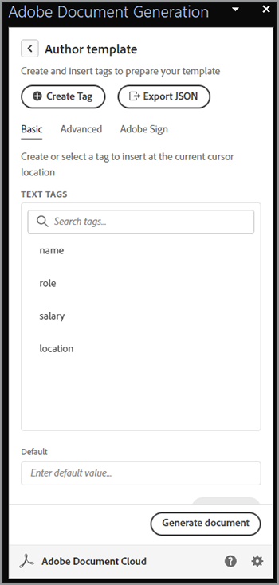

Une fois les balises définies, vous devez sélectionner le texte dans votre document et le remplacer par les balises appropriées. Dans cet exemple, des balises sont ajoutées pour le nom, le rôle et le salaire.

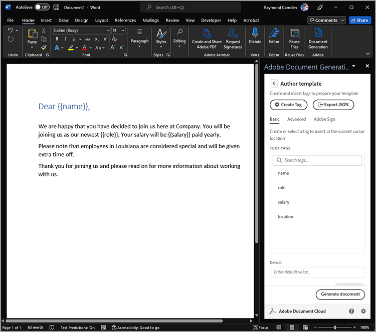

La génération de document ne prend pas uniquement en charge les balises simples, mais également les expressions logiques. Le texte du deuxième paragraphe du document ne s’applique qu’aux personnes résidant en Louisiane. Vous pouvez ajouter une expression conditionnelle en accédant à l’onglet Avancé du Baliseur de document et en définissant une condition. Voici comment définir une condition d&#39;égalité simple, mais notez que les comparaisons numériques et d&#39;autres types de comparaison sont également pris en charge.

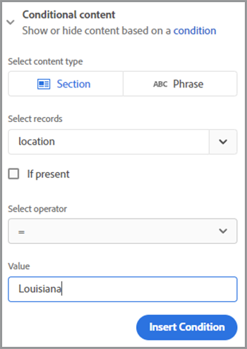

Il peut ensuite être inséré et entouré du paragraphe :

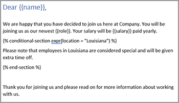

Pour tester comment cela fonctionne, sélectionnez **Générer le document**. La première fois que vous effectuez cette opération, vous devez vous connecter avec un Adobe ID. Une fois connecté, le fichier JSON par défaut s’affiche et peut être modifié manuellement.

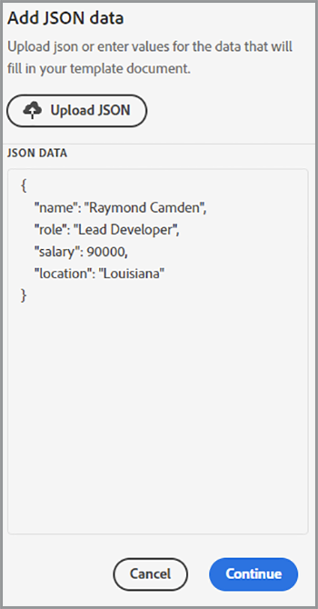

Un PDF est généré et peut ensuite être consulté ou téléchargé.

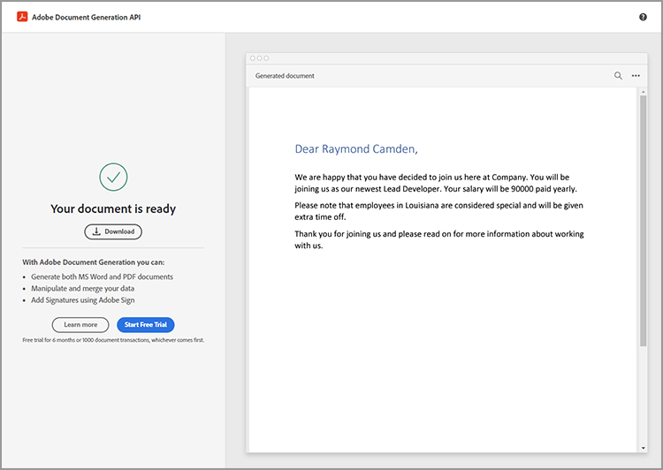

Bien que Document Tagger vous permette de concevoir et de tester rapidement, une fois l’opération terminée et en production, vous pouvez utiliser l’un des kits SDK pour automatiser ce processus. Bien que le code réel diffère en fonction de besoins spécifiques, voici un exemple de l’apparence de ce code dans Node.js :

```js
 const PDFServicesSdk = require('@adobe/pdfservices-node-sdk');

const credentials =  PDFServicesSdk.Credentials
    .serviceAccountCredentialsBuilder()
    .fromFile("pdfservices-api-credentials.json")
    .build();

// Data would be dynamic...
let data = {
    "name":"Raymond Camden",
    "role":"Lead Developer",
    "salary":9000,
    "location":"Louisiana"
}

// Create an ExecutionContext using credentials.
const executionContext = PDFServicesSdk.ExecutionContext.create(credentials);

// Create a new DocumentMerge options instance.
const documentMerge = PDFServicesSdk.DocumentMerge,
    documentMergeOptions = documentMerge.options,
    options = new documentMergeOptions.DocumentMergeOptions(jsonDataForMerge, documentMergeOptions.OutputFormat.PDF);

// Create a new operation instance using the options instance.
const documentMergeOperation = documentMerge.Operation.createNew(options);

// Set operation input document template from a source file.
const input = PDFServicesSdk.FileRef.createFromLocalFile('documentMergeTemplate.docx');
documentMergeOperation.setInput(input);

// Execute the operation and Save the result to the specified location.
documentMergeOperation.execute(executionContext)
    .then(result => result.saveAsFile('documentOutput.pdf'))
    .catch(err => {
        if(err instanceof PDFServicesSdk.Error.ServiceApiError
            || err instanceof PDFServicesSdk.Error.ServiceUsageError) {
            console.log('Exception encountered while executing operation', err);
        } else {
            console.log('Exception encountered while executing operation', err);
        }
    });
```

En bref, le code configure les informations d&#39;identification, crée un objet operation et définit l&#39;entrée et les options, puis appelle l&#39;opération. Enfin, il enregistre le résultat sous forme de PDF. (Les résultats peuvent également être affichés au format Word.)

La génération de documents prend en charge des cas d’utilisation beaucoup plus complexes, notamment la possibilité d’avoir des tableaux et des images entièrement dynamiques. Consultez la [documentation](https://developer.adobe.com/document-services/docs/overview/document-generation-api/) pour plus de détails.

## Exécution d&#39;opérations PDF

La [API PDF Services](https://developer.adobe.com/document-services/apis/pdf-services/) fournit un grand nombre d&#39;opérations &quot;utilitaires&quot; pour travailler avec des PDF. Ces opérations comprennent :

* Création de PDF à partir de documents Office
* Exportation de PDF vers des documents Office
* Combinaison et division de PDF
* Application de la ROC aux PDF
* Définition, suppression et modification de la protection des PDF
* Suppression, insertion, réorganisation et rotation de pages
* Optimisation des PDF via la compression ou la linéarisation
* Obtention des propriétés du PDF

Pour ce scénario, le résultat de l’appel de génération de document doit être fusionné avec un PDF standard. Cette opération est assez simple avec les SDK. Voici un exemple de dans Node.js :

```js
const PDFServicesSdk = require('@adobe/pdfservices-node-sdk');
 
// Initial setup, create credentials instance.
const credentials = PDFServicesSdk.Credentials
    .serviceAccountCredentialsBuilder()
    .fromFile("pdfservices-api-credentials.json")
    .build();
 
// Create an ExecutionContext using credentials and create a new operation instance.
const executionContext = PDFServicesSdk.ExecutionContext.create(credentials),
    combineFilesOperation = PDFServicesSdk.CombineFiles.Operation.createNew();
 
// Set operation input from a source file.
const combineSource1 = PDFServicesSdk.FileRef.createFromLocalFile('documentOutput.pdf'),
      combineSource2 = PDFServicesSdk.FileRef.createFromLocalFile('standardCorporate.pdf');

combineFilesOperation.addInput(combineSource1);
combineFilesOperation.addInput(combineSource2);
 
// Execute the operation and Save the result to the specified location.
combineFilesOperation.execute(executionContext)
    .then(result => result.saveAsFile('combineFilesOutput.pdf'))
    .catch(err => {
        if (err instanceof PDFServicesSdk.Error.ServiceApiError
            || err instanceof PDFServicesSdk.Error.ServiceUsageError) {
            console.log('Exception encountered while executing operation', err);
        } else {
            console.log('Exception encountered while executing operation', err);
        }
    });
```

Ce code prend les deux PDF, les fusionne et enregistre le résultat dans un nouveau PDF. Simple et facile ! Consultez la [docs](https://developer.adobe.com/document-services/docs/overview/pdf-services-api/) pour des exemples de ce qui peut être fait.

## Processus de signature

À l&#39;arrêt final du processus d&#39;intégration, l&#39;employé doit signer un accord stipulant qu&#39;il a lu et accepté toutes les politiques définies dans le document. [Acrobat Sign](https://www.adobe.com/fr/sign.html) prend en charge de nombreux workflows et intégrations, y compris un workflow automatisé via un [API](https://opensource.adobe.com/acrobat-sign/developer_guide/index.html). D&#39;une manière générale, la dernière partie du scénario peut être achevée comme suit :

Commencez par créer le document contenant le formulaire à signer. Il existe plusieurs façons de procéder, y compris un visuel conçu dans le tableau de bord utilisateur d’Adobe Sign. Une autre option consiste à utiliser le complément Word de génération de document pour insérer les balises pour vous. Cet exemple demande une signature et une date.

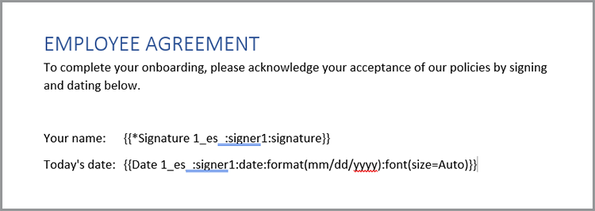

Ce document peut être enregistré en tant que PDF et joint à tous les documents à l’aide de la même méthode décrite ci-dessus. Ce processus crée un package cohérent qui contient une salutation personnalisée, une documentation d’entreprise standard et une page finale adaptée à la signature.

Le modèle peut être chargé dans le tableau de bord Acrobat Sign, puis utilisé pour de nouveaux accords. En utilisant l’API REST, ce document peut ensuite être envoyé à l’employé potentiel pour lui demander sa signature.

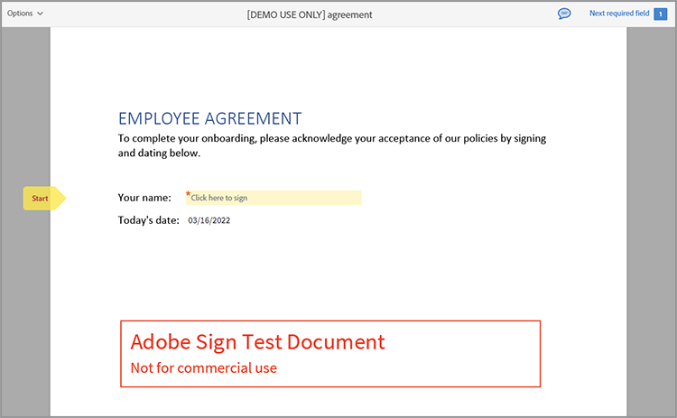

## Faites l’expérience

Tout ce qui est décrit dans cet article peut être testé dès maintenant. La [!DNL Adobe Acrobat Services] API [essai gratuit](https://documentcloud.adobe.com/dc-integration-creation-app-cdn/main.html) vous donne actuellement 1 000 demandes gratuites sur une période de six mois. Acrobat Sign [essai gratuit](https://www.adobe.com/sign.html#sign_free_trial) vous permet d’envoyer des accords avec filigrane à des fins de test.

Vous avez des questions ? La [forum de support](https://community.adobe.com/t5/document-services-apis/ct-p/ct-Document-Cloud-SDK) est surveillé quotidiennement par les développeurs d&#39;Adobes et les équipes de support. Enfin, pour trouver l&#39;inspiration, n&#39;oubliez pas d&#39;attraper le prochain [Clips papier](https://www.youtube.com/playlist?list=PLcVEYUqU7VRe4sT-Bf8flvRz1XXUyGmtF) épisode. Des réunions en direct sont régulièrement organisées avec des actualités, des démonstrations et des discussions avec les clients.
