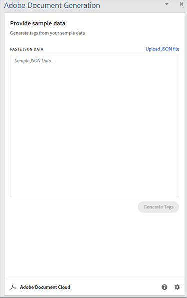
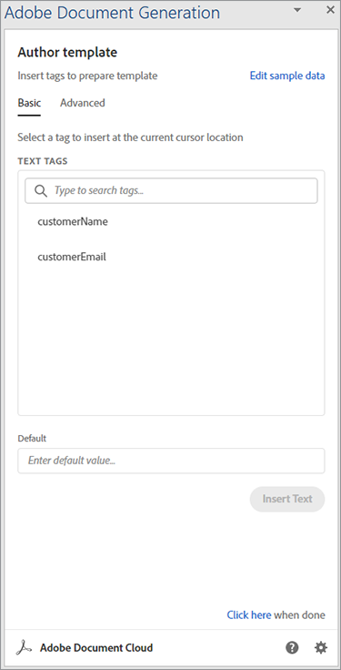
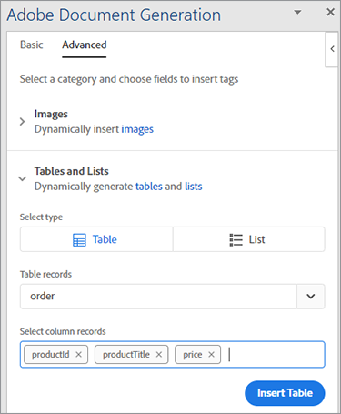
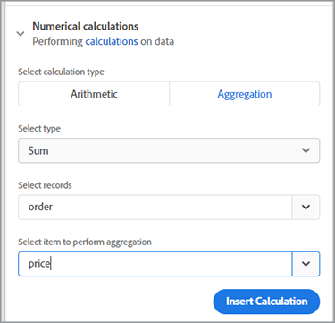
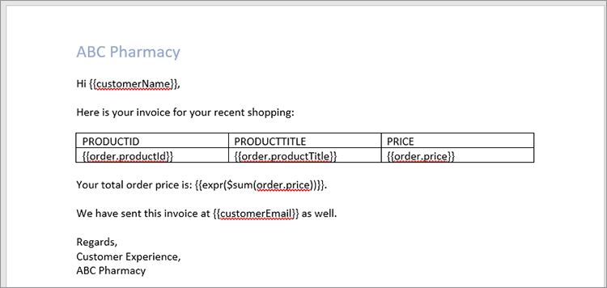
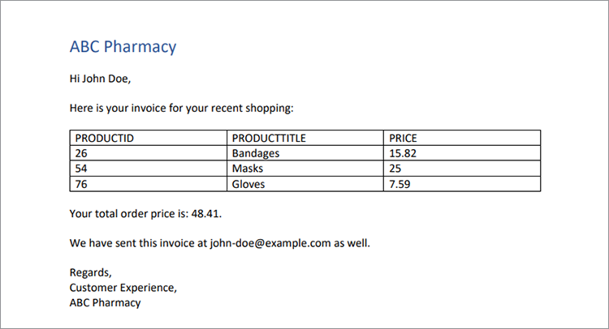

# Traitement des factures


C&#39;est génial quand l&#39;entreprise est en plein essor, mais la productivité en souffre quand vient le temps de préparer toutes ces factures. La génération manuelle de factures prend beaucoup de temps et vous risquez de commettre une erreur, de perdre de l’argent ou de mettre en colère un client dont le montant est incorrect.

Pensez à Danielle, par exemple, qui travaille dans le [service comptabilité](https://www.adobe.io/apis/documentcloud/dcsdk/invoices.html) [d&#39;une société de fournitures médicales](https://www.adobe.io/apis/documentcloud/dcsdk/invoices.html). C&#39;est la fin du mois, donc elle récupère les informations de plusieurs systèmes différents, vérifie son exactitude et formate les factures. Après tout ce travail, elle est enfin prête à convertir les documents en PDF (afin que tout le monde puisse les consulter sans acheter de logiciel spécifique) et envoyer à chaque client leur facture personnalisée.

Même lorsque la facturation mensuelle est terminée, Danielle ne peut pas échapper à ces factures. Certains clients ayant des cycles de facturation non mensuels, elle crée toujours une facture pour quelqu’un. Parfois, un client modifie sa facture et sous-paie. Danielle passe ensuite du temps à résoudre cette incompatibilité de facture. À ce rythme, elle doit embaucher un assistant pour suivre tout le travail !

Danielle a besoin d’un moyen de générer des factures rapidement et avec précision, à la fois par lots à la fin du mois et de manière ad hoc à d’autres moments. Dans l&#39;idéal, si elle pouvait protéger ces factures des modifications, elle n&#39;aurait pas à se soucier de dépanner les montants non correspondants.

## Ce que vous pouvez apprendre

Dans ce tutoriel pratique, découvrez comment utiliser l&#39;API Adobe Document Generation pour générer automatiquement des factures, protéger les mots de PDF par mot de passe et envoyer une facture à chaque client. Il suffit d’avoir une petite connaissance de Node.js, JavaScript, Express.js, HTML et CSS.

Le code complet de ce projet est [disponible sur GitHub](https://github.com/afzaal-ahmad-zeeshan/adobe-pdf-invoice-generation). Vous devez configurer le répertoire public avec votre modèle et les dossiers de données brutes. En production, vous devez récupérer les données à partir d’une API externe. Vous pouvez également explorer cette version archivée de l’application qui contient les ressources de modèle.

## API et ressources pertinentes

* [API PDF Services](https://opensource.adobe.com/pdftools-sdk-docs/release/latest/index.html)

* [API de génération de documents Adobe](https://www.adobe.io/apis/documentcloud/dcsdk/doc-generation.html)

* [API Adobe Sign](https://www.adobe.io/apis/documentcloud/sign.html)

* [Code du projet](https://github.com/afzaal-ahmad-zeeshan/adobe-pdf-invoice-generation)

## Préparation des données

Ce tutoriel ne s&#39;intéresse pas à la manière dont les données sont importées depuis vos entrepôts décisionnels. Vos commandes client peuvent figurer dans une base de données, une API externe ou un logiciel personnalisé. L’API Adobe Document Generation attend un document JSON contenant les données de facturation, telles que les informations de votre plateforme de gestion de la relation client (CRM) ou e-commerce. Ce tutoriel suppose que les données sont déjà au format JSON.

Pour plus de simplicité, utilisez la structure JSON suivante pour la facturation :

```
{ 
    "customerName": "John Doe", 
    "customerEmail": "john-doe@example.com", 
    "order": [ 
        { 
            "productId": 26, 
            "productTitle": "Bandages", 
            "price": 15.82 
        }, 
        { 
            "productId": 54, 
            "productTitle": "Masks", 
            "price": 25 
        }, 
        { 
            "productId": 76, 
            "productTitle": "Gloves", 
            "price": 7.59 
        } 
    ] 
} 
```

Le document JSON contient les détails du client ainsi que les informations de commande. Utilisez ce document structuré pour créer votre facture et afficher les éléments au format PDF.

## Création d’un modèle de facture

L’API Adobe Document Generation s’attend à ce qu’un modèle Microsoft Word et un document JSON créent un PDF dynamique ou un document Word. Créez un modèle Microsoft Word pour votre application de facturation et utilisez la boîte de dialogue [complément gratuit Balisage de génération de document](https://opensource.adobe.com/pdftools-sdk-docs/docgen/latest/wordaddin.html#add-in-demo) pour générer les balises de modèle. Installez le complément et ouvrez l’onglet dans Microsoft Word.



Une fois que vous avez collé le contenu JSON dans le complément, comme indiqué ci-dessus, cliquez sur Générer des balises. Ce module externe affiche le format de l’objet. Votre modèle de base peut utiliser le nom et l’adresse e-mail du client, mais n’affiche pas les informations de commande. Les informations de commande sont décrites plus loin dans ce tutoriel.



Commencez à écrire le modèle de facture dans votre document Microsoft Word. Laissez le curseur à l’endroit où vous devez insérer les données dynamiques, puis sélectionnez la balise dans la fenêtre du complément Adobe. Cliquez **Insérer du texte** afin que le complément Adobe de balise de génération de document puisse générer et insérer les balises. Pour la personnalisation, nous allons insérer le nom et l’adresse e-mail du client.

Passez maintenant aux données qui changent à chaque nouvelle facture. Sélectionnez le fichier **Avancé** de l’extension. Pour afficher les options disponibles pour générer un tableau dynamique basé sur les produits commandés par un client, cliquez sur **Tables et listes** .

Sélectionner **Commande** dans la première liste déroulante. Dans la deuxième liste déroulante, sélectionnez les colonnes de ce tableau. Dans ce tutoriel, sélectionnez les trois colonnes de l&#39;objet dont le rendu doit être effectué.



L&#39;API de génération de documents peut également effectuer des opérations complexes, telles que l&#39;agrégation d&#39;éléments dans un tableau. Dans le **Avancé** , sélectionnez **Calculs numériques**, et dans le **Agrégation** , sélectionnez le champ dans lequel vous souhaitez appliquer le calcul.



Cliquez sur le bouton **Insérer un calcul** pour insérer cette balise si nécessaire à l’intérieur du document. Le texte suivant s’affiche désormais dans votre fichier Microsoft Word :



Cet exemple de facture contient des informations sur les clients, les produits commandés et le montant total dû.

## Génération d’une facture avec l’API Adobe Document Generation

Utilisez le kit de développement logiciel (SDK) Adobe PDF Services Node.js pour combiner les documents Microsoft Word et JSON. Créez une application Node.js pour créer la facture à l’aide de l’API Document Generation.

L’API PDF Services inclut Document Generation Service, ce qui vous permet d’utiliser les mêmes informations d’identification pour les deux. Profitez d&#39;un [essai gratuit de six mois](https://www.adobe.io/apis/documentcloud/dcsdk/pdf-pricing.html), payez seulement 0,05 $ par transaction de document.

Voici le code pour fusionner le PDF :

```
async function compileDocFile(json, inputFile, outputPdf) { 
    try { 
        // configurations 
        const credentials =  adobe.Credentials 
            .serviceAccountCredentialsBuilder() 
            .fromFile("./src/pdftools-api-credentials.json") 
            .build(); 

        // Capture the credential from app and show create the context 
        const executionContext = adobe.ExecutionContext.create(credentials); 
  
        // create the operation 
        const documentMerge = adobe.DocumentMerge, 
            documentMergeOptions = documentMerge.options, 
            options = new documentMergeOptions.DocumentMergeOptions(json, documentMergeOptions.OutputFormat.PDF);

        const operation = documentMerge.Operation.createNew(options); 
  
        // Pass the content as input (stream) 
        const input = adobe.FileRef.createFromLocalFile(inputFile); 
        operation.setInput(input); 
  
        // Async create the PDF 
        let result = await operation.execute(executionContext); 
        await result.saveAsFile(outputPdf); 
    } catch (err) { 
        console.log('Exception encountered while executing operation', err); 
    } 
} 
```

Ce code prend des informations du document JSON d’entrée et du fichier modèle d’entrée. Il crée ensuite une opération de fusion de document pour regrouper les fichiers dans un rapport PDF unique. Enfin, il exécute l&#39;opération avec vos identifiants d&#39;API. Si vous ne les avez pas déjà, [créer des identifiants](https://opensource.adobe.com/pdftools-sdk-docs/release/latest/index.html#getting-credentials) (Les API de génération de documents et de services de PDF utilisent les mêmes informations d’identification).

Utilisez ce code dans le routeur Express pour gérer la demande de document :

```
// Create one report and send it back
try {
    console.log(\`[INFO] generating the report...\`);
    const fileContent = fs.readFileSync(\`./public/documents/raw/\${vendor}\`,
    'utf-8');
    const parsedObject = JSON.parse(fileContent);

    await pdf.compileDocFile(parsedObject,
    \`./public/documents/template/Adobe-Invoice-Sample.docx\`,
    \`./public/documents/processed/output.pdf\`);

    await pdf.applyPassword("p@55w0rd", './public/documents/processed/output.pdf',
    './public/documents/processed/output-secured.pdf');

    console.log(\`[INFO] sending the report...\`);
    res.status(200).render("preview", { page: 'invoice', filename: 'output.pdf' });
} catch(error) {
    console.log(\`[ERROR] \${JSON.stringify(error)}\`);
    res.status(500).render("crash", { error: error });
}
```

Une fois ce code exécuté, il fournit un document PDF contenant la facture générée dynamiquement en fonction des données fournies. Avec les exemples de données JSON (fournis ci-dessus), la sortie de ce code est :



Cette facture inclut vos données dynamiques du document JSON.

## Protection des factures par mot de passe

Étant donné que Danielle, la comptable, s’inquiète que les clients modifient la facture, appliquez un mot de passe pour restreindre la modification. [API PDF Services](https://opensource.adobe.com/pdftools-sdk-docs/release/latest/index.html) peut appliquer automatiquement un mot de passe aux documents. Ici, vous utilisez le kit SDK Adobe PDF Services pour protéger les documents par un mot de passe. Le code est le suivant :

```
async function applyPassword(password, inputFile, outputFile) {
    try {
        // Initial setup, create credentials instance.
        const credentials = adobe.Credentials
        .serviceAccountCredentialsBuilder()
        .fromFile("./src/pdftools-api-credentials.json")
        .build();

        // Create an ExecutionContext using credentials
        const executionContext = adobe.ExecutionContext.create(credentials);
        // Create new permissions instance and add the required permissions
        const protectPDF = adobe.ProtectPDF,
        protectPDFOptions = protectPDF.options;
        // Build ProtectPDF options by setting an Owner/Permissions Password, Permissions,
        // Encryption Algorithm (used for encrypting the PDF file) and specifying the type of content to encrypt.
        const options = new protectPDFOptions.PasswordProtectOptions.Builder()
        .setOwnerPassword(password)
        .setEncryptionAlgorithm(protectPDFOptions.EncryptionAlgorithm.AES_256)
        .build();

        // Create a new operation instance.
        const protectPDFOperation = protectPDF.Operation.createNew(options);

        // Set operation input from a source file.
        const input = adobe.FileRef.createFromLocalFile(inputFile);
        protectPDFOperation.setInput(input);

        // Execute the operation and Save the result to the specified location.
        let result = await protectPDFOperation.execute(executionContext);

        result.saveAsFile(outputFile);
    } catch (err) {
        console.log('Exception encountered while executing operation', err);
    }
}
```

Lorsque vous utilisez ce code, il protège votre document par un mot de passe et télécharge une nouvelle facture dans le système. Pour plus d’informations sur l’utilisation de ce code ou pour le tester, consultez la page [exemple de code](https://github.com/afzaal-ahmad-zeeshan/adobe-pdf-invoice-generation).

Une fois la facture terminée, vous pouvez l’envoyer automatiquement par e-mail au client. Il existe plusieurs façons d&#39;envoyer automatiquement des e-mails à vos clients. Le moyen le plus rapide est d’utiliser une API de messagerie tierce avec une bibliothèque d’assistance telle que [sendgrid-nodejs](https://github.com/sendgrid/sendgrid-nodejs). Si vous avez déjà accès à un serveur SMTP, vous pouvez également utiliser [nodemailer](https://www.npmjs.com/package/nodemailer) pour envoyer des e-mails via SMTP.

## Marche à suivre

Dans ce tutoriel pratique, vous avez créé une application simple pour aider Danielle à gérer sa comptabilité avec [facturation](https://www.adobe.io/apis/documentcloud/dcsdk/invoices.html). Grâce à l’API PDF Services et au kit SDK Document Generation, vous avez renseigné un modèle Microsoft Word avec les informations de commande client d’un document JSON et créé ainsi une facture PDF. Ensuite, protégez chaque document par mot de passe à l&#39;aide des services de protection par mot de passe en [API PDF Services](https://opensource.adobe.com/pdftools-sdk-docs/release/latest/index.html).

Étant donné que Danielle peut générer automatiquement des factures et n&#39;a pas à se soucier que les clients modifient leurs factures, elle n&#39;aura pas besoin d&#39;embaucher un assistant pour l&#39;aider dans tout le travail manuel. Elle peut utiliser son temps supplémentaire pour trouver des économies dans les dossiers des comptes fournisseurs.

Maintenant que vous avez vu à quel point c&#39;est facile, vous pouvez développer cette application simple en utilisant d&#39;autres outils d&#39;Adobe pour incorporer des factures sur votre site Web. Par exemple, afin que les clients puissent consulter leurs factures ou leur solde à tout moment. [API Adobe PDF Embed](https://www.adobe.io/apis/documentcloud/dcsdk/pdf-embed.html) est libre d&#39;utilisation. Vous pouvez même passer au service des ressources humaines ou des ventes, en automatisant leurs contrats et en collectant des signatures électroniques.

Pour explorer toutes les possibilités et commencer à créer votre propre application pratique, créez un [[!DNL Adobe Acrobat Services]](https://www.adobe.io/apis/documentcloud/dcsdk/gettingstarted.html) pour commencer dès aujourd’hui. Profitez d&#39;une version d&#39;essai gratuite de six mois [pay-as-you-go](https://www.adobe.io/apis/documentcloud/dcsdk/pdf-pricing.html)
à seulement 0,05 $ par transaction documentaire à mesure que votre entreprise évolue.
