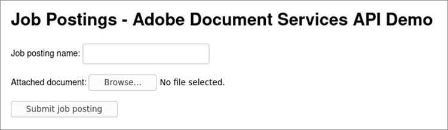
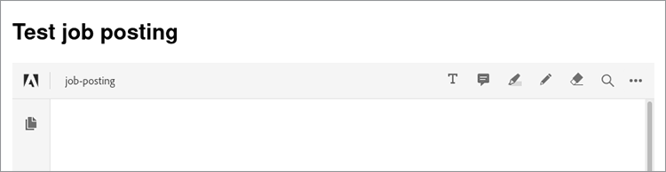

# Offre d&#39;emploi


Lorsque vous utilisez un site web à plusieurs utilisateurs, il est essentiel de concevoir une expérience qui garantisse une expérience fluide à chacun.

Imaginez le scénario suivant : vous avez un site Web qui permet aux employeurs de [charger des offres](https://www.adobe.io/apis/documentcloud/dcsdk/job-posting.html). Pour les chercheurs d&#39;emploi, il est pratique de consulter facilement tous les documents relatifs à une publication dans un format cohérent. Toutefois, il est pratique pour les employeurs de joindre des renseignements dans n&#39;importe quel format de fichier. Pour faciliter la tâche des deux types d&#39;utilisateurs, vous pouvez convertir automatiquement tous les documents téléchargés en PDF et les intégrer directement dans la publication.

## Ce que vous pouvez apprendre

Ce tutoriel pratique passe en revue un exemple Node.js qui utilise [!DNL Adobe Acrobat Services] et son [Node.js SDK](https://www.npmjs.com/package/@adobe/documentservices-pdftools-node-sdk) pour ajouter ces fonctionnalités à un site de publication d&#39;offres d&#39;emploi. Cela crée un site Web plus facile à utiliser et plus attrayant pour les employeurs et les demandeurs d&#39;emploi. Voici le fichier [terminer](https://github.com/contentlab-io/adobe_job_posting) [code de projet](https://github.com/contentlab-io/adobe_job_posting), au cas où vous voudriez suivre ce que vous lisez.

Pour commencer, configurez une application web Node.js simple basée sur Express. [Express](https://expressjs.com/) est un cadre d&#39;application web minimaliste offrant des fonctionnalités telles que le routage et la création de modèles. Le code de l’application est disponible sur [GitHub](https://github.com/contentlab-io/adobe_job_posting). Installez également le fichier [Base de données PostgreSQL](https://www.postgresql.org/) et configurez-le pour stocker le PDF.

## Pertinent [!DNL Acrobat Services] API

* [API PDF Embed](https://www.adobe.com/devnet-docs/dcsdk_io/viewSDK/index.html)

* [API PDF Services](https://opensource.adobe.com/pdftools-sdk-docs/release/latest/index.html)

## Création des identifiants d’API Adobe

D&#39;abord, vous devez [créer des identifiants](https://www.adobe.com/go/dcsdks_credentials) pour l’API Adobe PDF Embed (gratuite) et l’API Adobe PDF Services (gratuite pendant six mois) [pay-as-you-go](https://www.adobe.io/apis/documentcloud/dcsdk/pdf-pricing.html) pour seulement \$0.05 par transaction de document). Lors de la création d’informations d’identification pour l’API PDF Services, sélectionnez l’option &quot;Créer un exemple de code personnalisé&quot;. Enregistrez le fichier ZIP et extrayez pdftools-api-credentials.json et private.key dans le répertoire racine de votre projet Node.js Express.

Vous avez également besoin d’une clé API pour l’API Incorporer disponible gratuitement. De [Projets](https://console.adobe.io/projects), accédez au projet que vous avez créé. Cliquez ensuite sur **Ajouter au projet** et sélectionnez **API**. Enfin, cliquez sur **API PDF Embed**.

Spécifiez le domaine pour l’API PDF Embed. La clé API doit être publique (elle se trouve dans le code exécuté par le navigateur). En spécifiant un domaine, vous vous assurez que quelqu’un d’autre dans un autre domaine ne peut pas utiliser la clé API.

Vous ne pouvez pas utiliser &quot;localhost&quot; comme domaine. Spécifiez un domaine, tel que &quot;testing.local&quot;, et modifiez le fichier d&#39;hôtes sur votre ordinateur pour rediriger ce domaine vers 127.0.0.1, qui est votre ordinateur. Ensuite, au lieu de tester votre application sur localhost:3000, vous pouvez la tester sur testing.local:3000. Une fois terminé, recherchez la clé API pour l’API PDF Embed sur la page du projet.

## Ajout d’un formulaire et d’un gestionnaire de téléchargement

Avec une application Express opérationnelle et des identifiants d’API, vous avez également besoin d’un formulaire permettant aux utilisateurs de télécharger leurs documents sur le site web. Modifiez le modèle index.jade à cette fin.

Créez un champ de saisie pour le nom de la publication d&#39;emploi téléchargée et pour un document contenant plus d&#39;informations.

Dans le bloc de contenu du modèle, ajoutez le formulaire suivant :

```
extends layout

block content
  h1= title

  form(action="/upload", enctype="multipart/form-data", method="POST")
    label Job posting name:&nbsp;
    input(type="text", name="name", required="required")
    br
    br
    label Describing document:&nbsp;
    input(type="file", name="attachment", required="required")
    br
    br
    input(type="submit", value="Submit job posting")
```

Ensuite, ajoutez un gestionnaire pour la demande de POST à l’action /upload. Ensuite, ajoutez un itinéraire pour /upload au fichier routes/index.js. Vous pouvez créer un fichier pour cet itinéraire, mais vous devrez mettre à jour le fichier app.js pour refléter le nouveau fichier. Dans ce gestionnaire d&#39;itinéraire, vous pouvez accéder au nom donné et au fichier téléchargé.

```
router.post('/upload', async function (req, res, next) {
    const name = req.body.name;
    const fileContents = req.files.attachment.data;

    // code to work with the uploaded document
  });
```

La fonction est asynchrone, vous pouvez donc utiliser le mot clé await dans la fonction, ce qui est pratique lorsque vous appelez les méthodes qui effectuent des appels API.



## Utilisation de l’API PDF Services

Avant d&#39;utiliser l&#39;API PDF Services, vous devez ajouter les importations suivantes en haut du fichier d&#39;itinéraires :

```
const PDFToolsSdk = require('@adobe/documentservices-pdftools-node-sdk');
  const { Readable } = require('stream');
```

Directement sous les importations, vous pouvez charger des identifiants d’API et créer un fichier [contenu exécution](https://www.javascripttutorial.net/javascript-execution-context/). Comme vous pouvez réutiliser un contexte d&#39;exécution pour différentes opérations, il est logique de le faire une seule fois.

```
  const credentials = PDFToolsSdk.Credentials
  .serviceAccountCredentialsBuilder()
  .fromFile("pdftools-api-credentials.json")
  .build();

  const executionContext = PDFToolsSdk.ExecutionContext.create(credentials);
```

Revenez maintenant à l’écriture de code dans le gestionnaire de requêtes au niveau du commentaire dans le `router.post` s&#39;affiche. Commencez par convertir le document en PDF.

```
  const createPdfOperation = PDFToolsSdk.CreatePDF.Operation.createNew();

  const input = PDFToolsSdk.FileRef.createFromStream(Readable.from(fileContents),
  req.files.attachment.mimetype);

  createPdfOperation.setInput(input);

  let result = await createPdfOperation.execute(executionContext);

  result.saveAsFile('output-pdf' + new Date().getTime() + '.pdf');
  return res.send('success!');
```

La plupart des opérations suivent les mêmes quatre étapes. Commencez par initialiser le type d&#39;opération, en utilisant la méthode createNew de la classe appropriée. Ensuite, créez l&#39;entrée pour l&#39;opération, qui est FileRef. Les opérations suivantes peuvent ignorer cette étape, car le résultat d&#39;une opération est également un FileRef. Pour cette opération initiale, créez un FileRef à partir des octets du fichier téléchargé. Troisièmement, vous devez affecter l&#39;entrée à l&#39;opération. Enfin, l&#39;opération s&#39;exécute avec le contexte d&#39;exécution comme paramètre dans la méthode d&#39;exécution. Cette méthode renvoie une promesse afin que vous puissiez attendre le résultat.

Le code enregistre le PDF retourné dans un fichier et envoie une simple réponse &quot;success&quot; au navigateur. La partie &quot;Date&quot; du nom de fichier garantit un nom de fichier unique. SaveAsFile renvoie une erreur si le fichier de destination existe.

## Conversion d’images en texte et compression du PDF

Vous pouvez maintenant utiliser la reconnaissance optique de caractères (ROC) pour convertir des images en texte, puis compresser le résultat. Pour ce faire, utilisez les opérations OCR et CompressPDF similaires à l’opération CreatePDF . Ajoutez les éléments suivants au fichier d’itinéraires, dans `router.post`:

```
  const name = req.body.name;
  const fileContents = req.files.attachment.data;

  const createPdfOperation = PDFToolsSdk.CreatePDF.Operation.createNew();
  const input = PDFToolsSdk.FileRef.createFromStream(Readable.from(fileContents),
  req.files.attachment.mimetype);
  createPdfOperation.setInput(input);

  let result = await createPdfOperation.execute(executionContext);

  const ocrOperation = PDFToolsSdk.OCR.Operation.createNew();
  ocrOperation.setInput(result);
  result = await ocrOperation.execute(executionContext);

  const compressPdfOperation = PDFToolsSdk.CompressPDF.Operation.createNew();
  compressPdfOperation.setInput(result);
  result = await compressPdfOperation.execute(executionContext);

  result.saveAsFile('output-pdf' + new Date().getTime() + '.pdf');
  return res.send('success!');
```

Cette opération n&#39;est nécessaire qu&#39;une seule fois, car le résultat est un FileRef, que le code peut transmettre à setInput.

Il existe une meilleure alternative que d’enregistrer le fichier sur un disque dur et de renvoyer une réponse HTTP trop simplifiée. Stockez plutôt le PDF dans une base de données et affichez une page Web qui intègre le PDF à l’aide de l’API d’intégration de PDF gratuite d’Adobe. De cette façon, l&#39;offre d&#39;emploi ou la brochure de l&#39;employeur est visible sur le site Web pour les demandeurs d&#39;emploi à trouver et à consulter, avec les logos de l&#39;entreprise et d&#39;autres éléments de conception.

## Stockage du PDF dans une base de données

Stockez les PDF dans une base de données PostgreSQL. Obtenez le package node-postgres pour vous connecter à Postgres dans Node.js. Installez le package stream-buffers car, à un moment donné, vous devez stocker le contenu du PDF dans un tampon et FileRef fonctionne uniquement avec les flux. Donc, utilisez le paquet stream-buffers pour écrire le contenu dans un buffer.

```
npm install pg stream-buffers
```

Créez maintenant une table de base de données pour les offres d&#39;emploi. Il a besoin d&#39;une colonne pour un identificateur unique, d&#39;une colonne pour un nom et d&#39;une colonne pour le mot de PDF joint. Vous pouvez créer une table de base de données à partir de l&#39;interface de ligne de commande (CLI) Postgres :

```
CREATE TABLE job_postings (id TEXT PRIMARY KEY, name TEXT NOT NULL, attachment
BYTEA NOT NULL);
```

Revenez aux fichiers Node.js. Ajoutez des importations dans la partie supérieure du fichier :

```
  const { Client } = require('pg');
  const streamBuffers = require('stream-buffers');
```

Pour stocker le PDF dans la table de base de données, modifiez la fonction de téléchargement. Remplacez les deux dernières lignes (saveAsFile et send) par ce fragment de code :

```
  const pgClient = new Client();
  pgClient.connect();

  const id = Math.random().toString(36).substr(2, 6); // not securely random at all,
  but serves the purpose for this demo

  const writableStream = new streamBuffers.WritableStreamBuffer();
  writableStream.on("finish", async () => {    
    await pgClient.query("INSERT INTO job_postings VALUES ($1, $2, $3)", [
      id,
      name,
      writableStream.getContents()
    ]);
    res.redirect(`/job/${id}`);
  })
  result.writeToStream(writableStream);
```

Pour écrire le contenu, créez un WritableStreamBuffer. Avec l&#39;événement finish, il est temps d&#39;exécuter la requête SQL. Le paquet node-postgres convertit automatiquement le paramètre Buffer au format BYTEA. La requête redirige l&#39;utilisateur vers /job/{id}, un point de terminaison créé ultérieurement.

Pour l’API PDF Embed, vous avez également besoin d’un point de terminaison qui renvoie uniquement le contenu du PDF :

```
  router.get('/pdf/:id', async function (req, res, next) {
    const id = req.params.id;
 
    const pgClient = new Client();
    pgClient.connect();

  const pgResult = await pgClient.query("SELECT attachment FROM job_postings WHERE id
  = $1", [id]);
  const buffer = pgResult.rows[0].attachment;
  res.type('pdf');
    return res.send(buffer);
  });
```

## Intégration du PDF

Maintenant, créez le fichier /job/{id} point de terminaison, qui affiche un modèle contenant le nom de la publication de tâche demandée et un mot de PDF incorporé.

```
router.get('/job/:id', async function(req, res, next) {
    const id = req.params.id;

    const pgClient = new Client();
    pgClient.connect();

    const pgResult = await pgClient.query("SELECT name FROM job_postings WHERE id =
  $1", [id]);
    const name = pgResult.rows[0].name;

    res.render('job', { pdf_url: `/pdf/${id}`, name });
  });
```

Dans le répertoire views/, créez un fichier job.jade avec ce contenu :

```
  extends layout

  block content
    h1= name
    div(id='adobe-dc-view')
    script(src='https://documentcloud.adobe.com/view-sdk/main.js')
    script.
      window.embedUrl = "!{pdf_url}";
    script(src='/javascripts/embed-pdf.js')
```

Le premier script est le SDK View d’Adobe, qui facilite l’intégration du PDF. Le deuxième script est un serveur de ligne unique qui définit la valeur de window.embedUrl sur l&#39;URL du PDF fourni par le gestionnaire d&#39;itinéraire Express. Créez vous-même le troisième script comme suit :

```
  document.addEventListener("adobe_dc_view_sdk.ready", function () {
    var adobeDCView = new AdobeDC.View({ clientId: "YOUR API KEY HERE", divId:
   "adobe-dc-view" });
    adobeDCView.previewFile({
      content: { location: { url: '//' + window.location.host + window.embedUrl }
         },
      metaData: { fileName: "Job posting" }
    });
  });
```

Vous pouvez désormais tester l’ensemble du processus de téléchargement d’un document, de redirection vers la page /job/id et d’affichage du PDF incorporé. Vos utilisateurs suivent les mêmes étapes pour ajouter une offre d’emploi ou tout autre document à votre site web.



Pour voir une intégration en ligne en action, consultez cette page [démonstration en direct](https://documentcloud.adobe.com/view-sdk-demo/index.html#/view/IN_LINE/Bodea%20Brochure.pdf).

## Marche à suivre

Ce tutoriel pratique explique comment utiliser Node.js avec [!DNL Acrobat Services] pour convertir un fichier [publication de travaux](https://www.adobe.io/apis/documentcloud/dcsdk/job-posting.html) dans différents formats vers un PDF. Le PDF obtenu a ensuite été incorporé dans une page Web. Désormais, vous pouvez ajouter la même fonction à votre site web, ce qui permet aux employeurs de télécharger plus facilement des descriptions d’emploi, des brochures et plus encore pour les chercheurs d’emploi. Ces capacités permettent à chacun d&#39;obtenir les informations nécessaires pour trouver le travail de ses rêves.

[!DNL Acrobat Services] vous aident à ajouter des fonctions clés de gestion de documents à votre site web ou votre application. Si vous souhaitez approfondir les fonctionnalités de ces API, reportez-vous à la documentation de démarrage rapide suivante :

* [API PDF Embed](https://www.adobe.com/devnet-docs/dcsdk_io/viewSDK/index.html)

* [API PDF Services](https://opensource.adobe.com/pdftools-sdk-docs/release/latest/index.html)

Pour commencer à ajouter des fonctions conviviales de gestion de documents à votre site Web, [inscrivez-vous à l’essai gratuit](https://www.adobe.io/apis/documentcloud/dcsdk/gettingstarted.html). L’API Adobe PDF Embed est toujours gratuite et l’API Adobe PDF Services est gratuite pendant six mois. Dans ce cas, vous ne pouvez utiliser que l’API \$0.05 par transaction de document [pay-as-you-go](https://www.adobe.io/apis/documentcloud/dcsdk/pdf-pricing.html) à mesure que votre entreprise se développe.
