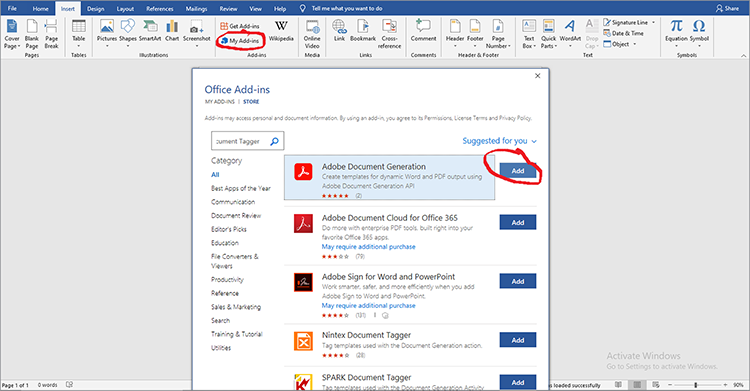
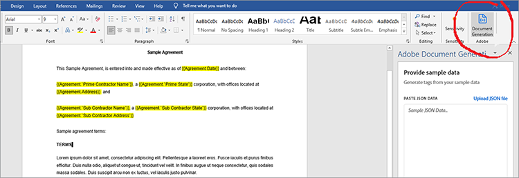
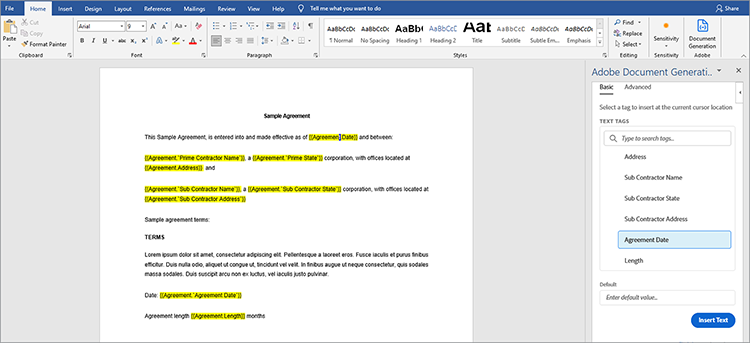
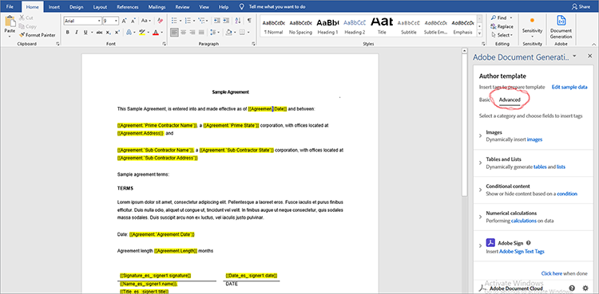
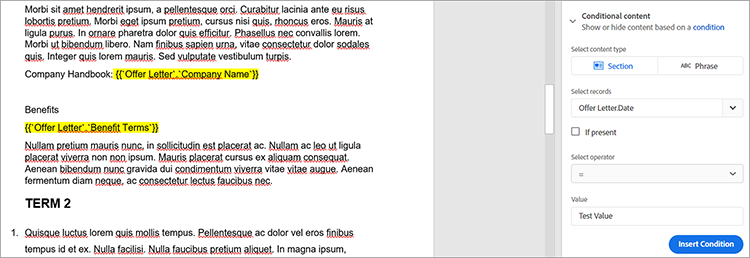
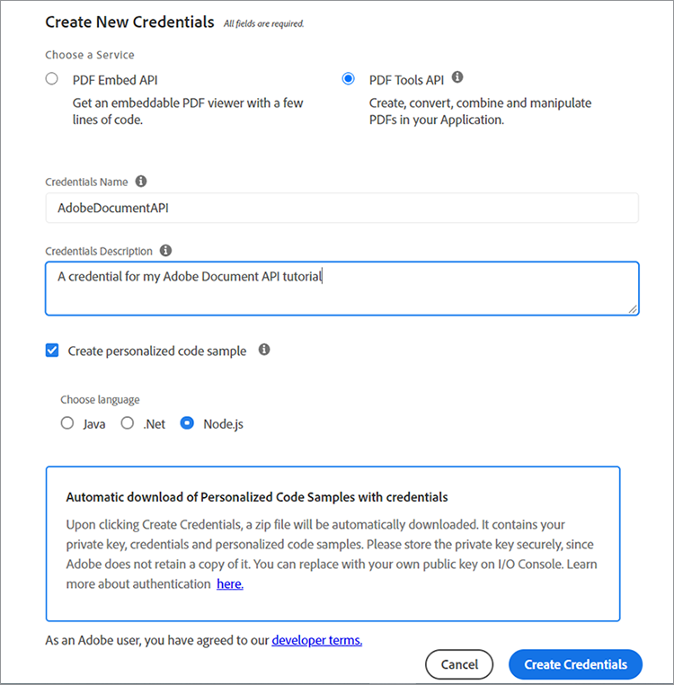
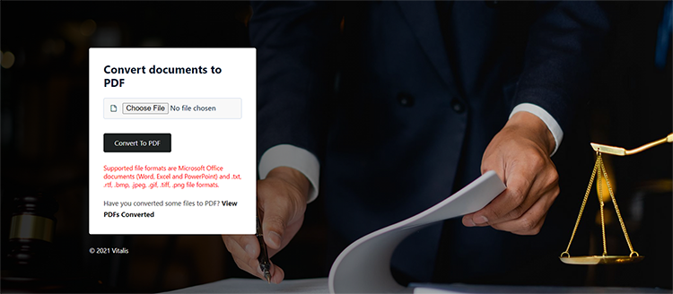
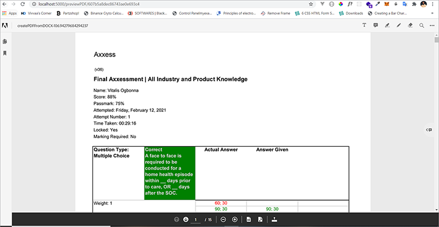

# Gestion des contrats juridiques


La digitalisation s&#39;accompagne de défis. Aujourd’hui, la plupart des entreprises proposent différents types de [contrats juridiques](https://www.adobe.io/apis/documentcloud/dcsdk/legal-contracts.html) qu’ils doivent créer, modifier, approuver et faire signer par différentes parties. Ces contrats juridiques nécessitent souvent une personnalisation et un branding uniques. Les entreprises peuvent également avoir besoin de les enregistrer dans un format protégé une fois signé pour les garder en sécurité. Pour ce faire, ils ont besoin d&#39;une solution robuste de génération et de gestion de documents.

De nombreuses solutions offrent une certaine possibilité de génération de documents, mais ne permettent pas de personnaliser les entrées de données ni la logique conditionnelle, comme les clauses qui s’appliquent uniquement à des scénarios spécifiques. La mise à jour manuelle des modèles juridiques d’une entreprise est difficile et source d’erreurs, car ces documents se développent de plus en plus. La nécessité d&#39;automatiser ces processus est considérable.

## Ce que vous pouvez apprendre

Dans ce tutoriel pratique, découvrez les fonctionnalités de [[!DNL Adobe Acrobat Services] API](https://www.adobe.io/apis/documentcloud/dcsdk/doc-generation.html) dans la génération de champs de saisie personnalisés dans les documents. Découvrez également comment convertir facilement ces documents générés dans un format de document portable (PDF) afin d’éviter toute manipulation de données.

Ce tutoriel implique un peu de programmation lors de l’exploration de la conversion de contrats en PDF. Pour suivre efficacement, [Microsoft Word](https://www.microsoft.com/en-us/download/office.aspx) et [Node.js](https://nodejs.org/) doit être installé sur votre PC. Une compréhension de base de Node.js et [Syntaxe ES6](https://www.w3schools.com/js/js_es6.asp) est également recommandé.

## API et ressources pertinentes

* [API de génération de documents Adobe](https://www.adobe.io/apis/documentcloud/dcsdk/doc-generation.html)

* [API PDF Embed](https://www.adobe.com/devnet-docs/dcsdk_io/viewSDK/index.html)

* [API Adobe Sign](https://www.adobe.io/apis/documentcloud/sign.html)

* [Code du projet](https://github.com/agavitalis/adobe_legal_contracts.git)

## Création d’un modèle de document

Vous pouvez créer des documents juridiques à l’aide de l’application Microsoft Word ou en téléchargeant le fichier Adobe [exemples de modèles Word](https://www.adobe.io/apis/documentcloud/dcsdk/doc-generation.html#sample-blade). Il n’en reste pas moins difficile de personnaliser les entrées et de signer numériquement ces documents sans utiliser d’outils d’aide tels que [Complément Baliseur de génération de document Adobe](https://www.adobe.io/apis/documentcloud/dcsdk/docs.html?view=docgen-addin) pour Microsoft Word.

L’outil Baliseur de génération de document est un complément Microsoft Word conçu pour faciliter la personnalisation de documents à l’aide de balises. Cela permet de créer des champs dynamiques dans des modèles de document qui remplissent de manière dynamique à l’aide de données JSON.



Pour illustrer l’utilisation de Document Generation Tagger, installez ce complément, puis créez un modèle de données JSON, qui est utilisé dans le balisage d’un simple document contractuel juridique.

Installez le marqueur de génération de document dans Word en cliquant sur l’icône **Insérer** , puis dans le groupe Compléments, cliquez sur **Mes compléments**. Dans le menu Compléments Office, recherchez &quot;Génération de document Adobe&quot;, puis cliquez sur **Ajouter** et suivez le processus. Vous pouvez voir ces étapes dans la capture d’écran ci-dessus.

Après avoir installé le complément Baliseur de génération de document pour Word, créez un modèle de données JSON simple pour baliser le document juridique.

Pour continuer, ouvrez l’éditeur de votre choix, créez un fichier nommé Agreement.json, puis collez le fragment de code ci-dessous dans le fichier JSON que vous avez créé.

```
{
"Agreement": {
"Date": "1/24/2021",
"Prime Contractor Name": "Ogbonna Vitalis Corp",
"Prime State": "Lagos",
"Address": "Maryland Ave, Lagos State, Ng",
"Sub Contractor Name": "Vivvaa Soln",
"Sub Contractor State": "California",
"Sub Contractor Address": "Molusi Avenue, Dallas Texas, CA",
"Agreement Date": "1/24/2021",
"Length": 5
}
}
```

Après avoir enregistré ce document JSON, importez-le dans le complément Baliseur de génération de document. Importez le document en cliquant sur **Génération de documents** dans le groupe Adobe en haut à droite de votre écran Word, comme indiqué dans la capture d’écran ci-dessous.



Une vidéo s’affiche pour vous guider. Vous pouvez le visionner ou accéder directement au champ de balisage en cliquant sur **Prise en main**. Après avoir cliqué **Prise en main**, un formulaire de téléchargement s’affiche. Cliquez **Charger un fichier JSON** et sélectionnez le fichier JSON que vous venez de créer. Une fois l’importation terminée, cliquez sur **Générer une balise** pour générer les balises.

Après avoir importé et généré des balises, vous pouvez les ajouter à votre document. Pour les ajouter, placez votre curseur à l’endroit exact où vous souhaitez que la balise apparaisse. Sélectionnez ensuite une balise dans l’API de génération de document et cliquez sur **Insérer du texte**. La capture d’écran ci-dessous décrit cette procédure.



Outre les balises de base créées à l’aide du modèle de données JSON importé, vous pouvez également utiliser des fonctionnalités avancées pour plus d’options telles que les images, la logique conditionnelle, les calculs, les éléments répétés et les expressions conditionnelles. Vous pouvez accéder à ces fonctionnalités en cliquant sur **Avancé** dans le panneau Balisage de génération de document. Vous pouvez le voir dans la capture d’écran ci-dessous.



Ces fonctions avancées ne sont pas différentes des balises de base. Pour inclure une logique conditionnelle, sélectionnez la partie du document à remplir. Configurez ensuite la règle qui détermine l’insertion de la balise.

Pour illustrer davantage, par exemple dans l’accord, vous souhaitez inclure une section uniquement sous condition. Dans le champ Sélectionner le type de contenu , sélectionnez **Section.** Dans le champ Sélectionner des enregistrements, sélectionnez l&#39;option qui détermine si la section conditionnelle s&#39;affiche. Sélectionnez l’opérateur conditionnel souhaité et définissez la valeur pour laquelle vous effectuez le test dans le champ Valeur. Cliquez ensuite sur **Insérer une condition.** La capture d’écran ci-dessous illustre ce processus.



Pour les calculs, sélectionnez Arithmétique ou Agrégation, puis incluez le premier enregistrement, l&#39;opérateur et le second enregistrement à utiliser en fonction des balises de modèle disponibles. Cliquez ensuite sur **Insérer un calcul**.

En outre, les contrats juridiques nécessitent souvent la signature des parties concernées. Vous pouvez insérer une signature électronique à l’aide des balises de texte Adobe Sign situées juste en dessous de la section &quot;Calculs numériques&quot;. Pour inclure la signature électronique, vous devez spécifier le nombre de destinataires et sélectionner **Signataire** et le type de champ dans les listes déroulantes, en conséquence. Une fois terminé, cliquez sur **Insérer une balise de texte Adobe Sign** pour finaliser le processus.

Pour garantir l&#39;intégrité des données, enregistrez les documents juridiques dans un format protégé. Avec [!DNL Acrobat Services] API, vous pouvez rapidement transformer des documents en format PDF. Vous pouvez créer une application Node.js express simple, y intégrer l’API Document Generation et utiliser cette application simple pour convertir votre document balisé Word au format PDF.

## Configuration du projet

Tout d’abord, vous configurez la structure de dossiers pour l’application Node.js. Dans cet exemple, appelez cette application simple AdobeLegalContractAPI. Vous pouvez récupérer le code source [ici](https://github.com/agavitalis/adobe_legal_contracts.git).

### Structure de répertoire

Créez un dossier appelé AdobeLegalContractAPI et ouvrez-le dans l’éditeur de votre choix. Créez une application Node.js de base avec le ```npm init``` en utilisant la structure de dossiers ci-dessous :

```
###Directory Structure
AdobeLegalContractAPI
-----config
----------default.json
-----controllers
----------createPDFController.js
----------previewController.js
-----models
----------document.js
-----routes
----------web.js
-----services
-----------upload.js
-----uploads
-----views
-----index.js
```

Vous trouverez ci-dessus une structure d’application Node.js simple pour votre application. Procédez maintenant à l&#39;installation des paquets npm nécessaires.

### Installation du package

Installez les packages requis à l’aide de la commande npm install comme indiqué dans l’extrait de code ci-dessous :

```
npm install express body-parser morgan multer hbs path config mongoose
```

Après avoir installé les packages, assurez-vous que le contenu de votre fichier package.json est similaire au fragment de code ci-dessous :

```
###package.json
{
"name": "adobelegalcontractapi",
"version": "1.0.0",
"description": "",
"main": "index.js",
"directories": {
"test": "test"
},
"dependencies": {
"body-parser": "^1.19.0",
"config": "^3.3.6",
"express": "^4.17.1",
"hbs": "^4.1.1",
"mongoose": "^5.12.1",
"morgan": "^1.10.0",
"multer": "^1.4.2",
"path": "^0.12.7"
},
"devDependencies": {},
"scripts": {
"start": "node index.js"
},
"repository": {
"type": "git",
"url": "https://github.com/agavitalis/adobe_legal_contracts.git"
},
"author": "Ogbonna Vitalis",
"license": "ISC",
"bugs": {
"url": "https://github.com/agavitalis/adobe_legal_contracts/issues"
},
"homepage": "https://github.com/agavitalis/adobe_legal_contracts#readme"
}
```

Dans ces fragments de code, vous avez installé les dépendances de l&#39;application, y compris le moteur de modèles de guidons pour la vue.

Ce tutoriel se concentre principalement sur l’utilisation de [[!DNL Acrobat Services] API](https://www.adobe.io/apis/documentcloud/dcsdk/) pour convertir des documents en PDF. Par conséquent, il n&#39;existe pas de processus détaillé pour créer cette application Node.js. Cependant, vous pouvez récupérer l&#39;intégralité du code de l&#39;application Node.js de travail sur [GitHub](https://github.com/agavitalis/adobe_legal_contracts.git).

## Intégration [!DNL Adobe Acrobat Services] API dans une application Node.js

[!DNL Adobe Acrobat Services] Les API sont des services fiables dans le cloud conçus pour la manipulation transparente de documents. Il propose trois API :

* API Adobe PDF Services

* API Adobe PDF Embed

* API de génération de documents Adobe

Vous avez besoin d’identifiants pour utiliser [!DNL Acrobat Services] API (différentes de vos identifiants d’API PDF Embed). Si vous ne disposez pas d’informations d’identification valides, [registre](https://www.adobe.com/go/dcsdks_credentials?ref=getStartedWithServicesSDK) et terminez le workflow comme illustré dans la capture d’écran ci-dessous. Profitez d&#39;un [essai gratuit de six mois puis paiement à l&#39;utilisation](https://www.adobe.io/apis/documentcloud/dcsdk/pdf-pricing.html), seulement 0,05 $ par transaction de document.



Une fois le processus d&#39;inscription terminé, un exemple de code se télécharge automatiquement sur votre PC pour vous aider à démarrer. Vous pouvez extraire cet exemple de code et suivre le tutoriel. N’oubliez pas de copier les fichiers pdftools-api-credentials.json et private.key de l’exemple de code extrait dans le répertoire racine du projet Node.js. Les informations d’identification sont requises pour que vous puissiez accéder à [!DNL Acrobat Services] Points de terminaison API. Vous pouvez également télécharger des exemples de SDK avec vos informations d’identification personnalisées afin de ne pas avoir à mettre à jour la clé dans l’exemple de code.

Installez maintenant le SDK du noeud Adobe PDF Services en exécutant le ```npm install \--save @adobe/documentservices-pdftools-node-sdk``` en utilisant le terminal dans le répertoire racine de votre application. Une fois l’installation terminée, vous pouvez utiliser [!DNL Acrobat Services] API pour manipuler des documents dans votre application.

## Création d’un document PDF

[!DNL Acrobat Services] Les API prennent en charge la création de PDF à partir de documents Microsoft Office (Word, Excel et PowerPoint) et d’autres [formats de fichier pris en charge](https://opensource.adobe.com/pdftools-sdk-docs/release/latest/howtos.html#create-a-pdf) comme .txt, .rtf, .bmp, .jpeg, .gif, .tiff et .png. Vous pouvez facilement convertir les contrats juridiques de tout autre format de fichier en PDF à l’aide des API de service Acrobat.

L’API Adobe Document Generation permet la conversion en fichier ou PDF Word. Par exemple, vous pouvez utiliser un modèle Word pour générer un contrat, y compris la réduction pour marquer le texte modifié. Ensuite, convertissez-le en mot de PDF et utilisez l’API PDF Services pour protéger le document par mot de passe, l’envoyer pour signature, etc.

Pour implémenter la création de documents PDF à partir des formats de fichiers pris en charge disponibles, il existe un formulaire permettant de télécharger un document pour transformation à l’aide de [!DNL Acrobat Services].

Le formulaire de téléchargement conçu s’affiche dans la capture d’écran ci-dessous et vous pouvez accéder aux fichiers HTML et CSS sur [GitHub](https://github.com/agavitalis/adobe_legal_contracts.git).



Maintenant, ajoutez les fragments de code suivants au fichier /createPDFController.js des contrôleurs. Ce code récupère le document chargé et le transforme en PDF. [!DNL Acrobat Services] enregistre le fichier téléchargé d’origine et le fichier transformé dans différents dossiers.

```
###controllers/createPDFController.js
const PDFToolsSdk = require('@adobe/documentservices-pdftools-node-sdk');
const Document = require('../models/document');
/*
* GET / route to show the createPDF form.
*/
function createPDF(req, res) {
//catch any response on the url
let response = req.query.response
res.render('index', { response })
}
/*
* POST /createPDF to create a new PDF File.
*/
function createPDFPost(req, res) {
let filePath = req.file.path;
let fileName = req.file.filename;
try {
// Initial setup, create credentials instance.
const credentials = PDFToolsSdk.Credentials
.serviceAccountCredentialsBuilder()
.fromFile("pdftools-api-credentials.json")
.build();
// Create an ExecutionContext using credentials and create a new operation instance.
const executionContext = PDFToolsSdk.ExecutionContext.create(credentials),
createPdfOperation = PDFToolsSdk.CreatePDF.Operation.createNew();
// Set operation input from a source file.
const input = PDFToolsSdk.FileRef.createFromLocalFile(filePath);
createPdfOperation.setInput(input);
// Execute the operation and Save the result to the specified location.
createPdfOperation.execute(executionContext)
.then(async(result) => {
let newFileName = `createPDFFromDOCX-${Math.random() * 171}.pdf`
let newFilePath = require('path').resolve('./') + `\\output\\${newFileName}`
await result.saveAsFile(`views/output/${newFileName}`)
//Creates a new document
let newDocument = new Document({
documentName: newFileName,
url: newFilePath
});
//Save it into the DB.
newDocument.save((err, docs) => {
if (err) {
res.send(err);
}
else {
res.redirect('/?response=PDF Successfully created')
}
});
})
.catch(err => {
if (err instanceof PDFToolsSdk.Error.ServiceApiError
|| err instanceof PDFToolsSdk.Error.ServiceUsageError) {
console.log('Exception encountered while executing operation', err);
} else {
console.log('Exception encountered while executing operation', err);
}
});
} catch (err) {
console.log('Exception encountered while executing operation', err);
}
}
//export all the functions
module.exports = { createPDF, createPDFPost };
```

Le fragment de code ci-dessus nécessitait le modèle de document et [!DNL Acrobat Services] Kit SDK de noeud précédemment installé. Il existe deux fonctions :

* createPDF affiche le formulaire de téléchargement de document.

* createPDFPost transforme le document chargé en PDF.

Les fonctions enregistrent les documents PDF transformés dans le répertoire views/output, où vous pouvez les télécharger sur votre PC.

Vous pouvez également prévisualiser le fichier de PDF transformé à l’aide de l’API PDF Embed gratuite. L’API PDF Embed vous permet de générer des informations d’identification d’Adobe [ici](https://www.adobe.com/go/dcsdks_credentials) (différent de votre [!DNL Acrobat Services] ) et enregistrez les domaines autorisés à accéder à l’API. Suivez le processus et générez des identifiants d’API PDF Embed pour votre application. Vous pouvez également consulter la démonstration [ici](https://documentcloud.adobe.com/view-sdk-demo/index.html#/view/FULL_WINDOW/Bodea%20Brochure.pdf), à partir duquel vous pouvez facilement générer des codes pour vous lancer rapidement.

Pour revenir à l’application, créez les fichiers list.hbs et preview.hbs dans le dossier d’affichage de votre application et collez le fragment de code ci-dessous dans les fichiers list.hbs et preview.hbs, respectivement.

```
###views/list.hbs
<!DOCTYPE html>
<html lang="en">
<head>
<title>Adobe Legal Contract</title>
<!-- Meta tags -->
<meta charset="UTF-8">
<meta name="viewport" content="width=device-width,
initial-scale=1.0">
<meta http-equiv="X-UA-Compatible" content="ie=edge">
<!-- //Meta tags -->
<link
href=".min.css" rel="stylesheet" integrity="sha384-eOJMYsd53ii+scO/
bJGFsiCZc+5NDVN2yr8+0RDqr0Ql0h+rP48ckxlpbzKgwra6" crossorigin="anonymous">
<link rel="stylesheet" href="css/style.css" type="text/css"
media="all" /><!-- Style-CSS -->
<link href="css/font-awesome.css" rel="stylesheet" /><!--
font-awesome-icons -->
</head>
<body>
<section>
<div class="form-36-mian section-gap">
<div class="wrapper">
<div class="container">
<div class="row">
{{#each documents}}
<div class="col-md-4 mb-2">
<div class="card" style="width:
18rem;">

<div class="card-body">
<h5
class="card-title">{{documentName}}</h5>
<a
href="/downloadPDF/{{_id}}" class="btn btn-primary"><i class="fa
fa-download" aria-hidden="true"></i> Download</a>
<a
href="/previewPDF/{{_id}}" class="btn btn-info"><i class="fa fa-eye"
aria-hidden="true"></i> Preview</a>
</div>
</div>
</div>
{{/each}}
</div>
</div>
<!-- copyright -->
<div class="copy-right">
<p>(c) 2021 Vitalis</p>
</div>
<!-- //copyright -->
</div>
</div>
</section>
</body>
</html>
###views/preview.hbs
<!DOCTYPE html>
<html lang="en">
<head>
<title>[!DNL Adobe Acrobat Services] PDF Embed API</title>
<meta charset="utf-8" />
<meta http-equiv="X-UA-Compatible" content="IE=edge,chrome=1" />
<meta id="viewport" name="viewport" content="width=device-width,
initial-scale=1" />
</head>
<body style="margin: 0px">
<input type="hidden" id="pdfDocumentName"
value={{document.documentName}} />
<input type="hidden" id="pdfDocumentUrl" value={{document.url}} />
<div id="adobe-dc-view"></div>
<script
src="https://documentcloud.adobe.com/view-sdk/main.js"></script>
<script type="text/javascript">
let pdfDocumentName =
document.getElementById("pdfDocumentName").value;
let pdfDocumentUrl =
document.getElementById("pdfDocumentUrl").value;
document.addEventListener("adobe_dc_view_sdk.ready", function
() {
var adobeDCView = new AdobeDC.View({ clientId:
"XXXXXXXXXXXXXXXX", divId: "adobe-dc-view" });
adobeDCView.previewFile({
content: { location: { url:
`http://localhost:5000/output/${pdfDocumentName}` } },
metaData: { fileName: pdfDocumentName }
}, {});
});
</script>
</body>
</html>
```

Créez également un fichier controller/previewController.js et collez-y les fragments de code ci-dessous.

```
const Document = require('../models/document');
/*
* GET /listFiles route to show PDF file lists.
*/
async function listFiles(req, res) {
let documents = await Document.find({});
res.render('lists', { documents })
}
/*
* GET /previewPDF route to show PDF file in AdobeEmbedAPI.
*/
async function previewPDF(req, res) {
//catch any response on the url
let documentId = req.params.documentId
let document = await Document.findOne({_id:documentId});
res.render('preview', { document })
}
/*
* GET /downloadPDF To Download PDF Documents.
*/
async function downloadPDF(req, res) {
let documentId = req.params.documentId
let document = await Document.findOne({_id:documentId});
res.download(document.url);
}
//export all the functions
module.exports = {listFiles, previewPDF, downloadPDF };
```

Dans le fichier contrôleur ci-dessus, il y a trois fonctions : listFiles, previewPDF et downloadPDF. La fonction listFiles répertorie tous les fichiers de PDF générés jusqu&#39;à présent à l&#39;aide de [!DNL Acrobat Services] API. La fonction previewPDF vous permet de prévisualiser des fichiers de PDF à l’aide de l’API PDF Embed, tandis que la fonction downloadPDF vous permet de télécharger le fichier de PDF généré sur votre ordinateur. La capture d’écran ci-dessous montre un exemple de l’aperçu du PDF à l’aide de l’API PDF Embed.



## Résumé

Dans ce tutoriel pratique, vous avez balisé un document à l’aide du complément Document Generation Tagger Microsoft Word. Puis, intégré [!DNL Acrobat Services] API dans une application Node.js et converti un document balisé dans un format de PDF téléchargeable, bien que vous auriez également pu créer le contrat juridique directement dans le PDF. Enfin, vous avez utilisé l’API Adobe PDF Embed pour prévisualiser le mot de PDF généré à des fins de vérification et de signature.

L’application terminée facilite considérablement l’étiquetage [modèles de contrat juridique](https://www.adobe.io/apis/documentcloud/dcsdk/legal-contracts.html) avec les champs dynamiques, convertissez-les en PDF, prévisualisez-les et signez-les à l’aide de [!DNL Acrobat Services] API. Au lieu de passer du temps à créer un contrat unique, votre équipe peut envoyer automatiquement le bon contrat à chaque client, puis consacrer davantage de temps à développer votre activité.

Les organisations utilisent [!DNL Adobe Acrobat Services] API pour leur exhaustivité et leur facilité d’utilisation. Mais surtout, vous pouvez profiter d&#39;un [essai gratuit de six mois puis paiement à l&#39;utilisation](https://www.adobe.io/apis/documentcloud/dcsdk/pdf-pricing.html). Vous ne payez que ce que vous utilisez. De plus, l’API PDF Embed est toujours gratuite.

Prêt à booster votre productivité en améliorant le flux de vos documents ? [Prise en main](https://www.adobe.io/apis/documentcloud/dcsdk/gettingstarted.html) aujourd&#39;hui.
