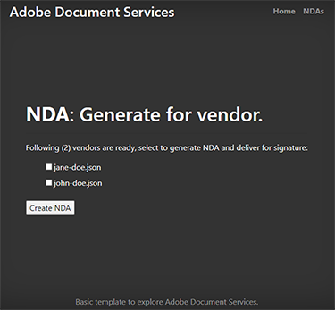
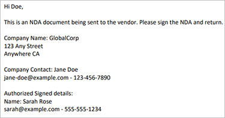

# Création d’un accord de confidentialité


Les organisations collaborent avec des contributeurs externes pour créer leurs services et produits. Un accord de confidentialité (NDA) est un élément important de ces collaborations. Elle empêche toutes les parties de divulguer des informations confidentielles susceptibles de nuire à l&#39;une ou l&#39;autre entité.

Le format d’accord de confidentialité le plus utilisé est un document PDF. Les organisations préparent un accord de confidentialité et l&#39;envoient à toutes les parties. Ensuite, une fois que tout le monde a signé, ils initient le contrat. Au sein d’une équipe à grande vitesse, la création manuelle de PDF ralentit la progression.

## Ce que vous pouvez apprendre

Ce tutoriel explique comment créer un modèle d&#39;accord de confidentialité Microsoft Word pour votre entreprise. le complément gratuit d’Adobe pour Microsoft Word, [Adobe du marqueur de génération de document](https://opensource.adobe.com/pdftools-sdk-docs/docgen/latest/wordaddin.html#add-in-demo), insère &quot;tags&quot; pour entrer les valeurs dynamiques. Découvrez comment transmettre les données JSON au modèle et créer un PDF dynamique. Le PDF résultant peut être envoyé par e-mail ou affiché à vos collaborateurs dans leur navigateur, en fonction des besoins et objectifs de votre entreprise. Pour suivre, il vous suffit de vous familiariser avec Node.js, JavaScript, Express.js, HTML et CSS.

## API et ressources pertinentes

Avec [!DNL Adobe Acrobat Services], vous pouvez générer des documents PDF à la volée à l’aide de données dynamiques. [!DNL Acrobat Services] offre une suite d’outils de PDF, y compris l’API Adobe Document Generation pour automatiser [Création de NDA](https://www.adobe.io/apis/documentcloud/dcsdk/nda-creation.html).

* [API de génération de documents Adobe](https://www.adobe.io/apis/documentcloud/dcsdk/doc-generation.html)

* [API Adobe Sign](https://www.adobe.io/apis/documentcloud/sign.html)

* [Adobe du marqueur de génération de document](https://opensource.adobe.com/pdftools-sdk-docs/docgen/latest/wordaddin.html#add-in-demo)

* [Code du projet](https://github.com/afzaal-ahmad-zeeshan/adobe-docugen-sample)

* [[!DNL Acrobat Services] touches](https://opensource.adobe.com/pdftools-sdk-docs/release/latest/index.html#getcred)

## Création du modèle JSON

Le modèle Word de Microsoft dépend du modèle JSON. Vous devez donc commencer par le créer. Pour le tutoriel, vous utilisez une structure JSON de base qui contient des détails sur l’entreprise, tels que les coordonnées.

```
{
"vendor": {
"companyName": "GlobalCorp",
"street": "123 Any Street",
"street2": "",
"city":"Anywhere",
"state":"CA",
"primaryContact": {
"firstName":"John",
"lastName":"Doe",
"email":"john-doe@example.com",
"phone":"123-456-7890"
}
},
"authorizedSigner": {
"firstName": "Sarah",
"lastName": "Rose",
"email": "sarah@example.com",
"phone":"555-555-1234"
}
}
```

Cette structure est utilisée dans Microsoft Word pour générer un modèle. Ces données peuvent provenir de n’importe quelle source de données, à condition qu’elles soient au format JSON. Pour plus de simplicité, vous créez plusieurs fichiers dans l&#39;application Node.js, mais votre cas d&#39;utilisation peut nécessiter une connexion à une base de données pour extraire les informations sur le fournisseur.

## Création du modèle Microsoft Word

Créez le modèle d’accord de confidentialité dans un document Microsoft Word. L’API Adobe PDF Services s’attend à ce que le document Microsoft Word contienne des balises dans lesquelles le service peut injecter des valeurs à partir de documents JSON. Bien que le modèle soit le même pour toutes les demandes d’Adobe, les données dynamiques dans JSON changent. Ces balises aident à créer des documents PDF pour chaque fournisseur dans ce cas, en utilisant un seul modèle Microsoft Word et en accélérant le processus en automatisant la génération de documents NDA.

Vous pouvez installer le fichier [complément gratuit Balisage de génération de document](https://opensource.adobe.com/pdftools-sdk-docs/docgen/latest/wordaddin.html#add-in-demo) dans Microsoft Word. Si vous faites partie d’une organisation, vous pouvez demander à votre administrateur Microsoft Office d’installer le complément gratuit pour tout le monde.

Une fois le complément installé, vous pouvez le retrouver dans l’onglet Accueil sous la catégorie Adobe . Pour ouvrir l’onglet, sélectionnez **Génération de documents**:


Dans l’onglet, vous pouvez télécharger l’exemple de document JSON. Ce document peut être un exemple, car vous ne l’utilisez que pour créer un modèle Microsoft Word.


Sélectionner **Générer des balises** pour afficher les éléments que vous pouvez utiliser dans votre modèle. Voici les propriétés extraites de la structure JSON, prêtes à être utilisées dans le modèle :


Voici les fonctionnalités de la boîte de dialogue `authorizedSigner` . D’autres champs sont entourés et vous pouvez développer l’affichage dans Microsoft Word. Le complément offre également des options de données avancées, telles que des tableaux, des listes, des valeurs calculées, etc.

## Création des balises

N’hésitez pas à créer un modèle ou à importer un [modèle existant](https://www.adobe.io/apis/documentcloud/dcsdk/doc-generation.html#sample-blade) dans Microsoft Word. Une fois le document configuré, ajoutez des balises à chaque champ en cliquant sur les jetons correspondants dans le complément.

Le modèle suivant dans un fichier Microsoft Word :


Ce fichier contient plusieurs balises. Lorsque vous exécutez le programme, ces champs sont remplis avec les informations sur le fournisseur.

Document Generation Tagger s’intègre à l’API Adobe Sign. Grâce à cette intégration, vous pouvez créer automatiquement des balises de texte Sign afin que le document généré puisse ensuite être envoyé à Adobe Sign pour signature.

## Génération du NDA pour les fournisseurs

Dans l’exemple d’application, vous avez préparé des dossiers pour l’entrée et la sortie. Comme mentionné précédemment, vous utilisez des fichiers JSON, de sorte qu’il existe deux fichiers pour afficher les fournisseurs disponibles dans le système. Les fichiers sont affichés dans un formulaire qui s’imprime dans le navigateur :

```
<h1><b>NDA</b>: Generate for vendor.</h1>
<hr />
<p>Following ({{files.length}}) vendors are ready, select to generate NDA and deliver for signature:</p>
<form method="POST">
<ul>
{{#each files }}
<li><input type="checkbox" name="vendor" value="{{this}}" id="file-{{@index}}" /> <label for="file-{{@index}}">{{this}}</label></li>
{{/each}}
</ul>
<input type="submit" value="Create NDA" />
</form>
```

Ce code génère l’interface utilisateur suivante dans le navigateur :



Lorsque l’administrateur sélectionne une personne, l’application utilise Adobe PDF Services pour générer le NDA lors de vos déplacements.

```
async function compileDocFile(json, inputFile, outputPdf) {
try {
// configurations
const credentials = adobe.Credentials
.serviceAccountCredentialsBuilder()
.fromFile("./src/pdftools-api-credentials.json")
.build();
// Capture the credential from app and show create the context
const executionContext = adobe.ExecutionContext.create(credentials);
// create the operation
const documentMerge = adobe.DocumentMerge,
documentMergeOptions = documentMerge.options,
options = new documentMergeOptions.DocumentMergeOptions(json, documentMergeOptions.OutputFormat.PDF);
const operation = documentMerge.Operation.createNew(options);
// Pass the content as input (stream)
const input = adobe.FileRef.createFromLocalFile(inputFile);
operation.setInput(input);
// Async create the PDF
let result = await operation.execute(executionContext);
await result.saveAsFile(outputPdf);
} catch (err) {
console.log('Exception encountered while executing operation', err);
}
}
```

Utilisez ce code dans le routeur Express :

```
// Create one report and send it back
try {
console.log(`[INFO] generating the report...`);
const fileContent = fs.readFileSync(`./public/documents/raw/${vendor}`, 'utf-8');
const parsedObject = JSON.parse(fileContent);
await pdf.compileDocFile(parsedObject, `./public/documents/template/Adobe-NDA-Sample.docx`, `./public/documents/processed/output.pdf`);
console.log(`[INFO] sending the report...`);
res.status(200).render("preview", { page: 'nda', filename: 'output.pdf' });
} catch(error) {
console.log(`[ERROR] ${JSON.stringify(error)}`);
res.status(500).render("crash", { error: error });
}
```

Vous pouvez afficher [exemple de code complet](https://github.com/afzaal-ahmad-zeeshan/adobe-docugen-sample) sur GitHub.

Ce code utilise un document JSON et le modèle Word Microsoft dans l’appel d’API du [!DNL Adobe Acrobat Services] SDK. Dans la réponse, vous recevez la sortie et l’enregistrez dans le système de fichiers de l’application. Vous pouvez transférer le document généré à vos clients par e-mail ou leur afficher un aperçu dans le navigateur à l’aide de la [API Adobe PDF Embed](https://www.adobe.io/apis/documentcloud/dcsdk/pdf-embed.html).

Cet appel crée le document NDA suivant :



[!DNL Adobe Acrobat Services] Les API insèrent du contenu pour créer un document PDF. Sans ces outils, vous devrez peut-être écrire le code pour traiter des documents Office et travailler avec des formats de fichiers Raw PDF. Avec l’aide des services Adobe PDF, vous pouvez effectuer toutes ces étapes avec un seul appel d’API.

Maintenant utiliser [API Adobe Sign](https://www.adobe.io/apis/documentcloud/sign.html) demander des signatures sur les accords de confidentialité et remettre le document final signé à toutes les parties. Adobe Sign vous informe [utilisation d’un webhook](https://www.adobe.io/apis/documentcloud/sign/docs.html#!adobedocs/adobe-sign/master/webhooks.md). En écoutant ce webhook, vous pouvez récupérer l’état du NDA.

Pour une explication plus détaillée du processus Adobe Sign, [consulter la documentation](https://www.adobe.io/apis/documentcloud/sign/docs.html) ou lisez cet article de blog détaillé.

## Marche à suivre

Dans ce tutoriel pratique, l&#39;Adobe Document Generation Tagger a été utilisé pour générer dynamiquement des documents PDF à l&#39;aide de modèles Microsoft Word et de fichiers de données JSON. Le complément a contribué à [créer automatiquement des accords de confidentialité](https://www.adobe.io/apis/documentcloud/dcsdk/nda-creation.html) personnalisée pour chaque partie, puis collectez des signatures à l’aide de l’API Sign.

Vous pouvez utiliser ces techniques pour créer de manière dynamique vos propres accords de confidentialité ou autres documents, et permettre ainsi à votre équipe de se concentrer pleinement sur son travail productif. Explorer [[!DNL Adobe Acrobat Services]](https://www.adobe.io/apis/documentcloud/dcsdk/pdf-tools.html) pour rechercher des API et des kits SDK correspondant à votre langue et au moteur d’exécution de votre choix, afin de pouvoir ajouter des fonctions de PDF directement dans vos applications pour une création rapide de documents en PDF. [Prise en main](https://www.adobe.io/apis/documentcloud/dcsdk/gettingstarted.html) avec une version d&#39;essai gratuite de six mois
[pay-as-you-go](https://www.adobe.io/apis/documentcloud/dcsdk/pdf-pricing.html) pour seulement 0,05 $ par transaction de document.
