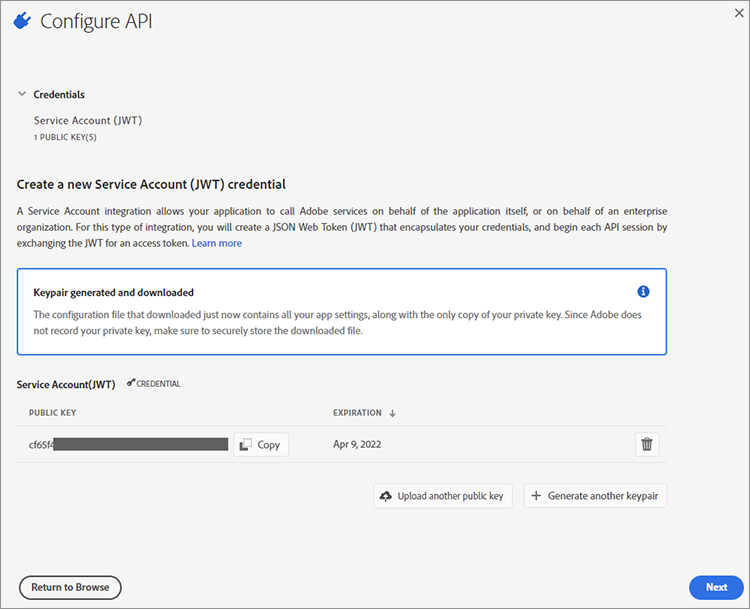
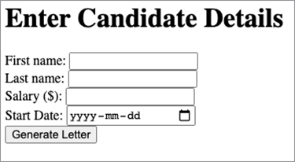
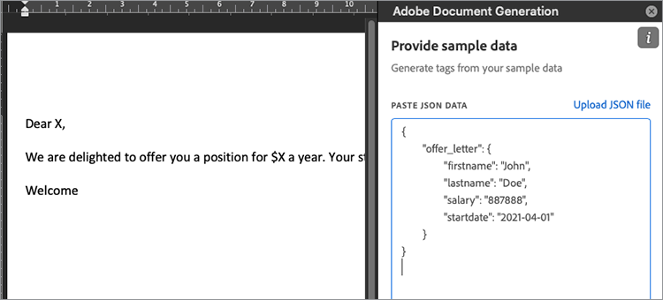

# Gestion des lettres d&#39;embauche


Les lettres d’embauche des employés sont l’une des premières expériences que les employés ont avec votre entreprise. Par conséquent, vous voulez vous assurer que vos lettres d’embauche sont conformes à la marque, mais vous ne voulez pas avoir à créer une lettre dans votre traitement de texte à partir de zéro à chaque fois. [!DNL Adobe Acrobat Services] Les API offrent un moyen rapide, simple et efficace de gérer les éléments clés de [générer et distribuer des lettres d&#39;embauche aux nouveaux employés](https://www.adobe.io/apis/documentcloud/dcsdk/employee-offer-letters.html).

## Ce que vous pouvez apprendre

Ce tutoriel pratique décrit la configuration d’un projet Node Express qui affiche un formulaire web à remplir par un utilisateur avec les détails des employés. Ces détails utilisent [!DNL Acrobat Services] sur le web pour générer une lettre d’offre sous forme de PDF qui peut être remise à un client pour signature à l’aide de l’API Adobe Sign.

## API et ressources pertinentes

* [API PDF Services](https://opensource.adobe.com/pdftools-sdk-docs/release/latest/index.html)

* [API de génération de documents Adobe](https://www.adobe.io/apis/documentcloud/dcsdk/doc-generation.html)

* [API Adobe Sign](https://www.adobe.io/apis/documentcloud/sign.html)

* [Complément Word de balise de génération de document](https://www.adobe.io/apis/documentcloud/dcsdk/docs.html?view=docgen-addin)

* [Exemple de projet](https://www.adobe.io/apis/documentcloud/dcsdk/employee-offer-letters.html)

## Prise en main

[Node.js](https://nodejs.org/) est la plate-forme de programmation. Il est livré avec un énorme ensemble de bibliothèques, comme le serveur Web Express. [Télécharger Node.js](https://nodejs.org/en/download/) et suivez les étapes pour installer ce formidable environnement de développement open source.

Pour utiliser l’API Adobe de génération de document dans Node.js, accédez à la section [API Document Generation](https://www.adobe.io/apis/documentcloud/dcsdk/doc-generation.html) pour accéder à votre compte ou vous inscrire pour en créer un. Votre compte est [gratuit pendant six mois, puis avec paiement à l&#39;unité](https://www.adobe.io/apis/documentcloud/dcsdk/pdf-pricing.html) pour seulement 0,05 $ par transaction documentaire, vous pouvez donc l&#39;essayer sans risque, puis seulement payer à mesure que votre entreprise se développe.

Après vous être connecté au [Console Adobe Developer](https://console.adobe.io/), cliquez sur **[!UICONTROL Créer un projet]**. Le projet est nommé &quot;Projet 1&quot; par défaut. Cliquez sur le bouton **[!UICONTROL Modifier le projet]** et remplacez le nom par &quot;Offer Letter Generator&quot;. Au centre de l’écran se trouve un **[!UICONTROL Prise En Main De Votre Nouveau Projet]** s&#39;affiche. Pour activer la sécurité sur votre projet, procédez comme suit :

Cliquez **Ajouter une API**. Vous voyez un certain nombre d’API parmi lesquelles choisir. Dans le **[!UICONTROL Filtrer par produit]** , sélectionnez **[!UICONTROL Document Cloud]**, puis cliquez sur **[!UICONTROL Suivant]**.

Maintenant, générez des informations d’identification pour accéder à l’API. Les informations d’identification se présentent sous la forme d’un jeton web JSON ([JWT](https://jwt.io/)) : une norme ouverte pour une communication sécurisée. Si vous connaissez JWT et avez déjà généré des clés, vous pouvez télécharger votre clé publique ici. Vous pouvez également continuer en sélectionnant **Option 1** pour que Adobe génère les clés pour vous.



Cliquez sur le bouton **[!UICONTROL Générer une paire de clés]** du menu. Vous obtenez un fichier config.zip à télécharger. Décompressez le fichier d’archive. Il contient deux fichiers : certificate_pub.crt et private.key. Assurez-vous que ce dernier est sécurisé, car il contient vos identifiants privés et peut être utilisé pour générer des documents douteux s&#39;il n&#39;est pas sous votre contrôle.

Cliquez sur **[!UICONTROL Suivant]**. Non, permet d’accéder à l’API PDF Generation. Dans le **[!UICONTROL Sélectionner des profils de produit]** écran, vérifier **[!UICONTROL Développeur de services de PDF d&#39;entreprise]**, puis cliquez sur l’icône **[!UICONTROL Enregistrer l’API configurée]** du menu. Vous êtes maintenant prêt à utiliser l’API.

## Configuration du projet

Configurez un projet de noeud pour exécuter votre code. Cet exemple utilise [Code Visual Studio](https://code.visualstudio.com/) (Code VS) en tant qu&#39;éditeur. Créez un dossier appelé &quot;letter-generator&quot; et ouvrez-le dans VS Code. Dans le **[!UICONTROL Fichier]** , sélectionnez **[!UICONTROL Terminal]** \> **[!UICONTROL Nouveau terminal]** pour ouvrir un shell dans ce dossier. Vérifiez que Node est installé et situé sur votre chemin en entrant les informations suivantes :

```
node -v
```

Vous devriez voir la version du noeud que vous avez installée.

Maintenant que votre environnement de développement est installé, vous pouvez créer votre projet.

Initialisez d&#39;abord le projet à l&#39;aide du gestionnaire de modules de noeud (npm). Tapez ce qui suit :

```
npm init
```

Vous êtes invité à poser des questions sur votre projet Node. Vous pouvez ignorer la plupart de ces questions, mais assurez-vous que le nom du projet est &quot;lettre-generator&quot; et que le point d&#39;entrée est **index.js**. Sélectionner **Oui** pour terminer l&#39;initialisation du projet.

Vous avez maintenant un fichier package.json. Node utilise ce fichier pour organiser votre projet. Avant de créer le fichier index.js, vous devez ajouter des bibliothèques d’Adobe à l’aide de la commande suivante :

```
npm install --save @adobe/documentservices-pdftools-node-sdk
```

Un nouveau dossier nommé node_modules doit être ajouté à votre projet. Ce dossier est l’emplacement où toutes les bibliothèques (appelées dépendances dans Node) sont téléchargées. Le fichier package.json est également mis à jour avec une référence aux services Adobe PDF.

Maintenant, vous voulez installer Express comme votre cadre web léger. Entrez la commande suivante :

```
npm install express –save
```

Comme précédemment, la section des dépendances de package.json est mise à jour en conséquence.

## Création d&#39;un modèle de lettre d&#39;embauche

Ensuite, à la racine du projet, créez un fichier nommé &quot;app.js&quot;. Mettons le code de démarrage suivant là-dedans :

```
const express = require('express');
const bodyParser = require('body-parser');
const PDFToolsSdk = require('@adobe/documentservices-pdftools-node-sdk')
const path = require('path');
const app = express();
const port = 8000;
app.use(bodyParser.urlencoded({ extended: true }));
app.get('/', (req, res) => {
res.sendFile(path.join(__dirname + '/index.html'));
});
app.post('/', (req, res) => {
console.log('Got body:', req.body);
res.sendStatus(200);
});
app.listen(port, () => {
console.log(`Candidate offer letter app listening on port ${port}!`)
});
```

Notez que la route GET renvoie un **index.html** fichier. Nous allons créer un fichier de HTML avec ce nom et la forme simple suivante. Vous pouvez ajouter des styles CSS et d’autres éléments de conception ultérieurement selon vos besoins. Ce formulaire reprend les informations de base du candidat pour générer une lettre de bienvenue :

```
<!DOCTYPE html>
<html lang="en">
<head>
<meta charset="UTF-8">
<meta http-equiv="X-UA-Compatible" content="IE=edge">
<meta name="viewport" content="width=device-width, initial-scale=1.0">
<title>Offer Letter Generator</title>
</head>
<body>
<h1>Enter Candidate Details</h1>
<form action="" method="post">
<div>
<label for="firstname">First name: </label>
<input type="text" name="firstname" id="firstname" required>
</div>
<div>
<label for="lastname">Last name: </label>
<input type="text" name="lastname" id="lastname" required>
</div>
<div>
<label for="salary">Salary ($): </label>
<input type="number" name="salary" id="salary" required>
</div>
<div>
<label for="startdate">Start Date: </label>
<input type="date" name="startdate" id="startdate" required>
</div>
<div>
<input type="submit" value="Generate Letter">
</div>
</form>
</body>
</html>
```

Exécutez le serveur Web avec la commande suivante :

```
node app.js
```

Vous devriez voir le message &quot;Candidate offer letter app Listen on port 8000&quot;. Si vous ouvrez votre navigateur pour <http://localhost:8000/>, le formulaire doit se présenter comme suit :



Notez que le formulaire est publié sur lui-même. Si vous saisissez des données et cliquez sur **Générer une lettre,** vous devriez voir les informations suivantes sur la console :

```
Got body: { firstname: 'John',
lastname: 'Doe',
salary: '887888',
startdate: '2021-04-01' }
```

Vous remplacez cette journalisation de console par un appel de service Web vers [!DNL Acrobat Services]. Tout d’abord, vous devez créer un modèle basé sur JSON des informations. Le format de ce modèle ressemble à ceci :

```
{
    "offer_letter": {
    "firstname": "John",
    "lastname": "Doe",
    "salary": "887888",
    "startdate": "2021-04-01"
    }
}
```

Si vous le souhaitez, vous pouvez rendre ce modèle plus élaboré. Pour ce tutoriel, gardez cet exemple simple. Il n&#39;y a pas de validation sur ce formulaire parce que cela dépasse le cadre de cet article. Pour convertir votre corps de formulaire vers le modèle de données décrit ci-dessus, modifiez la méthode du gestionnaire app.post pour qu’elle contienne le code suivant :

```
app.post('/', (req, res) => {
const docModel = {'offer_letter': req.body};
generateLetter(docModel);
res.sendStatus(200);
});
```

La première ligne place vos données JSON au format souhaité. Vous transmettez maintenant ces données à une fonction generateLetter. Arrêtez votre serveur et collez le code suivant à la fin de app.js. Ce code prend un document Word comme modèle et remplit des espaces réservés avec des informations provenant d&#39;un document JSON.

```
// Letter generation function
function generateLetter(jsonDataForMerge) {
try {
// Initial setup, create credentials instance.
const credentials = PDFToolsSdk.Credentials
.serviceAccountCredentialsBuilder()
.fromFile("pdftools-api-credentials.json")
.build();
// Create an ExecutionContext using credentials
const executionContext = PDFToolsSdk.ExecutionContext.create(credentials);
// Create a new DocumentMerge options instance
const documentMerge = PDFToolsSdk.DocumentMerge,
documentMergeOptions = documentMerge.options,
options = new documentMergeOptions.DocumentMergeOptions(jsonDataForMerge,
documentMergeOptions.OutputFormat.PDF);
// Create a new operation instance using the options instance
const documentMergeOperation = documentMerge.Operation.createNew(options)
// Set operation input document template from a source file.
const input = PDFToolsSdk.FileRef.createFromLocalFile(
'resources/OfferLetter-Template.docx');
documentMergeOperation.setInput(input);
// Execute the operation and Save the result to the specified location.
documentMergeOperation.execute(executionContext)
.then(result => result.saveAsFile('output/OfferLetter.pdf'))
.catch(err => {
if(err instanceof PDFToolsSdk.Error.ServiceApiError
|| err instanceof PDFToolsSdk.Error.ServiceUsageError) {
console.log(
'Exception encountered while executing operation', err);
} else {
console.log(
'Exception encountered while executing operation', err);
}
});
} catch (err) {
console.log('Exception encountered while executing operation', err);
}
}
```

Il y a beaucoup de code à déballer. Prenons d&#39;abord la partie principale : le `documentMergeOperation`. Cette section vous permet de fusionner vos données JSON avec un modèle de document Word. Vous pouvez utiliser la commande [exemple sur le site Adobe](https://www.adobe.io/apis/documentcloud/dcsdk/doc-generation.html#sample-blade) comme référence, mais faisons votre propre exemple simple. Ouvrez Word et créez un document vierge. Vous pouvez le personnaliser autant que vous le souhaitez, mais au moins avoir quelque chose comme ceci :

Cher X,

Nous sommes ravis de vous offrir un poste pour X $ par année. Votre date de début sera X.

Bienvenue

Enregistrez le document sous le nom &quot;OfferLetter-Template.docx&quot; dans un dossier appelé &quot;resources&quot; à la racine de votre projet. Notez les trois X dans le document. Ces XS sont des espaces réservés temporaires pour vos informations JSON. Bien que vous puissiez utiliser une syntaxe spéciale pour remplacer ces espaces réservés, Adobe fournit un complément Word qui simplifie cette tâche. Pour installer le complément, accédez à l’Adobe [Complément Word de balise de génération de document](https://www.adobe.io/apis/documentcloud/dcsdk/docs.html?view=docgen-addin) site.

Dans OfferLetter-Template, cliquez sur le nouveau **Génération de documents** du menu. Un panneau latéral s’ouvre. Cliquez sur **Commencer**. Une zone de texte vous est fournie pour coller les données JSON d’exemple. Copiez l’extrait de code &quot;offer-data&quot; de JSON situé au-dessus dans la zone de texte. Il doit ressembler à ce qui suit :



Cliquez sur le bouton **Générer des balises** du menu. Vous obtenez un menu déroulant de balises à insérer dans les points appropriés du document. Mettez en surbrillance le premier X du document et sélectionnez **[!UICONTROL prénom]**. Cliquez **[!UICONTROL Insérer du texte]** et &quot;Cher X&quot; est remplacé par &quot;Cher ```{{`offer_letter`.firstname}}```,&quot;. Cette balise est le format correct pour `documentMergeOperation`. Continuez et ajoutez les trois balises restantes aux Xs appropriés. N&#39;oubliez pas d&#39;enregistrer OfferLetter-template.docx. Cela devrait ressembler à ceci :

Bonjour ```{{`offer_letter`.firstname}} {{`offer_letter`.lastname}}```,

Nous sommes ravis de vous offrir un poste pour $ ```{{`offer_letter`.salary}}``` par an. Votre date de début sera le ```{{`offer_letter`.startdate}}```.

Bienvenue

Le modèle Word possède désormais un balisage qui correspond au format JSON. Par exemple, ```{{`offer_letter`.`firstname`}}``` au début du document Word est remplacé par la valeur dans la section &quot;prénom&quot; des données JSON.

Retour à votre `generateLetter` s&#39;affiche. Pour sécuriser votre appel REST, créez un nouveau fichier intitulé pdftools-api-credentials.json à la racine du projet. Collez les données JSON suivantes et ajustez-les avec les détails de la section Compte de service (JWT) de votre [Developer Console](https://console.adobe.io/).

```
{
"client_credentials": {
"client_id": "<YOUR_CLIENT_ID>",
"client_secret": "<YOUR_CLIENT_SECRET>"
},
"service_account_credentials": {
"organization_id": "<YOUR_ORGANIZATION_ID>",
"account_id": "<YOUR_TECHNICAL_ACCOUNT_ID>",
"private_key_file": "<PRIVATE_KEY_FILE_PATH>"
}
}
```

* L’ID client, le secret client et l’ID d’organisation peuvent être copiés directement à partir du **[!UICONTROL Détails des identifiants]** de la console.

* L’ID de compte est le **ID de compte technique**.

* Copiez le fichier private.key généré précédemment dans le projet et saisissez son nom dans la section private_key_file du fichier pdftools-api-credentials.json . Si vous le souhaitez, vous pouvez placer un chemin d&#39;accès au fichier de clé privée ici. N&#39;oubliez pas de le protéger car il peut être mal utilisé une fois hors de votre contrôle.

Pour générer un PDF avec les données JSON remplies, revenez à votre **[!UICONTROL Saisissez les détails du candidat]** formulaire web et publier des données. Cela prend un peu de temps car le document doit être téléchargé depuis l’Adobe, mais vous devriez avoir un fichier intitulé OfferLetter.pdf dans un nouveau dossier intitulé &quot;output&quot;.

## Marche à suivre

C&#39;est tout ! Ce n&#39;est que le début. Si vous étudiez la section Avancé de l’onglet Génération de document du complément Word, vous remarquerez que tous les marqueurs d’espace réservé ne proviennent pas des données JSON associées. Vous pouvez également ajouter des balises de signature. Ces balises vous permettent de prendre le document obtenu et de le télécharger vers [Adobe Sign](https://acrobat.adobe.com/ca/en/sign.html) pour livraison et signature au nouvel employé. Lisez la section Prise en main de l’API Adobe Sign pour savoir comment procéder. Ce processus est similaire car vous utilisez des appels REST sécurisés avec un jeton JWT.

L&#39;exemple de document unique fourni ci-dessus peut servir de base à une demande lorsqu&#39;une organisation doit : [accélérer le recrutement saisonnier](https://www.adobe.io/apis/documentcloud/dcsdk/employee-offer-letters.html) des employés sur plusieurs sites. Comme on l&#39;a vu, le principal processus consiste à recueillir des données auprès des candidats au moyen d&#39;une application en ligne. Les données sont utilisées pour remplir les champs d’une lettre d’offre et les envoyer pour signature électronique.

[!DNL Adobe Acrobat Services] est libre d&#39;utiliser pendant six mois, puis [pay-as-you-go](https://www.adobe.io/apis/documentcloud/dcsdk/pdf-pricing.html) à seulement 0,05 $ par transaction documentaire, pour la tester et adapter votre workflow de lettre d’embauche au développement de votre activité. Pour [prise en main](https://www.adobe.io/apis/documentcloud/dcsdk/gettingstarted.html)
créer vos propres modèles, [création de votre compte développeur](https://www.adobe.io/).
