# [!DNL Adobe Acrobat Services] Exemples d’utilisation API

![[!DNL Acrobat Services] Bannière Cas d’usage API](../assets/usecaseshero.jpg)

## Que peut faire le [!DNL Adobe Acrobat Services] Les API me conviennent ?

Découvrez comment le [!DNL Adobe Acrobat Services] Les API peuvent transformer votre activité grâce à ces cas d’usage pratiques.

### [!DNL Acrobat Services] API

<table style="table-layout:fixed">
<tr>
  <td>
    <a href="automatelegalworkflows.md">
      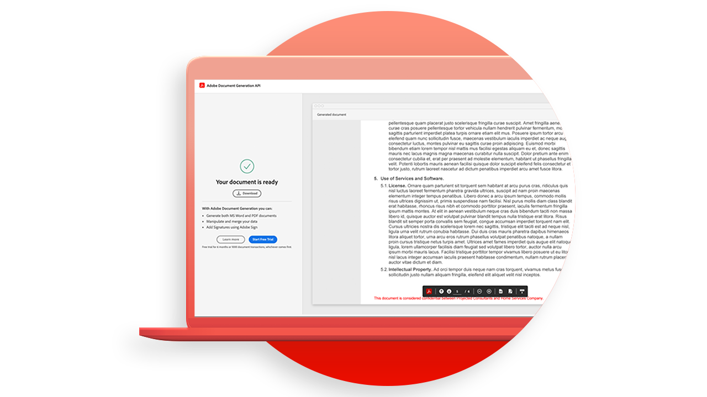
    </a>
    

    <a href="automatelegalworkflows.md"><strong>Automatisation des workflows juridiques</strong></a>
    

    <em>Découvrez comment automatiser les workflows juridiques avec du contenu conditionnel</em>
     
  </td>
  <td>
      <a href="employeeonboarding.md">
        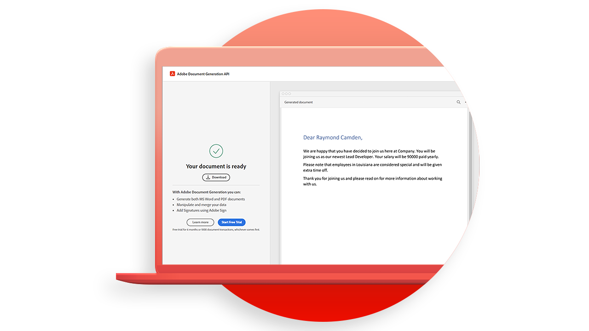
      </a>
      

      <a href="employeeonboarding.md"><strong>Modernisation de l’intégration</strong></a>
      

      <em>Découvrez comment moderniser l’intégration des collaborateurs</em>
       
  </td>
  <td>
      <a href="acceleratesales.md">
        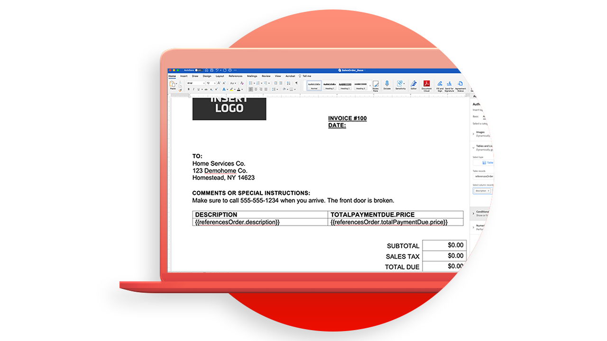
      </a>
      

      <a href="acceleratesales.md"><strong>Accélérez votre processus de vente</strong></a>
      

      <em>Découvrez comment accélérer vos ventes en intégrant les expériences documentaires</em>
       
    </td>
    <td>
      <a href="sales.md">
        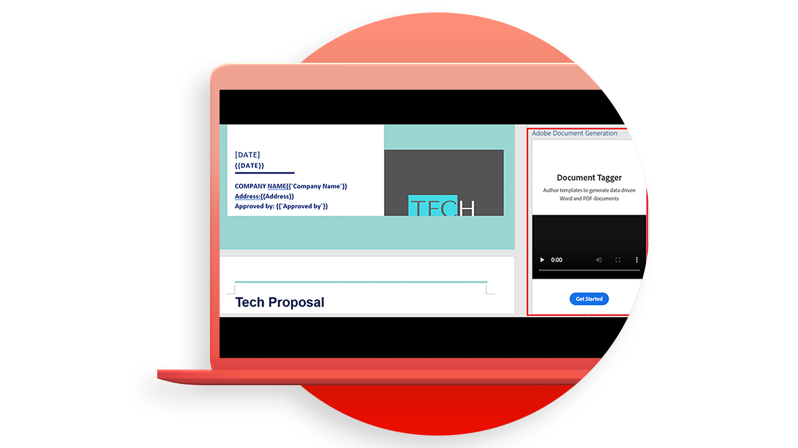
      </a>
      

      <a href="sales.md"><strong>Gestion des devis et des contrats</strong></a>
      

      <em>Découvrez comment créer un workflow efficace pour automatiser et simplifier les propositions commerciales</em>
       
    </td>
</tr>
<tr>
  <td>
    <a href="nda.md">
      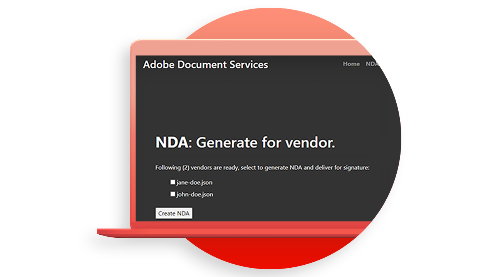
    </a>
    

    <a href="nda.md"><strong>Création d’un accord de confidentialité</strong></a>
    

    <em>Création d'un PDF NDA dynamique pour la collaboration</em>
     
  </td>
  <td>
    
    

    <a href="legal.md"><strong>Gestion des contrats juridiques</strong></a>
    

    <em>Découvrez comment générer et protéger automatiquement des documents juridiques avec une saisie de données personnalisée</em>
     
  </td>
  <td>
    <a href="offer.md">
      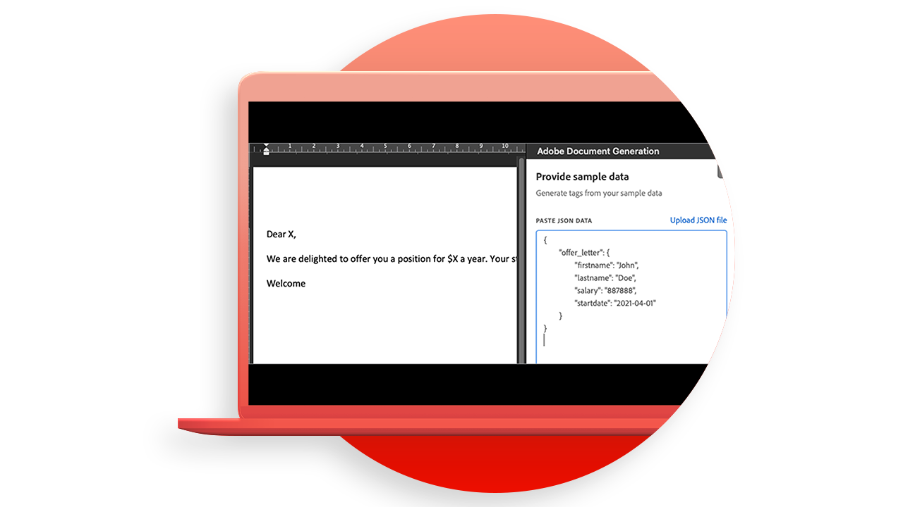
    </a>
    

    <a href="offer.md"><strong>Gestion des lettres d'embauche</strong></a>
    

    <em>Découvrez comment générer une lettre d’offre pouvant être remise à un nouvel employé pour signature.</em>
     
  </td>
  <td>
    <a href="searching.md">
      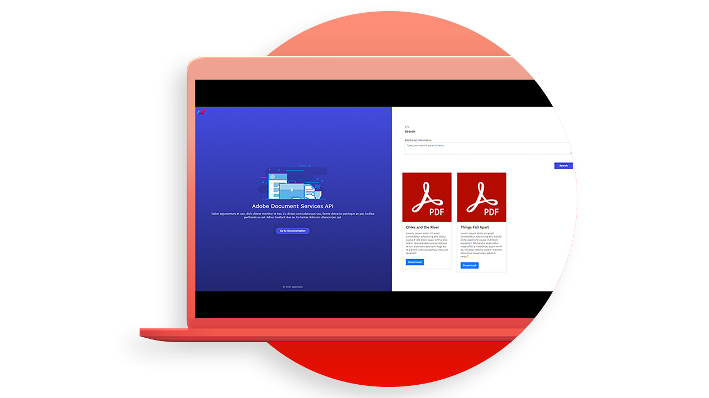
    </a>
    

    <a href="searching.md"><strong>Recherche et indexation</strong></a>
    

    <em>Apprenez à créer des fichiers de PDF interrogeables à partir de documents numérisés</em>
     
  </td>
</tr>
<tr>
  <td>
    <a href="reviews.md">
      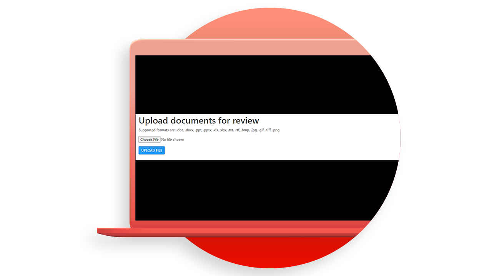
    </a>
    

    <a href="reviews.md"><strong>Révisions et approbations</strong></a>
    

    <em>Découvrez comment créer un workflow de révision et de validation des documents pour la collaboration entre les équipes</em>
     
  </td>
  <td>
    <a href="reportcreation.md">
      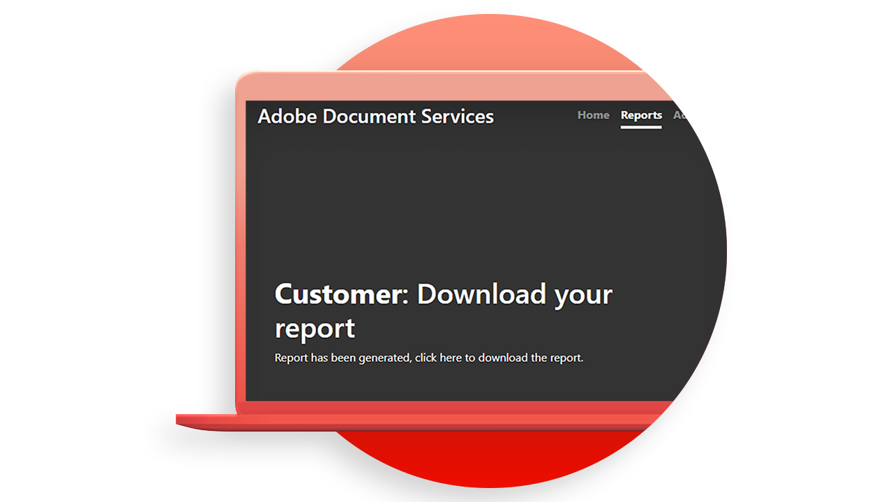
    </a>
    

    <a href="reportcreation.md"><strong>Création et modification de rapports</strong></a>
    

    <em>Découvrez comment générer des rapports de PDF sur votre site web pour les clients</em>
     
  </td>
  <td>
    <a href="jobposting.md">
      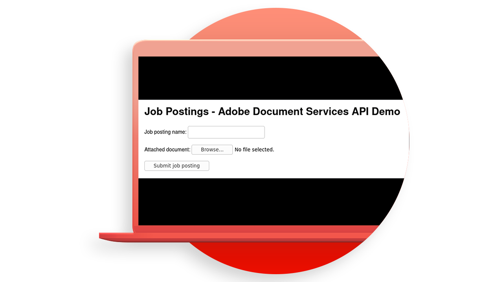
    </a>
    

    <a href="jobposting.md"><strong>Offre d'emploi</strong></a>
    

    <em>Découvrez comment créer une expérience web fluide et cohérente pour les candidats et les employeurs</em>
     
  </td>
  <td>
    <a href="educationcollab.md">
      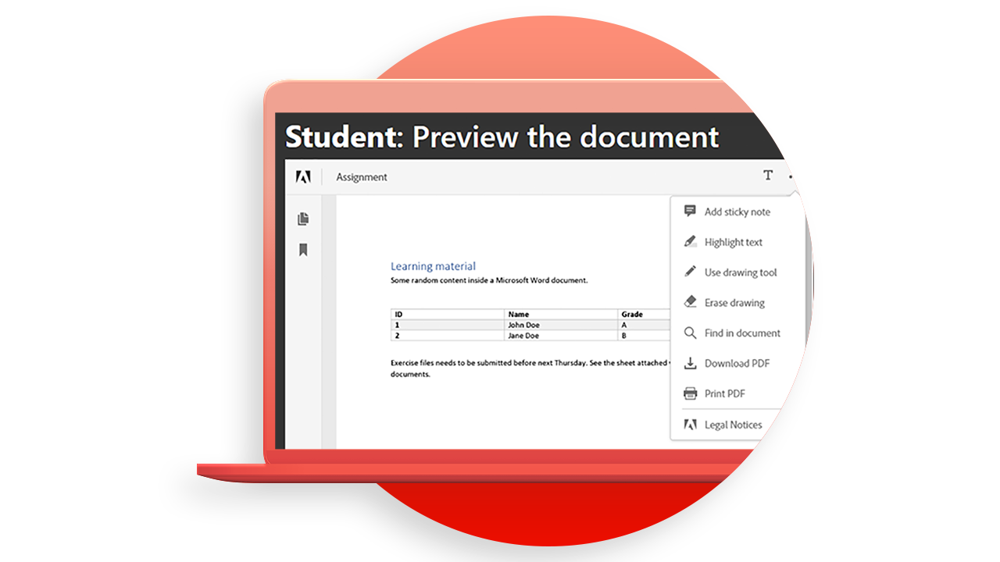
    </a>
    

    <a href="educationcollab.md"><strong>Collaboration étudiant-enseignant</strong></a>
    

    <em>Découvrez comment créer une plateforme d’apprentissage en ligne qui permet aux enseignants et aux étudiants de partager facilement des ressources en PDF</em>
     
  </td>
</tr>
<tr>
  <td>
    <a href="AgreementWorkflowsNodejs.md">
      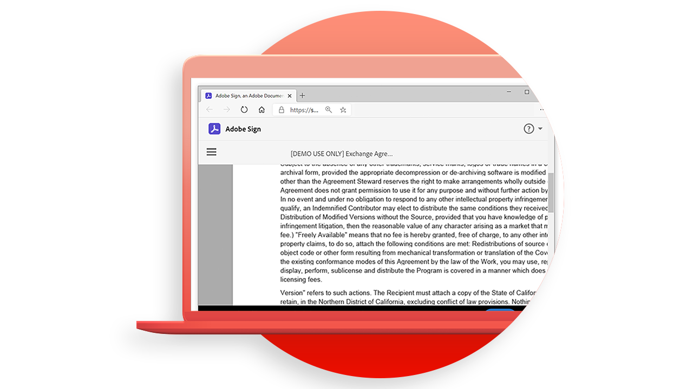
    </a>
    

    <a href="AgreementWorkflowsNodejs.md"><strong>Workflows des accords dans Node.js</strong></a>
    

    <em>[!DNL Adobe Acrobat Services] Les API intègrent facilement des fonctionnalités de PDF dans vos applications web</em>
     
  </td>
  <td>
    <a href="HRAgreementWorkflowsJava.md">
      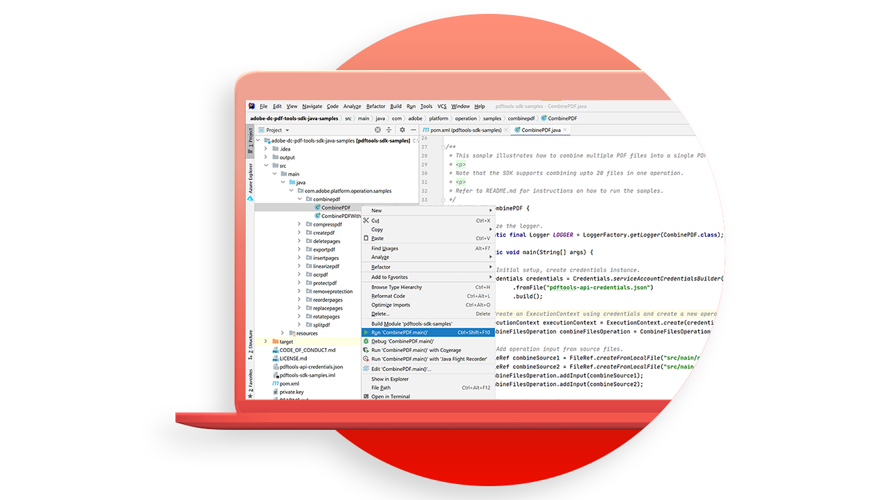
    </a>
    

    <a href="HRAgreementWorkflowsJava.md"><strong>Workflows de documents RH dans Java</strong></a>
    

    <em>[!DNL Adobe Acrobat Services] Les API intègrent facilement des fonctionnalités PDF dans vos applications web de RH</em>
     
  </td>
  <td>
    <a href="FinanceWorkflowsJava.md">
      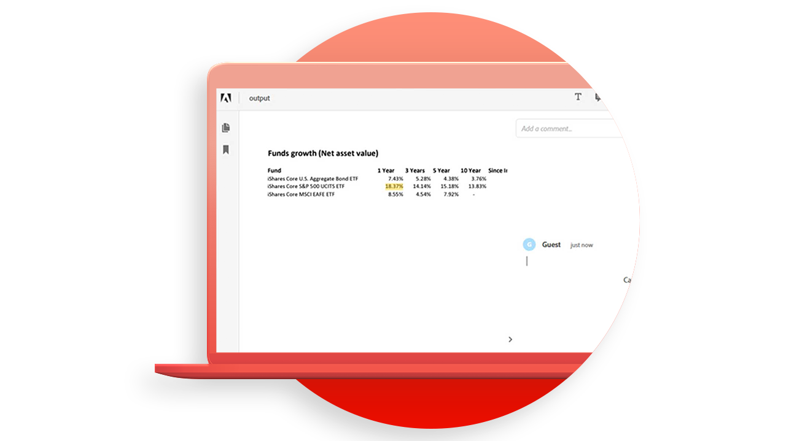
    </a>
    

    <a href="FinanceWorkflowsJava.md"><strong>Gestion des workflows de documents financiers dans Java</strong></a>
    

    <em>[!DNL Adobe Acrobat Services] fournit tous les outils, services et fonctions nécessaires pour traiter et extraire des données à partir de documents financiers PDF</em>
     
  </td>
  <td>
    
    

     
  </td>
</tr>
</table>

### API Document Generation

<table style="table-layout:fixed">
<tr>
  <td>
    
    

    <a href="invoices.md"><strong>Traitement des factures</strong></a>
    

    <em>Découvrez comment générer, protéger par mot de passe et envoyer automatiquement des factures client</em>
     
  </td>
  <td>
    
    

     
  </td>
  <td>
    
    

     
  </td>
  <td>
    
    

     
  </td>
</tr>
</table>

### API PDF Embed

<table style="table-layout:fixed">
<tr>
   <td>
    
    

    <a href="ddppdfembedapi.md"><strong>Publication de documents numériques</strong></a>
    

    <em>Découvrez comment afficher des documents de PDF incorporés dans des pages web à l’aide de l’API Adobe PDF Embed</em>
     
  </td>
  <td>
    
    

     
  </td>
  <td>
    
    

     
  </td>
  <td>
    
    

     
  </td>
</tr>
</table>