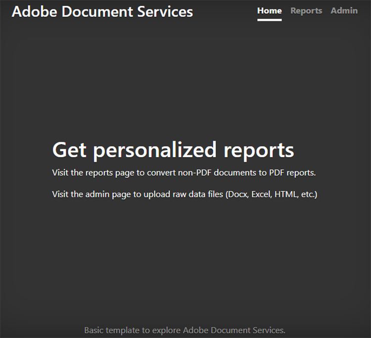
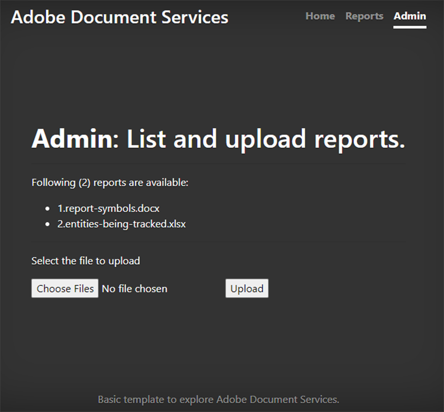
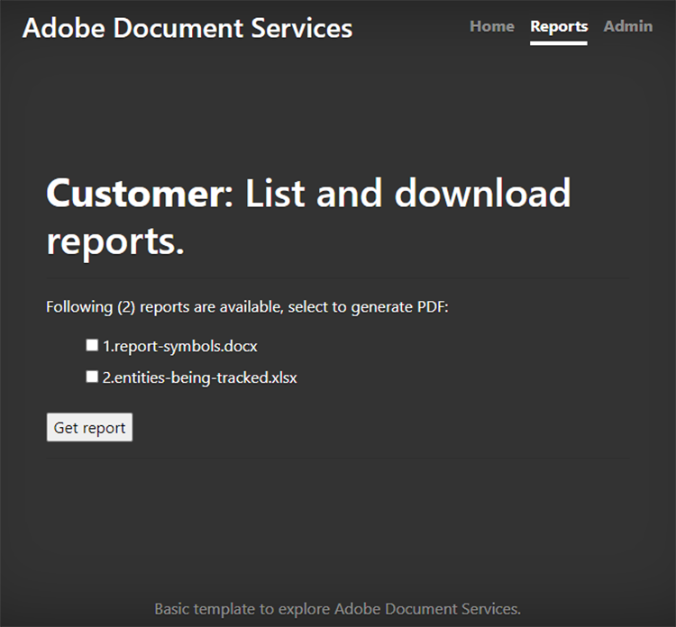
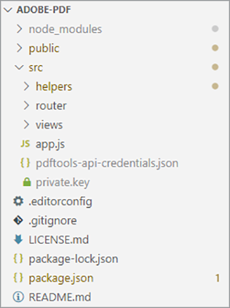
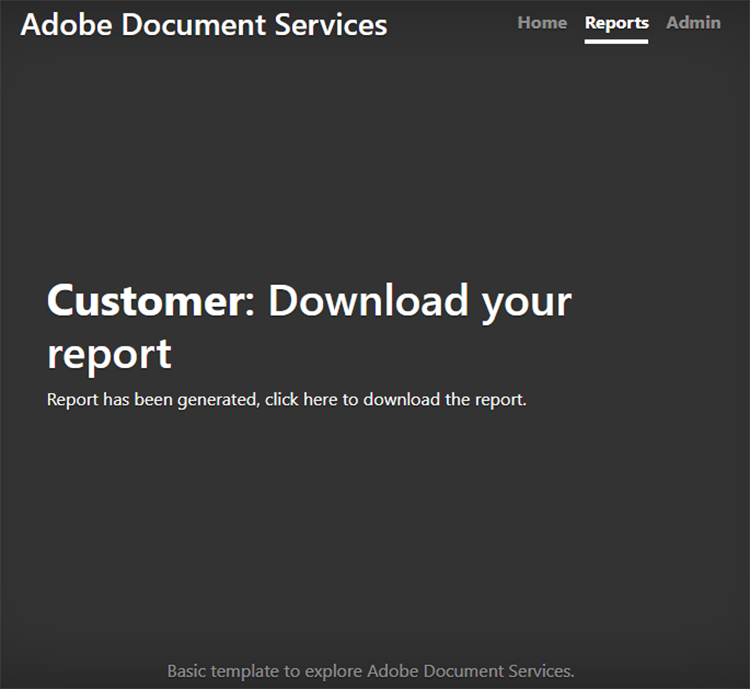
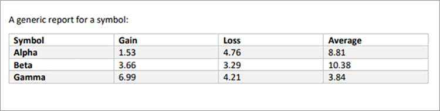

# Création et modification de rapports


Les secteurs de la finance, de l’éducation, du marketing et autres utilisent des PDF pour partager des données avec leurs clients et parties prenantes. Les PDF permettent de partager facilement des documents enrichis, avec des tableaux, des graphiques et du contenu interactif, dans un format accessible à tous. [!DNL Adobe Acrobat Services] Les API aident ces sociétés à générer des rapports de PDF partageables à partir de Microsoft Word, de Microsoft Excel, de graphiques et d’autres formats de documents divers.

Dis-le [diriger une entreprise de suivi sur les réseaux sociaux](https://www.adobe.io/apis/documentcloud/dcsdk/on-demand-report-creation.html). Vos clients se connectent à une partie de votre site protégée par mot de passe pour consulter l&#39;analytics de leurs campagnes. Souvent, ils veulent partager ces statistiques avec leurs dirigeants, actionnaires, donateurs ou autres parties prenantes. Les documents PDF téléchargeables sont un excellent moyen pour vos clients de partager des chiffres, des graphiques, etc.

En incorporant [API PDF Services](https://www.adobe.io/apis/documentcloud/dcsdk/pdf-tools.html) sur votre site web, vous pouvez générer des rapports de PDF en déplacement pour chaque client. Vous pouvez créer des PDF, puis les regrouper en un seul rapport pratique que vos clients pourront télécharger et transmettre à leurs parties prenantes.

## Ce que vous pouvez apprendre

Dans ce tutoriel pratique, apprenez à utiliser le kit SDK PDF Services dans un environnement Node.js et Express.js (avec quelques scripts JavaScript, HTML et CSS) pour ajouter rapidement et facilement des fonctionnalités orientées PDF à un site web. Ce site Web comporte une page où les administrateurs téléchargent des rapports, une zone où les clients affichent une liste des rapports disponibles et sélectionnent les documents à convertir en PDF, et des points de terminaison utiles pour télécharger les PDF générés par le système.

## API et ressources pertinentes

* [API PDF Services](https://opensource.adobe.com/pdftools-sdk-docs/release/latest/index.html)

* [API PDF Embed](https://www.adobe.com/devnet-docs/dcsdk_io/viewSDK/index.html)

## Tableau de bord des rapports Campaign pour les clients

>[!NOTE]
>
>Ce tutoriel ne traite pas des bonnes pratiques de Node.js ni de la sécurisation de vos applications web. Certaines zones du site Web sont exposées pour une utilisation publique et la dénomination des documents peut ne pas être adaptée à la production. Pour discuter de la meilleure approche possible pour concevoir un tel système, consultez vos architectes et ingénieurs.

Ici, vous avez une application Web Express.js de base qui a une zone de rapports clients et une section d&#39;administrateur. Cette application peut présenter des rapports pour les campagnes sur les médias sociaux. Par exemple, il peut indiquer le nombre de fois où l’utilisateur clique sur une publicité.



Vous pouvez télécharger ce projet à partir du [Référentiel GitHub](https://github.com/afzaal-ahmad-zeeshan/express-adobe-pdf-tools).

Voyons maintenant comment publier ces rapports.

## Téléchargement de rapports

Pour faire simple, utilisez uniquement le transfert et le traitement basés sur le système de fichiers. Dans Express.js, vous pouvez utiliser le module fs pour répertorier tous les fichiers disponibles dans un répertoire.

Sur la même page, activez l’administrateur pour charger des fichiers de rapport sur le serveur pour que les clients puissent les consulter. Ces fichiers peuvent avoir différents formats, tels que Microsoft Word, Microsoft Excel, HTML et [autres formats de données]https://opensource.adobe.com/pdftools-sdk-docs/release/latest/howtos.html#create-a-pdf), y compris les fichiers graphiques. La page d’administration se présente comme suit :



>[!NOTE]
>
>Protégez vos URL par mot de passe ou utilisez le paquet passeport de npm pour sécuriser votre application derrière la couche d&#39;authentification et d&#39;autorisation.

Lorsque l’administrateur sélectionne et télécharge un fichier, il est déplacé vers un référentiel public auquel d’autres personnes peuvent accéder. Vous utilisez le même référentiel pour publier des documents à partir de la page d&#39;administration et répertorier les rapports marketing disponibles pour les clients. Ce code est :

```
router.get('/', (req, res) => {
try {
let files = fs.readdirSync('./public/documents/raw') // read the files
res.status(200).render("reports", { page: 'reports', files: files });
} catch (error) {
res.status(500).render("crash", { error: error });
}
});
```

Ce code répertorie tous les fichiers et affiche la liste des fichiers.

## Sélection de rapports

Côté utilisateur, vous disposez d’un formulaire permettant aux clients de sélectionner les documents qu’ils souhaitent inclure dans leur rapport de campagne sur les réseaux sociaux. Pour plus de simplicité, sur votre page d’exemple, affichez uniquement le nom du document et une case à cocher pour sélectionner le document. Les clients peuvent sélectionner un ou plusieurs rapports à regrouper dans un seul document PDF.

Pour une interface utilisateur plus avancée, vous pouvez également afficher un aperçu du rapport ici.



## Génération d&#39;un rapport PDF

Utilisez le SDK PDF Services pour créer les rapports de PDF à partir de vos entrées de données. Les données (comme indiqué dans les captures d’écran ci-dessus) peuvent provenir de divers formats de données tels que Microsoft Word, Microsoft Excel, HTML, graphiques, etc. Commencez par installer le package npm pour PDF Services SDK.

```
$ npm install --save @adobe/documentservices-pdftools-node-sdk
```

Avant de commencer, vous devez avoir des identifiants d’API, [sans Adobe](https://opensource.adobe.com/pdftools-sdk-docs/release/latest/index.html#getcred). Utilisez votre [!DNL Acrobat Services] compte [gratuit pendant six mois, puis avec paiement à l&#39;unité](https://www.adobe.io/apis/documentcloud/dcsdk/pdf-pricing.html) pour seulement \$0.05 par transaction de document.

Téléchargez le fichier d’archive et extrayez le fichier JSON pour les informations d’identification et la clé privée. Dans le projet d&#39;exemple, placez le fichier dans le répertoire src.



Maintenant que les informations d&#39;identification sont configurées, vous pouvez écrire la tâche de conversion du PDF. Pour cette démonstration, vous devez effectuer deux opérations dans l&#39;application :

* Conversion de documents Raw en fichiers PDF

* Regroupement de plusieurs fichiers de PDF dans un même rapport

La procédure globale est similaire pour l&#39;exécution de toute opération. La seule différence est le service que vous utilisez. Dans le code suivant, vous convertissez le document brut en fichier PDF :

```
async function createPdf(rawFile, outputPdf) {
try {
// configurations
const credentials = adobe.Credentials
.serviceAccountCredentialsBuilder()
.fromFile("./src/pdftools-api-credentials.json")
.build();
// Capture the credential from app and show create the context
const executionContext = adobe.ExecutionContext.create(credentials),
operation = adobe.CreatePDF.Operation.createNew();
// Pass the content as input (stream)
const input = adobe.FileRef.createFromLocalFile(rawFile);
operation.setInput(input);
// Async create the PDF
let result = await operation.execute(executionContext);
await result.saveAsFile(outputPdf);
} catch (err) {
console.log('Exception encountered while executing operation', err);
}
}
```

Dans le code ci-dessus, vous lisez les informations d’identification et créez le contexte d’exécution. Le SDK PDF Services requiert le contexte d&#39;exécution pour authentifier vos demandes.

Ensuite, vous exécutez l’opération Créer un PDF qui convertit les documents Raw au format PDF. Enfin, vous utilisez la boîte de dialogue `outputPdf` pour copier le rapport du PDF. Dans l’exemple de code, vous trouverez ce code sous le fichier src/helpers/pdf.js. Plus loin dans ce tutoriel, vous importerez le module PDF et appellerez cette méthode.

Comme le montre la section précédente, vos clients peuvent accéder à la page suivante pour sélectionner les états qu&#39;ils souhaitent convertir en PDF :


Lorsqu&#39;un client sélectionne un ou plusieurs de ces rapports, vous créez le fichier de PDF.

Tout d&#39;abord, voyons un fichier de PDF unique en action. Lorsque l’utilisateur sélectionne un seul rapport, il vous suffit de le convertir en PDF et de fournir le lien de téléchargement.

```
try {
console.log(`[INFO] generating the report...`);
await pdf.createPdf(`./public/documents/raw/${reports}`, `./public/documents/processed/output.pdf`);
console.log(`[INFO] sending the report...`);
res.status(200).render("download", { page: 'reports', filename: 'output.pdf' });
} catch(error) {
console.log(`[ERROR] ${JSON.stringify(error)}`);
res.status(500).render("crash", { error: error });
}
```

Ce code crée un rapport et partage l’URL de téléchargement avec le client. Voici la page web de sortie :



Voici le PDF de sortie :



Les clients peuvent sélectionner plusieurs fichiers pour générer un rapport combiné. Lorsque le client sélectionne plusieurs documents, vous effectuez deux opérations : le premier crée un mot de PDF partiel pour chaque document et le second les regroupe dans un rapport de PDF unique.

```
async function combinePdf(pdfs, outputPdf) {
try {
// configurations
const credentials = adobe.Credentials
.serviceAccountCredentialsBuilder()
.fromFile("./src/pdftools-api-credentials.json")
.build();
// Capture the credential from app and show create the context
const executionContext = adobe.ExecutionContext.create(credentials),
operation = adobe.CombineFiles.Operation.createNew();
// Pass the PDF content as input (stream)
for (let pdf of pdfs) {
const source = adobe.FileRef.createFromLocalFile(pdf);
operation.addInput(source);
}
// Async create the PDF
let result = await operation.execute(executionContext);
await result.saveAsFile(outputPdf);
} catch (err) {
console.log('Exception encountered while executing operation', err);
}
}
```

Cette méthode est disponible sous le fichier src/helpers/pdf.js et exposée dans le cadre de l’exportation de module.

```
try {
console.log(`[INFO] creating a batch report...`);
// Create a batch report and send it back
let partials = [];
for (let index in reports) {
const name = `partial-${index}-${reports[index]}`;
await pdf.createPdf(`./public/documents/raw/${reports[index]}`, `./public/documents/processed/${name}`);
partials.push(`./public/documents/processed/${name.replace('docx', 'pdf').replace('xlsx', 'pdf')}`);
}
await pdf.combinePdf(partials, `./public/documents/processed/output.pdf`);
console.log(`[INFO] sending the combined report...`);
res.status(200).render("download", { page: 'reports', filename: 'output.pdf' });
} catch(error) {
console.log(`[ERROR] ${JSON.stringify(error)}`);
res.status(500).render("crash", { error: error });
}
```

Ce code génère un rapport compilé pour plusieurs documents d&#39;entrée. La seule fonction ajoutée est la fonction `combinePdf` qui prend une liste de noms de chemin de fichier PDF et retourne un PDF de sortie unique.

Désormais, les clients de votre tableau de bord de réseaux sociaux peuvent sélectionner des rapports pertinents dans leur compte et les télécharger sous la forme d’un PDF pratique. Ce tableau de bord leur permet de présenter la réussite de leurs campagnes à la direction et aux autres parties prenantes à l&#39;aide de données, de tableaux et de graphiques dans un format universellement facile à ouvrir.

## Marche à suivre

Ce tutoriel pratique explique comment utiliser l’API PDF Services pour aider les clients à télécharger des rapports pertinents sous forme de mots de PDF faciles à partager. Vous avez créé une application Node.js pour présenter la puissance de l&#39;API PDF Services pour les services de création de rapports et de lecture de PDF. L&#39;application a démontré comment vos clients peuvent télécharger un seul document de rapport ou combiner et fusionner plusieurs documents dans un seul rapport PDF.

Cette application à Adobe aide votre [clients du tableau de bord réseaux sociaux](https://www.adobe.io/apis/documentcloud/dcsdk/on-demand-report-creation.html) obtenir et partager les rapports dont ils ont besoin, sans se soucier si Microsoft Office ou d’autres logiciels sont installés sur leur appareil. Vous pouvez utiliser les mêmes techniques dans votre propre application pour aider vos utilisateurs à afficher, combiner et télécharger des documents. Vous pouvez également consulter les nombreuses autres API d’Adobe pour ajouter et suivre des signatures, et bien plus encore.

Pour commencer, demandez votre [[!DNL Adobe Acrobat Services]](https://www.adobe.io/apis/documentcloud/dcsdk/gettingstarted.html) , puis créez des expériences de reporting attrayantes pour vos collaborateurs et clients. Profitez de votre compte gratuitement pendant six mois [pay-as-you-go](https://www.adobe.io/apis/documentcloud/dcsdk/pdf-pricing.html) au fur et à mesure que vos efforts marketing se développent, seulement \$0.05 par transaction de document.
