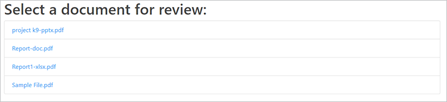

# Révisions et approbations


La collaboration inter-équipes à distance est devenue nécessaire pour de nombreuses entreprises pendant la pandémie de COVID-19, [partage et révision de documents digitaux](https://www.adobe.io/apis/documentcloud/dcsdk/review-and-approval.html) présente une série de défis pour les équipes et les ressources interfonctionnelles.

Ces défis incluent le partage de documents dans différents formats de fichier, la révision et l’annotation efficaces du contenu, ainsi que la synchronisation avec les modifications les plus récentes. [!DNL Adobe Acrobat Services] Les API sont conçues pour permettre aux développeurs d’applications de résoudre ces problèmes pour leurs utilisateurs.

## Ce que vous pouvez apprendre

Ce tutoriel pratique explique comment créer un processus de révision et d’approbation de documents dans une application web Node.js et Express. Pour suivre ce tutoriel, vous devez avoir une certaine expérience de Node.js.

L’application offre les fonctionnalités suivantes :

* Conversion de différents types de fichiers en PDF

* Activer le téléchargement de fichiers

* Donnez aux utilisateurs la possibilité d’ajouter des commentaires et des annotations

* Afficher les PDF avec ces commentaires

* Activation des profils utilisateur pour identifier les auteurs de commentaires

* Combiner des fichiers dans un PDF final que les utilisateurs peuvent télécharger

## API et ressources pertinentes

* [API PDF Services](https://opensource.adobe.com/pdftools-sdk-docs/release/latest/index.html)

* [API PDF Embed](https://www.adobe.com/devnet-docs/dcsdk_io/viewSDK/index.html)

* [Code du projet](https://github.com/contentlab-io/adobe_reviews_and_approvals)

## Création des identifiants d’API Adobe

Avant de démarrer le code, vous devez [créer des identifiants](https://www.adobe.com/go/dcsdks_credentials) pour l’API Adobe PDF Embed et l’API Adobe PDF Services. L’API PDF Embed est gratuite. L’API PDF Services est gratuite pendant six mois, vous pouvez alors passer à un [formule &quot;payez au fur et à mesure&quot;](https://www.adobe.io/apis/documentcloud/dcsdk/pdf-pricing.html) à seulement \$0.05 par transaction de document.

Lors de la création d’informations d’identification pour l’API PDF Services, sélectionnez **Créer un exemple de code personnalisé** et sélectionnez Node.js pour la langue. Enregistrez le fichier ZIP et extrayez pdftools-api-credentials.json et private.key dans le répertoire racine de votre projet Node.js Express.

## Configuration d’un projet et des dépendances

Configurez votre projet Node.js et Express de sorte qu’il serve les fichiers statiques d’un dossier nommé &quot;public&quot;. Vous pouvez configurer vos modes de projet, en fonction de vos préférences. Pour être rapidement opérationnel, vous pouvez utiliser la boîte de dialogue [Générateur d’applications Express](https://expressjs.com/en/starter/generator.html). Ou si vous voulez garder les choses simples, vous pouvez [partir de zéro](https://expressjs.com/en/starter/hello-world.html) et conservez votre code dans un seul fichier JavaScript. Dans l’exemple de projet ci-dessus, vous utilisez l’approche à fichier unique et conservez tout votre code dans index.js.

Copiez le fichier `pdftools-api-credentials.json` et `private.key` de l’exemple de code personnalisé au répertoire racine du projet. Ajoutez-les également au fichier .gitignore, si vous en avez un, afin que vos fichiers d’informations d’identification ne soient pas envoyés accidentellement à un référentiel.

Ensuite, exécutez `npm install @adobe/documentservices-pdftools-node-sdk` pour installer le SDK Node.js pour les services de PDF. Importez ce module et créez l&#39;objet d&#39;informations d&#39;identification d&#39;API dans votre code (index.js dans votre projet d&#39;exemple), après les importations du reste de votre dépendance comme ceci :

```
  const PDFToolsSdk = require( "@adobe/documentservices-pdftools-node-sdk" );

  // Create Credentials
  const credentials =  PDFToolsSdk.Credentials
      .serviceAccountCredentialsBuilder()
      .fromFile( "pdftools-api-credentials.json" )
      .build();
```

Votre code de démarrage doit ressembler à ceci :

```
  
  const express = require( "express" );
  const PDFToolsSdk = require( "@adobe/documentservices-pdftools-node-sdk" );

  // Create Credentials
  const credentials =  PDFToolsSdk.Credentials
      .serviceAccountCredentialsBuilder()
      .fromFile( "pdftools-api-credentials.json" )
      .build();

  const app = express();

  app.use( express.static( "public" ) );

  app.listen( 8889, function() {
      console.log( "Server started on port", 8889 );
  } );
```

Vous êtes maintenant prêt à travailler avec [!DNL Acrobat Services] API.

## Conversion d’un fichier en PDF

Pour la première partie du workflow de document, l’utilisateur final doit télécharger des documents à partager. Pour ce faire, vous ajoutez une fonction de téléchargement et regroupez les différents formats de fichier de document dans des PDF afin de les préparer au processus de révision.

Commencez par créer une fonction de conversion de documents en PDF en fonction de la [exemple de fragment pour l&#39;API PDF Services](https://www.adobe.io/apis/documentcloud/dcsdk/pdf-tools.html). Cet exemple montre également des extraits de code pour de nombreuses autres fonctionnalités essentielles, notamment la reconnaissance optique de caractères (ROC), la protection et la suppression de mot de passe et la compression.

```
function fileToPDF( filename, outputFilename, callback ) {
      // Create an ExecutionContext using credentials and create a new operation
  instance.
      const executionContext = PDFToolsSdk.ExecutionContext.create( credentials ),
          createPdfOperation = PDFToolsSdk.CreatePDF.Operation.createNew();

      // Set operation input from a source file.
      const input = PDFToolsSdk.FileRef.createFromLocalFile( filename );
      createPdfOperation.setInput( input );

      // Execute the operation and Save the result to the specified location.
      createPdfOperation.execute( executionContext )
          .then( result => {
              result.saveAsFile( outputFilename );
              callback( outputFilename );
          } );
  }
```

Vous pouvez maintenant utiliser cette fonction pour créer des PDF à partir de documents téléchargés.

## Gestion des téléchargements de fichiers

Ensuite, le serveur a besoin d’un point de terminaison de téléchargement de fichiers sur le serveur Web pour recevoir et traiter les documents.

Commencez par créer un dossier dans un dossier de téléchargements et nommez-le &quot;brouillons&quot;. Vous stockez ici les fichiers téléchargés et les fichiers de PDF convertis. Ensuite, exécutez `npm install express-fileupload` pour installer le module Express-FileUpload et ajouter le middleware à Express dans votre code :

```
const fileUpload = require( "express-fileupload" );
app.use( fileUpload() );
```

Maintenant, ajoutez un élément `/upload `et enregistrez le fichier téléchargé dans le dossier brouillons en utilisant le même nom de fichier. Ensuite, appelez la fonction que vous avez écrite précédemment pour créer un fichier PDF du même document s&#39;il n&#39;est pas déjà au format PDF. Vous pouvez générer un nom de fichier pour le nouveau fichier de PDF en fonction du nom du document téléchargé d’origine :

```
// Create a PDF file from an uploaded file
app.post( "/upload", ( req, res ) => {
    if( !req.files || Object.keys( req.files ).length === 0 ) {
        return res.status( 400 ).send( "No files were uploaded." );
    }
    
    // Create PDF from the uploaded file
    let file = req.files.myFile;
    file.mv( __dirname + "/uploads/drafts/" + file.name, ( err ) => {
        if( err ) {
            return res.status( 500 ).send( err );
        }
        if( file.name.endsWith( ".pdf" ) ) {
            res.redirect( "/" );
        }
        else {
            // Convert to PDF
            fileToPDF( __dirname + "/uploads/drafts/" + file.name, __dirname + "/uploads/drafts/" + file.name.replace( /\./g, "-" ) + ".pdf", ( file ) => {
                res.redirect( "/" );
            } );
        }
    });
} );
```

## Création d’une page de téléchargement

Maintenant, pour télécharger des fichiers à partir de l’application web, créez un fichier `index.html` dans le dossier de téléchargements. Sur la page, ajoutez un formulaire de téléchargement de fichier qui envoie le fichier au point d’entrée /upload :

```
<form ref="uploadForm" 
      action="/upload"
      method="post" 
      encType="multipart/form-data">
      <input type="file" name="myFile" accept=".doc,.docx,.ppt,.pptx,.xls,.xlsx,.txt,.rtf,.bmp,.jpg,.gif,.tiff,.png">
      <input type="submit" value="Upload File" />
  </form>
```


Vous pouvez désormais télécharger des documents sur le serveur Node.js. Le serveur enregistre le fichier dans le dossier uploads/draft et crée une version au format PDF à côté.

Vous êtes maintenant prêt à incorporer les documents téléchargés. Utilisez donc l’API PDF Embed pour permettre aux utilisateurs d’ajouter facilement des commentaires et des annotations aux documents.

## Énumération des fichiers de PDF

Dans la mesure où un workflow de document standard peut impliquer plusieurs documents, vous devez afficher une liste de documents et les lier chacun à une nouvelle page de révision de document dans votre application.

Tout d&#39;abord, dans le code du serveur, ajoutez un point de terminaison /files qui obtient et renvoie une liste de tous les fichiers de PDF stockés dans le dossier uploads/draft :

```
const fs = require( "fs" );

app.get( "/files", ( req, res ) =\> {

fs.readdir( \_\_dirname + "/uploads/drafts/", ( err, files ) =\> {

if( err ) {

return res.status( 500 ).send( err );using

}

return res.json( files.filter( f =\> f.endsWith( ".pdf" ) ) );

} );

} );
```

Ajouter un élément `/download/:file` qui permet d’accéder au fichier de PDF chargé pour l’incorporation dans la page web.

>[!NOTE]
>
>Dans une application de production, vous devez ajouter une authentification et une autorisation pour vous assurer que la demande provient d’un utilisateur valide et que l’utilisateur est autorisé à accéder au document.

```
app.get( "/download/:file", function( req, res ){
    // Note: In production code, this should check authentication and user access permissions
    res.download( __dirname + "/uploads/drafts/" + req.params[ "file" ] );
});
```

Mettez à jour la page index.html avec un élément de liste de fichiers qui se remplit au moment du chargement. Chaque élément peut être lié à une page web draft.html et vous transmettez le nom de fichier à la page à l’aide de paramètres de chaîne de requête.

>[!NOTE]
>
>Vous utilisez jQuery pour ajouter chaque élément. Vous devez donc charger la bibliothèque jQuery sur votre page Web ou ajouter l’élément à l’aide d’une méthode différente.

```
  <ul id="filelist">
      <li>Loading documents...</li>
  </ul>

  ...

  <script>
      // Load current files
      fetch( "/files" )
      .then( r => r.json() )
      .then( files => {
          if( files && files.length > 0 ) {
              $( "#filelist" ).empty();
              files.forEach( file => {
                  $( "#filelist" ).append( `<li><a
  href="/draft.html?file=${file}">${file}</a></li>` );
              })
          } else {
                  $("#filelist").append("<div>No documents found.</div>");
                }
      });
  </script>
```



## Incorporation d’un PDF

Vous êtes prêt à intégrer et afficher des fichiers de PDF dans votre application web.

Créez une page web appelée &quot;draft.html&quot; et ajoutez un élément div sur la page pour le PDF incorporé :

```
  <div id="adobe-dc-view"></div>
```

Incluez le fichier [!DNL Acrobat Services] bibliothèque :

```
  <script src="https://documentcloud.adobe.com/view-sdk/main.js"></script>
```

Dans une balise de script personnalisée, analysez le nom du fichier à partir des paramètres de chaîne de requête afin de savoir quel fichier incorporer sur la page :

```
  <script type="text/javascript">
          let params = new URLSearchParams( window.location.search );
          let filename = params.get( "file" );
  </script>
```

Ajoutez un écouteur d’événement de document pour l’événement adobe_dc_view_sdk.ready qui charge le fichier de PDF spécifié dans une vue incorporée à l’intérieur de l’élément div. Utilisez votre ID client à partir des identifiants d’API PDF Embed. Pour activer les commentaires et les annotations, incorporez la vue en mode FULL_WINDOW et définissez l&#39;option showAnnotationsTools sur true.

```
  document.addEventListener( "adobe_dc_view_sdk.ready", () => { 
      var adobeDCView = new AdobeDC.View( { 
          clientId: "YOUR CLIENT ID HERE",
          divId: "adobe-dc-view",
          locale: "en-US",
      } );
      adobeDCView.previewFile( {
          content: { location: { url: "download/" + filename } },
          metaData: { fileName: "Draft Version.pdf" }
      }, {
          embedMode: "FULL_WINDOW",
          showAnnotationTools: true,
          showPageControls: true
      } );
  });
```

## Création d’un profil utilisateur

Par défaut, les commentaires et les annotations s’affichent sous la forme &quot;Invité&quot; dans cette vue. Vous pouvez définir le nom du réviseur pour les commentaires et les annotations en enregistrant un rappel de profil utilisateur dans le code de la page dans la vue du PDF. Voici un exemple de profil. Dans une application à part entière qui inclut l’authentification utilisateur, les informations de profil de la session utilisateur connectée peuvent être définies de cette manière pour identifier chaque commentateur du document dans le processus de révision.

```
  adobeDCView.registerCallback(
      AdobeDC.View.Enum.CallbackType.GET_USER_PROFILE_API,
      () => {
          return new Promise( ( resolve, reject ) => {
              resolve({
                  code: AdobeDC.View.Enum.ApiResponseCode.SUCCESS,
                  data: {
                      userProfile: {
                          name: "YOUR NAME",
                          firstName: "FIRST",
                          lastName: "LAST",
                          email: "document.editor@adobe.com"
                      }
                  }
              });
          });
      }
  );
```

Votre profil vous identifie en tant qu’utilisateur spécifique lorsque vous consultez et annotez un document chargé à l’aide de cette page web.

## Enregistrement des commentaires du document

Après qu’un utilisateur a annoté un document, il clique sur **Enregistrez.** Par défaut, cliquer sur **Enregistrer** télécharge le fichier de PDF mis à jour. Modifiez cette action pour mettre à jour le fichier de PDF actif sur le serveur.

Ajouter un élément `/save` point d’entrée vers le code serveur qui écrase le fichier du PDF dans le dossier uploads/draft :

```
  // Overwrite the PDF file with latest PDF changes and annotations
  app.post( "/save", ( req, res ) => {
      if( !req.files || Object.keys( req.files ).length === 0 ) {
          return res.status( 400 ).send( "No files were uploaded." );
      }

      let file = req.files.pdf;
      file.mv( __dirname + "/uploads/drafts/" + file.name, ( err ) => {
          if( err ) {
              return res.status( 500 ).send( err );
          }
          res.send( "File uploaded" );
      });
  } );
```

Enregistrez un rappel d&#39;affichage de PDF pour SAVE_API qui télécharge le contenu vers le point de terminaison /save. Vous pouvez modifier la valeur autoSaveFrequency pour permettre à votre application d’enregistrer automatiquement les modifications sur un minuteur et d’inclure des métadonnées supplémentaires au fichier actuellement incorporé à la fin, si vous le souhaitez.

```
  adobeDCView.registerCallback(
      AdobeDC.View.Enum.CallbackType.SAVE_API,
      ( metaData, content, options ) => {
          return new Promise( ( resolve, reject ) => {
              let formData = new FormData();
              formData.append( "pdf", new Blob( [ content ] ), "drafts/" + filename
  );
              fetch( "/save", {
                  method: "POST",
                  body: formData
              }).then( resp => {
                  resolve({
                      code: AdobeDC.View.Enum.ApiResponseCode.SUCCESS,
                      data: {
                          /* Updated file metadata after successful save operation */
                          metaData: Object.assign( metaData, {} )
                      }
                  });
              });
          });
      },
      {
          autoSaveFrequency: 0,
          enableFocusPolling: false,
          showSaveButton: true
      }
  );
```

Les commentaires et les annotations sur les documents provisoires sont désormais enregistrés sur le serveur. Vous pouvez [en savoir plus sur les rappels](https://www.adobe.com/devnet-docs/dcsdk_io/viewSDK/howtos_ui.html#callbacks-workflows) s’adaptent à votre workflow. Par exemple, [rappels de statut](https://www.adobe.com/devnet-docs/dcsdk_io/viewSDK/howtos_ui.html#status-callback) aider à gérer les conflits de fichiers si plusieurs personnes souhaitent réviser et commenter le même document simultanément.

À la dernière étape, vous regroupez tous les documents modifiés dans un seul fichier de PDF à l’aide de l’API PDF Services.

## Combinaison de fichiers de PDF

Le code de combinaison de PDF est semblable au code de création de PDF, mais utilise l&#39;opération CombineFiles et ajoute chaque fichier en entrée.

```
  function combineFilesToPDF( files, outputFilename, callback ) {
      // Create an ExecutionContext using credentials and create a new operation
  instance.
      const executionContext = PDFToolsSdk.ExecutionContext.create( credentials ),
          combineFilesOperation = PDFToolsSdk.CombineFiles.Operation.createNew();

      // Set operation inputs from source files.
      files.forEach( file => {
          const input = PDFToolsSdk.FileRef.createFromLocalFile( file );
          combineFilesOperation.addInput( input );
      } );

      // Execute the operation and Save the result to the specified location.
      combineFilesOperation.execute( executionContext )
          .then( result => {
              result.saveAsFile( outputFilename );
              callback( outputFilename );
          } );
 }
```

## Téléchargement du PDF final

Ajoutez un point de terminaison appelé /finalize qui appelle la fonction pour combiner tous les fichiers de PDF à l&#39;intérieur du fichier `uploads/drafts` dans un dossier `Final.pdf` , puis le télécharge.

```
  app.get( "/finalize", ( req, res ) => {
      fs.readdir( __dirname + "/uploads/drafts/", ( err, files ) => {
          if( err ) {
              return res.status( 500 ).send( err );
          }
          combineFilesToPDF(
              files.filter( f => f.endsWith( ".pdf" ) ).map( f => __dirname + 
  "/uploads/drafts/" + f ),
              __dirname + "/uploads/Final.pdf", ( file ) => {
              res.download( file );
          } );
      } );
  } );
```

Enfin, ajoutez un lien dans la page web principale index.html à ce point de terminaison /finalize. Ces liens permettent aux utilisateurs de télécharger le résultat du workflow de document.

```
<a href="/finalize">Download final PDF</a>
```


## Marche à suivre

Ce tutoriel pratique explique comment [!DNL Acrobat Services] Les API intègrent un [processus de partage et de révision de documents](https://www.adobe.io/apis/documentcloud/dcsdk/review-and-approval.html) dans une application Web. L’application permet aux télétravailleurs de partager des fichiers et de collaborer avec leurs coéquipiers, ce qui est particulièrement utile pour les employés et les sous-traitants qui travaillent à domicile.

Vous pouvez utiliser ces techniques pour activer la collaboration dans votre application ou explorer [Exemples de SDK du noeud Services de PDF](https://github.com/adobe/pdftools-node-sdk-samples) et [Exemples d’API PDF Embed](https://github.com/adobe/pdf-embed-api-samples) sur GitHub pour trouver l’inspiration sur la façon d’utiliser les API d’Adobe.

Prêt à activer le partage de documents et la révision dans votre propre application ? S&#39;inscrire [[!DNL Adobe Acrobat Services]](https://www.adobe.io/apis/documentcloud/dcsdk/gettingstarted.html) compte développeur. Accédez gratuitement à Adobe PDF Embed et testez gratuitement les autres API pendant six mois. Après votre évaluation, vous pouvez [pay-as-you-go](https://www.adobe.io/apis/documentcloud/dcsdk/pdf-pricing.html) pour seulement \$0.05 par transaction de document à mesure que votre entreprise se développe.
