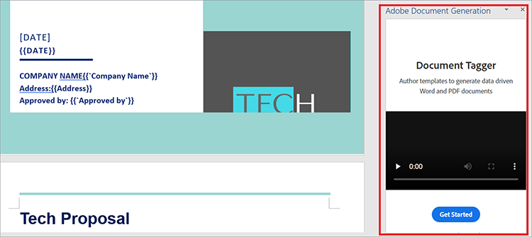
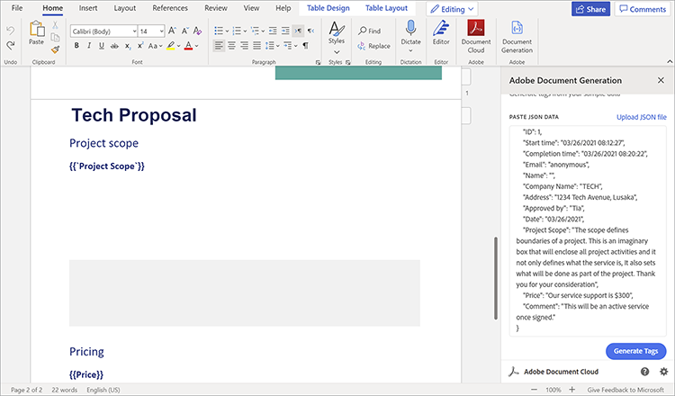
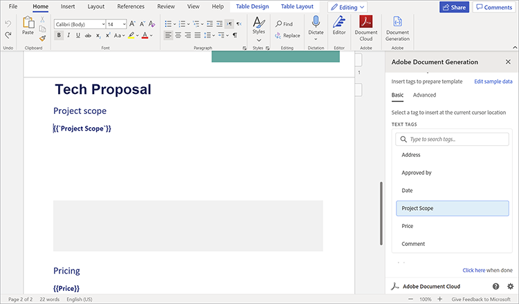
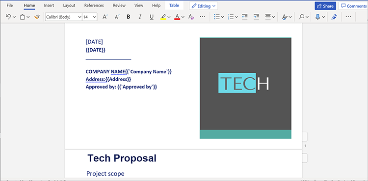
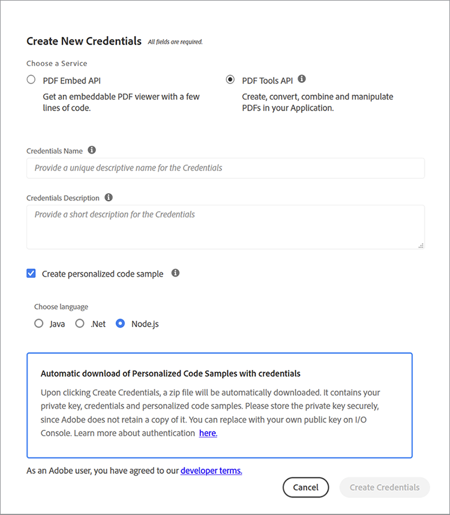

# Gestion des devis et des contrats


Les propositions de vente sont la première étape du parcours d&#39;une entreprise vers l&#39;acquisition de clients. Comme pour tout, les premières impressions durent. Ainsi, votre première interaction avec les clients définit leurs attentes pour votre entreprise. Votre proposition doit être concise, précise et pratique.

Les contrats et les propositions contiennent différents types de données dans leur structure documentaire. Ils contiennent à la fois des données dynamiques (nom du client, montant du devis, etc.) et des données statiques (texte standard, telles que les capacités de l’entreprise, les profils d’équipe et les conditions standard de l’énoncé des travaux). La création de documents de modèle, tels que des devis, implique souvent des tâches monotones, telles que le remplacement manuel des détails du projet dans un modèle standard. Dans ce tutoriel, vous utiliserez des données dynamiques et des workflows pour créer un processus efficace pour [création de propositions commerciales](https://www.adobe.io/apis/documentcloud/dcsdk/sales-proposals-and-contracts.html).

## Ce que vous pouvez apprendre

Dans ce tutoriel pratique, découvrez comment mettre en oeuvre des données dynamiques et des workflows à l’aide de plusieurs outils, dont les plus importants sont [!DNL Adobe Acrobat Services] API. Ces API sont utilisées pour faciliter les propositions commerciales et les contrats pour vous et votre entreprise. Ce tutoriel explique comment créer, fusionner et afficher automatiquement des documents PDF à l&#39;aide de techniques pratiques. Effectuer ces tâches manuellement est long et fastidieux. En profitant de [!DNL Acrobat Services] API, vous pouvez réduire le temps passé sur ces tâches.

## API et ressources pertinentes

* [Microsoft Word](https://www.office.com/)

* [Node.js](https://nodejs.org/en/)

* [npm](https://www.npmjs.com/get-npm)

* [[!DNL Acrobat Services] API](https://www.adobe.io/apis/documentcloud/dcsdk/)

* [API de génération de documents Adobe](https://www.adobe.io/apis/documentcloud/dcsdk/doc-generation.html)

* [API Adobe Sign](https://www.adobe.io/apis/documentcloud/sign.html)

* [Adobe du marqueur de génération de document](https://opensource.adobe.com/pdftools-sdk-docs/docgen/latest/wordaddin.html#add-in-demo)

## Résolution du problème

Maintenant que vous avez les outils installés, vous pouvez commencer à résoudre le problème. Les propositions ont à la fois un contenu statique et un contenu dynamique propre à chaque client. Des goulets d&#39;étranglement se produisent car les deux types de données sont nécessaires chaque fois que vous faites une proposition. La saisie de texte statique prend du temps. Vous allez donc l’automatiser et n’utiliser manuellement que les données dynamiques de chaque client.

Tout d’abord, créez un formulaire de capture de données dans [Microsoft Forms](https://www.office.com/launch/forms?auth=1) (ou votre outil de création de formulaires préféré). Ce formulaire concerne les données dynamiques des clients qui sont ajoutées à une proposition de vente. Remplissez ce formulaire en y ajoutant des questions pour obtenir des clients les informations dont vous avez besoin (nom de l&#39;entreprise, date, adresse, portée du projet, tarification, etc.). Pour créer le vôtre, utilisez cette [formulaire](https://forms.office.com/Pages/ShareFormPage.aspx id=DQSIkWdsW0yxEjajBLZtrQAAAAAAAAAAN__rtiGj5UNElTR0pCQ09ZNkJRUlowSjVQWDNYUEg2RC4u&amp;sharetoken=1AJeMavBAzzxuISRKmUy). L’objectif est que les clients potentiels remplissent le formulaire, puis exportent leurs réponses sous forme de fichiers JSON, qui sont transmis à la partie suivante de votre workflow.

Certains outils de création de formulaires permettent uniquement d’exporter des données au format CSV. Donc, vous pourriez trouver utile de [convertir](http://csvjson.com/csv2json) Transformez le fichier CSV généré en fichier JSON.

Les données statiques sont réutilisées dans chaque proposition de vente. Vous pouvez donc utiliser un modèle de devis dans Microsoft Word pour fournir le texte statique. Vous pouvez utiliser cette [modèle](https://1drv.ms/w/s!AiqaN2pp7giKkmhVu2_2pId9MiPa?e=oeqoQ2), mais vous pouvez créer le vôtre ou utiliser un fichier [Modèle Adobe](https://www.adobe.io/apis/documentcloud/dcsdk/doc-generation.html).

Il vous faut maintenant quelque chose qui prenne à la fois les données dynamiques des clients au format JSON et le texte statique dans le modèle Microsoft Word pour créer une proposition de vente unique pour un client. La [!DNL Acrobat Services] Les API sont utilisées pour fusionner les deux et générer un PDF pouvant être signé.

Pour ce faire, vous devez utiliser des balises. Les balises sont des chaînes faciles à utiliser qui peuvent représenter des nombres, des mots, des tableaux ou même des objets complexes. Les balises servent de marque de réservation pour les données dynamiques, qui dans ce cas sont des données client saisies dans le formulaire. Une fois les balises insérées dans le modèle, vous pouvez mapper les champs de formulaire du fichier JSON au modèle Word.

## Utilisation de balises

Ouvrez votre modèle de devis et sélectionnez le fichier **Insérer** . Dans le **Add-ins** , sélectionnez **Obtenir des compléments**. Ensuite, sélectionnez **Complément Génération de document Adobe** pour l’ajouter. Une fois ajouté, le Baliseur de génération de document s’affiche sur la **Accueil** dans la boîte de dialogue **Adobe** groupe.

Dans le **Accueil** dans la boîte de dialogue **Adobe** , sélectionnez **Génération de documents** pour commencer à baliser le document. Une vidéo de démonstration utile apparaît dans un panneau sur le côté droit de la fenêtre.



Sélectionner **Prise en main**. Vous êtes ensuite invité à fournir des exemples de données. Collez ou chargez le fichier JSON de réponse au formulaire comme indiqué ci-dessous.



Sélectionner **Générer des balises** pour obtenir une liste des champs du fichier JSON que vous avez collé ou chargé. Les balises sont affichées ci-dessous, dans la barre latérale droite.



Après avoir généré les balises, vous pouvez les insérer dans le document. Des balises sont ajoutées au document à l’emplacement du curseur. Comme indiqué ci-dessus, vous devez ajouter le fichier **Portée du projet** juste en dessous de la balise **Portée du projet** sous-titre. De cette façon, lorsqu’un client entre dans la portée du projet dans le formulaire, sa réponse passe sous le **Portée du projet** , en remplaçant la balise que vous venez d’ajouter. Une fois l’ajout de balises terminé, une partie de votre document doit ressembler à la capture d’écran ci-dessous.



## Utilisation des API

Accédez à l’onglet [!DNL Acrobat Services] API [homepage](https://www.adobe.io/apis/documentcloud/dcsdk/doc-generation.html). Pour commencer à utiliser [!DNL Acrobat Services] API, vous avez besoin d’informations d’identification pour votre application. Faites défiler la liste jusqu’au bout et sélectionnez **Commencer l’essai gratuit** pour créer des identifiants. Vous pouvez utiliser ces services [gratuit pendant six mois, puis avec paiement à l&#39;unité](https://www.adobe.io/apis/documentcloud/dcsdk/pdf-pricing.html) pour seulement 0,05 $ par transaction, vous ne payez que pour ce dont vous avez besoin.

Sélectionner **API PDF Services** comme votre service de choix et remplissez les autres détails comme indiqué ci-dessous.



Une fois vos informations d’identification créées, vous obtenez des exemples de code. Sélectionnez la langue de votre choix (ce tutoriel utilise Node.js). Vos identifiants d’API se trouvent dans un fichier zip. Extrayez les fichiers dans PDFToolsSDK-Node.jsSamples.

Pour commencer, créez un dossier vide nommé auto-doc\*\*.\*\* Dans le dossier, exécutez la commande suivante pour initialiser un projet Node.js : `npm init`. Nommez votre projet &quot;auto-doc&quot;*.*

Dans le dossier ./PDFToolsSDK-Node.jsSamples/adobe-dc-pdf-tools-sdk-node-samples, il existe un fichier nommé pdftools-api-credentials.json. Déplacez-le et private.key dans le dossier auto-doc. Il contient vos identifiants d’API. Dans le dossier de documentation automatique, créez également un sous-dossier appelé &quot;resources&quot;. Il contient les données formatées JSON reçues des clients chaque fois que vous générez une proposition de vente. Dans le même dossier, enregistrez le modèle de devis depuis Microsoft Word.

Maintenant, vous êtes prêt à faire de la magie ! Comme vous utilisez Node.js dans ce tutoriel, vous devez installer Node.js [!DNL Acrobat Services] SDK. Pour ce faire, dans le dossier auto-doc, exécutez yarn add @adobe/documentservices-pdftools-node-sdk.

Créez maintenant un fichier appelé merge.js et collez le code suivant dans celui-ci.

```
javascript
const PDFToolsSdk = require('@adobe/documentservices-pdftools-node-sdk'),
fs = require('fs');
try {
// Initial setup, create credentials instance.
const credentials = PDFToolsSdk.Credentials
.serviceAccountCredentialsBuilder()
.fromFile("pdftools-api-credentials.json")
.build();
// Setup input data for the document merge process
const jsonString = fs.readFileSync('resources/Proposal.json'),
jsonDataForMerge = JSON.parse(jsonString);
// Create an ExecutionContext using credentials
const executionContext = PDFToolsSdk.ExecutionContext.create(credentials);
// Create a new DocumentMerge options instance
const documentMerge = PDFToolsSdk.DocumentMerge,
documentMergeOptions = documentMerge.options,
options = new documentMergeOptions.DocumentMergeOptions(jsonDataForMerge, documentMergeOptions.OutputFormat.PDF);
// Create a new operation instance using the options instance
const documentMergeOperation = documentMerge.Operation.createNew(options)
// Set operation input document template from a source file.
const input = PDFToolsSdk.FileRef.createFromLocalFile('resources/Proposal.docx');
documentMergeOperation.setInput(input);
// Execute the operation and Save the result to the specified location.
documentMergeOperation.execute(executionContext)
.then(result => result.saveAsFile('output/Proposal.pdf'))
.catch(err => {
if (err instanceof PDFToolsSdk.Error.ServiceApiError
|| err instanceof PDFToolsSdk.Error.ServiceUsageError) {
console.log('Exception encountered while executing operation', err);
} else {
console.log('Exception encountered while executing operation', err);
}
});
} catch (err) {
console.log('Exception encountered while executing operation', err);
}
```

Ce code obtient votre fichier JSON à partir du formulaire Microsoft à l’aide des balises que vous avez créées à l’aide de [!DNL Acrobat Services]. Il fusionne ensuite les données avec le modèle de devis que vous avez créé dans Microsoft Word pour générer un tout nouveau PDF. Le PDF est enregistré dans le fichier nouvellement créé ./dossier de sortie.

En outre, le code utilise [API Adobe Sign](https://www.adobe.io/apis/documentcloud/sign.html) pour que les deux sociétés signent la proposition de vente générée. Consultez cet article de blog pour une explication détaillée de cette API.

## Marche à suivre

Vous avez commencé avec un processus inefficace et fastidieux qui nécessitait une automatisation. Vous êtes passé de la création manuelle de documents pour chaque client à la création d’un workflow rationalisé pour automatiser et simplifier [le processus de proposition de vente](https://www.adobe.io/apis/documentcloud/dcsdk/sales-proposals-and-contracts.html).

Grâce à Microsoft Forms, vos clients vous ont fourni des données stratégiques qu’ils auraient pu exploiter dans le cadre de leurs offres spéciales. Vous avez créé un modèle de devis dans Microsoft Word pour fournir le texte statique que vous ne vouliez pas recréer à chaque fois. Vous avez ensuite utilisé [!DNL Acrobat Services] des API pour fusionner les données du formulaire et du modèle afin de créer plus efficacement un PDF de devis de vente pour vos clients ;

Ce tutoriel pratique n’est qu’un aperçu de ce qui est possible avec ces API. Pour découvrir d’autres solutions, consultez la page [[!DNL Adobe Acrobat Services]](https://www.adobe.io/apis/documentcloud/dcsdk/gettingstarted.html) page API. Utilisez tous ces outils gratuitement pendant six mois. Puis, payez seulement 0,05 $ par transaction de document sur le [pay-as-you-go](https://www.adobe.io/apis/documentcloud/dcsdk/pdf-pricing.html) pour que vous ne payiez que lorsque votre équipe ajoute des prospects à votre pipeline de ventes.
