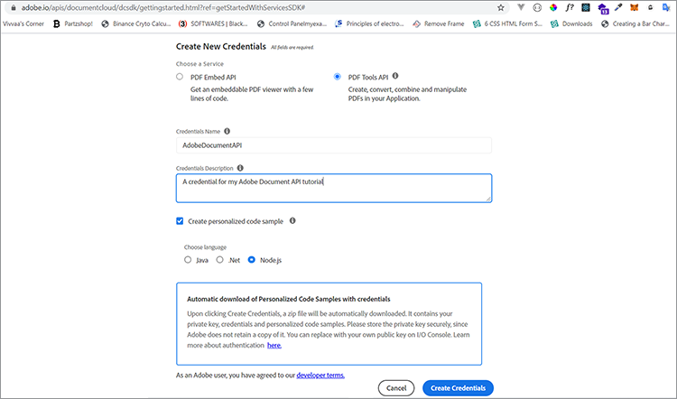
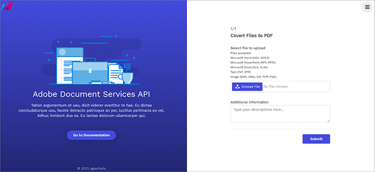
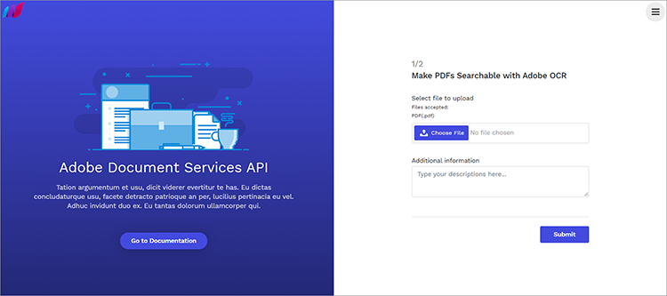
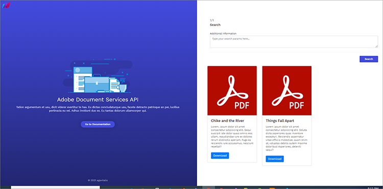

# Recherche et indexation


Les entreprises doivent souvent numériser leurs documents imprimés et fichiers numérisés. Considérez ceci [scénario](https://docs.google.com/document/d/11jZdVQAw-3fyE3Y-sIqFFTlZ4m02LsCC/edit). Un cabinet d’avocats a scanné des milliers de contrats juridiques pour créer des fichiers digitaux. Ils veulent déterminer si l&#39;un de ces contrats juridiques comporte une clause particulière ou un supplément qu&#39;ils doivent réviser. La précision est nécessaire à des fins de conformité. La solution consiste à inventorier les documents numériques, à rendre le texte indexable et à créer un index pour retrouver ces informations.

La création d&#39;archives numériques pour extraire des informations en vue de leur édition ou de leurs opérations en aval représente un véritable cauchemar pour la plupart des entreprises.

## Ce que vous pouvez apprendre

Ce tutoriel pratique vous explique comment [!DNL Adobe Acrobat Services] Les fonctionnalités et fonctionnalités des API peuvent facilement être utilisées pour archiver et numériser des documents. Vous explorez ces fonctionnalités en créant une application NodeJS Express, puis en intégrant [!DNL Acrobat Services] API pour l&#39;archivage, la numérisation et la transformation documentaire.

Pour suivre, vous devez [Node.js](https://nodejs.org/) installé et une compréhension de base de Node.js et [Syntaxe ES6](https://www.w3schools.com/js/js_es6.asp).

## API et ressources pertinentes

* [API PDF Services](https://opensource.adobe.com/pdftools-sdk-docs/release/latest/index.html)

* [Code du projet](https://github.com/agavitalis/AdobeDocumentServicesAPIs.git)

## Configuration du projet

Commencez par configurer la structure de dossiers de l’application. Vous pouvez récupérer le code source [ici](https://github.com/agavitalis/AdobeDocumentAPI.git).

## Structure de répertoire

Créez un dossier appelé AdobeDocumentServicesAPIs et ouvrez-le dans l’éditeur de votre choix. Créez une application NodeJS de base avec le `npm init` en utilisant cette structure de dossiers :

```
AdobeDocumentServicesAPIs
config
default.json
controllers
createPDFController.js
makeOCRController.js
searchController.js
models
document.js
output
.gitkeep
routes
web.js
services
upload.js
views
index.hbs
ocr.hbs
search.hbs
index.js
```

Vous utilisez MongoDB comme base de données pour cette application. Par conséquent, pour configurer, placez vos configurations de base de données par défaut dans le dossier config/, en collant le fragment de code ci-dessous dans le fichier default.json de ce dossier, puis ajoutez l&#39;URL de votre base de données.

```
### config/default.json and config/dev.json
{ "DBHost": "YOUR_DB_URI" }
```

## Installation du package

Maintenant, installez certains packages à l&#39;aide de la commande npm install comme indiqué dans l&#39;extrait de code ci-dessous :

```
{
    "name": "adobedocumentservicesapis",
    "version": "1.0.0",
    "description": "",
    "main": "index.js",
    "directories": {
    "test": "test"
    },
    "dependencies": {
    "body-parser": "^1.19.0",
    "config": "^3.3.6",
    "express": "^4.17.1",
    "hbs": "^4.1.1",
    "mongoose": "^5.12.1",
    "morgan": "^1.10.0",
    "multer": "^1.4.2",
    "path": "^0.12.7"
    },
    "devDependencies": {},
    "scripts": {
    "start": "set NODE_ENV=dev && node index.js"
    },
    "repository": {
    "type": "git",
    "url": "git+https://github.com/agavitalis/AdobeDocumentServicesAPIs.git"
    },
    "author": "Ogbonna Vitalis",
    "license": "ISC",
    "bugs": {
    "url": "https://github.com/agavitalis/AdobeDocumentServicesAPIs/issues"
    },
    "homepage": "https://github.com/agavitalis/AdobeDocumentServicesAPIs#readme"
}
```

```
###bash
npm install express mongoose config body-parser morgan multer hbs path pdf-parse
Ensure that the content of your package.json file is similar to this code snippet:
###package.json
{
```

Ces fragments de code installent les dépendances de l&#39;application, y compris le moteur de modèles de guidons pour la vue. Dans la balise scripts, vous configurez les paramètres d&#39;exécution de l&#39;application.

## Intégration [!DNL Acrobat Services] API

[!DNL Acrobat Services] comprend trois API :

* API Adobe PDF Services

* API Adobe PDF Embed

* API de génération de documents Adobe

Ces API automatisent la génération, la manipulation et la transformation du contenu d’un PDF via un ensemble de services web dans le cloud.

Pour obtenir les informations d’identification dont vous avez besoin : [registre](https://www.adobe.com/go/dcsdks_credentials?ref=getStartedWithServicesSDK) et terminez le workflow. L’API PDF Embed est gratuite. Les API PDF Services et Document Generation sont gratuites pendant six mois. À la fin de votre période d’essai, vous pouvez [pay-as-you-go](https://www.adobe.io/apis/documentcloud/dcsdk/pdf-pricing.html) à seulement 0,05 $ par transaction documentaire. Vous ne payez que lorsque votre entreprise se développe et traite davantage de contrats.



Une fois que vous avez terminé l&#39;inscription, un exemple de code est téléchargé sur votre PC qui contient vos identifiants d&#39;API. Extrayez cet exemple de code et placez les fichiers private.key et pdftools-api-credentials.json dans le répertoire racine de votre application.

Maintenant, installez [SDK Node.js des services de PDF](https://www.npmjs.com/package/@adobe/documentservices-pdftools-node-sdk) en exécutant le fichier ` npm install --save @adobe/documentservices-pdftools-node-sdk ` en utilisant le terminal dans le répertoire racine de l’application.

## Création d’un PDF

[!DNL Acrobat Services] prend en charge la création de PDF à partir de documents Microsoft Office (Word, Excel et PowerPoint) et d’autres [formats de fichier pris en charge](https://opensource.adobe.com/pdftools-sdk-docs/release/latest/howtos.html#create-a-pdf) comme .txt, .rtf, .bmp, .jpg, .gif, .tiff et .png.

Pour créer des documents PDF à partir des formats de fichiers pris en charge, utilisez ce formulaire pour télécharger les documents. Vous pouvez accéder aux fichiers HTML et CSS du formulaire dans [GitHub](https://github.com/agavitalis/AdobeDocumentServicesAPIs.git).



Maintenant, ajoutez les fragments de code suivants au fichier controllers/createPDFController.js. Ce code récupère le document et le transforme en PDF.

Les fichiers d’origine et le fichier transformé sont enregistrés dans un dossier au sein de votre application.

```
const PDFToolsSdk = require('@adobe/documentservices-pdftools-node-sdk');
/*
* GET / route to show the createPDF form.
*/
function createPDF(req, res) {
//catch any response on the url
let response = req.query.response
res.render('index', { response })
}
/*
* POST /createPDF to create a new PDF File.
*/
function createPDFPost(req, res) {
let filePath = req.file.path;
let fileName = req.file.filename;
try {
// Initial setup, create credentials instance.
const credentials = PDFToolsSdk.Credentials
.serviceAccountCredentialsBuilder()
.fromFile("pdftools-api-credentials.json")
.build();
// Create an ExecutionContext using credentials and create a new operation
instance.
const executionContext = PDFToolsSdk.ExecutionContext.create(credentials),
createPdfOperation = PDFToolsSdk.CreatePDF.Operation.createNew();
// Set operation input from a source file.
const input = PDFToolsSdk.FileRef.createFromLocalFile(filePath);
createPdfOperation.setInput(input);
// Execute the operation and Save the result to the specified location.
createPdfOperation.execute(executionContext)
.then((result) => {
result.saveAsFile('output/createPDFFromDOCX.pdf')
//download the file
res.redirect('/?response=PDF Successfully created')
})
.catch(err => {
if (err instanceof PDFToolsSdk.Error.ServiceApiError
|| err instanceof PDFToolsSdk.Error.ServiceUsageError) {
console.log('Exception encountered while executing operation',
err);
} else {
console.log('Exception encountered while executing operation',
err);
}
});
} catch (err) {
console.log('Exception encountered while executing operation', err);
}
}
//export all the functions
module.exports = { createPDF, createPDFPost };
```

Ce fragment de code requiert [SDK Node.js des services de PDF](https://www.npmjs.com/package/@adobe/documentservices-pdftools-node-sdk). Utilisez les fonctions suivantes :

* createPDF, qui affiche le formulaire de téléchargement de document

* createPDFPost, qui transforme le document chargé en PDF

Les documents PDF transformés sont enregistrés dans le répertoire de sortie, tandis que le fichier d’origine est enregistré dans le répertoire de téléchargements.

## Utilisation de la reconnaissance de texte

La reconnaissance optique de caractères (ROC) convertit les images et les documents numérisés en fichiers indexables. Vous pouvez convertir [!DNL Acrobat Services] Des API, des images et des documents numérisés dans des PDF indexables. Après avoir effectué une opération OCR, le fichier devient modifiable et indexable. Vous pouvez stocker le contenu du fichier dans un magasin de données à des fins d&#39;indexation et autres.

Rappelez-vous que la recherche et l’indexation des documents numérisés sont essentielles dans de nombreuses entreprises où la gestion des fichiers et le traitement des informations sont essentiels. La fonction OCR élimine ces défis.

Pour implémenter cette fonctionnalité, vous devez concevoir un formulaire de chargement similaire à celui ci-dessus. Cette fois, vous limitez le formulaire aux fichiers PDF, car vous pouvez utiliser la fonction OCR uniquement sur les documents PDF.

Voici le formulaire de téléchargement pour cet exemple :



Maintenant, pour manipuler le PDF chargé et effectuer certaines opérations OCR, ajoutez le fragment de code ci-dessous au fichier controllers/makeOCRController.js. Ce code implémente le processus OCR sur un fichier chargé, puis enregistre le fichier dans le système de fichiers de votre application.

```
const fs = require('fs')
const pdf = require('pdf-parse');
const mongoose = require('mongoose');
const Document = require('../models/document');
const PDFToolsSdk = require('@adobe/documentservices-pdftools-node-sdk');
/*
* GET /makeOCR route to show the makeOCR form.
*/
function makeOCR(req, res) {
//catch any response on the url
let response = req.query.response
res.render('ocr', { response })
}
/*
* POST /makeOCRPost to create a new PDF File.
*/
function makeOCRPost(req, res) {
let filePath = req.file.path;
let fileName = req.file.filename;
try {
// Initial setup, create credentials instance.
const credentials = PDFToolsSdk.Credentials
.serviceAccountCredentialsBuilder()
.fromFile("pdftools-api-credentials.json")
.build();
// Create an ExecutionContext using credentials and create a new operation
instance.
const executionContext = PDFToolsSdk.ExecutionContext.create(credentials),
ocrOperation = PDFToolsSdk.OCR.Operation.createNew();
// Set operation input from a source file.
const input = PDFToolsSdk.FileRef.createFromLocalFile(filePath);
ocrOperation.setInput(input);
// Execute the operation and Save the result to the specified location.
ocrOperation.execute(executionContext)
.then(async (result) => {
let newFileName = `createPDFFromDOCX-${Math.random() * 171}.pdf`;
await result.saveAsFile(`output/${newFileName}`);
let documentContent = fs.readFileSync(
require("path").resolve("./") + `\\output\\${newFileName}`
);
pdf(documentContent)
.then(function (data) {
//Creates a new document
var newDocument = new Document({
documentName: fileName,
documentDescription: description,
documentContent: data.text,
url: require("path").resolve("./") + `\\output\\${newFileName}`
});
//Save it into the DB.
newDocument.save((err, docs) => {
if (err) {
res.send(err);
} else {
//If no errors, send it back to the client
res.redirect(
"/makeOCR?response=OCR Operation Successfully performed on
the PDF File"
);
}
});
})
.catch(function (error) {
// handle exceptions
console.log(error);
});
})
.catch(err => {
if (err instanceof PDFToolsSdk.Error.ServiceApiError
|| err instanceof PDFToolsSdk.Error.ServiceUsageError) {
console.log('Exception encountered while executing operation',
err);
} else {
console.log('Exception encountered while executing operation',
err);
}
});
} catch (err) {
console.log('Exception encountered while executing operation', err);
}
}
//export all the functions
module.exports = { makeOCR, makeOCRPost };
```

Vous avez besoin du [!DNL Acrobat Services] Node SDK et les modules mongoose, pdf-parse et fs, ainsi que votre schéma de modèle de document. Ces modules sont nécessaires pour enregistrer le contenu du fichier transformé dans une base de données MongoDB.

Créez maintenant deux fonctions : makeOCR pour afficher le formulaire chargé, puis makeOCRost pour traiter le document chargé. Enregistrez le formulaire d’origine dans une base de données, puis enregistrez le formulaire transformé dans le dossier de sortie de votre application.

Les informations d’identification fournies par l’Adobe à partir du fichier pdftools-api-credentials.json sont chargées dans chaque cas avant la transformation du fichier.

>[!NOTE]
>
>La fonction OCR prend uniquement en charge les documents PDF.

Ajoutez également le fragment de code ci-dessous au fichier Modes/Document.js de votre application.

Dans le fragment de code, définissez un modèle de mangouste, puis décrivez les propriétés du document à enregistrer dans la base de données. En outre, indexez le champ documentContent pour rendre la recherche de texte facile et efficace.

```
const mongoose = require("mongoose");
const Schema = mongoose.Schema;
//Document schema definition
var DocumentSchema = new Schema(
{
documentName: { type: String, required: false },
documentDescription: { type: String, required: false },
documentContent: { type: String, required: false },
url: { type: String, required: false },
status: {
type: String,
enum : ["active","inactive"],
default: "active"
}
},
{ timestamps: true }
);
//for text search
DocumentSchema.index({
documentContent: "text",
});
//Exports the DocumentSchema for use elsewhere.
module.exports = mongoose.model("document", DocumentSchema);
```

## Recherche de textes

Vous implémentez maintenant une fonction de recherche simple pour permettre aux utilisateurs d’effectuer des recherches textuelles simples. Vous pouvez également ajouter une fonctionnalité de téléchargement pour activer le téléchargement de fichiers de PDF.

Cette fonctionnalité nécessite un formulaire simple et des cartes pour afficher le résultat de la recherche. Vous pouvez trouver les designs du formulaire et des cartes sur [GitHub](https://github.com/agavitalis/AdobeDocumentServicesAPIs.git).

La capture d’écran ci-dessous illustre la fonction de recherche et les résultats de recherche. Vous pouvez télécharger les résultats de la recherche.



Pour implémenter la fonction de recherche, créez un fichier searchController.js dans le dossier du contrôleur de votre application et collez le fragment de code ci-dessous :

```
const fs = require('fs')
const mongoose = require('mongoose');
const Document = require('../models/document');
/*
* GET / route to show the search form.
*/
function search(req, res) {
//catch any response on the url
let response = req.query.response
res.render('search', { response })
}
/*
* POST /searchPost to search the contents of your saved file.
*/
function searchPost(req, res) {
let searchString = req.body.searchString;
Document.aggregate([
{ $match: { $text: { $search: searchString } } },
{ $sort: { score: { $meta: "textScore" } } },
])
.then(function (documents) {
res.render('search', { documents })
})
.catch(function (error) {
let response = error
res.render('search', { response })
});
}
//export all the functions
module.exports = { search, searchPost, downloadPDF };
```

Mettez maintenant en oeuvre une fonction de téléchargement pour activer le téléchargement des documents renvoyés par la recherche d&#39;un utilisateur.

## Téléchargement de documents

L’implémentation d’une fonction de téléchargement est similaire à ce que vous avez déjà fait. Ajoutez le fragment de code suivant après la fonction searchPost dans le fichier controllers/earchController.js :

```
/*
* POST /downloadPDF To Download PDF Documents.
*/
async function downloadPDF(req, res) {
console.log("here")
let documentId = req.params.documentId
let document = await Document.findOne({_id:documentId});
res.download(download.link);
}
```

## Marche à suivre

Dans ce tutoriel pratique, vous avez intégré [!DNL Acrobat Services] API dans une application Node.js et également utilisé l&#39;API pour mettre en oeuvre une transformation de document qui convertit les fichiers en PDF. Vous avez ajouté une fonction OCR qui permet de rechercher des images et des fichiers numérisés. Ensuite, vous avez enregistré les fichiers dans un dossier afin qu’ils puissent être téléchargés.

Vous avez ensuite ajouté une fonction de recherche pour rechercher les documents convertis en texte par OCR. Enfin, vous avez implémenté une fonction de téléchargement pour faciliter le téléchargement de ces fichiers. Votre demande dûment remplie permet à une société juridique de localiser et de traiter plus facilement du texte spécifique.

Utilisation [!DNL Acrobat Services] pour la transformation de documents est fortement recommandé en raison de sa robustesse et de sa facilité d&#39;utilisation par rapport à d&#39;autres services. Vous pouvez rapidement créer un compte pour commencer à profiter des fonctionnalités de [!DNL Acrobat Services] API pour la gestion et la transformation de documents.

Maintenant que vous avez une bonne compréhension de la façon d&#39;utiliser [!DNL Acrobat Services] Grâce aux API, vous pourrez approfondir vos compétences grâce à la pratique. Vous pouvez cloner le référentiel utilisé dans ce tutoriel et tester certaines des compétences que vous venez d&#39;apprendre. Mieux encore, vous pouvez tenter de reconstruire cette application tout en explorant les possibilités illimitées de [!DNL Acrobat Services] API.

Prêt à activer le partage de documents et la révision dans votre propre application ? Inscrivez-vous pour [[!DNL Adobe Acrobat Services]](https://www.adobe.io/apis/documentcloud/dcsdk/gettingstarted.html)
compte développeur. Profitez d&#39;une version d&#39;essai gratuite de six mois, puis [pay-as-you-go](https://www.adobe.io/apis/documentcloud/dcsdk/pdf-pricing.html) pour seulement \$0.05 par transaction de document à mesure que votre entreprise se développe.
